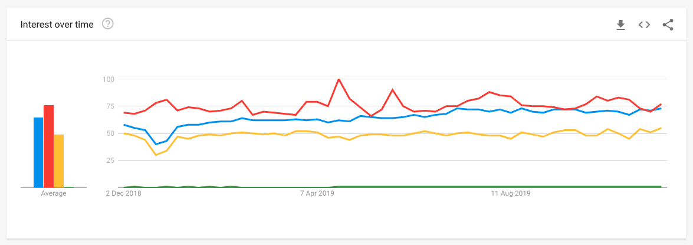

# 结论

在本文中，我向您展示了前端开发人员应在2020年尝试学习，改进或掌握的10项重要内容。

这份清单并不是要完整，但希望它能给您明年的灵感-选择全由您决定！
# 10.软技能

对于开发人员来说，经常被忽视但确实非常重要的是获得软技能。

虽然有助于了解事物的技术方面，但了解如何在团队中进行交流也同样重要。 如果您对技术职业很认真，并且/或者打算升任高级职位，则应该从事以下软技能方面的工作：
+ 同情
+ 通讯
+ 团队合作
+ 平易近人和乐于助人
+ 忍耐
+ 开放的思想
+ 解决问题
+ 问责制
+ 创造力
+ 时间管理

永远记住：高级开发人员最重要的交付物是高级开发人员。
# 9. Git

毫无疑问，Git是当今Web开发中版本控制的标准。 对于每个前端工程师而言，了解基本的Git概念和工作流程以在各种规模的团队中有效工作都是非常重要的。

这是您应该知道的一些流行的Git命令：
+ git配置
+ git初始化
+ git克隆
+ git状态
+ git添加
+ git提交
+ git推
+ git pull
+ git分支

知道这些命令可以提高工作效率总是很高兴的，但是前端工程师还应该学习Git的基本概念。 以下是一些适合您的资源：
+ “解释Git的基本概念以及如何使用GitHub”
+ “如何使用GitHub –使用GitHub进行开发人员协作”
+ 的GitHub
# 8.清洁代码

能够编写干净的代码是一项很棒的技能，许多组织都对此提出了很高的要求。 如果您想从开发人员的位置升级为高级开发人员的位置，则应真正学习干净代码的概念。

简洁的代码应优雅且易于阅读。 它应该重点突出，您应该注意这一点。 所有测试均以纯净代码运行。 它们不应包含重复项，应尽量减少使用实体（例如类，方法和函数）。

干净代码开发人员应做的一些事情是：
+ 为变量，类，方法和函数创建有意义的名称
+ 函数应该很小并且参数应尽可能少
+ 根本不需要注释-代码应该说明一切

如果您想了解有关干净代码检查的更多信息，请阅读Robert C. Martin的书籍和帖子。
# 7.测试

未经测试的代码不应找到它的生产方式。

在您的个人项目中似乎没有任何测试似乎很方便，但在商业和企业环境中工作时必须进行测试。 因此，对于任何开发人员而言，最好尽可能将测试集成到开发工作流程中。

可以区分以下测试用例：
## 单元测试

隔离测试单个组件或功能。
## 整合测试

测试组件之间的交互。
## 端到端测试

在浏览器中测试功能完善的用户流。

有更多测试方法，例如手动测试，快照测试等。如果您想升任高级开发人员职位或打算在拥有某些开发标准的大型公司工作，则应尝试进行测试 技能。
# 6.代码编辑器/ IDE

与2019年一样，微软的VS Code将在2020年成为大多数前端工程师的第一编辑器。

它提供几乎类似于IDE的功能，例如代码完成和突出显示，并且可以通过其扩展市场进行几乎无限的扩展。

特别是市场使VS Code如此出色。 以下是您作为前端开发人员的一些出色扩展：
+ JavaScript（ES6）代码段
+ npm
+ 更漂亮
+ CSS速览
+ 威图
+ ESLint
+ Live Sass编译器
+ Chrome调试器
+ 实时服务器
+ 美化

这些是很酷的例子。 在VS Code中还有很多可以发现的地方，因此，如果您尚未使用它，我建议您尝试一下。
# 5. GraphQL

GraphQL是当前最热门的主题之一，并且绝对是您在2020年需要学习或改进的东西。

尽管REST通过提供无状态服务器之类的出色概念一直被认为是设计Web API的事实上的标准，但在跟上快速变化的客户端访问RESTful API时，RESTful API却越来越不灵活。

GraphQL由Facebook开发，旨在解决开发人员在处理Restful API时面临的确切问题。

使用REST API，开发人员可以通过从具有特定目的的多个端点（例如/ users / <id>端点或/ tours / <id> / location端点）中获取数据来收集数据。

使用GraphQL，这将以不同的方式工作。 开发人员会将查询与他们的数据要求一起发送到GraphQL服务器。 然后，服务器将返回带有所有相应数据的JSON对象。

使用GraphQL的另一个好处是它使用了强类型系统。 GraphQL服务器上的所有内容都是使用GraphQL模式定义语言（SDL）通过模式定义的。 创建架构后，前端开发人员和后端开发人员都可以彼此独立地工作，因为他们知道已定义的数据结构。

如果您想了解有关GraphQL的更多信息，请查看以下重要资源：

GraphQL

如何使用GraphQL

“ GraphQL Content API入门”

“ GraphQL：一种数据查询语言”
# 4. PWA

渐进式Web应用程序（PWA）无疑将在2020年成为现实。越来越多的公司选择PWA取代本机应用程序，以便为用户提供丰富的移动体验。

PWA可靠（即时加载，无需连接互联网即可工作），快速（流畅的动画，对用户交互的快速响应）和吸引人的体验（本机应用程序的感觉，出色的用户体验）。

他们利用服务人员提供脱机功能，并利用Web应用清单文件提供全屏体验。

构建渐进式Web应用程序的原因有：
+ 可以从浏览器添加到用户的主屏幕
+ 即使没有互联网也能正常工作
+ 支持网络推送通知以增强用户参与度
+ 利用Google的Lighthouse功能

如果您想了解有关PWA的更多信息，请随时查看以下其他资源：
+ 渐进式Web应用
+ “您的第一个渐进式Web应用程序”
# 3. JAMstack

术语JAMstack代表JavaScript（在客户端上运行-例如，React，Vue或VanillaJS），API（服务器端进程通过JavaScript通过HTTPS抽象并访问）和标记（在部署时预先构建的模板标记）。 。

这是一种构建网站和应用程序以提高性能的方法-降低扩展成本，提供更高的安全性并提供更好的开发人员体验。

尽管这些术语本身并不是什么新鲜事物，但它们的共同点是相同的-它们并不依赖于Web服务器。 因此，依赖于Ruby或Node.js后端或使用服务器端CMS（例如Drupal或WordPress）构建的网站的单片应用程序不是使用JAMstack构建的。

如果要使用JAMstack，有一些最佳实践：
## 整个项目都在CDN上提供服务

由于不需要服务器，因此整个项目都可以通过CDN进行服务，从而释放出无与伦比的速度和性能。
## 一切都生活在Git中

每个人都应该能够从Git存储库克隆整个项目，而无需数据库或复杂的设置。
## 自动化构建

您可以完美地自动构建，因为所有标记都是预先构建的，例如使用webhooks或云服务。
## 原子部署

为了通过在大型项目中重新部署数百或数千个文件来避免出现不一致的状态，原子部署将等待所有文件上传，然后再进行更改。
## 即时缓存失效

当站点上线时，必须确保CDN可以处理即时缓存清除，以使更改可见。

像Netlify或Zeit这样的著名主机都支持JAMstack应用程序，大公司使用它们为用户提供出色的体验。

您绝对想在2020年成为一名前端开发人员。如果您想了解有关JAMstacks的更多信息，这里有一些很棒的资源：
+ JAMstack
+ JAMstack WTF
+ “ JAMstack的新手？ 您需要了解的一切入门知识”
# 2.静态网站生成器

静态站点生成器结合了服务器端渲染的功能（对于SEO非常重要，而且还具有初始加载时间）和单页应用程序。

如今，许多项目即使不需要服务器端渲染也选择了SSG，因为Next或Nuxt之类的解决方案具有便捷的功能，例如降价支持，模块捆绑器，集成测试运行器等。

如果您认真对待前端开发，则应仔细研究以下项目，并尝试获得一些实践经验：
+ 下一步（基于反应）
+ Nuxt（基于Vue）
+ 盖茨比（基于反应）
+ Gridsome（基于Vue）

这些可能是2020年最热门的，尽管还有更多。 如果您想了解更多关于它们的信息，请查看这些资源：
+ Next.js
+ Nuxt.js
+ 盖茨比
+ 网格状
# 1.框架

2020年，我们可能会看到Facebook的ReactJS与社区驱动的VueJS之间的对决。 目前，React在GitHub上拥有140,000星，而Vue则拥有153,000星。 例如，Angular只有53,000个恒星。

在2019年，React（蓝线），Vue（红线），Angular（黄线）和Svelte（绿线）的搜索量支持此假设-Vue略高于React。 Angular在搜索量方面无法跟上，Svelte在此比较中绝对不起作用。


因此，对于2020年，使用或希望使用JavaScript框架的前端开发人员应将React和Vue作为他们的主要选择。 如果您正在处理大型企业项目，则Angular是有效的选择。

如果您想了解有关这些框架的更多信息，请查看以下重要资源：
+ 反应
+ Vue.js
# 前端开发人员在2020年应学习的10件事
## 明年如何提升您的工程职业

> Photo by Isaac Smith on Unsplash

# 介绍

毫无疑问，前端开发将成为2020年技术领域最热门的学科之一。

以前，前端空间的开发人员足以了解一些HTML，CSS，也许还有jQuery来创建交互式网站，但是今天，他们面临着广泛且不断变化的开发技能生态系统； 掌握的工具，库和框架； 并且需要不断投资于个人教育。

最近几年，我们使用JavaScript为主要的Web应用程序提供了强大的新库和框架，例如ReactJS，VueJS和Svelte。

本文旨在为您提供一些指导，指导您在2020年作为前端开发人员来提升游戏水平，无论您是刚开始编程还是已经有一定的经验。
```
(本文翻译自Simon Holdorf的文章《10 Things Front-End Developers Should Learn in 2020》，参考：https://medium.com/better-programming/10-things-front-end-developers-should-learn-in-2020-61b448e75483)
```
