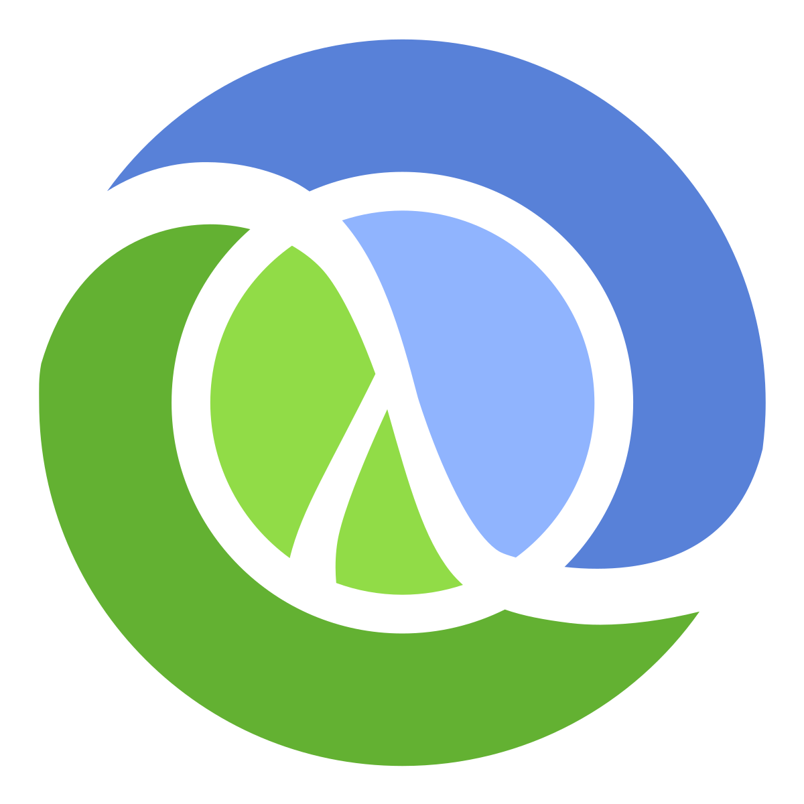

# 2019年面向企业的10种顶级编程语言

硬件和软件的组合是推动技术进步的主要因素。 顶级编程语言是我们今天所看到的现代和新兴技术的核心部分。

今天的开发人员处理的编程语言比以往任何时候都要多。 同样，许多IT外包公司现在正在使用大量语言来构建所有不同类型的软件应用程序。

对于那些利用这些编程语言满足其需求的人（无论是个人还是商业的），有多种选择可供选择。 由于要选择多种语言，因此企业很难为其定制软件开发项目找到并雇用程序员。

但是对于那些利用这些编程语言满足其需求的人（无论是个人还是商业的），有多种选择可供选择。 由于多种语言可供选择，企业甚至很难找到和雇用开发人员。

我试图找到最有生产力和最受欢迎的编程语言，供开发人员学习和企业利用。
# 顶尖的编程语言2019

> The popularity of Top Programming languages as per Google trends

在列出针对开发人员和企业的最佳编程语言之前，我想简要介绍一下其研究工作。 因此，这里简要介绍了我用于研究的参数：
## 1.收入最高的顶级编程语言（摘自《 StackOverflow开发人员调查报告2019》和《 Indeed》）。

注意：语言的出色程度并不取决于开发人员的薪资待遇。 同样，为特定的按需顶级编程语言支付多少开发人员也没有关系。 从长远来看，最重要的是开发人员如何提高技能并使用他们已经知道的语言进行工作。

但是，我考虑了这项研究指标，因为薪水甚至更多，但与热情同样重要。
## 2.基于来自StackOverflow的调查的开发人员偏好。

在过去的十年中，顶级编程语言的开发越来越集中在使开发人员更容易上手。 因此，公平地将他们对编程语言的喜爱作为衡量标准。
## 3.分析GitHub上的开发人员活动（排名来自2019年第一季度的GitHut 2.0结果）。

自2014年第二季度以来，GitHut的第一个版本没有更新，但就分析GitHub上的活动而言，GitHut 2.0可能提供类似的价值。 开发人员活动在帮助企业确定特定语言/框架或技术堆栈的价值方面发挥着巨大作用。 他们密切关注开发人员的活动，并以此为基础选择租用编码器。
## 4. 2018年6月至2019年5月全球Google搜索趋势。

因此，基于以下参数，面向开发人员的2019年顶级编程语言为：
+ 的JavaScript
+ 蟒蛇
+ 爪哇
+ 走
+ 长生不老药
+ 红宝石
+ 科特林
+ 打字稿
+ 斯卡拉
+ Clojure

> Top Programming languages as per GitHut 2.0

# 1. JavaScript

+ 根据确实数据，美国JavaScript开发人员的平均工资：每年109,462美元。
+ 在2019年Stack Overflow开发者调查中被公认为最流行的顶级编程语言。
+ GitHub上最流行的编程语言。
+ 根据Google趋势数据显示，JavaScript去年以来的流行度似乎有所下降。 该语言在2018年6月的最高分数是100，而到2019年5月，该分数是84。
# 2. Python

+ 根据确实的数据，美国Python开发人员的平均薪酬：每年117,503美元。
+ 根据2019年Stack Overflow开发者调查，Python是最顶级的面向对象编程语言之一，在最受欢迎的顶级编程语言列表中排名第二。
+ 在StackOverflow Developer调查中也被公认为最需要的编程语言。
+ GitHub上第二活跃的编程语言。
+ 自去年以来，Python的流行程度没有发生重大变化。 截至2019年5月，该语言得分为88，而2018年6月为85。
# 3. Java

+ 根据确实的数据，美国Java开发人员的平均工资：每年101,929美元。
+ 作为2019年最令人恐惧的编程语言之一，Java恰好排在第十位。
+ GitHub上第三活跃的顶级编程语言。
+ 截至2018年6月，Java在Google趋势中获得100分中的97分。截至2019年5月，该数字已降至80分。这可能是由于Python广泛使用作为替代方法，以及Python V之间的激烈竞争 Java。
# 4.去

+ Go开发人员的全球平均薪资：每年109,483美元。 在美国，使用这种顶级编程语言的平均年薪为$ 136K。
+ 在2019年Stack Overflow开发者调查中，Go是全球收入第三高的语言。
+ Go编程语言是Github上第四活跃的语言。
+ 自去年以来，Go的Google搜索受欢迎程度一直保持不变。
# 5.长生不老药

+ Elixir的全球平均开发薪资：76K。 美国Elixir开发人员的平均薪水为12.3万美元。
+ 根据2019年Stack Overflow开发者调查，Elixir是全球收入第五高的语言。
+ Elixir在GitHub上最活跃的顶级编程语言排名中已超过3个位置。
+ 自去年以来，Elixir的Google搜索趋势基本保持不变。
# 6.红宝石

+ 全球使用Ruby进行开发的平均薪资：$ 76k。 美国Ruby开发人员的平均薪水为12.3万美元。
+ 根据2019年Stack Overflow开发者调查，Ruby是全球收入第六高的语言。
+ 自上一年以来，Ruby在Github中最活跃的顶级编程语言排名中下降了一位。
+ Ruby在Google搜索趋势中的受欢迎程度已大大下降。 去年6月，该语言的普及度得分为94（满分100），截至2018年5月，该分数为72。
# 7.科特林

+ Kotlin的全球平均开发薪酬：5.7万美元。 在美国，Kotlin开发人员的平均工资为125,000美元。
+ 尽管Kotlin到目前为止还不是收入最高的语言之一，但由于Google宣布Kotlin是Android应用程序开发的官方语言，因此它的需求激增。
+ Kotlin是GitHub上排名第15的最活跃的顶级编程语言，自去年以来已经上升了一位。
+ 今年Kotlin的知名度迅速飙升。 在2018年，科特林在Google趋势中的得分仅为71，而到2019年5月，它在100分中得分90。
# 8. TypeScript

+ 使用TypeScript进行开发的平均全球薪资：6万美元。 的平均薪水
+ 美国的TypeScript开发人员为11.5万美元。
+ 根据Stack Overflow开发人员调查，TypeScript是排名第十的最受欢迎的顶级编程语言。
+ 受微软支持的编程语言在GitHub上排名第八。
+ 根据Google搜索显示的TypeScript的流行度在今年5月达到顶峰，而2018年6月的评分为84分。
# 9. Scala

+ Scala的全球平均开发工资：78k美元。 Scala开发人员在美国的平均薪水为14.3万美元。
+ 根据2019年Stack Overflow年度开发人员调查，Scala是美国收入最高的编程语言，也是全球收入第四高的编程语言。
+ Scala是2019年Github上排名第12的最活跃的顶级编程语言。
+ 自去年以来，Scala在Google搜索趋势中的受欢迎程度一直保持不变。
# 10. Clojure

+ Clojure的全球平均开发薪酬：9万美元。 Clojure开发人员在美国的平均薪资为13.9万美元。
+ 根据2019年Stack Overflow开发人员调查，Clojure是全球收入最高的编程语言，在美国排名第二。
+ 但是，Clojure并不是GitHub上2019年最活跃的顶级编程语言之一。 实际上，它的排名自去年以来已经下降了一位。
+ Google对Clojure编程语言的搜索趋势大致相同。
# 结论

编程的世界每年都在变化。 我们有一些顶级的编程语言，例如Java和JavaScript，它们在此类列表中几乎处于永恒的位置。 然后是诸如Kotlin之类的语言，以惊人的速度崛起，并成为迄今为止最受欢迎的编程语言之一。

作为开发人员，此列表将使您了解当今的10种最相关的编程语言，并可能激发您学习其中的一种。 如果您足够勇敢，那就一切！ 一般来说，这就是编码和计算机编程的美。 您拥有提升实力所需要的全部资源，而最重要的是您在哪里下定决心以及如何将知识付诸实践。
