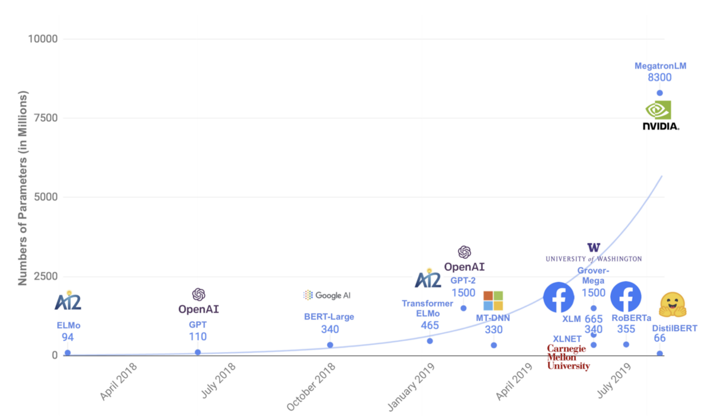

# 2019：BERT年

在2019年总结之际，有趣的是，我们反思了语言机器学习领域的近期主要趋势。 对于NLP来说，2019年是具有里程碑意义的一年，其新记录涵盖了从阅读理解到情感分析等一系列重要任务。 突出的主要研究趋势是NLP中迁移学习的兴起，这是指使用大规模的预训练模型并将其微调为与您特定的语言相关任务。 转移学习使您可以重用以前构建的模型中的知识，从而可以提高性能和泛化能力，同时需要更少的标签训练数据。

预训练模型然后进行针对特定任务的微调的想法本身并不是什么新鲜事物-计算机视觉从业人员经常使用在像ImageNet这样的大型数据集上进行预训练的模型，并且在NLP中，我们多年来一直在进行“浅”的转移学习 通过重复使用单词嵌入。

但是在2019年，对于像BERT这样的模型，我们看到了向更深层知识转移的重大转变，即将整个模型转移到新任务上-本质上是使用大型的预训练语言模型作为可重用的语言理解特征提取器。

去年，这被称为“ NLP的ImageNet时刻”，而在2019年，研究继续以此趋势为基础。 BERT在简化NLP中的迁移学习以及在此过程中以最小的适应性生成11个句子级和单词级NLP任务的最新结果的过程中而著称。 从实用的角度来看，这是令人兴奋的，但是BERT和相关模型可能更有趣，因为它们正在促进我们对如何将语言表示为计算机，以及哪种表示最能使我们的模型解决具有挑战性的语言问题的基本理解。

新兴的范式是：当您可以重用BERT对语言的扎实理解时，为什么要为每个新的NLP任务从头开始不断学习语言语法和语义？

这个核心概念，再加上简单的微调过程和开源代码，意味着BERT迅速普及-BERT最初于2018年末发布，而BERT在2019年变得非常流行。直到我尝试编译时，我才意识到它有多么流行 去年发布的与BERT相关的论文清单。 我收集了169篇与BERT相关的论文，并将其手动注释为几种不同的研究类别（例如，构建BERT的特定领域版本，了解BERT的内部机制，构建多语言的BERT等）。

这是一次所有这些论文的图：

> A collection of BERT-related papers published between November 2018 and December 2019. The y axis is the log of the citation count (as measured by Google Scholar), but with a floor of 0. The majority of these papers were found by searching for BERT in the title of arXiv papers.


这种信息通常具有更好的交互性，因此这里是GIF。 您也可以签出Jupyter笔记本以自己玩图，原始数据在这里。

> Mousing over a mass of BERT papers.


现在有很多BERT论文。 关于此情节的一些注意事项：
+ 有趣的是，观察到2018年11月发表原始论文与2019年1月左右论文泛滥之间的时间间隔（相当短）。
+ BERT论文的最初浪潮往往集中在核心BERT模型（红色，紫色和橙色点）的立即扩展和应用上，例如使BERT适用于推荐系统，情感分析，文本摘要和文档检索。
+ 然后，从4月开始，发布了一系列探讨BERT内部机制的论文（以绿色显示），例如了解BERT如何建模分层的语言现象并分析注意头之间的冗余。 特别令人感兴趣的是论文“ BERT重新发现经典的NLP管道”，作者发现BERT的内部计算与传统的NLP工作流程类似（首先进行词性标记，然后进行依存关系分析，然后进行实体标记等）。 。
+ 大约在9月左右，发布了一系列有关压缩BERT模型尺寸的论文（青色），例如DistilBERT，ALBERT和TinyBERT论文。 例如，来自HuggingFace的DistilBERT模型是BERT的压缩版本，其参数数量只有一半（从1.1亿降至6600万），但在重要的NLP任务上的性能却达到了95％（请参阅GLUE基准测试）。 原始的BERT模型并不十分轻巧，这在计算资源不足的地方（如移动电话）是一个问题。
+ 这份BERT论文清单很可能是不完整的。 如果与BERT相关的论文的真实数量是我的两倍，我不会感到惊讶。 作为粗略的上限，引用原始BERT论文的论文数量目前超过3100。
+ 如果您对其中一些型号的名称感到好奇，那么本质上讲，NLP研究人员对芝麻街的角色感到迷惑。 我们可以归咎于ELMo论文使这一切开始，这使得后来的诸如BERT和ERNIE的模型不可避免。 我热切地在等待一个BIGBIRD模型-我们将其称为压缩版本SMALLBIRD吗？
# BERT文献中的一些教训

通过这些文献，出现了一些一般概念：
+ 开源机器学习模型的价值。 作者免费提供了BERT模型和相关代码，并提供了一个简单，可重用的微调过程。 这种开放性对于加快研究速度至关重要，而且我怀疑如果作者不那么直率的话，该模型是否会如此受欢迎。
+ 认真对待超参数调整的重要性。 RoBERTa的论文通过提出一种更原则性的BERT训练方法，优化的设计选择（如更改训练任务）和更广泛的超参数调整，引起了轰动。 这种更新的培训制度，再加上只是对更多数据进行更长时间培训的模型，再次将各种NLP基准的性能提升到了创纪录的水平。
+ 关于模型大小的想法。 最初的BERT作者很感兴趣，发现即使只是在非常小的数据集上，简单地增加模型的大小也可以极大地提高性能。 也许这意味着从某种意义上说，您“需要”数亿个参数来表示人类语言。 2019年的其他几篇论文发现，仅扩大NLP模型的规模即可带来改进（著名的是OpenAI的GPT-2模型）。 还有一些新的技巧可用来训练可笑的巨大NLP模型，例如NVIDIA的80亿参数巨兽。 但是，也有证据表明，随着模型尺寸的增加，收益会递减，这与研究人员在添加更多卷积层时遇到的墙式计算机视觉类似。 关于模型压缩和参数效率的论文的成功表明，可以从给定大小的模型中获得更多的性能。

> Our NLP models are getting bigger and bigger. From DistilBERT paper.

# BERT是什么？

让我们退后一步，讨论一下BERT到底是什么。 BERT（来自变压器的双向编码器表示形式）是Google研究人员建立的经过预先训练的语言模型（LM）。 对语言模型进行了培训，这些任务可以激励模型以学习对语言的深刻理解。 LM的常见训练任务是预测下一个单词（“猫坐在___上”）。

BERT基于一种相对较新的神经网络体系结构-变压器，该变压器使用一种称为自我注意的机制来捕获单词之间的关系。 变形金刚中没有卷积（如CNN中的卷积）或递归操作（如RNN中的卷积）（“注意就是您所需要的”）。 已经出版了一些出色的教程，介绍了《变形金刚》和《自我注意》，因此在这里我将不做详细介绍。 但简要地说：
+ 自我注意是一种逐个序列的操作，它通过将每个单词的上下文烘焙成其表示形式来更新输入令牌嵌入。 这样，它就可以同时对所有输入词之间的关系进行建模-与RNN形成对比，在RNN中，输入令牌被顺序读取和处理。 自我注意会使用点积来计算单词向量之间的相似度，并且通常将结果注意权重可视化为注意权重矩阵。
+ 注意权重捕获单词之间关系的强度，我们允许模型通过使用多个注意头来学习不同类型的关系。 每个关注头通常会捕获单词之间的一种特定类型的关系（有些冗余）。 这些关系中的一些是直觉上可以解释的（例如主客关系或跟踪相邻单词），而有些则是难以理解的。 您可以认为注意力与卷积网络中的过滤器类似，其中每个过滤器从数据中提取特定类型的特征-哪种特征最能帮助神经网络的其余部分做出更好的预测。
+ 这种自我关注机制是Transformers中的核心操作，但仅是将其引入上下文：Transformers最初是为机器翻译而开发的，它们具有编码器-解码器结构。 Transformer编码器和解码器的构建块是一个Transformer块，它本身通常由一个自我注意层，一定数量的规范化层和一个标准前馈层组成。 每个块对输入矢量执行此操作序列，并将输出传递到下一个块。 在“变形金刚”中，深度是指变形块的数量。

使用此Transformer设置，对BERT模型进行了2种无监督语言任务的训练。 BERT训练最重要的是，它只需要未标记的数据-可以使用任何文本语料库，而无需任何特殊的标记数据集。 BERT论文使用Wikipedia和书籍语料库来训练模型。 与“常规”语言模型一样，数据价格便宜，这是一个巨大的优势。
## BERT如何训练？

但是BERT接受了哪些培训，以鼓励其学习这种对语言的良好，普遍有用的理解？ 未来的工作调整了学习策略，但是原始论文使用了两个任务：
+ 屏蔽语言模型（MLM）任务。此任务鼓励模型在单词级别和句子级别学习良好的表示形式（因为句子是单词表示形式的总和）。简短地说，一个句子中15％的单词是随机选择的，并用<MASK>标记隐藏（或“掩盖”）。该模型的工作是通过使用<MASK>之前和之后的单词来预测这些隐藏单词的身份-因此，我们正尝试从损坏的输入中重建文本，并且左右上下文都用于作出预测。这使我们能够建立将所有上下文都考虑在内的单词表示形式。与ELMo（基于RNN的语言模型用于生成上下文感知词嵌入）的方法相反，BERT同时学习其双向表示，其中两种语言模型分别学习从左到右和从右到左的表示形式然后串联起来。我们可以说ELMo是“浅双向”模型，而BERT是“深双向”模型。
+ 下一个句子预测（NSP）任务。 如果我们的模型将用作语言理解的基础，那么对一些句子间的连贯性知识会有所帮助。 为了鼓励模型学习句子之间的关系，我们添加了“下一句预测”任务，其中该模型必须预测一对句子是否相关，即一个句子是否可能接连出现。 正训练对是语料库中真正相邻的句子； 阴性训练对是从语料库中随机抽取的。 这不是一个完美的系统，因为实际上可以对随机采样的对进行关联，但这已经足够了。

该模型必须学会同时执行两项任务，因为实际的训练损失是两项任务损失的总和（即，MLM和NSP均值之和）。

以防万一您发现掩盖方法有问题：您是对的。 由于段中随机有15％的单词被屏蔽，因此您可能会出现多次<MASK>。 很好，但是BERT将这些屏蔽的令牌彼此独立对待，这是一个限制，因为它们很容易相互依赖。 这是XLNet文件解决的要点之一，有些人认为这是BERT的后继者。
## 微调BERT

训练完基本的BERT模型后，通常会分两步进行调整：首先，对未标记的数据继续进行“无监督”训练，然后通过添加额外的层并针对新目标进行训练来学习实际任务（ 使用的标签示例并不多）。 这种方法源于Google的Dai＆Le在2015年的LSTM LM论文中。

BERT微调实际上将更新模型的所有参数，而不仅是新的特定于任务的层中的参数，因此此方法与完全冻结传输的层参数的技术不同。

在实践中，通过BERT传输学习，通常通常仅重用经过训练的编码器堆栈-您将模型的解码器切掉一半，而仅将编码器变压器块用作特征提取器。 因此，我们不在乎Transformer的Decoder部分对最初训练的任何语言任务所做的预测，我们只对模型学会了内部表示文本输入的方式感兴趣。

BERT微调可能需要几分钟或几小时，具体取决于您的任务，数据大小和TPU / GPU资源。 如果您有兴趣尝试尽快对BERT进行微调，则可以在Google Colab上使用此现成的代码，该代码提供对免费TPU的访问。
## BERT之前发生了什么？

原始BERT纸写得很好，我建议您检查一下； 以下要点总结了本文对语言模型预训练和微调空间中以前主要方法的描述：
+ 无监督的基于特征的方法（例如ELMo），其使用预先训练的表示作为输入特征，但使用特定于任务的架构（即，它们针对每个新任务更改模型的结构）。 您所有喜欢的词嵌入（从word2vec到GLoVe到FastText），句子嵌入和段落嵌入均属于此类别。 ELMo还提供了词嵌入功能，但是以上下文相关的方式提供-令牌的嵌入/表示是从左到右和从右到左语言模型隐藏状态向量的串联。
+ 无监督的微调方法（例如OpenAI的GPT模型），可以微调所有用于下游任务的预训练参数，并通过引入一些特定于任务的参数来最小化模型结构。 预训练是对未标记的文本进行的，学习任务通常是从左到右的语言建模或文本压缩（与自动编码器一样，自动编码器将文本压缩为矢量表示形式，并从矢量中重构文本）。 但是，这些方法建模上下文的能力一直受到限制，因为它们通常是单向的，从左到右的模型-对于给定的单词，没有能力将所有以后的单词合并到其表示中。
+ 从监督数据转移学习。 还有一些工作要转移从有大量训练数据的监督任务中学到的知识，例如 使用机器翻译模型中的权重来初始化针对其他语言问题的参数。
## 问题或需要考虑的事情
+ 来自计算机视觉的一些工作表明，预训练和微调主要有助于加快模型收敛。
## 结论

我希望这篇文章对BERT现象进行了合理的回顾，并展示了该模型在NLP中的受欢迎程度和强大程度。 这个领域正在迅速发展，我们现在从最先进的模型中看到的结果甚至在5年前都令人难以置信（例如，超人类的表现正在回答）。 NLP最近的两个主要趋势是迁移学习和Transformers的兴起，我渴望看到它们在2020年将如何发展。

> Happy holidays!


-

Welocalize是NLP和翻译技术的行业领导者。 要与我们团队中的某人就您的NLP项目聊天，请发送电子邮件至david，网址为david.clark@welocalize.com。
```
(本文翻译自Natasha Latysheva的文章《2019: The Year of BERT》，参考：https://towardsdatascience.com/2019-the-year-of-bert-354e8106f7ba)
```
