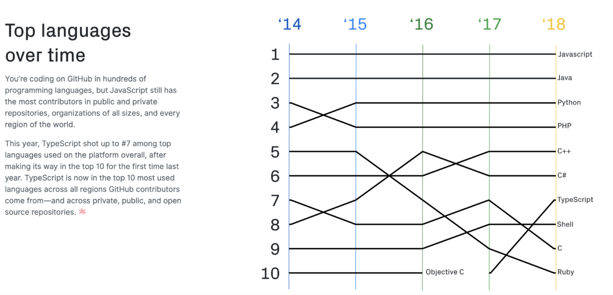
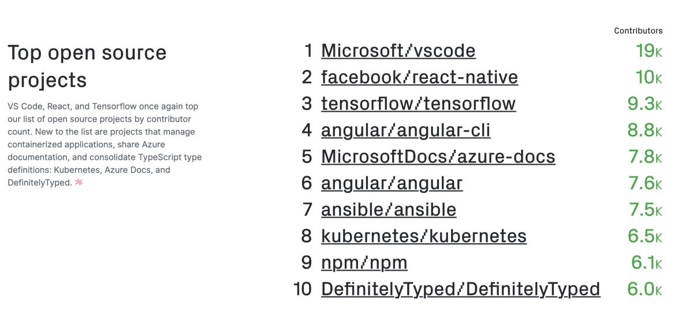
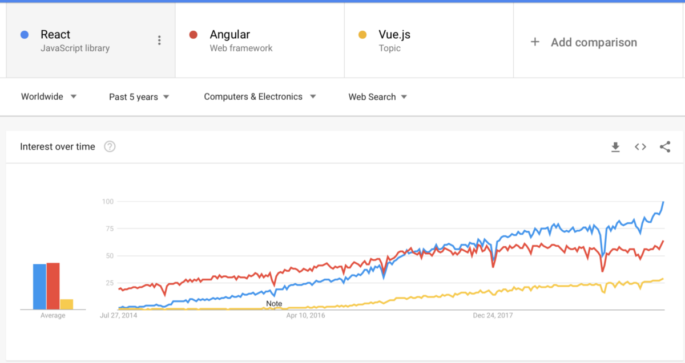
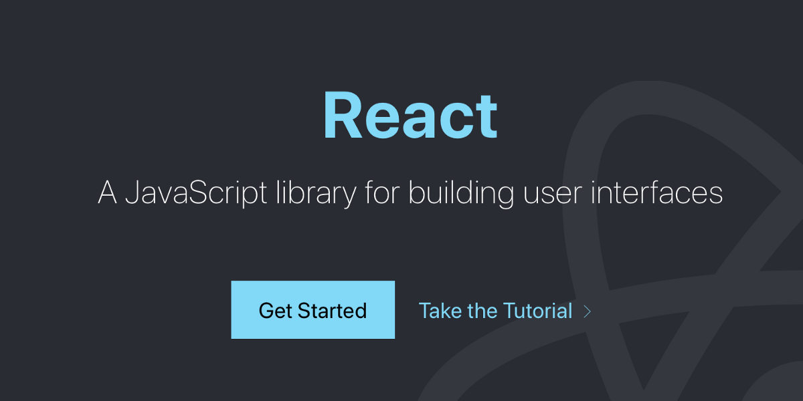
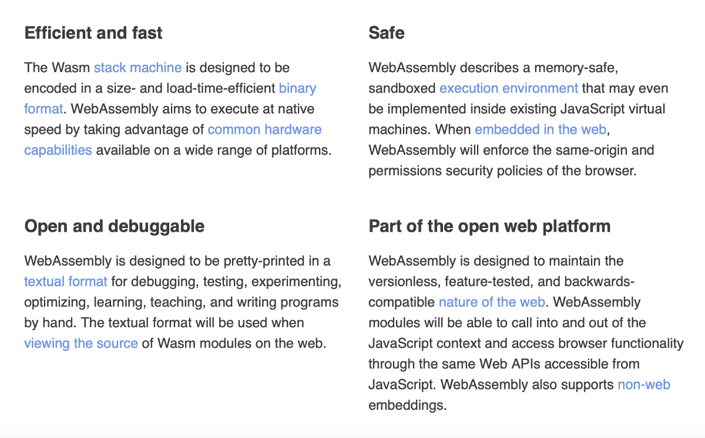
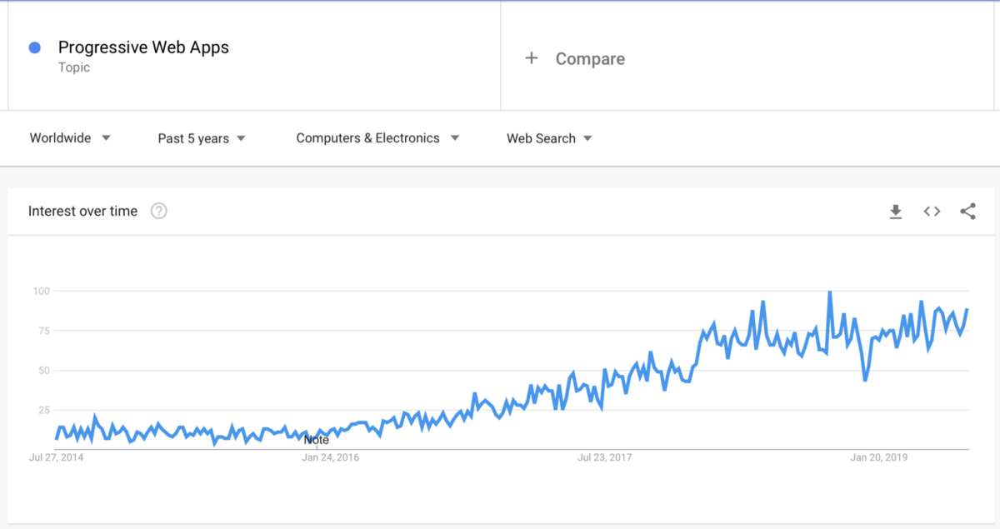
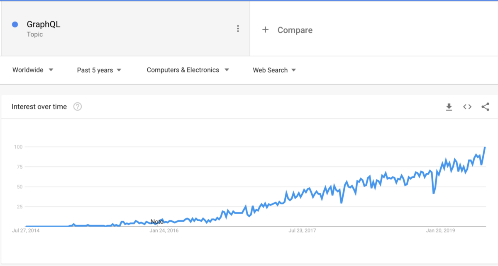
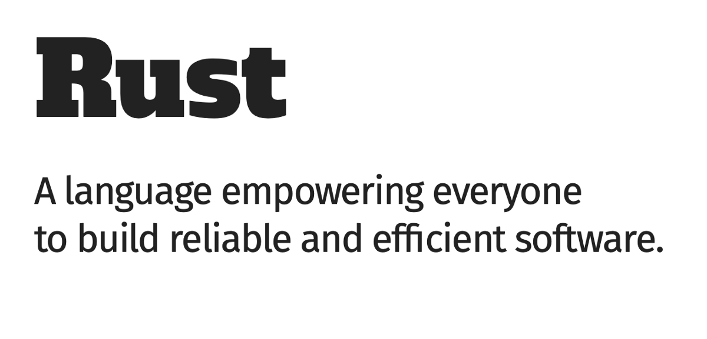
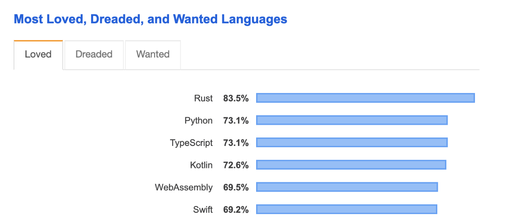

## 每个程序员都应该阅读的10本书
### 阅读是找到理想编程工作的一项至关重要的技能

我错过了一个很棒的项目吗？ 让我们知道哪些项目或语言值得更多的关注和关注！
## 每个程序员都应该阅读的10本书
### 阅读是找到理想编程工作的一项至关重要的技能

谢谢阅读！ 保持好状况。
## 即将到来的JavaScript新功能-2019、2020年及以后
### 窥视JavaScript语言的未来
# 始终押宝JavaScript

我们可以充满信心地说2010年是JavaScript的十年。 我们已经看到JavaScript增长迅猛，而且似乎并未放缓。

JavaScript开发人员被称为“非真正的开发人员”，因此受到了一些滥用。JavaScript是Netflix，Facebook，Google等许多大型科技公司的心脏。 因此，JavaScript作为一种语言与任何其他编程语言一样合法。 以成为JavaScript开发人员而感到自豪。 毕竟，JavaScript社区已经构建了一些最酷，最具创新性的东西。

几乎所有网站都在一定程度上利用了JavaScript。 有多少个网站？ 百万！
## 即将到来的JavaScript新功能-2019、2020年及以后
### 窥视JavaScript语言的未来

成为JavaScript开发人员从来没有比现在更好。 薪水不断上涨，社区一如既往地活跃，就业市场巨大。 如果您想学习JavaScript，那么“ You Do n't Know JS”系列丛书非常适合阅读。

> Top languages over time


我之前写过关于JavaScript受欢迎的原因-您可能也应该读过。

> Top open source projects

# 反应将继续统治

> Frontend JavaScript frontend libraries


到目前为止，React是最流行的前端开发JavaScript库，这也是有原因的。 构建React应用很有趣且容易。 就构建应用程序的经验而言，React团队和社区所做的出色工作。

> React — https://reactjs.org


我曾经使用过Vue，Angular和React，并且我认为它们都是可以使用的出色框架。 请记住，库的目标是完成工作，因此，应将精力集中在完成工作上，而不是集中在风味上。 争论什么是“最佳”框架是完全没有用的。选择一个框架并将所有精力用于构建东西。

如果您觉得自己受到启发，请从此列表中选择一些内容，并立即开始构建！
# Web组装将看到更多光

> Web Assembly


WebAssembly（缩写为Wasm）是基于堆栈的虚拟机的二进制指令格式。 Wasm被设计为可移植的目标，用于编译C，C ++和Rust等高级语言。 Wasm还支持在Web上为客户端和服务器应用程序进行部署。 PWA也可以使用wasm。

换句话说，Web Assembly是将JavaScript技术与更高级别的技术联系起来的一种方法。 考虑在您的React应用程序中使用Rust图像处理库。 Web程序集允许您执行此操作。

性能是关键，随着数据量的增长，保持良好性能将变得更加困难。 那就是C ++或Rust的低级库发挥作用的时候。 我们将看到更大的公司从那里开始采用Web Assembly和Snowball。
# 渐进式Web应用程序是不可忽视的力量

渐进式Web应用程序（PWA）是一种通过将Web的最佳功能与顶级质量的移动应用程序相结合来构建应用程序的新方法。

> Photo by Rami Al-zayat on Unsplash


与本地特定于平台的开发人员相比，有更多的Web开发人员在狂奔。 一旦大公司意识到他们可以重新利用其Web开发人员来开发渐进式Web应用程序，我怀疑我们将会看到大量的PWA。

但是，较大的公司需要一段时间才能适应，这对于技术而言是很正常的。 渐进式部分通常会落到前端开发中，因为它主要是与Web Workers API（本机浏览器API）进行交互。

网络应用程序无处不在。 越来越多的人开始意识到这样的想法：编写单个交叉兼容的PWA可以减少工作量，并为您节省更多时间。

> PWA Google Trends


今天是开始更多了解PWA的完美之日，从这里开始。
# GraphQL的采用将继续增长

> GraphQL Google Trends


随着应用程序复杂性的增长，我们对数据消耗的需求也在增加。 我是GraphQL的忠实拥护者，并且已经使用了很多次。 与传统的REST API相比，我认为这是一种非常出色的获取数据的解决方案。

虽然典型的REST API需要从多个URL进行加载，但是GraphQL API可以在单个请求中获取应用程序需要的所有数据。


在各种不同环境和语言中，各种规模的团队都使用GraphQL为移动应用程序，网站和API提供支持。

> Who’s using GraphQL


如果您有兴趣学习GraphQL，请查看我编写的本教程。
# 锈将成为主流

> Rust- https://www.rust-lang.org/


Rust是一种专注于安全性（尤其是安全并发性）的多范式系统编程语言。 Rust在语法上与C ++类似，但其目的是在保持高性能的同时提供更好的内存安全性。

> Source: Leftover Salad


我们已经看到了Rust编程语言四年来的强劲增长。 我相信2020年将是Rust正式成为主流的一年。 主流是可以自我解释的，但是我相信学校将开始在他们的课程中引入Rust。 这将引起Rust工程师的新浪潮。

> Most loved programming languages from the 2019 StackOverflow Survey.


Rust拥有强大而活跃的社区，已证明自己是一门伟大的语言。 随着Facebook在Rust（有史以来最大的项目）上构建Libra，我们将看到Rust真正产生了什么。

如果您想学习一种新的语言，我强烈建议您学习Rust。 如果您想了解更多信息，请从本书开始学习Rust。 去生锈！
# 2020年及以后的编程趋势预测
## 预测2020年将出现哪些编程技术

> Photo by Safar Safarov on Unsplash


2020年即将到来，听起来如此疯狂。 2020年听起来像是科幻小说，但是我们要敲开它的前门了。

如果您对未来可能带给编程世界的好奇，那么您来对地方了。 我可能完全错了-对此不做报价-但我认为这将会发生。 我无法预测未来，但是我可以做出有根据的猜测。

“预测未来的最佳方法是创造未来。”

- 亚伯拉罕·林肯
```
(本文翻译自Indrek Lasn的文章《2020 and Beyond Programming Trend Predictions》，参考：https://medium.com/better-programming/2020-programming-trend-predictions-a5d6b70bec26)
```
