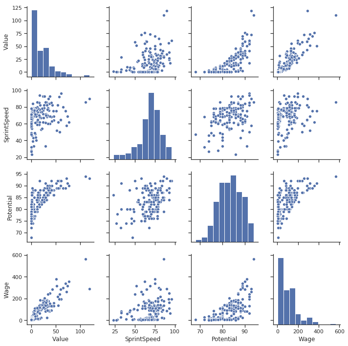
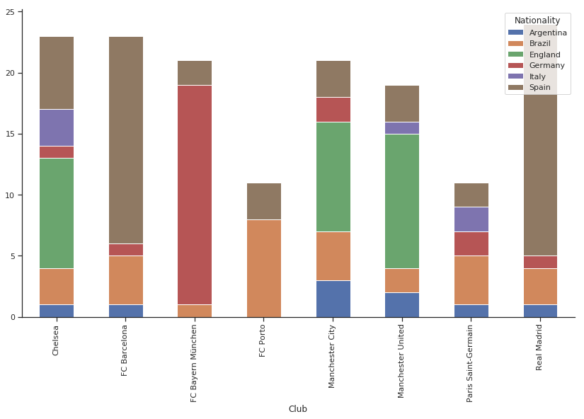

最初于2019年4月19日发布在https://mlwhiz.com。
# 参考文献
+ 寻找分类相关性
+ Seaborn Swarmplot文档
+ Seaborn Pairplot文档

此kaggle内核中此帖子的代码。
# 结论

因此，回顾一下，在本文中，我们讨论了如何计算和读取不同变量类型之间的相关性，绘制数值数据之间的相关性以及使用Swarmplots使用数值数据绘制类别数据。 我喜欢我们如何在Seaborn中将图表元素彼此叠加。

另外，如果您想了解有关可视化的更多信息，我想在密歇根大学讲一门关于数据可视化和应用绘图的出色课程，这是Python本身相当不错的数据科学专业化的一部分。 检查一下

如果您喜欢这篇文章，请鼓掌。 这将有助于增加该职位的报道范围。 我将来也会写更多对初学者友好的文章。 在Medium上关注我，或订阅我的博客以了解有关它们的信息。 一如既往，我欢迎反馈和建设性的批评，可以在Twitter @mlwhiz上与他们联系。

您也可以在Seaborn上查看我的其他文章，其中我创建了一些更简单的可重用图形。
# 群图

如何看待分类数据与数值数据之间的关系？

输入图片Swarmplot，就像它们的名字一样。 为每个类别绘制了大量的点，并在y轴上分散了一些点，使它们更易于查看。

它们是我目前绘制这种关系的最爱。
```python
g = sns.swarmplot(y = "Club",
              x = 'Wage', 
              data = filtered_player_df,
              # Decrease the size of the points to avoid crowding 
              size = 7)
# remove the top and right line in graph
sns.despine()
g.figure.set_size_inches(14,10)
plt.show()
```

> Swarmplot…


为什么不使用Boxplots？ 中位数在哪里？ 我可以画吗？ 明显。 将条形图叠加在顶部，我们有一个漂亮的图形。
```python
g = sns.boxplot(y = "Club",
              x = 'Wage', 
              data = filtered_player_df, whis=np.inf)
g = sns.swarmplot(y = "Club",
              x = 'Wage', 
              data = filtered_player_df,
              # Decrease the size of the points to avoid crowding 
              size = 7,color = 'black')
# remove the top and right line in graph
sns.despine()
g.figure.set_size_inches(12,8)
plt.show()
```

> Swarmplot+Boxplot, Interesting


非常好。 我们可以在图表上看到各个点，可以看到一些统计数据，并可以明确地了解工资差异。

最右边的点是梅西。 但是，我不必在图表下方的文本中告诉您。 对？

此图将在演示文稿中显示。 你老板说。 我想在这张图上写梅西。 进入图片注释。
```python
max_wage = filtered_player_df.Wage.max()
max_wage_player = filtered_player_df[(player_df['Wage'] == max_wage)]['Name'].values[0]
g = sns.boxplot(y = "Club",
              x = 'Wage', 
              data = filtered_player_df, whis=np.inf)
g = sns.swarmplot(y = "Club",
              x = 'Wage', 
              data = filtered_player_df,
              # Decrease the size of the points to avoid crowding 
              size = 7,color='black')
# remove the top and right line in graph
sns.despine()
# Annotate. xy for coordinate. max_wage is x and 0 is y. In this plot y ranges from 0 to 7 for each level
# xytext for coordinates of where I want to put my text
plt.annotate(s = max_wage_player,
             xy = (max_wage,0),
             xytext = (500,1), 
             # Shrink the arrow to avoid occlusion
             arrowprops = {'facecolor':'gray', 'width': 3, 'shrink': 0.03},
             backgroundcolor = 'white')
g.figure.set_size_inches(12,8)
plt.show()
```

> Annotated, Statistical Info and point swarm. To the presentation, I go.

+ 见那里的波尔图。 用这么小的工资预算与巨人竞争。
+ 皇家和巴塞罗那有那么多高薪球员。
+ 曼城的工资中位数最高。
+ 曼联和切尔西相信平等。 许多参与者聚集在相同的工资水平上。
+ 我很高兴，虽然内马尔比梅西更受重视，但梅西和内马尔之间的工资差异很大。

在这个疯狂的世界中有种常态。
# 配对图

虽然我谈论了很多相关性，但这是一个善变的指标。

为了理解我的意思，让我们看一个例子。

Anscombe的四重奏包含四个数据集，它们具有几乎相同的1的相关性，但是分布却非常不同，并且在绘制图形时看起来也非常不同。

> Anscombe Quartet — Correlations can be fickle.


因此，有时绘制相关数据变得至关重要。 并分别查看分布。

现在，我们的数据集中有许多列。 将它们全部绘制成图表会非常费力。

不，这是一行代码。
```python
filtered_player_df = player_df[(player_df['Club'].isin(['FC Barcelona', 'Paris Saint-Germain',
       'Manchester United', 'Manchester City', 'Chelsea', 'Real Madrid','FC Porto','FC Bayern München'])) & 
                      (player_df['Nationality'].isin(['England', 'Brazil', 'Argentina',
       'Brazil', 'Italy','Spain','Germany'])) 
                     ]
# Single line to create pairplot
g = sns.pairplot(filtered_player_df[['Value','SprintSpeed','Potential','Wage']])
```


非常好。 我们可以在这张图中看到很多东西。
+ 工资和价值高度相关。
+ 其他大多数值也都相关。 但是，潜力与价值的趋势并不寻常。 我们可以看到随着达到特定的潜在阈值，该值如何呈指数增长。 此信息可能有助于建模。 可以对电位进行一些转换以使其更相关吗？

注意：没有分类列。

我们可以做得更好吗？ 我们永远可以。
```python
g = sns.pairplot(filtered_player_df[['Value','SprintSpeed','Potential','Wage','Club']],hue = 'Club')
```


如此多的信息。 只需将hue参数添加为分类变量Club。
+ 波尔图的工资分配偏向下方。
+ 我看不到波尔图球员的价值分布如此陡峭。 波尔图的球员总是会寻找机会。
+ 在潜力与工资图表上查看许多粉红色点（切尔西）如何构成聚类。 切尔西有很多低薪的高潜力球员。 需要更多关注。

我已经知道工资/价值子图中的一些要点。

工资500k的蓝点是梅西。 而且，比梅西更具价值的橘色点是内马尔。

尽管此hack仍然无法解决分类问题，但我对分类变量的分布很感兴趣。 虽然个别。

执行此操作的代码来自dython软件包。 我不会在您可以在我的Kaggle内核中找到的代码中写太多。 最终结果如下所示：
```python
player_df = player_df.fillna(0)
results = associations(player_df,nominal_columns=catcols,return_results=True)
```

> Categorical vs. Categorical, Categorical vs. Numeric, Numeric vs. Numeric. Much more interesting.


它不漂亮吗？

仅通过查看这些数据，我们就可以对足球有很多了解。 例如：
+ 运动员的位置与运球能力高度相关。 您不会在后面玩梅西。 对？
+ 与传球和控球相比，运球的价值更重要。 规则是总是传球。 内马尔，我在看着你。
+ 俱乐部和工资具有较高的相关性。 可以预料的。
+ 身体类型和首选脚部高度相关。 这是否意味着如果您是精益，那么您很可能是左撇子？ 没什么意义。 人们可以进一步调查。

此外，我们可以通过这个简单的图表找到大量信息，而在没有分类变量的典型相关图中看不到该信息。

我把它留在这里。 人们可以更多地查看图表并找到更有意义的结果，但重点是，这使生活变得更容易找到模式。
# 与图的类别相关性：

用简单的术语来说，“相关性”是两个变量如何一起移动的度量。

例如，在现实世界中，收入和支出呈正相关。 如果一个增加，另一个也会增加。

学习成绩和视频游戏使用率呈负相关。 一个增加表示另一个减少。

因此，如果我们的预测变量与目标变量正相关或负相关，那么它就很有价值。

当我们尝试理解数据时，不同变量之间的相关性是一件很不错的事情。

我们可以轻松地使用Seaborn创建一个很好的相关图。
```python
corr = player_df.corr()
g = sns.heatmap(corr,  vmax=.3, center=0,
            square=True, linewidths=.5, cbar_kws={"shrink": .5}, annot=True, fmt='.2f', cmap='coolwarm')
sns.despine()
g.figure.set_size_inches(14,10)
    
plt.show()
```

> Where did all the categorical variables go?


但是，您注意到任何问题吗？

是的，此图仅计算“数值”列之间的相关性。

如果我的目标变量是俱乐部或职位怎么办？

我希望能够获得三种不同情况之间的相关性，并且我们使用以下相关性度量来计算这些相关性：
## 1.数值变量

我们已经采用了Pearson的相关性形式，可以衡量两个变量如何一起移动。 范围是[-1,1]
## 2.分类变量

对于分类-分类案例，我们将使用Cramer的V。 它是两个离散变量的互相关，并与具有两个或多个级别的变量一起使用。 这是一个对称的度量，因为按变量顺序无所谓。 Cramer（A，B）== Cramer（B，A）。

例如：在我们的数据集中，俱乐部和国籍必须以某种方式关联。

让我们使用堆叠图进行检查，这是了解分类变量与分类变量之间分布的一种极好的方法。 我们使用数据的子集，因为此数据中有很多国籍和俱乐部。

我们只保留最好的团队（保留波尔图足球俱乐部只是为了获得更多样本多样性）和最常见的国籍。


俱乐部的偏好在很大程度上说明了国籍：了解前者有助于预测后者。

我们可以看到一个球员是否属于英格兰，那么他更有可能在切尔西或曼联踢球，而不是在巴塞罗那足球俱乐部，拜仁慕尼黑或波尔图踢球。

所以这里有一些信息。 Cramer的V捕获相同的信息。

如果所有俱乐部的每个国籍的球员比例相同，那么Cramer的V为0。

例如，如果每个俱乐部都喜欢单一国籍的Cramer的V == 1，则所有英格兰球员都在曼联踢球，所有德国人都在拜仁慕尼黑打球，等等。

在所有其他情况下，范围为[0,1]
## 3.数值和分类变量

对于分类连续的情况，我们将使用“相关比率”。

在不进行过多数学的情况下，它可以衡量色散。

给定一个数字，我们可以找出它属于哪个类别？

例如：

假设我们的数据集中有两列：SprintSpeed和Position：
+ GK：58（德吉亚），52（T。库图瓦），58（诺伊尔先生），43（布冯）
+ CB：68（D。Godin），59（V。Kompany），73（S。Umtiti），75（M。Benatia）
+ ST：91（C.Ronaldo），94（G。Bale），80（S.Aguero），76（R.Lewandowski）

如您所见，这些数字可以很好地预测它们所属的类别，因此具有很高的相关比率。

如果我知道冲刺速度超过85，则可以肯定地说该球员在ST比赛。

该比率也为[0,1]

我将在kaggle上使用FIFA 19完整球员数据集中的数据-最新FIFA 19数据库中注册的每个球员的详细属性。

由于数据集有很多列，因此我们将只关注分类和连续列的子集。
```python
import numpy as np
import pandas as pd
import seaborn as sns
import matplotlib.pyplot as plt
%matplotlib inline
# We dont Probably need the Gridlines. Do we? If yes comment this line
sns.set(style="ticks")
player_df = pd.read_csv("../input/data.csv")
numcols = [
 'Overall',
 'Potential',
'Crossing','Finishing',  'ShortPassing',  'Dribbling','LongPassing', 'BallControl', 'Acceleration',
       'SprintSpeed', 'Agility',  'Stamina',
 'Value','Wage']
catcols = ['Name','Club','Nationality','Preferred Foot','Position','Body Type']
# Subset the columns
player_df = player_df[numcols+ catcols]
# Few rows of data
player_df.head(5)
```

> Player Data


这是一个格式良好的数据，但是我们需要对Wage和Value列（因为它们在欧元中并且包含字符串）进行一些预处理，以使其成为数字，以便我们进行后续分析。
```python
def wage_split(x):
    try:
        return int(x.split("K")[0][1:])
    except:
        return 0
player_df['Wage'] = player_df['Wage'].apply(lambda x : wage_split(x))
def value_split(x):
    try:
        if 'M' in x:
            return float(x.split("M")[0][1:])
        elif 'K' in x:
            return float(x.split("K")[0][1:])/1000
    except:
        return 0
player_df['Value'] = player_df['Value'].apply(lambda x : value_split(x))
```
# 每个数据集都有3种出色的可视化技术
## 并在此学习一些关于足球的知识


可视化效果很棒。 但是，很难制作出良好的可视化效果。

此外，要将这些可视化呈现给更多的受众，需要花费时间和精力。

我们都知道如何制作条形图，散点图和直方图，但是我们并没有花太多精力来美化它们。

这伤害了我们-我们在同行和管理人员中的信誉。 您现在不会感觉到，但是它确实发生了。

另外，我发现重用代码非常重要。 每次访问新数据集时，我都需要重新开始吗？ 图的一些可重用概念可以帮助我们找到有关数据FAST的信息。

在这篇文章中，我还将讨论3种很酷的视觉工具：
+ 与图的分类相关性
+ 配对图
+ 使用Seaborn的Swarmplots和图注解。

简而言之，这篇文章是关于有用和可表达的图形的。
```
(本文翻译自Rahul Agarwal的文章《3 Awesome Visualization Techniques for every dataset》，参考：https://towardsdatascience.com/3-awesome-visualization-techniques-for-every-dataset-9737eecacbe8)
```
