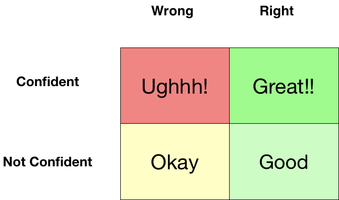

# 结论

在写这篇文章之前，我想了很多，因为我可能在这篇文章中听起来有些刺耳。 但是我想有必要让人们知道他们的错误。

在这里，有些人会不同意我如何从如此小的错误中判断人们。

我想说，面试是关于在有限的时间内评判某人。

此外，许多公司现在将行为回合与常规数据科学回合分开，并且独创，有资格或过度自信显然无济于事。

因此，我想说，尊重和友善有很长的路要走，您应该在生活中而不是在面试室里实现目标。

这样，您还可以练习很多，也可以成为更好的人。

PS：使用的所有名称都只是占位符，这些都是我个人的观点。
# 3.关键字填充

关键字填充是一种使他们的履历表超负荷的做法，他们可能不了解这些技能。

这样做的典型借口是-很多人这样做。 人力资源部可能不会选择我。 该系统只能那样工作。

您可能将其称为必要的邪恶。 我称它为您为失败做好准备。

执行此操作时，您可能会偶尔接到面试电话。 因为我会在你的履历表上烤你，所以对你的可能性很大。 我希望您对此有所了解。

如果Mark在自己的履历表中放入了决策树，则Mark应该会对此提出疑问。

或者，如果Mark说他已经从Scratch实现了机器学习算法，那么期望Mark解释该算法的实质内容是没有错的。

关键是，如果您一无所知，那没关系。 没有人做。 但是在您的履历表上撒谎，您就使我的工作变得容易了，因为这类谎言很容易捕获。
# 2.过度自信效应

因此，我最近还采访了克里斯，担任数据科学职位。

我首先询问他的项目和过去的工作。

他自信地解释了自己的项目。 在开始的30分钟内，我们谈到了他的各种项目，我非常确信他在团队中占有一席之地。

到目前为止，我还没有问太多技术问题，这就是我开始对此表示怀疑的地方。 事情是克里斯会很自信地解释我的任何要求，尽管是错误的。 他会尝试向我解释他不知道的概念。

我觉得他似乎以为我可能不知道自己的问题的答案。 这样他就可以通过说些什么来走运。

而这在采访中发生了两三遍。

现在不要误会我的意思-信心很好。 健康的一点是必要的。 但是要自信和错误，这会带来灾难。

我可以信任克里斯处理业务吗？ 如果他对公司做出错误的举动或提出崇高的主张而事后却没有意识到，会发生什么？

在人们成为受害者的所有认知偏见中，过度自信被称为最“普遍和潜在的灾难性”。它被归咎于诉讼，罢工，战争以及股市泡沫和崩溃。 —维基百科

实际上，我更喜欢一个没有信心和错误的人。 至少到那时我才想知道我的事实。
# 1.失去您的权利

这就是我通常所说的数据科学中的生存偏差。

因此，您想成为Rockstar数据科学家。 也许在蓬勃发展的行业找到一份工作。 HBR确实表示将缺少数据科学家，您会觉得自己是最合适的人选。

我现在确实接受了很多采访，而且我看到很多人遭受生存偏差的困扰。

不久前，我采访了一个在该领域已有经验的人。 我们叫他安迪。 我问安迪一个简单的基于数学的问题。 这是一次数据科学采访，所以我想他应该已经预料到了。 对？

不，他的回答是-

我们有用于完成所有这些任务的软件包。

我忽略了这一点。 放任不管。

问了一个不同的问题，他说我为什么要问数学问题？

这件事告诉我关于安迪的事情，他觉得自己有资格。 仅仅因为Andy看到很多人都进入了数据科学领域，他认为他也应该加入。

安迪不明白的是，对于每一个成功的数据科学家来说，都有很多人没有做到。

安迪所看到的只是幸存者。 那是一个错误。

> Pixabay

# 您不应在数据科学面试中犯的3个错误
## 我作为采访者的经验教训

人们问我很多有关如何找到数据科学工作的问题？ 或如何转换职业或如何学习求职面试？

通常，我的答案是做一些MOOC，创建一些项目，参与Kaggle，尝试创办一家初创公司并且不放弃。

但是，对于数据科学工作，每个人都应该了解一些事情。

数据科学工作涉及大量来回通信，并且涉及许多人员处理技能。 因此，即使您没有意识到，您也会无意中测试这些技能。

有时您可能会觉得-我是一名编码人员，让我安然地进行编码。 还是我的行为如何重要？ 关键是它确实在做。

这篇文章旨在说明人们在数据科学访谈中犯的一些最严重的错误，这样您就不必再重复这些错误了。
