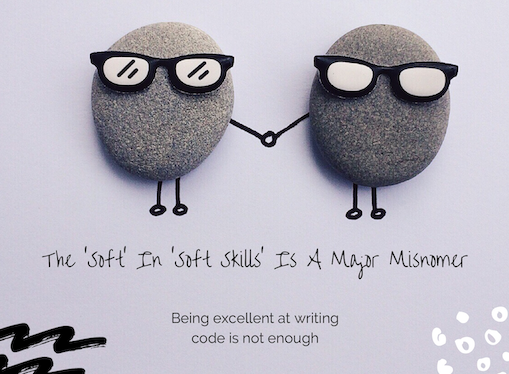
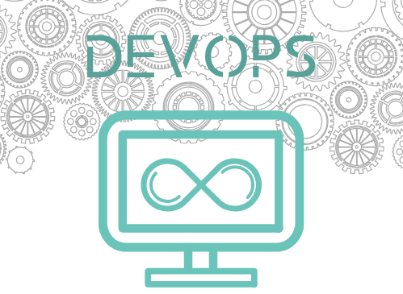
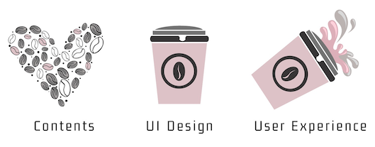
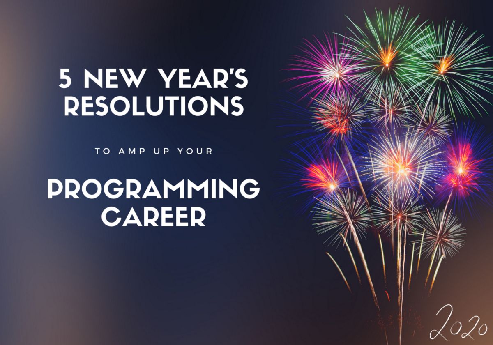

我会定期撰写有关中型领导力，技术和数据的文章-如果您想阅读我以后的文章，请“关注”我！
# 关于制定决议

您今年无需设定很多决议。 您只需要一些对您的编程职业和心态有积极影响的好人。 希望本文能激发您以最佳的方式开始新的一年！
```
📌 The Statistics behind New Year’s resolutionsThe statistics on how many people actually follow through and accomplish their New Year’s resolutions are rather grim. Research suggests that approximately half of all Americans make New Year’s resolutions yet only 8% actually achieve them. Also according to 'U.S. News' approximately 80% of resolutions fail by the second week of February!Ouch! Don’t be part of these statistics!📌 Make your career resolutions stickHow can you join this elite few people that pursue their plans and achieve their goals? Here is what the Harvard experts say.
```

新年快乐—新年快乐

🤞祝您新年快乐，健康成功！ 希望在2020年，我们所有人都离我们渴望拥有的职业并成为我们想要成为的人更近一步。

🙏最后但同样重要的是，我要感谢所有读者和本年度的TDS团队。 这是一个非常好的社区，你们都是一个伟大的社区。

谢谢阅读！
# — 5：了解业务领域

在我以前担任年轻工程师的环境中，业务分析师（BA）是业务与开发团队之间的联络人，因此，我相信，如果BA可以向我解释要求，我会写 代码-在我职业生涯的早期就很好。 但是，我很难理解，业务不关心代码！ 我们作为软件工程师的职责不是生产代码，而是为公司增值并产生业务影响。

花时间了解业务运作方式是我们工作的主要但经常被忽略的部分。 没有一个简单的，一刀切的所有人都可以回答的问题，因为我们都可能专注于不同领域，但是一个想法是与业务部门交谈并寻求建议，参加培训课程甚至寻求业务认证。 您的最终目标应该是证明您可以在与业务部门的讨论中贡献很多独特而宝贵的见解！ 例如，尝试指出有误的规范并提出其他可接受的建议。

为了解决问题，您必须首先了解问题

如果您想从程序员升级为开发负责人，架构师或项目经理，并在工作中获得成功，这将为您提供极大的帮助！
# -4：提高您的人际交往能力

开发人员是内向的怪胎，只能独自工作，这种想法已经完全过时了。 程序员是团队的一部分，他们每天与同事，经理和业务用户进行互动。 改进的第一要务是谦卑。 您可能已经阅读了我的以下观点：具有过硬的技术能力但出色的软技能的程序员在职业发展方面胜过技术专家！

这只是成为更好的开发人员的一个方面。 为了更全面地介绍人际关系，我提示您阅读以下两本出色的书：
+ 人民网
+ 软技能：软件开发人员的生活手册

# — 3：成为具有DevOps意识的开发人员

许多程序员认为他们的主要职责是编写代码，因此他们将DevOps视作一个松散的概念，实际上并没有帮助他们改善实际情况。 事实并非如此，拥护DevOps可以极大地帮助您的编程事业。 我的建议是从这些基本的DevOps技能入手：
## 持续交付

持续交付（CD）是从构建到生产环境的构建，测试，配置和部署软件的过程。 为了向最终用户提供价值，您必须持续，快速，一致且无错误地发布产品。 Atlassian的Bamboo是我选择的工具，因为它易于配置并且可以与Jira集成在一起。 在这里您可以找到更多信息。 对于等效的开源软件，请尝试詹金斯。

如果您仍然依靠手动过程来部署软件，请帮个忙，不要停下来！ 当您熟悉了这些好处之后，使用CD就变得轻而易举了！
## 测试自动化

软件测试不再仅由与项目相关的质量保证（QA）专家负责。 当您持续交付软件时，就不可能依靠临时测试和手动测试。 我假设您具有TDD（测试驱动开发）的基本知识，所以我鼓励您熟悉几种测试技术以及BDD（行为驱动开发）：
+ 软件测试中的经验教训
+ 行动中的BDD
## 应用监控

反应性软件补救措施并不理想，因为它们会破坏客户服务，因此每个组织都提供一种APM（应用程序性能监视器）系统，该系统可以监视CPU使用率，磁盘空间，SLA等。但是，作为开发人员，您还能提供什么帮助？ 并补充这项努力？ 监视和分析日志对于跟踪应用程序性能，进行故障排除，执行根本原因分析，检查系统行为并预测将来的中断非常重要。

我建议您专注于Elastic（ELK）堆栈，因为该公司可以说是最受欢迎的开源和商业用途的日志管理平台：Elasticsearch用于深度搜索和数据分析，Logstash用于集中式日志记录，日志扩充和解析 和Kibana提供强大而精美的数据可视化效果。 他们的在线视频是一个不错的切入点。


DevOps对软件开发产生了重大影响。 我们只是在这里进行了介绍，但是DZone是DevOps的“善良”伴随您的旅程的一个重要资源。
# — 2：关注用户体验

大多数后端开发人员认为UX（用户体验）设计等于UI（用户界面）设计，因此他们认为UX是前端开发人员的责任。 不！ 我将通过“解释”一幅我在“面向开发人员的动手UX设计”一本书中看到的图片来说明差异。 这是我的看法：


UX设计并非（仅）关于视觉效果。 它着重于用户体验的整体感觉，并涉及整个软件开发生命周期。 软件中断的频率，如何向用户提供反馈，界面的直观性，运行批处理需要多长时间，响应时间短，解决问题的上市时间是多长时间？ 问题[也是在这里也起作用]。

我正在与您分享关于UX的五个简单规则，我的团队和我在与非常难请的银行家和风险管理者打交了多年之后，学到了艰难的方法：
+ 在设计软件时让用户参与
+ 性能与功能同等重要
+ 错误消息应针对用户而不是开发人员
+ 在自我导向的用户界面中进行清晰导航是最好的
+ 质量保证是软件开发不可或缺的一部分

特别是关于UI设计，我建议您参考以下两个资源：《 101 UX原理》一书和99％的Invisible podcast。
# — 1：学习软件制作的技巧

程序运行不需要大量的知识和技能。 每个人都可以做到。 使某事正常工作不是一件难事-做到正确是！ 想象一下您上第一门编程课时编写的第一个程序。 并将其与现在进行比较。 看看你走了多远？

现在，让我向您介绍设计模式，坚实原则和软件体系结构范式的神奇世界，看看您如何才能与少数编写持久，具有高凝聚力和松散耦合的优雅软件的人相处，并且最容易理解 ，扩展和维护。

“建筑是关于重要的东西。 不管是什么。” —拉尔夫·约翰逊（Ralph Johnson）

以下是今年您应该努力阅读的一些经典著作：
+ 企业应用程序架构的模式
+ 清洁建筑
+ 设计模式：可重用的面向对象软件的元素

如果您将精力放在体系结构方面，而不是使用最新的语言，流行的框架或其他开发风尚，则可以更好地服务于软件工程。 我并不是说这些无关紧要； 事实上，情况正好相反！ 但是，如果您想提高自己的职业生涯，这是我的第一条建议：将精力集中在构建和开发软件上，从而降低维护成本。 换句话说：了解软件体系结构； 你的老板会爱你的！
# 5项新年计划，以提高您的编程职业
## 如何在2020年提高您作为开发人员的就业能力


1月1日即将到来，随着午夜的到来而来的诺言也随之而来。 有太多事情要做启动或相反地停止。 但是有时候，我们的新年目标会忽略我们的职业目标。 这不是很审慎，因为工作是我们生活中如此重要的部分，应该使我们最大的利益变得更好，使我们的生活变得更好。

我们应该仔细考虑要在未来十年内实现的目标，并计划🅝🅞🅦如何到达那里。 十年末是一个反思对我们有用或不有用的好时机，并思考我们可以采取哪些不同的措施来实现下一个目标。

因此，一定要从编程中喘一口气，然后再完全沉浸在相同的旧知识中，花一些时间进行反思和解决。 考虑到这一点，这里有一些解决方法的想法和一些相关资源，使您踏上一条新的道路。
```
⭐️ Pro Tip: As you approach this list, do not be vague. Think to yourself: "What shall I do, by when". You need to make a plan: SMART goals are specific, measurable, achievable, relevant and time bound.
```

让我们一起浏览一下清单：
```
(本文翻译自Semi Koen的文章《5 New Year’s Resolutions to Amp Up Your Programming Career》，参考：https://towardsdatascience.com/5-new-years-resolutions-to-amp-up-your-programming-career-175c4f9c7068)
```
