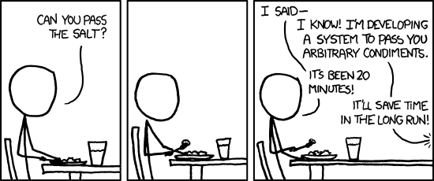

# 我们的灵感

我想知道他从哪里得到所有这些各种饮料？
# 7.运营设计思维


在大学学习时，一项很难在面试中测试且难以复制的技能正在思考最终用户可能如何错误地使用您的软件。 我们通常将其称为通过操作场景进行思考。

不过，这只是一种礼貌的方式，表示您正在尝试伪造证明代码。

例如，由于许多编程都是维护工作，因此通常意味着更改与其他代码高度纠缠的代码。 即使是简单的更改也需要跟踪对象，方法和/或API的所有可能引用。 否则，很容易意外破坏您未意识到已连接的模块。 即使您只是在更改数据库中的数据类型。

它还包括在进行开发之前仔细考虑边缘情况并仔细考虑整个高层设计。

对于要开发新模块或微服务的更复杂的情况，重要的是要花一些时间并仔细考虑所构建内容的操作场景。 考虑一下未来的用户可能如何使用您的新模块，他们可能如何不正确地使用它，可能需要哪些参数以及未来的程序员是否可能以其他方式使用您的代码。

简单地编码和编程只是问题的一部分。 创建在您的计算机上运行良好的软件很容易。 但是，部署代码有很多方法可能会出错。 一旦投入生产，就很难说出代码的使用方式以及原始代码会附加哪些其他代码。 从现在开始的五年后，未来的程序员可能会对代码的局限感到沮丧。
# 6.学习说不，优先

无论您是财务分析师还是软件工程师，这实际上都适合任何角色。 但特别是，技术角色似乎让每个人都需要一些东西。 如果您是数据工程师，则可能会被要求做更多的事情，而不仅仅是开发管道。 一些团队将需要数据提取，其他团队将需要仪表板，而其他团队则需要为其数据科学家提供新的管道。

undefined

这很困难，因为它很容易处理您提出的每个请求。 尤其是如果您即将大学毕业。 您希望避免使任何人失望，并且始终为您提供大量的工作。

在大公司中，总是有无数的工作。 关键仅在于采取什么措施。

undefined
# 5.编写简单的可维护代码


年轻工程师可能会出现的一种趋势是，尝试将他们所知道的一切实施到一个解决方案中。 有这样一种愿望，使您对面向对象的编程，数据结构，设计模式和新技术有所了解，并在编写的每一段代码中都使用这些知识。 您会产生不必要的复杂性，因为它很容易过度附加到您过去使用的解决方案或设计模式。

在复杂的设计概念和简单的代码之间取得平衡。 设计模式和面向对象的设计应该可以简化宏伟的事物中的代码。 但是，越来越多的流程被抽象化，封装和黑盒化，调试起来就越困难。
# 4. Github…等不了吗？


一些CS专业的学生在出生那天就开始使用Git。 他们了解每个命令和参数，并可以在专业人员周围盘旋。

其他人在第一份工作中就对Git有初见。 对于他们来说，Git是令人困惑的命令和进程的地狱景观。 他们从未百分百确定自己在做什么（这是备忘单很受欢迎的原因）。

无论您的公司使用哪种存储库系统，如果正确使用该系统都将很有帮助，而如果使用不当则会对系统造成阻碍。 一次简单的推送或承诺并不需要花费很多时间来解开多个分支和叉子的杂物。 另外，如果您经常忘记拉出最新版本的存储库，那么您还将要处理从未有过的有趣的合并冲突。

如果您需要保留Git命令备忘单，请执行此操作。 一切都会使您的生活更简单。
# 3.避免开会


undefined

最常见的方法是每天简单地阻止两个小时的会议，这是一个持续不断的会议。 通常，大多数人会在发现有益时召开一次定期会议。 他们将利用这段时间来赶上他们的开发工作。

避免开会以便完成工作的另一种方法是先出现，然后再出现。 就个人而言，我们喜欢早点出现，因为总的来说，办公室比较安静。 多数早期出现的人都像您一样，只是想完成工作，所以没有人困扰您。

这对于个人贡献者来说很重要，因为我们的工作需要我们专注于时间，而且我们不与其他人交谈。 是的，有时候您可能想在与他人一起工作的地方解决问题。 但是一旦解决了阻塞问题，您只需要编写代码。 这是关于进入那个区域的事情，在这个区域中，您经常对自己正在做的工作抱有很多复杂的想法。 如果您经常停下来，可能很难从上次停下来的地方继续往前走。
# 2.对不良项目的意识

有很多技能需要花一些时间来学习。 我们认为值得了解的技能之一就是了解哪些项目不值得做，哪些项目显然是步履蹒跚。

大公司的项目总是比可能完成或影响更大的项目多。 有些项目可能没有任何业务意义（至少对您而言没有意义），还有一些项目的管理不善。 这并不是说您不同意该项目时就应该切断想法。 但是，如果利益相关者无法正确解释最终结果将做什么，那么该项目可能就不值得做。

另外，某些项目可能过于关注技术而不是解决方案，因此从一开始就很明显不会产生太大影响。 在了解到底什么是坏项目之前，此技能需要执行许多坏项目。 因此，不要花太多时间在尝试辨别每个项目上。

在您的职业生涯的某个时候，您将拥有良好的直觉。
# 1.学习如何阅读他人的密码


除您之外的每个人都编写糟糕的代码。

这就是为什么一项具有多项好处的伟大技能就是能够遵循他人的代码。

不管以前的工程师的代码多么混乱或不怎么认真，您仍然需要能够遍历它。 毕竟，这是您的工作。 即使那位工程师是你一年前。

此技能有两种好处。 一种是，能够阅读别人的代码，这是了解什么是不良设计的绝佳机会。 在浏览其他人的代码时，您会了解哪些有效，哪些无效。 更重要的是，您将学习哪种类型的代码容易被另一位工程师遵循以及哪些代码难以遵循。

您需要确保尽可能多地阅读别人的代码。 这样，其他工程师就会了解您是一名高级工程师。

确保您提出有关可维护代码和良好注释的重要性的要点。 这进一步显示了您在编程领域的主导地位。

您的代码应设计得井井有条，不需要任何文档。 实际上，如果您是一名优秀的程序员，则不应编写任何代码。 这只是浪费时间，您需要花费时间进行编码和参加会议。

能够读取他人的凌乱代码，也可以在需要时轻松进行更新。 有时候这意味着更新您缺乏经验的代码。例如，我们曾经将脚本从Powershell转换为Python，再转换为Perl。 我们在Perl方面的经验有限，但是我们仍然有足够的背景信息来弄清楚发生了什么并进行所需的更改。

这源于对所有代码的理解以及对Perl脚本的理解。

阅读别人的代码使您变得很有价值，因为即使您使用的都是经过精心设计的系统，也可能会使他人感到困惑。
# 高效程序员的7种技能
## 受到前Google TechLead的启发

> Photo by Chris Ried on Unsplash


软件工程师花费大量时间通过练习leet代码问题和完善简历来获得面试技巧。

一旦他们最终在初创公司，谷歌，亚马逊或另一家公司获得这份工作，他们可能会发现他们用来获得这份工作的技能与他们日常工作所需要的技能不匹配。

我们的团队受到TechLead创建的高效程序员的七项技能的启发。 我们想对这个话题发表自己的看法。

这是我们有效的程序员的七项技能。
```
(本文翻译自SeattleDataGuy的文章《7 Skills of Highly Effective Programmers》，参考：https://medium.com/better-programming/7-habits-of-highly-effective-programmers-563ee3b63f33)
```
