## 使用交互式地图和动画可视化伦敦的自行车出行
### 探索Python中的数据可视化工具
## 为什么样本方差被n-1除
### 解释您的老师没有教过的高中统计资料
## 我希望我早先知道的5个Python功能
### Python技巧超越了lambda，map和filter
# 4.外卖

总而言之，我们使用蒙特卡洛模拟法估算了着陆概率，以便计算在N玩家游戏中具有一定数量房屋的每种颜色集的收支平衡点和预期利润。 基于上述观察和策略，我们总结了您应遵循的以下7种策略。
+ 避免使用公用事业和布朗集，
+ 在获得铁路收益以获得短期收益时观看现金储备，或者在4人以上游戏中获得蓝收益以获得长期收益，
+ 根据游戏中的玩家数量选择橙色，红色，黄色和/或绿色，
+ 为您拥有的每种颜色快速建造3栋房屋，
+ 注意现金流，然后在财务上可行的时候建造第四所房子，以最大化您的利润，
+ 避免购买酒店，否则您会为对手腾出房子，因为游戏中只有32个房子，并且
+ 通过不付款避免在稍后阶段支付租金来留在监狱。

由于我们做出了许多假设，在某些情况下可能不成立，因此您应该花点时间进行分析。 每个游戏都是不同的，很难一概而论。 考虑到人类行为的不可预测性也是极其困难的，因为允许并鼓励玩家自由交易。
## 有趣的事实

一回合后，您有1.94％的机会进入监狱。 您可以借助双打击中“进入监狱”或从任一副牌中抽出“立即进入监狱”卡。

千载难逢的机会。
```python
# probability of getting imprisoned (not just visiting) in your first turn of a game
n_game = 1e6
n_round = 1
player = Player()
imprisoned_cnt = 0
board = Board()

for i in range(n_game): # simulate 10,000 games
    player.new_game()    
    board.turn(player=player) # simulate a turn for each player
    if player.imprisoned:
        imprisoned_cnt += 1
        
print(f'There is a {imprisoned_cnt/n_game*100:.2f}% chance that you are in Jail after one turn.')
```

谢谢阅读！ 同样，代码在GitHub上可用。 如果您对Python，统计数据或可视化感兴趣，则以下文章可能会有所帮助：
## 我希望我早先知道的5个Python功能
### Python技巧超越了lambda，map和filter
## 为什么样本方差被n-1除
### 解释您的老师没有教过的高中统计资料
## 使用交互式地图和动画可视化伦敦的自行车出行
### 探索Python中的数据可视化工具

最初发布于edenau.github.io。
## b。 预期利润

我们都知道，游戏的目标不仅仅是达到收支平衡。

您想赚钱并使您的对手破产。 彩色组的利润是该组总收入与总成本之间的差。 收入与对手回合总数成正比，而成本则是恒定的。 它们可以通过以下公式计算。
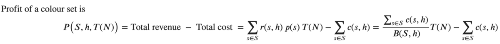

我们先前假设游戏中的回合数R或多或少是恒定的。 对手回合数T =（N-1）R线性增加，因此收入（和利润P）随着玩家数的增加而线性增加。

让我们看看如果您拥有不同的颜色设置以及在顶部建造不同数量的房屋，那么在游戏中玩家数量不同时利润会如何变化。 持有全部四个站点和持有全部两个公用事业的利润也作了参考。
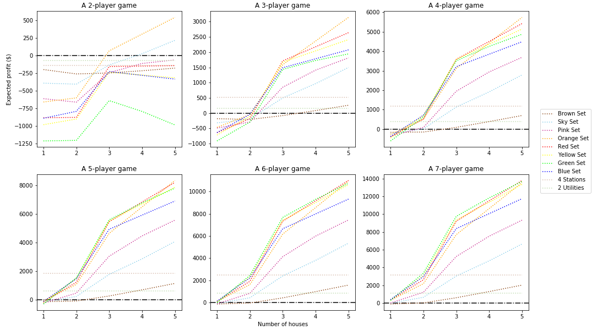
> Expected profit of each colour set in an N-player game, for N between 2 and 7


我们发现
+ 布朗套装毫无价值，
+ 在玩家开始建造房屋之前，获得4条铁路可以在游戏开始时为您带来快速收益，
+ 建造第三所房子时，利润会大大增加，
+ 橙色在2人游戏中占主导地位，
+ 红色，黄色和绿色也很有希望，并且
+ 蓝色是平均水平。

因此，您应该
+ 避免使用棕色或粉红色的公用设施，
+ 如果您一开始买得起，就选择全部4条铁路，并且不要坚持交易其他物业来换取铁路收藏品，因为从长远来看效果不佳，
+ 前往天空和橙色进行2人游戏，
+ 参加橙色，红色和黄色的3人游戏，
+ 参加绿色比赛，参加4人以上的比赛，
+ 仅当您有足够的现金储备时，才可以在4人以上的游戏中加入蓝军，并且
+ 迅速盖三间房子。 那是关键。
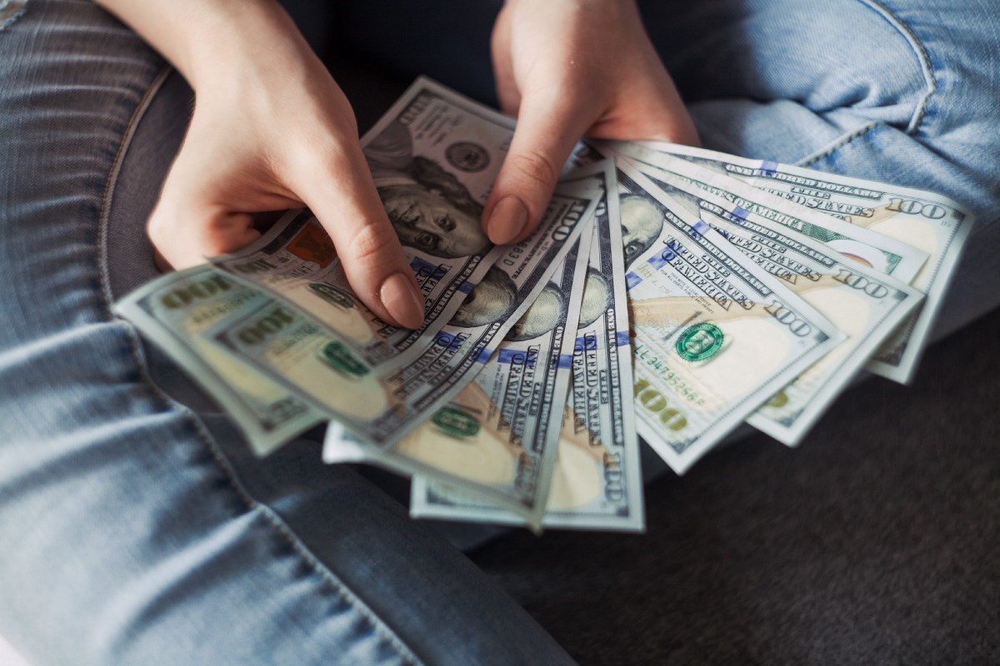
> Photo by Alexander Mils on Unsplash

# 3.评估
## 一种。 收支平衡点

我们将资产的收支平衡点定义为收回投资所需的预期对手数。 这是通过财产总成本除以对手每回合的预期租金收入得出的。 对手每转一圈的预期收入与其着陆概率和租金收入成正比。 我们可以使用相同的逻辑通过以下公式找出颜色集的收支平衡点。
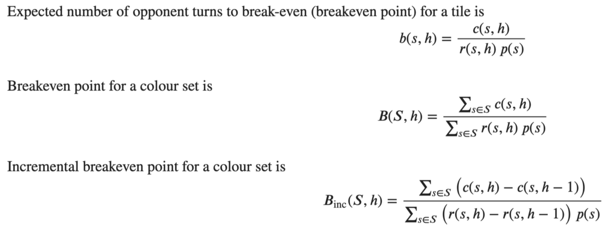

我们还将增量盈亏平衡点定义为收回增量投资所需的预期对手轮数。 这意味着如果球员决定盖一栋额外的房子，他要花多长时间才能拿回钱。

让我们看看房屋数量不同的每种颜色的收支平衡点如何变化。 5间房屋对应于一家酒店，以实现可视化目的。
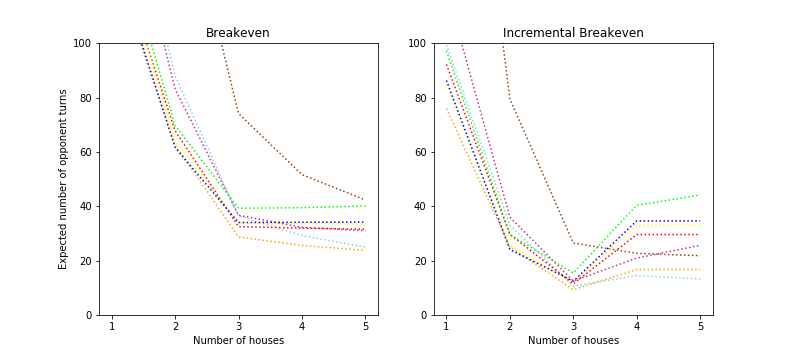
> Break-even points of each colour set as a function of the number of houses


我们发现
+ 花费最长时间才能收回您在Brown系列中的投资，
+ 即使您投资Sky或Orange套装，收支平衡也更容易，
+ 对于拥有3个房屋的集合，要达到收支平衡比1或2容易得多，并且
+ 如果您投资绿色或蓝色套装中的第四套房子，则可能无法收回您的钱。

我们仅基于盈亏平衡点的比较提出了以下策略。 你应该
+ 避免布朗集，
+ 使用您拥有的所有其他颜色快速建造3栋房屋，并且
+ 如果您拥有它们，则可以在天空和/或橙色区域中建造第四间房屋。

> Photo by Tierra Mallorca on Unsplash

## b。 投资成本

物业的投资成本c（s，h）包括土地价格和房屋价格。 对于不同的属性和在顶部建造的房屋数量，它有所不同。 它们被硬编码到程序中。
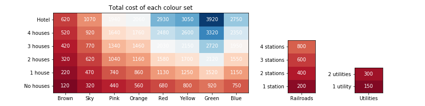
> Cost matrix for each colour set, railroads, and utilities


请注意，我们会考虑整个颜色集的投资成本，而不是单个属性的投资成本。 这是因为只有当玩家拥有整个颜色集时才能购买房屋。
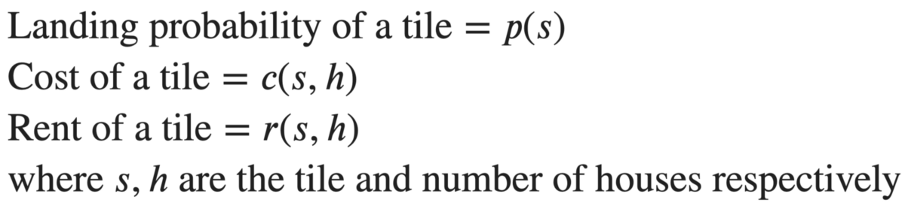

我们还以类似的方式对租金收入矩阵r（s，h）进行了硬编码。
# 2.变量
## 一种。 着陆概率

让我们模拟四人大富翁游戏一百万次。 为了简化模拟，我们没有模拟参与者之间的货币交换或交易，因为这会使事情复杂化。

让我们定义一些变量。
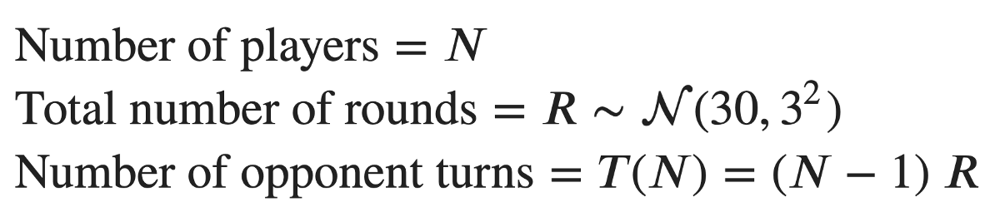

对于N玩家的大富翁游戏，我们假设有R轮，每个玩家在每个回合中都有一个回合。 对手回合总数为（N-1）R。 我们假设每个玩家在游戏中玩的回合次数相同，即没有玩家提前退出。
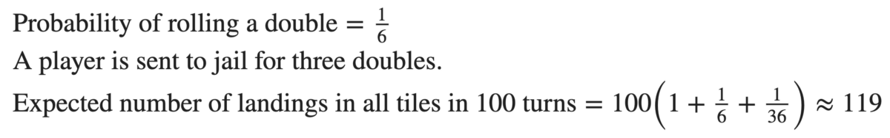

旁注1：根据官方“大富翁”规则，连续双打被视为一回合。 每个双打的降落仍记录在我们的模拟中。 因此，每100圈，所有磁贴的预期着陆数量约为119。
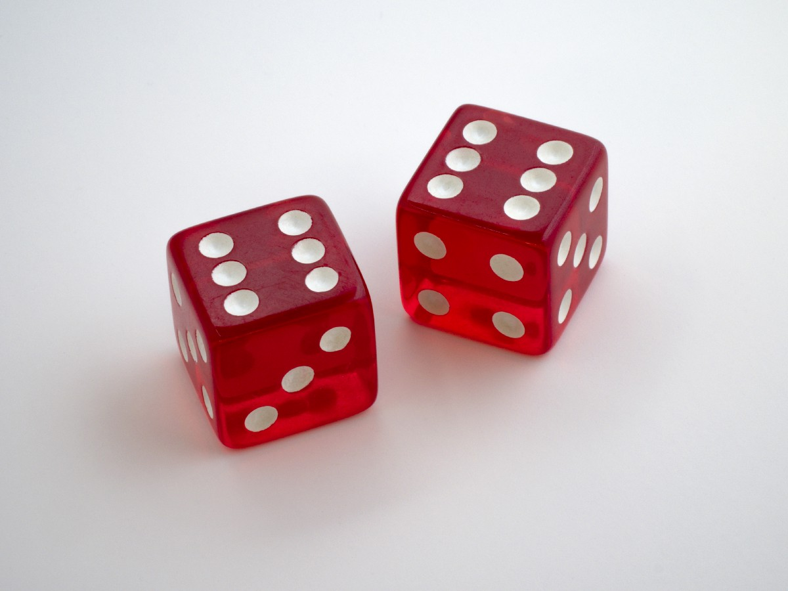
> Photo by Brett Jordan on Unsplash


为了获得更逼真的近似值，我们在模拟中增加了随机性，其中游戏中的回合数R遵循具有均值30和标准差3的高斯分布。均值取自在线文章，方差为 任意的。
```python
opponents = []
n_oppo = 4-1 # a 4-player game has 3 opponents

n_game = 1e6
n_round_mean, n_round_std = get_n_round_stat(n_oppo)

# 1. Create opponents in a list
for _ in range(n_oppo):
    opponents.append(Player())

# 2. Simulate 1,000,000 games
for i in range(round(n_game)): 
    # by creating a new board and cleaning each player's states
    board = Board()
    for player in opponents:
        player.new_game()
        
    # 3. Simulate a random number of rounds per game
    n_round = np.random.normal(n_round_mean, n_round_std)
    for j in range(round(n_round)): 
        # 4. Simulate each turn for each player
        for player in opponents:
            board.turn(player=player)
```

让我们通过条形图可视化每个图块s的着陆概率p（s）。
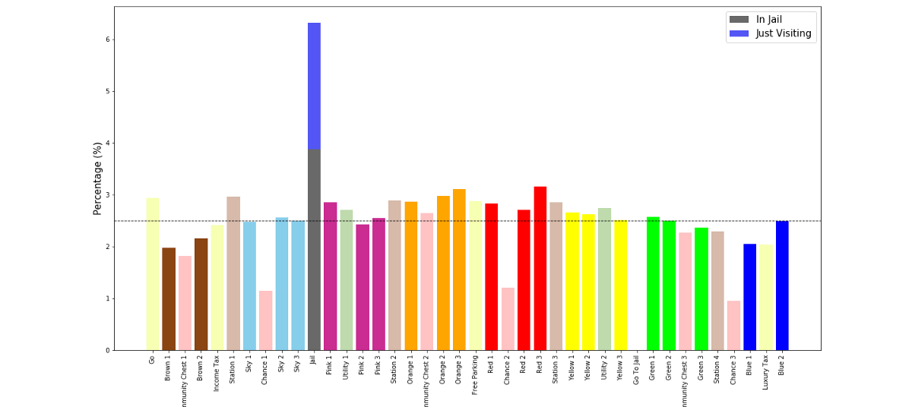
> Landing probabilities of tiles on the Monopoly board


哇。

我当然没想到这一点。 着陆概率不相等。 我们可以观察到
+ 您最终有0％的机会最终会进入“入狱”，
+ 您可能会选择使用CC磁贴而不是使用Chance磁贴，这可能是由于牌组中的纸牌组合有所不同，
+ 您有6.31％的机会进入监狱，包括“仅拜访”和“进入监狱”，
+ 即使我们不包括“ Just Visiting”，监狱也是访问量最高的区域，
+ 布朗1号（Old Kent Road / Mediterranean Avenue）是造访次数最少的房产，机会为1.98％，
+ 红色3号（特拉法加广场/伊利诺伊州大街）是访问量最大的酒店，概率为3.16％，这可能是因为将玩家发送到该酒店的机会卡，以及
+ Orange 3（Vine Street /纽约大街）和Orange 2（Marlborough Street / Tennessee Avenue）是参观人数最多的房地产竞赛的亚军，这使得Orange设置平均是参观人数最多的颜色组。 这是因为刚离开监狱（棋盘上访问最多的地方）的玩家经常会拜访他们。

也许布朗套装不值得投资。 也许橙色是必须购买的。 我们目前尚不确定，因为我们没有考虑他们的租金和成本。 我们也这样做。

旁注2：监狱的着陆可能性可能被低估了。 我们假设玩家通过使用免费监狱卡或支付50英镑/美元来摆脱监狱。 他们不会尝试不支付任何费用而翻倍越狱。 这种假设在游戏开始时就成立了，但在游戏结束时却没有，因为留在监狱里是避免支付租金的最佳策略。
## C。 实现—面向对象的编程

我们模拟板。 我们使用面向对象编程来模拟玩家掷骰子，在棋盘上移动以及其他所有内容。 我们正在Python中实现它，代码可在GitHub上获得。
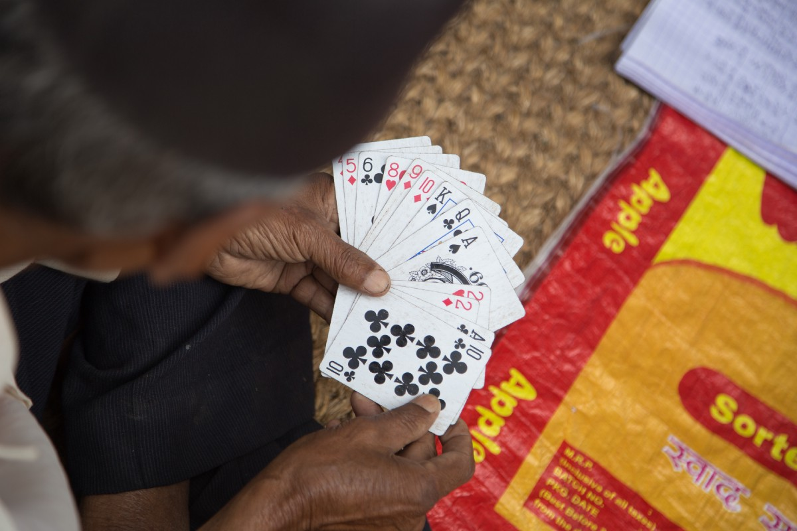
> Photo by Miroslav Jonas on Unsplash


大富翁游戏中有两种对象-棋盘和一些玩家。 通过在掷骰子的过程中在棋盘上奔跑的玩家进行模拟，并在需要时有时从Chance或Community Chest的桌子中抽牌。 然后，可以通过蒙特卡洛模拟来估算玩家出现在每个图块上的概率。

玩家具有1.状态：
+ 板上的当前位置∈[0..39]，
+ 当玩家连续掷出三个连续的双打时，一个计数连续掷出的双打∈[0..3]的双倍计数器立即被送入监狱，并且计数器重置，并且
+ 监禁布尔变量∈[0,1]，用于区分“只是来访”和“入狱”；

2.财产：
+ 来自Chance卡座∈[0,1]的无监狱卡，并且
+ 来自社区公益金∈[0,1]的无监狱卡；

和3.记录，
+ 落在电路板上每个区块上的事件总数，以及
+ 降落在监狱上时，“仅拜访”和“入狱”的总次数。

玩家可以
+ 掷一双公平的骰子，
+ 更新并记录他们的新职位，
+ 更新他们的其他身份和财产，以及
+ 开始新游戏时清理他们的身份和财产。

另一方面，董事会拥有
+ 名称，物业类型，物业价格，房价，所有瓷砖的不同数量房屋的租金，以及
+ 在游戏开始时就被洗牌的机会和CC的牌组洗了一次，可以在其中取出免押金卡并放回原处。

板可以
+ 模拟玩家掷骰子的回合以及随后发生的所有事情，以及
+ 模拟每个卡组的抽奖。
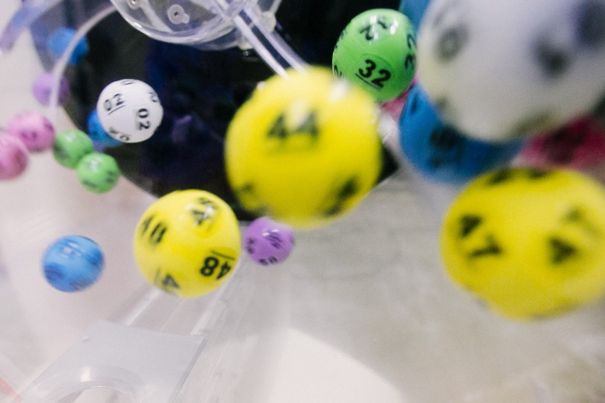
> Photo by dylan nolte on Unsplash

## b。 方法论—蒙特卡洛

我们将着陆概率定义为玩家在回合结束时或在下一局掷骰之前（如果获得双倍奖励）在瓷砖上结束的概率。

游戏中有许多因素会影响着陆概率。 所有玩家都从开始（开始为0）开始。 他们按自己的顺序掷出一对骰子，并相应地在棋盘上移动。 由于滚动7的可能性比获得2或12的可能性大得多，因此某些磁贴可能比其他磁贴更常被访问。

> Photo by Geoff Brooks on Unsplash


当玩家落在不是属性的“临时”图块上时，他们会遵循该图块的规则，并最终可能会在另一个图块中结束。
+ 到达“进入监狱”（第30层）的玩家显然被送往监狱（第10层）。
+ 到达公益金（CC）（2、17和33组）的玩家从CC牌组中抽牌并据此移动。 他们可能会停留在当前位置，但可能会被发送到Go或Jail。
+ 到达机会（第7、22和36号瓷砖）的玩家从“机会”牌中抽牌并据此移动。 他们可能会停留在当前的位置，但也可能会被发送到Go，Jail，位置5、11、24或39。他们可以向后移动3步。
+ 连续滚动三双的玩家将被送进监狱。

您可以立即发现降落到“去监狱”的可能性为零。 玩家不能在没有被送进监狱的情况下最终停留在此砖块上。*请注意，“摆脱监狱免费”卡无需支付银行费用即可使玩家退出监狱，他们不能被用来避免首先进入监狱。

非常复杂。

我们可以使用马尔可夫链和一些巨大矩阵来分析找到着陆概率。 您可以从每个起始图块分析得出到达每个图块的条件概率。 而且我们不会那样做。

另外，我们可以通过蒙特卡洛模拟来估算着陆概率。 蒙特卡洛方法通过重复随机抽样来近似分布。 在这种情况下，我们可以模拟百万富翁游戏一百万次。 我们记录玩家在每个图块上出现的频率。 记录的频率是着陆概率的近似值。 我们模拟的游戏越多，我们就越有信心。

但是如何？
# 1.目标
## 一种。 指标

您想在游戏中实现什么？ 你想赢。 成为唯一的幸存者。 赚钱。 您想明智地投资可以为您带来利润的房地产。 我们到了那里。

> Photo by Annie Spratt on Unsplash


为了投资某些物业，收支平衡需要多长时间？ 我可以在游戏中赚多少钱？ 我们需要建立一些指标来衡量您的效果。
+ 收支平衡点：要收回您投资的资金需要多少对手转弯？ 棕色的套装非常便宜，但是要花很多时间才能收回您的钱吗？ 蓝色的很贵，但也许我会很快就把钱还回来？
+ 预期利润：游戏中每组资产的预期利润是多少？ 如果一场比赛中有无限多回合，我们非常有信心Blue套组可以为您带来最大的利润。 但是，当其他所有人的钱都用尽时，游戏结束。 蓝军可能不值得在短游戏中进行投资。

一组属性的性能取决于a）收入，b）成本以及c）对手降落在其上的可能性。 如果您的对手以某种方式有可能是房地产A的2倍，那么即使B的租金更高，也可能值得投资。 薄利多销。

我们知道物业的成本和租金。 他们写在他们的地契上。 但是我们不知道它们的着陆概率。 让我们找出答案。
# 约定
+ 命名：我们将通过面板上的颜色来命名属性，因为它们在全球范围内的不同版本中具有不同的名称。 事实证明，还有多种配色方案，但是我们将按价格升序使用以下版本-棕色，天空，粉红色，橙色，红色，黄色，绿色和蓝色。 也有铁路和公用事业。
+ 标记：我们使用0到39之间的整数标记“转到蓝色2”（即Mayfair / Boardwalk）中的每个图块。
+ 成本：投资房地产的玩家支付a）一次性土地价格，b）如果他们决定建造一些房屋价格。
+ 收入：当一名对手登陆其拥有的物业时，其获得租金收入。
+ 双打：两个骰子的号码相同。 掷双打的玩家可以再次掷骰子。
# 赢得垄断的7种策略
## 有关Python，统计信息，可视化和童年记忆的故事

> Photo by Raivis Razgals on Unsplash


垄断是世界上最受欢迎的棋盘游戏之一。 它具有许多不同的许可和本地化版本。 孩之宝（Hasbro）刚刚发布了具有三重属性的更长版本的《大富翁》（Monopoly），这将永远发挥作用。

这是一个棋盘游戏，可以给人们（美好的？）童年记忆。 我曾经在假期与亲戚的孩子一起玩，但我通常会迷路。

我玩《大富翁》已有多年了。 但是我真的很想知道我是否可以打得更好以增加获胜的机会。 也许我可以胜任。 今天，我将分析如何最大程度地赢得大富翁游戏。

我们的分析涉及Python，统计数据和可视化。

就像现实世界一样，游戏中的属性是不相等的。 它们带有不同的价值和奖励。 许多人认为，“ Go”磁贴（梅菲尔/木板路或Blue 2）之前最昂贵的房产可以为他们带来一笔财富，而其他人则更喜欢收集整套铁路或公用事业。

代码在GitHub上可用。
```
(本文翻译自Eden Au的文章《7 Strategies to Win Monopoly》，参考：https://towardsdatascience.com/7-strategies-to-win-monopoly-a89ead18b062)
```
