# Javascript中的8种常见数据结构
## 更好地了解数据结构如何工作

这听起来是否熟悉：“我通过完成兼职课程开始了前端开发”

您可能正在寻求提高计算机科学的基础知识，尤其是在数据结构和算法方面。 今天，我们将介绍一些常见的数据结构，并以JavaScript实施它们。

希望这部分内容可以补充您的技能！
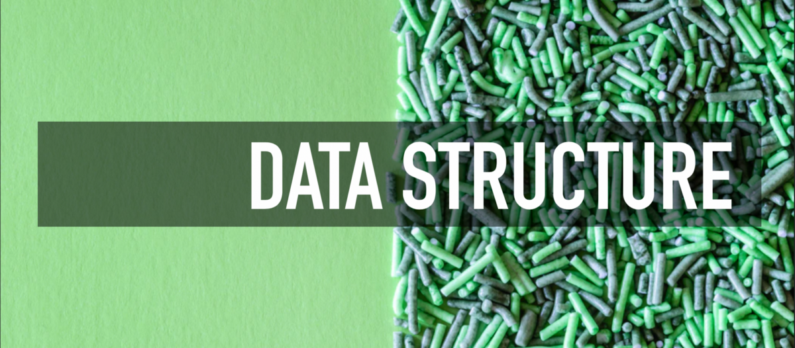
## 1.堆叠
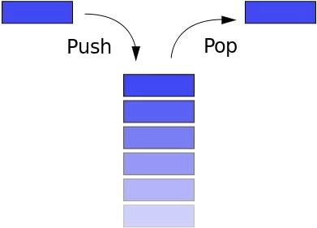

堆栈遵循LIFO（后进先出）的原理。 如果您堆叠书籍，则最上层的书籍将排在最底层的书籍之前。 或者，当您在Internet上浏览时，后退按钮会将您带到最近浏览的页面。

Stack具有以下常见方法：
+ 推送：输入一个新元素
+ pop：删除顶部元素，返回删除的元素
+ 窥视：返回顶部元素
+ length：返回堆栈中的元素数）

Javascript中的数组具有Stack的属性，但是我们使用Stack（）函数从头开始构建Stack
```
function Stack() {this.count = 0;  this.storage = {};  this.push = function (value) {    this.storage[this.count] = value;    this.count++;  }  this.pop = function () {    if (this.count === 0) {      return undefined;    }    this.count--;    var result = this.storage[this.count];    delete this.storage[this.count];    return result;  }  this.peek = function () {    return this.storage[this.count - 1];  }  this.size = function () {    return this.count;  }}
```
## 2.排队


队列类似于堆栈。 唯一的区别是Queue使用FIFO原理（先进先出）。 换句话说，当您排队等候总线时，队列中的第一个将始终排在第一位。

队列具有以下方法：
+ 入队：输入队列，在最后添加一个元素
+ 出队：离开队列，移除前元素并返回
+ 前：获取第一个元素
+ isEmpty：确定队列是否为空
+ size：获取队列中的元素数）

JavaScript中的数组具有Queue的某些属性，因此我们可以使用数组来构造Queue的示例：
```
function Queue() {  var collection = [];  this.print = function () {    console.log(collection);  }  this.enqueue = function (element) {    collection.push(element);  }  this.dequeue = function () {    return collection.shift();  }  this.front = function () {    return collection[0];  }  this.isEmpty = function () {    return collection.length === 0;  }  this.size = function () {    return collection.length;  }}
```
## 优先队列

队列还有另一个高级版本。 为每个元素分配优先级，并将根据优先级对它们进行排序：
```
function PriorityQueue() {  ...  this.enqueue = function (element) {    if (this.isEmpty()) {      collection.push(element);    } else {      var added = false;      for (var i = 0; i < collection.length; i++) {        if (element[1] < collection[i][1]) {          collection.splice(i, 0, element);          added = true;          break;        }      }      if (!added) {        collection.push(element);      }    }  }}
```

测试一下：
```
var pQ = new PriorityQueue();pQ.enqueue([ gannicus , 3]);pQ.enqueue([ spartacus , 1]);pQ.enqueue([ crixus , 2]);pQ.enqueue([ oenomaus , 4]);pQ.print();
```

结果：
```
[  [  spartacus , 1 ],  [  crixus , 2 ],  [  gannicus , 3 ],  [  oenomaus , 4 ]]
```
## 3.链表
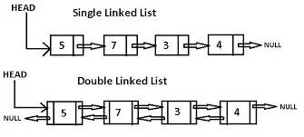

从字面上看，链表是一个链式数据结构，每个节点由两部分信息组成：该节点的数据和指向下一个节点的指针。 链表和常规数组都是带有序列化存储的线性数据结构。 当然，它们也有差异：
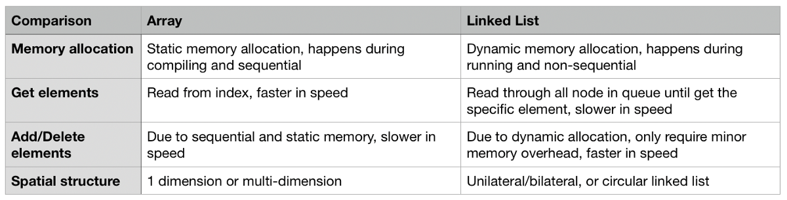

单边链表通常具有以下方法：
+ size：返回节点数
+ head：返回head的元素
+ 添加：在尾部添加另一个节点
+ 删除：删除某些节点
+ indexOf：返回节点的索引
+ elementAt：返回索引的节点
+ addAt：在特定索引处插入节点
+ removeAt：删除特定索引处的节点
```
/** Node in the linked list **/function Node(element) {      // Data in the node    this.element = element;      // Pointer to the next node     this.next = null;}    function LinkedList() {          var length = 0;          var head = null;          this.size = function () {                return length;          }          this.head = function () {                return head;          }          this.add = function (element) {                var node = new Node(element);                if (head == null) {                      head = node;                } else {                      var currentNode = head;                      while (currentNode.next) {                            currentNode = currentNode.next;                      }                      currentNode.next = node;                }                length++;          }          this.remove = function (element) {                var currentNode = head;                var previousNode;                if (currentNode.element === element) {                      head = currentNode.next;                } else {                      while (currentNode.element !== element) {                            previousNode = currentNode;                            currentNode = currentNode.next;                      }                      previousNode.next = currentNode.next;                }                length--;          }          this.isEmpty = function () {                return length === 0;          }          this.indexOf = function (element) {                var currentNode = head;                var index = -1;                while (currentNode) {                      index++;                      if (currentNode.element === element) {                            return index;                      }                      currentNode = currentNode.next;                }                return -1;          }          this.elementAt = function (index) {                var currentNode = head;                var count = 0;                while (count < index) {                      count++;                      currentNode = currentNode.next;                }                return currentNode.element;          }          this.addAt = function (index, element) {                var node = new Node(element);                var currentNode = head;                var previousNode;                var currentIndex = 0;                if (index > length) {                      return false;                }                if (index === 0) {                      node.next = currentNode;                      head = node;                } else {                      while (currentIndex < index) {                            currentIndex++;                            previousNode = currentNode;                            currentNode = currentNode.next;                      }                      node.next = currentNode;                      previousNode.next = node;                }                length++;          }          this.removeAt = function (index) {                var currentNode = head;                var previousNode;                var currentIndex = 0;                if (index < 0 || index >= length) {                      return null;                }                if (index === 0) {                      head = currentIndex.next;                } else {                      while (currentIndex < index) {                            currentIndex++;                            previousNode = currentNode;                            currentNode = currentNode.next;                      }                      previousNode.next = currentNode.next;                }                length--;                return currentNode.element;          }    }
```
## 4.设置


集合是数学的基本概念：定义明确且不同的对象的集合。 ES6引入了集合的概念，它与数组有一定程度的相似性。 但是，集合不允许重复元素，也不会被索引。

一个典型的集合具有以下方法：
+ 值：返回集合中的所有元素
+ size：返回元素数
+ 具有：确定元素是否存在
+ 添加：将元素插入集合
+ 删除：从集合中删除元素
+ 并集：返回两组的交集
+ 差异：返回两组的差异
+ 子集：确定某个集合是否是另一个集合的子集

为了区分ES6中的集合，在以下示例中我们声明为MySet：
```
function MySet() {      var collection = [];      this.has = function (element) {            return (collection.indexOf(element) !== -1);      }      this.values = function () {            return collection;      }      this.size = function () {            return collection.length;      }      this.add = function (element) {            if (!this.has(element)) {                  collection.push(element);                  return true;            }            return false;      }      this.remove = function (element) {            if (this.has(element)) {                  index = collection.indexOf(element);                  collection.splice(index, 1);                  return true;            }            return false;      }      this.union = function (otherSet) {            var unionSet = new MySet();            var firstSet = this.values();            var secondSet = otherSet.values();            firstSet.forEach(function (e) {                  unionSet.add(e);            });            secondSet.forEach(function (e) {                  unionSet.add(e);            });            return unionSet;  }          this.intersection = function (otherSet) {                var intersectionSet = new MySet();                var firstSet = this.values();                firstSet.forEach(function (e) {                      if (otherSet.has(e)) {                            intersectionSet.add(e);                      }                });                return intersectionSet;          }          this.difference = function (otherSet) {                var differenceSet = new MySet();                var firstSet = this.values();                firstSet.forEach(function (e) {                      if (!otherSet.has(e)) {                            differenceSet.add(e);                      }                });                return differenceSet;          }          this.subset = function (otherSet) {                var firstSet = this.values();                return firstSet.every(function (value) {                      return otherSet.has(value);                });          }    }
```
## 5.哈希表
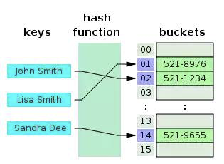

哈希表是键值数据结构。 由于通过键查询值的闪电般的速度，它通常用于Map，Dictionary或Object数据结构中。 如上图所示，哈希表使用哈希函数将键转换为数字列表，这些数字用作相应键的值。 要快速使用键获取价值，时间复杂度可以达到O（1）。 相同的键必须返回相同的值-这是哈希函数的基础。

哈希表具有以下方法：
+ 添加：添加键值对
+ 删除：删除键值对
+ 查找：使用键查找对应的值

Java简化哈希表的示例：
```
function hash(string, max) {  var hash = 0;  for (var i = 0; i < string.length; i++) {    hash += string.charCodeAt(i);  }  return hash % max;}function HashTable() {  let storage = [];  const storageLimit = 4;  this.add = function (key, value) {    var index = hash(key, storageLimit);    if (storage[index] === undefined) {      storage[index] = [        [key, value]      ];    } else {      var inserted = false;      for (var i = 0; i < storage[index].length; i++) {        if (storage[index][i][0] === key) {          storage[index][i][1] = value;          inserted = true;        }      }      if (inserted === false) {        storage[index].push([key, value]);      }    }  }  this.remove = function (key) {    var index = hash(key, storageLimit);    if (storage[index].length === 1 && storage[index][0][0] === key) {      delete storage[index];    } else {      for (var i = 0; i < storage[index]; i++) {        if (storage[index][i][0] === key) {          delete storage[index][i];        }      }    }  }  this.lookup = function (key) {    var index = hash(key, storageLimit);    if (storage[index] === undefined) {      return undefined;    } else {      for (var i = 0; i < storage[index].length; i++) {        if (storage[index][i][0] === key) {          return storage[index][i][1];        }      }    }  }}
```
## 6.树
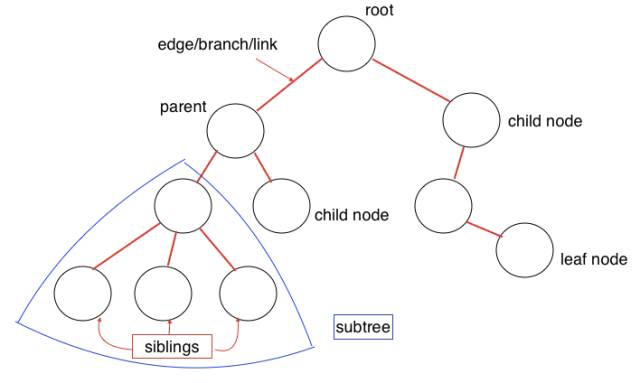

树数据结构是多层结构。 与Array，Stack和Queue相比，它也是一种非线性数据结构。 在插入和搜索操作期间，此结构非常高效。 让我们看一下树数据结构的一些概念：
+ root：树的根节点，无父节点
+ 父节点：上层的直接节点，只有一个
+ 子节点：较低层的直接节点，可以有多个
+ 兄弟姐妹：共享同一父节点
+ 叶：没有子节点
+ 边缘：节点之间的分支或链接
+ 路径：从起始节点到目标节点的边缘
+ 节点高度：特定节点到叶节点的最长路径的边数
+ 树的高度：根节点到叶节点的最长路径的边数
+ 节点深度：从根节点到特定节点的边数
+ 节点度：子节点数

这是二叉搜索树的示例。 每个节点最多有两个节点，左节点小于当前节点，右节点大于当前节点：
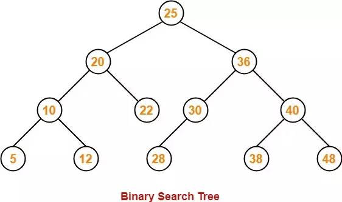

二进制搜索树中的常用方法：
+ 添加：在树中插入一个节点
+ findMin：获取最小节点
+ findMax：获取最大节点
+ 查找：搜索特定节点
+ isPresent：确定某个节点的存在
+ 删除：从树中删除节点

JavaScript中的示例：
```
class Node {  constructor(data, left = null, right = null) {    this.data = data;    this.left = left;    this.right = right;  }}class BST {  constructor() {    this.root = null;  }  add(data) {    const node = this.root;    if (node === null) {      this.root = new Node(data);      return;    } else {      const searchTree = function (node) {        if (data < node.data) {          if (node.left === null) {            node.left = new Node(data);            return;          } else if (node.left !== null) {            return searchTree(node.left);          }        } else if (data > node.data) {          if (node.right === null) {            node.right = new Node(data);            return;          } else if (node.right !== null) {            return searchTree(node.right);          }        } else {          return null;        }      };      return searchTree(node);    }  }  findMin() {    let current = this.root;    while (current.left !== null) {      current = current.left;    }    return current.data;  }  findMax() {    let current = this.root;    while (current.right !== null) {      current = current.right;    }    return current.data;  }  find(data) {    let current = this.root;    while (current.data !== data) {      if (data < current.data) {        current = current.left      } else {        current = current.right;      }      if (current === null) {        return null;      }    }    return current;  }  isPresent(data) {    let current = this.root;    while (current) {      if (data === current.data) {        return true;      }      if (data < current.data) {        current = current.left;      } else {        current = current.right;      }    }    return false;  }  remove(data) {    const removeNode = function (node, data) {      if (node == null) {        return null;      }      if (data == node.data) {        // no child node        if (node.left == null && node.right == null) {          return null;        }        // no left node        if (node.left == null) {          return node.right;        }        // no right node        if (node.right == null) {          return node.left;        }        // has 2 child nodes        var tempNode = node.right;        while (tempNode.left !== null) {          tempNode = tempNode.left;        }        node.data = tempNode.data;        node.right = removeNode(node.right, tempNode.data);        return node;      } else if (data < node.data) {        node.left = removeNode(node.left, data);        return node;      } else {        node.right = removeNode(node.right, data);        return node;      }    }    this.root = removeNode(this.root, data);  }}
```

测试一下：
```
const bst = new BST();bst.add(4);bst.add(2);bst.add(6);bst.add(1);bst.add(3);bst.add(5);bst.add(7);bst.remove(4);console.log(bst.findMin());console.log(bst.findMax());bst.remove(7);console.log(bst.findMax());console.log(bst.isPresent(4));
```

结果：
```
176false
```
## 7.特里（发音为“ try”）
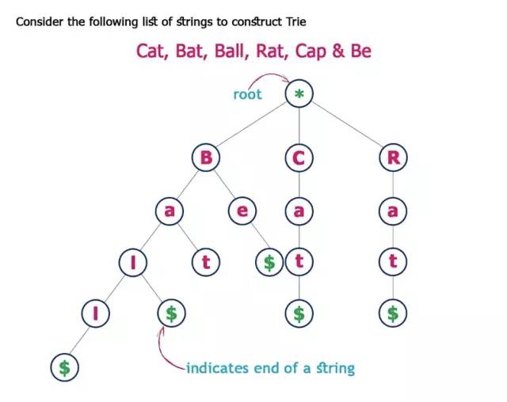

Trie或“前缀树”也是一种搜索树。 Trie分步存储数据-树中的每个节点代表一个步骤。 Trie用于存储词汇，因此可以快速搜索，尤其是自动完成功能。

Trie中的每个节点都有一个字母-在分支之后可以形成一个完整的单词。 它还包含一个布尔指示符，以显示这是否是最后一个字母。

Trie具有以下方法：
+ 添加：在字典树中插入一个单词
+ isWord：确定树是否由某些单词组成
+ 打印：返回树中的所有单词
```
/** Node in Trie **/function Node() {      this.keys = new Map();      this.end = false;      this.setEnd = function () {            this.end = true;      };      this.isEnd = function () {            return this.end;      }}function Trie() {          this.root = new Node();          this.add = function (input, node = this.root) {                if (input.length === 0) {                     node.setEnd();                      return;                } else if (!node.keys.has(input[0])) {                      node.keys.set(input[0], new Node());                      return this.add(input.substr(1), node.keys.get(input[0]));                } else {                      return this.add(input.substr(1), node.keys.get(input[0]));                }          }          this.isWord = function (word) {                let node = this.root;                while (word.length > 1) {                      if (!node.keys.has(word[0])) {                            return false;                      } else {                            node = node.keys.get(word[0]);                           word = word.substr(1);                      }                }                return (node.keys.has(word) && node.keys.get(word).isEnd()) ? true : false;          }              this.print = function () {                    let words = new Array();                    let search = function (node = this.root, string) {                          if (node.keys.size != 0) {                                for (let letter of node.keys.keys()) {                                      search(node.keys.get(letter), string.concat(letter));                                }                                if (node.isEnd()) {                                      words.push(string);                                }                          } else {                                string.length > 0 ? words.push(string) : undefined;                                return;                          }                    };                    search(this.root, new String());                    return words.length > 0 ? words : null;      }}
```
## 8.图
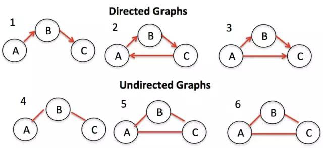

图（有时称为网络）是指具有链接（或边）的节点集。 根据链接是否具有方向，它可以进一步分为两组（即有向图和无向图）。 Graph在我们的生活中得到了广泛使用，例如，在导航应用中计算最佳路线，或者在社交媒体中向推荐的朋友举两个例子。

图有两种表示形式：

邻接表

在此方法中，我们在左侧列出所有可能的节点，并在右侧显示已连接的节点。
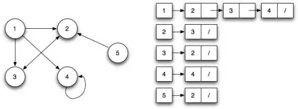

邻接矩阵

邻接矩阵显示行和列中的节点，行和列的交点解释节点之间的关系，0表示未链接，1表示链接，> 1表示不同的权重。
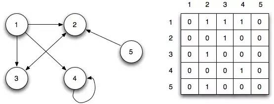

要查询图中的节点，必须使用“呼吸优先”（BFS）方法或“深度优先”（DFS）方法在整个树形网络中进行搜索。

让我们看一个用Javascript编写BFS的示例：
```
function bfs(graph, root) {  var nodesLen = {};  for (var i = 0; i < graph.length; i++) {    nodesLen[i] = Infinity;  }  nodesLen[root] = 0;  var queue = [root];  var current;  while (queue.length != 0) {    current = queue.shift();    var curConnected = graph[current];    var neighborIdx = [];    var idx = curConnected.indexOf(1);    while (idx != -1) {      neighborIdx.push(idx);      idx = curConnected.indexOf(1, idx + 1);    }    for (var j = 0; j < neighborIdx.length; j++) {      if (nodesLen[neighborIdx[j]] == Infinity) {        nodesLen[neighborIdx[j]] = nodesLen[current] + 1;        queue.push(neighborIdx[j]);      }    }  }  return nodesLen;}
```

测试一下：
```
var graph = [  [0, 1, 1, 1, 0],  [0, 0, 1, 0, 0],  [1, 1, 0, 0, 0],  [0, 0, 0, 1, 0],  [0, 1, 0, 0, 0]];console.log(bfs(graph, 1));
```

结果：
```
{  0: 2,  1: 0,  2: 1,  3: 3,  4: Infinity}
```

就是这样–我们涵盖了所有常见的数据结构，并提供了JavaScript中的示例。 这应该使您更好地了解计算机中数据结构的工作方式。 编码愉快！
