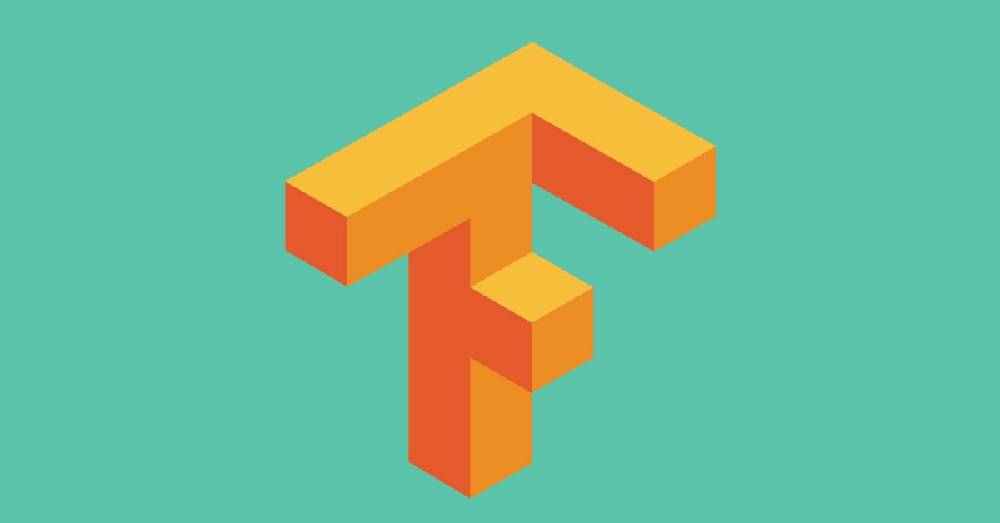
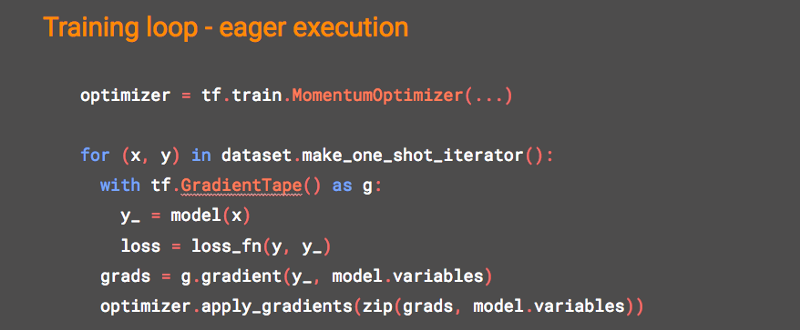
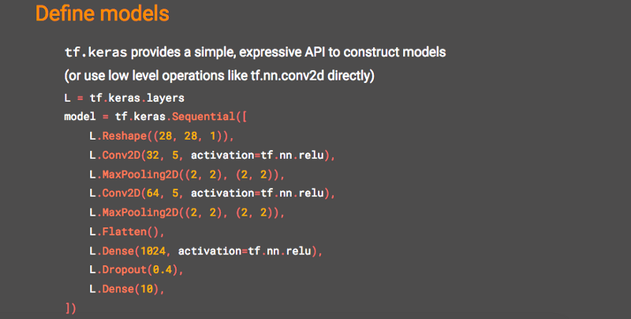
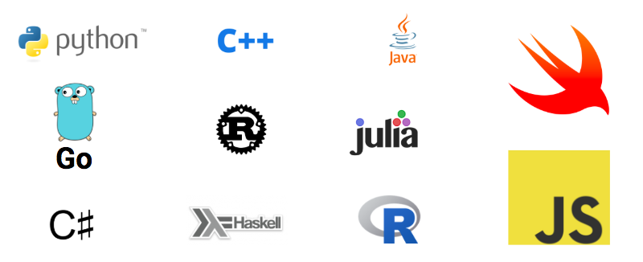
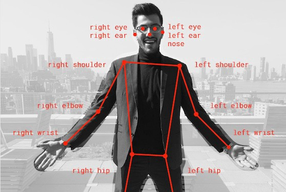
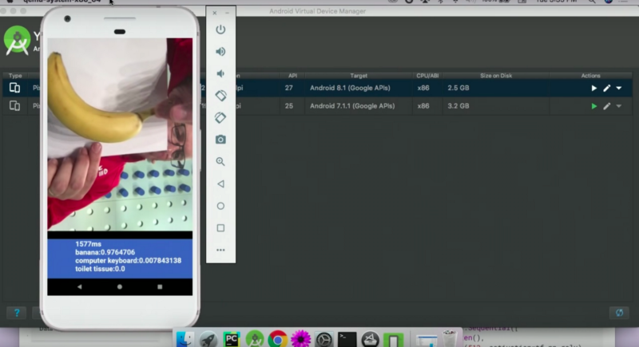
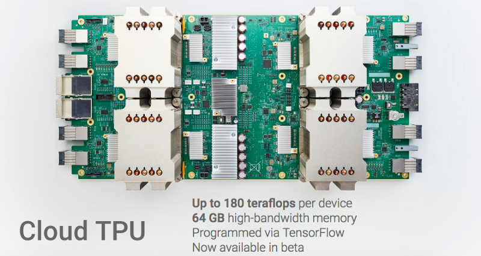
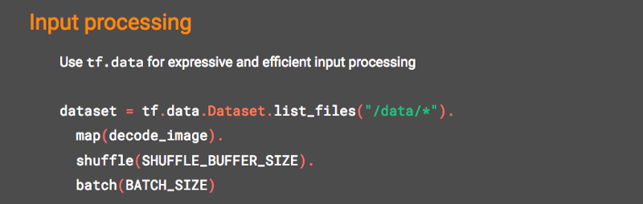
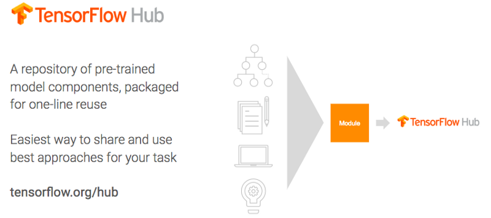

# 关于TensorFlow的9件事

今天早上，我发现自己总结了自己在旧金山Google Cloud Next上的一次演讲中最喜欢的内容，TensorFlow有何新功能？

然后我考虑了一会儿，看不到不与您分享我的简短摘要的原因（除了也许您可能不观看视频，您应该检查一下，演讲者很棒），所以这里 去…
# ＃1这是一个强大的机器学习框架

TensorFlow是一个机器学习框架，如果您拥有大量数据和/或您追随人工智能的最新技术：深度学习，它可能是您最好的朋友。 神经网络。 大个子 这不是一门数据科学的瑞士军刀，而是一台工业车床……这意味着，如果您要做的只是将回归线插入20×2电子表格中，则可能会停止阅读。

但是，如果您追求的是大目标，那就兴奋了。 TensorFlow已被用于寻找新的星球，通过帮助医生筛查糖尿病性视网膜病来预防失明，并通过提醒当局注意非法砍伐森林活动的迹象来帮助挽救森林。 这就是AlphaGo和Google Cloud Vision的基础，您可以一起使用。 TensorFlow是开源的，您可以免费下载并立即开始。

> Discovered with the help of TensorFlow, the planet Kepler-90i makes the Kepler-90 system the only other system we know of that has eight planets in orbit around a single star. No system has been found with more than eight planets, so I guess that means we’re tied with Kepler-90 for first place (for now). Learn more here.

# ＃2奇怪的方法是可选的

我为TensorFlow Eager竭尽全力。

如果您在过去尝试过TensorFlow并逃避了尖叫，因为它迫使您像学者/外星人一样而不是像开发人员那样进行编码，那就来吧！

TensorFlow急切的执行使您可以像纯Python程序员一样与之交互：所有直接编写和调试代码的即时性，而无需在构建那些庞大的图时屏住呼吸。 我本人是一位正在恢复中的学者（很可能是外星人），但自从问世以来，我一直爱着TF的热切执行。 非常渴望取悦！

# ＃3您可以逐行构建神经网络

Keras + TensorFlow =更轻松的神经网络构建！

Keras的宗旨是用户友好和易于原型设计，这是旧的TensorFlow所渴望的。 如果您喜欢面向对象的思维，并且喜欢一次建立一层神经网络，那么您会喜欢tf.keras。 在下面的几行代码中，我们创建了一个顺序神经网络，它具有标准的钟声和口哨声，例如辍学（提醒我在某些时候对我的隐喻进行抒情抒情，涉及订书机和流感）。

哦，你喜欢拼图，对吗？ 忍耐。 不要对订书机考虑太多。
# ＃4不仅是Python

好的，您一段时间以来一直在抱怨TensorFlow的Python单躁狂。 好消息！ TensorFlow不再仅适用于Pythonista。 现在，它可以以多种语言运行，从R到Swift到JavaScript。

# ＃5您可以在浏览器中进行所有操作

说到JavaScript，您可以使用TensorFlow.js在浏览器中训练和执行模型。 呆呆在酷炫的演示中，当你回来时我仍然会在这里。

> Real-time Human Pose Estimation in the browser with TensorFlow.js. Turn on your camera for a demo here. Or don’t get out of your chair. ¯\_(ツ)_/¯ Up to you.

# ＃6有适用于小型设备的精简版

从博物馆那里得到了旧式桌面？ 烤面包机？ （同样吗？）TensorFlow Lite将模型执行带到了各种设备（包括移动设备和IoT）上，与原始TensorFlow相比，推理速度提高了3倍以上。 是的，现在您可以在Raspberry Pi或手机上进行机器学习。 在演讲中，Laurence通过在数千人面前的Android模拟器上实时演示图像分类来完成一项勇敢的工作，并且它确实有效。

> 1.6 seconds to compute? Check! Banana with over 97% probability? Check! Toilet tissue? Well, I’ve been to a few countries where I suppose a sheet of paper like the one Laurence is holding up counts.

# ＃7专用硬件变得更好

如果您已经厌倦了等待CPU完成数据训练以训练神经网络的工作，现在就可以使用专门为Cloud TPU设计的硬件。 T是张量。 就像TensorFlow ...巧合吗？ 我觉得不是！ 几周前，谷歌发布了Alpha版本3 TPU。

# ＃8新的数据管道已大大改进

您在那边用numpy做什么？ 如果您想在TensorFlow中执行此操作，然后又急于退出，则现在使用tf.data命名空间可以使TensorFlow中的输入处理更具表现力和效率。 tf.data为您提供了与培训同步的快速，灵活和易于使用的数据管道。

# ＃9您无需从头开始

您知道开始机器学习的有趣方式不是吗？ 编辑器中的新页面为空白，没有英里的示例代码。 借助TensorFlow Hub，您可以采用历史悠久的传统的更有效版本，该传统可以帮助您自己编写别人的代码并称为自己的代码（也称为专业软件工程）。

TensorFlow Hub是一个可重用的，经过预训练的机器学习模型组件的存储库，打包后可以单线重用。 救救自己！

当我们处于社区主题而不是一个个挣扎时，您可能想知道TensorFlow刚刚获得了YouTube官方频道和博客。

更新！ 截至2019年3月，您应该知道的第十件事...
# ＃10 TensorFlow变得用户友好！

现在我们已经处理完了去年的新闻，现在是时候您需要首先了解一件事了：TensorFlow 2.0终于来了！ 这是彻底的改头换面，其全部目的在于使TF超级易于使用。 只要您等待，后果将对每个行业产生重大连锁反应。 在这里阅读我的更新。

总结了我的总结，以下是完整的演讲，请您在接下来的42分钟内进行娱乐。
