## Dipanjan Sarkar-数据科学家-英特尔公司| 领英
### 在全球最大的专业社区LinkedIn上查看Dipanjan Sarkar的个人资料。 Dipanjan在...上列出了6个职位
## 多维数据有效可视化的艺术-动手方法-ODSC印度…
### 描述性分析是与数据科学项目或…相关的任何分析生命周期的核心组成部分之一。
## 有效可视化多维数据的艺术
### 有效数据可视化的策略
## dipanjanS / art_of_data_visualization
### 多维数据有效可视化的艺术-dipanjanS / art_of_data_visualization

本文中使用的所有代码都可以作为Jupyter笔记本以及我的GitHub存储库中的其他内容和幻灯片提供。
## dipanjanS / art_of_data_visualization
### 多维数据有效可视化的艺术-dipanjanS / art_of_data_visualization

我确实介绍了如何使用Python中的最新数据可视化框架（如seaborn和matplotlib）对稍微复杂一些的数据进行多维数据可视化。 如果您有兴趣，下面的文章应该可以帮助您入门。
## 有效可视化多维数据的艺术
### 有效数据可视化的策略

这些文章的大部分内容都在我最近于ODSC于2018年举行的会议演讲中讨论过。您可以在此处查看完整的演讲议程和幻灯片。 结束后，我将发布YouTube会议演讲！
## 多维数据有效可视化的艺术-动手方法-ODSC印度…
### 描述性分析是与数据科学项目或…相关的任何分析生命周期的核心组成部分之一。

有反馈给我吗？ 还是有兴趣与我合作进行研究，数据科学，人工智能，甚至发表有关TDS的文章？ 您可以在LinkedIn上与我联系。
## Dipanjan Sarkar-数据科学家-英特尔公司| 领英
### 在全球最大的专业社区LinkedIn上查看Dipanjan Sarkar的个人资料。 Dipanjan在...上列出了6个职位

感谢Durba编辑本文。
## 适用于Python的图形语法-plotnine 0.4.0文档
### plotnine是Python中图形语法的一种实现，它基于ggplot2。 语法允许用户...
## 图形的分层语法
### 图形语法是一种工具，可以使我们简洁地描述图形的组成部分。 这样的语法
## 图形语法| 利兰·威尔金森| 施普林格
### 第一版前言在为1980年代的SYSTAT编写图形之前，我首先在...
# 图形语法的综合指南，可有效可视化多维数据
## 学习有效的策略，以利用分层的“图形语法”框架实现有效的数据可视化

# 介绍

可视化多维数据既是一门艺术，也是一门科学。 由于我们的二维（2-D）渲染设备的局限性，随着维度数量的增加，在两个以上的数据维度（属性或特征）上建立有效的可视化变得非常困难。 在我之前的文章“多维数据的有效可视化的艺术”中，我们通过动手实例广泛地介绍了一些有效的多维数据可视化的策略。 在本文中，我们将介绍用于构建这些可视化效果的分层框架，称为“图形语法”。 我们还将探讨分层图形语法框架背后的基本概念，并讨论如何使用每个特定的分层组件在多维数据上建立有效的可视化。 示例将在Python中显示，但是，如果您感兴趣，可以轻松地在R中复制相同的示例。
# 动机

数据可视化和讲故事一直是任何涉及从数据中提取有意义的见解的数据科学流程中最重要的阶段之一，而不管数据或项目的复杂性如何。 以“ Datasaurus Dozen”为例，下图描述了十二个不同的数据集。

您能猜出这些看起来完全不同的数据集之间的共同点是什么？

> The Datasaurus Dozen — What is common among these diverse datasets?


答：所有数据集的摘要统计信息完全相同！


下图所示，这是众所周知的Anscombe四重奏的有趣变体，您可能对此很熟悉。
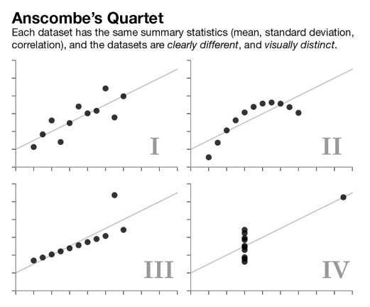
> Anscombe’s quartet — Different datasets with same summary statistics


这些演示的主要成果是：“不要盲目相信您的数据，而是开始对数据进行建模”。 摘要统计信息总是具有欺骗性。 在进行功能工程和构建统计，机器学习和深度学习模型之前，请始终可视化和理解您的数据属性。

另一个非常重要的动力来源，尤其是对于有效的数据可视化而言，可以从几个世纪前的出色案例研究中获得，而当我们甚至没有计算机时，更不用说Python或R了！ 第一个是约翰·斯诺（John Snow）著名的可视化作品，描绘了1854年英国伦敦的霍乱大爆发！
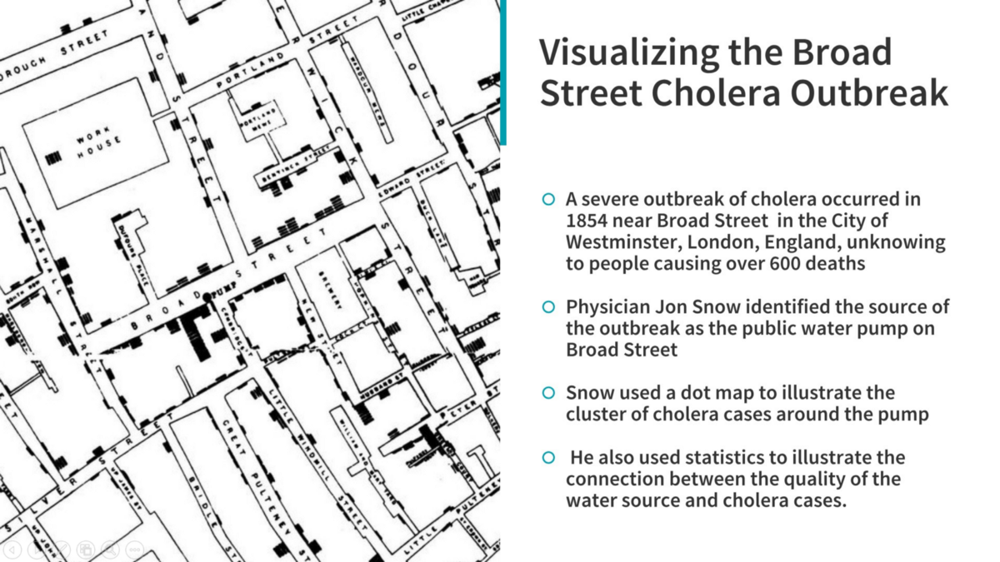
> Visualizing the Broad Street Cholera outbreak which helped find the root cause of the disease outbreak!


您可以看到简单的手绘可视化如何帮助找到1850年代宽街爆发霍乱的根本原因。 现代护理实践之母佛罗伦萨·南丁格尔（Florence Nightingale）建立了另一种有趣的可视化方法，他对护理和统计学深感兴趣。
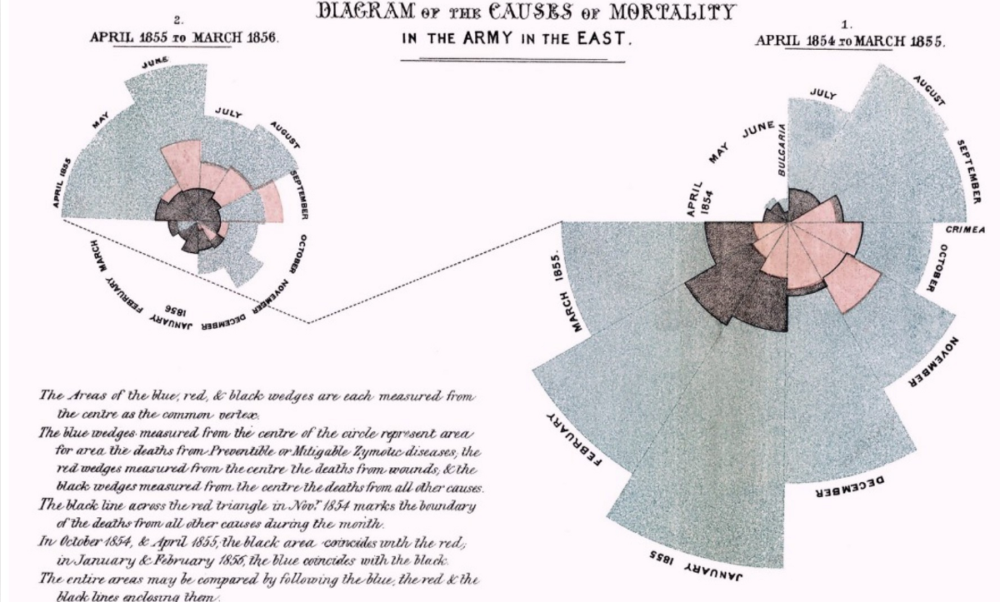
> Causes of Mortality in the Army of the East — Florence Nightingale


上图描绘了极地区域图，描绘了1850年代军队中的死亡（死亡）原因。 我们可以看到，可视化绝对不是简单化，但是它传达了正确的见解-清楚地显示了由于伤口或其他原因而死于可预防疾病的士兵比例。 这应该成为有效数据可视化的足够动力！
# 了解图形语法

要了解图形语法，我们需要了解“语法”的含义。 下图简要总结了这两个方面。
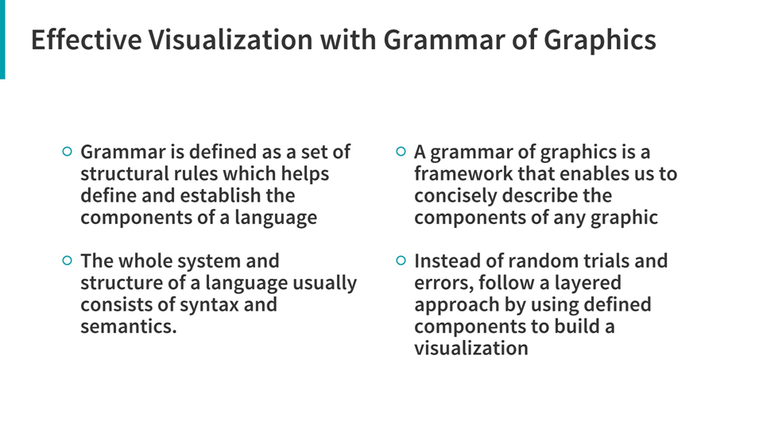

基本上，图形语法是遵循分层方法以结构化方式描述和构造可视化或图形的框架。 涉及多维数据的可视化通常具有多个组成部分或方面，并且利用这种分层的图形语法，可以帮助我们描述和理解可视化中涉及的每个组成部分-包括数据，美观性，规模，对象等。

图形框架的原始语法由Leland Wilkinson提出，涵盖了与有效数据可视化有关的所有主要方面。 我绝对会推荐有兴趣的读者，只要有机会，就可以阅读有关这本书的书！
## 图形语法| 利兰·威尔金森| 施普林格
### 第一版前言在为1980年代的SYSTAT编写图形之前，我首先在...

但是，我们将使用它的一种变体-称为图形框架的分层语法，该框架由著名的数据科学家，著名的R可视化程序包ggplot2的创建者Hadley Wickham提出。 读者应该查看他的论文“图形的分层语法”，其中详细介绍了他提议的图形分层语法，还应该讨论针对R编程语言构建的开源实现框架ggplot2。
## 图形的分层语法
### 图形语法是一种工具，可以使我们简洁地描述图形的组成部分。 这样的语法

哈德利（Hadley）的分层图形语法使用多个分层组件来描述任何图形或可视化。 最值得注意的是，它与Wilkinson提出的原始图形语法有一些变化，如下图所示。

> Mapping between components of Wilkinson’s grammar (left) and the layered grammar (right)


您可以看到语法中有各种组件，可用于构建和描述可视化。 我已经确定了七个主要组成部分，它们通常可以帮助我在多维数据上建立有效的可视化效果。 下图详细说明了该语法中的每个特定组成部分。
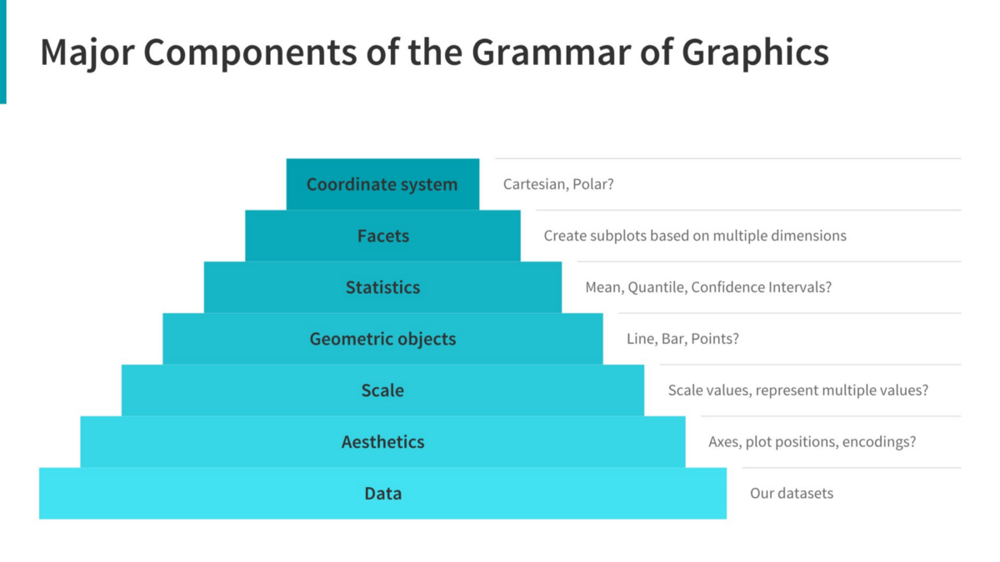
> Major components of the Grammar of Graphics


我们使用金字塔体系结构说明了同样的内容，以显示组件的固有分层结构。 通常，要构建或描述具有一个或多个维度的任何可视化，我们可以使用以下组件。
+ 数据：始终从数据开始，确定要可视化的尺寸。
+ 美学：根据数据尺寸，图中各个数据点的位置确认轴。 还要检查是否需要任何形式的编码，包括大小，形状，颜色等，这些形式对于绘制多个数据维度很有用。
+ 缩放：我们是否需要缩放潜在值，使用特定的比例来表示多个值或一个范围？
+ 几何对象：俗称“几何”。 这将涵盖我们在可视化工具上描绘数据点的方式。 应该是点，条，线等吗？
+ 统计：我们是否需要在可视化中显示一些统计量，例如集中趋势，价差，置信区间的量度？
+ 方面：我们是否需要根据特定数据维度创建子图？
+ 坐标系：可视化应基于哪种坐标系-是直角坐标系还是极坐标系？

现在，我们将通过一些动手示例，研究如何利用此分层框架为多维数据构建有效的数据可视化。
# 图形在实践中的语法

现在，我们将在上一节中学到的概念应用于一些实际数据。 我们将使用Python构建所有可视化，但是我也建议人们检查R中的ggplot2软件包，这是迄今为止最令人鼓舞的框架之一，用于构建美观，整洁的出版物质量的可视化。 我们确实有一个由Yhat，Inc.构建的Python ggplot框架。但是，如果您检查存储库，最近两年没有推送任何提交或更新，但是不幸的是，这会导致一些错误，尤其是由于向后不兼容 较新版本的熊猫的问题。 因此，为了在Python中模拟图形语法的真正分层语法，我们将使用另一个有趣的框架，称为plotnine。
## 适用于Python的图形语法-plotnine 0.4.0文档
### plotnine是Python中图形语法的一种实现，它基于ggplot2。 语法允许用户...

Plotnine是用于基于ggplot2的图形框架分层语法的开源Python实现。 因此，使用此分层语法中先前指定的组件，我们可以构建有效的可视化效果。
## 从数据开始

我们总是从加载并查看要分析和可视化的数据集开始。 我们将使用著名的mtcars数据集作为plotenine中的预加载数据集之一。
```python
from plotnine import *
from plotnine.data import mtcars

mtcars.head()
```
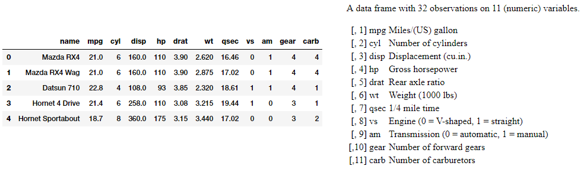

mtcars数据集包含从1974年《美国汽车趋势》杂志中提取的数据，该数据描述了32辆汽车（1973–74年型号）的油耗以及汽车设计和性能的10个其他属性。 上图中描述了每个属性的细节。 让我们现在构建一些可视化。
## 可视化二维（2-D）

现在，我们可以使用图形框架分层语法中的某些组件来可视化二维数据，包括数据，比例，美学和几何。 在这种情况下，我们为几何对象选择一个点或散点图，以表示每个数据点。
```python
(ggplot(mtcars, 
        aes('wt', 'mpg')) 
        + geom_point()
        + theme_bw())
```
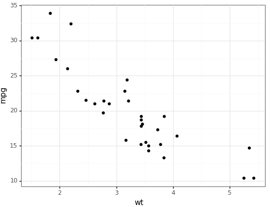

从以上可视化中我们可以清楚地看到mpg与cat wt负相关。
## 可视化三维（3-D）

为了可视化数据集中的三个维度，我们可以利用颜色作为我们的审美成分之一，以可视化我们其他两个维度之外的另一个维度，如以下示例所示。
```python
(ggplot(mtcars, 
            aes('wt', 'mpg', color='factor(gear)'))
            + geom_point()
            + theme_bw())
```
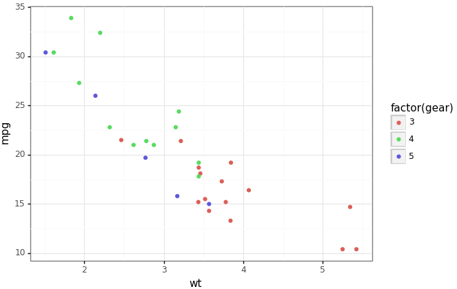

在上面的可视化中，我们使用颜色美学以及其他两个数据维度（变量）将具有不同档数的汽车描绘为单独的类别。 很显然，平均而言，齿轮数较少的汽车往往具有较高的重量和较低的mpg。
## 可视化四维（4-D）

为了可视化数据集中的四个维度，除了包括几何体，数据和比例尺在内的其他常规组件外，我们还可以利用颜色和大小作为我们的两种美学。
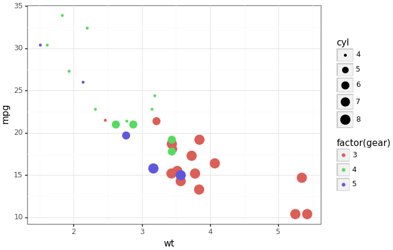

可视化向我们展示了强大的美学能力，可以帮助我们在单个图中可视化多个数据维度。 显然，具有较高气缸数的汽车的齿轮数较少，因此，其重量较高，mpg较低。

或者，我们也可以使用颜色和构面来描述四个维度的数据，而不是如以下示例中所述的大小。
```python
(ggplot(mtcars, 
        aes('wt', 'mpg', 
            color='factor(gear)'))
        + geom_point() 
        + facet_wrap('~cyl') 
        + theme_bw())
```
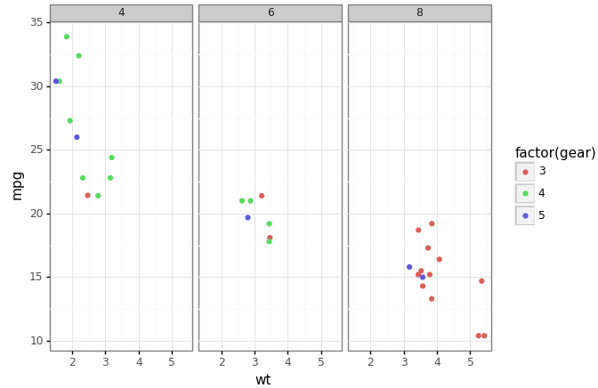

方面绝对是构建有效数据可视化的最强大组件之一，如上面的可视化所示，在该图中，我们可以清楚地看到缸数更高的汽车具有更低的齿轮数，并且与以前的颜色和尺寸可视化类似。
## 可视化数据维度和统计数据

为了可视化数据维度和一些相关的统计信息（例如拟合线性模型），我们可以利用统计信息以及分层语法中的其他组件。
```python
(ggplot(mtcars, 
        aes('wt', 'mpg', 
            color='factor(gear)'))
        + geom_point() 
        + stat_smooth(method='lm') 
        + theme_bw())
```
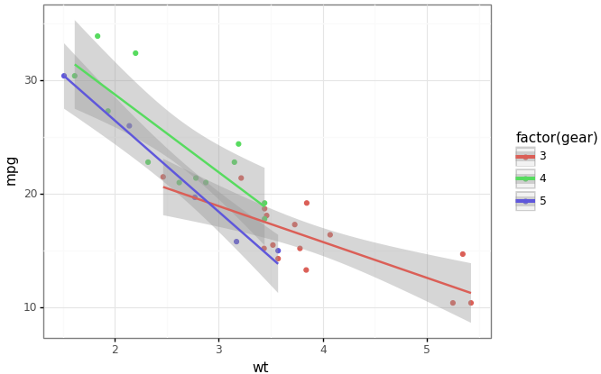

这使我们能够查看基于wt的mpg线性模型趋势（归因于统计信息组件）。
## 可视化五维（5-D）

为了可视化五个维度的数据，您现在已经了解了演练！ 我们将利用美学的力量，包括颜色，大小和刻面。
```python
(ggplot(mtcars, 
        aes('wt', 'mpg', 
            color='factor(gear)', 
            size='cyl'))
        + geom_point() 
        + facet_wrap('~am') 
        + theme_bw())
```
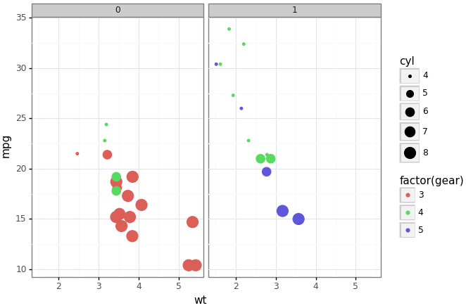

在这里，我们将am用作方面，其中0表示自动变速箱，而1表示手动变速箱。 该图显示，与具有自动变速器的汽车相比，具有手动变速器的汽车具有更高的档数。 而且，大多数具有更多气缸（缸）的汽车都具有自动变速器。 其他见解与我们在前面的图中所观察到的相似。
## 可视化六维（6-D）

为了在六个维度上可视化数据，我们可以在y轴上添加一个附加的构面，在x轴上添加一个构面，并且颜色和大小作为美感。
```python
(ggplot(mtcars, 
        aes('wt', 'mpg', 
            color='factor(gear)', 
            size='cyl'))
        + geom_point() 
        + facet_grid('am ~ carb') 
        + theme_bw())
```
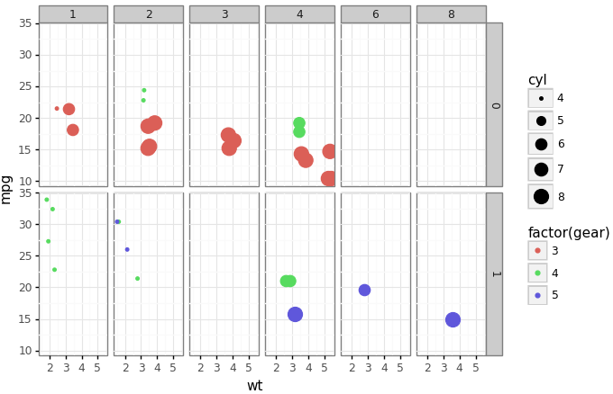

我们将传输率（am）表示为0（自动），将1（手动）表示为y轴上的小平面，将化油器的数量（carb）表示为x轴上的小平面，除此之外，我们使用与我们类似的其他美学方法来表示其他尺寸 以前的地块。 从以上可视化中得出的一个有趣的见解是，具有更多齿轮的汽车具有手动变速器（am）和具有更多化油器（carb）。 您还有其他有趣的见解吗？
## 我们可以更高吗？

紧迫的问题是，我们可以超越六个维度吗？ 好吧，绕开二维渲染设备的局限性以可视化更多数据维度的方式无疑变得越来越困难。


一种方法是使用更多的构面和子图。 除此之外，如果您的数据集具有时间方面，也可以使用时间的概念，如以下示例所示。

> Hans Rosling’s famous visualization of global population, health and economic indicators


这描绘了汉斯·罗斯林（Hans Rosling）著名的可视化效果，描绘了全球人口，健康状况和各个国家的各种经济指标。 TED官方会议上也介绍了这一点，我建议大家检查一下他们是否还没有这样做！

这应该使您对如何利用图形的分层语法可视化多维数据有一个很好的了解。
# 结论

就像我一次又一次提到的那样，数据可视化既是一门艺术，也是一门科学。 本文应该为您提供足够的动力和示例，以开始理解和利用分层的图形框架语法，以在多维数据上构建自己的有效可视化效果。
