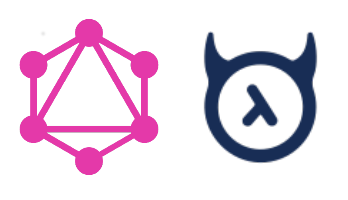
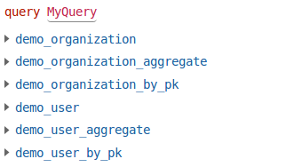
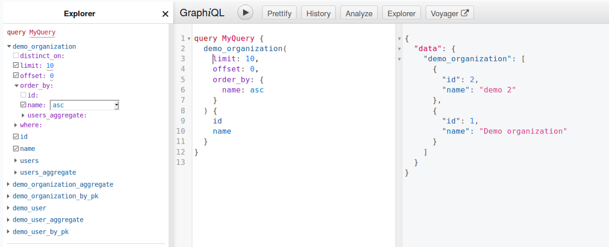
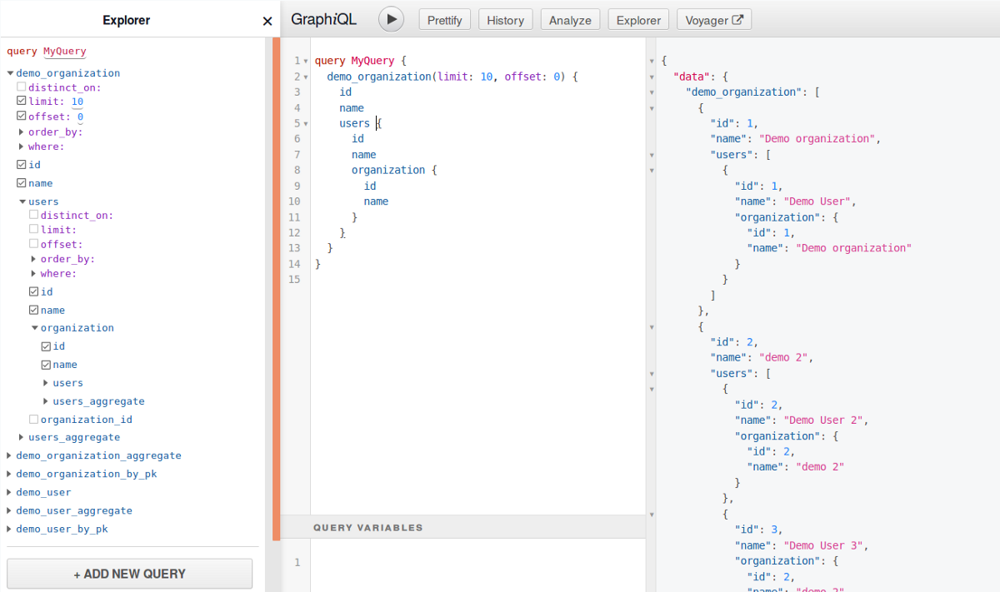
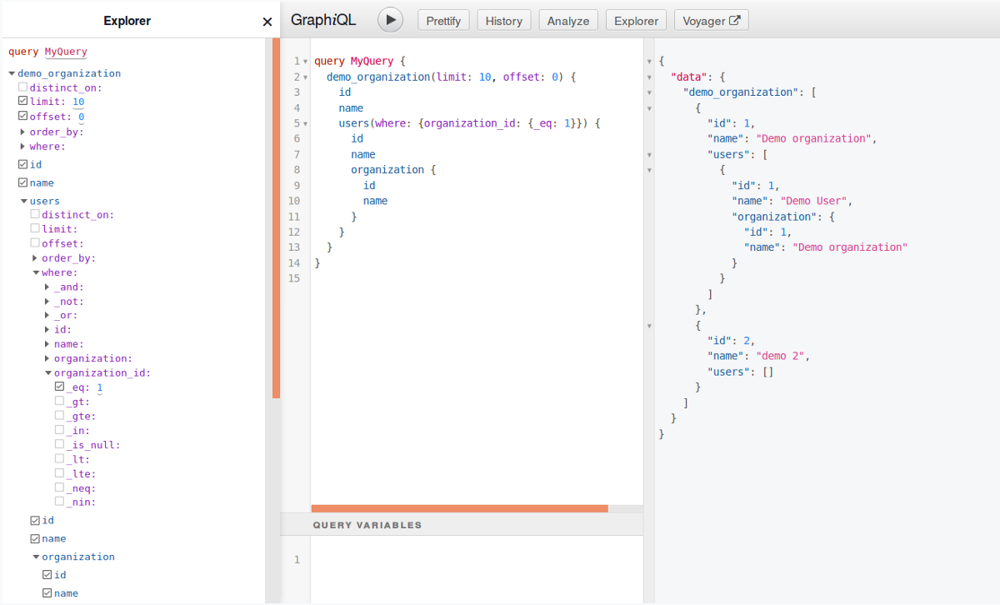
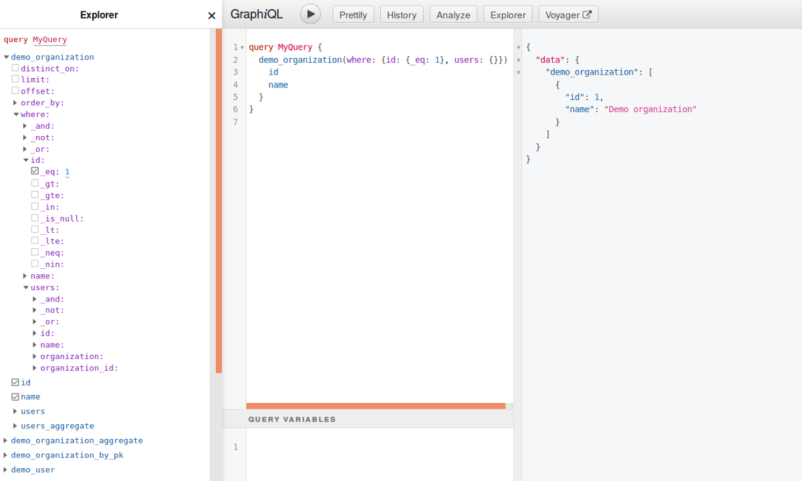
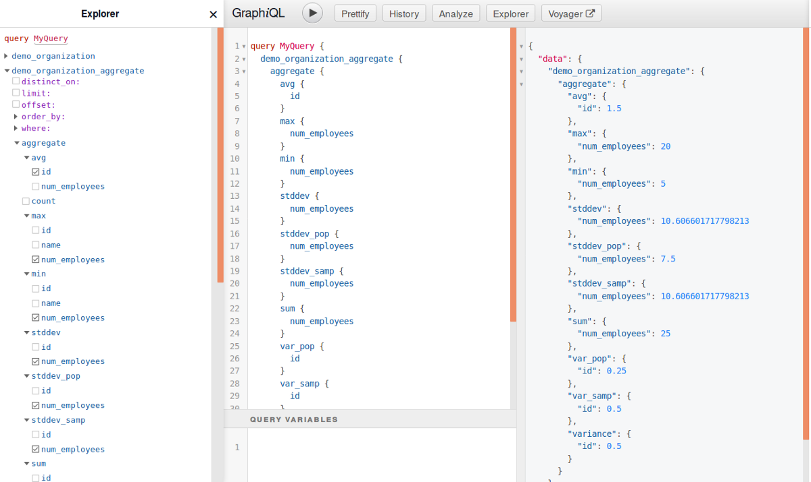
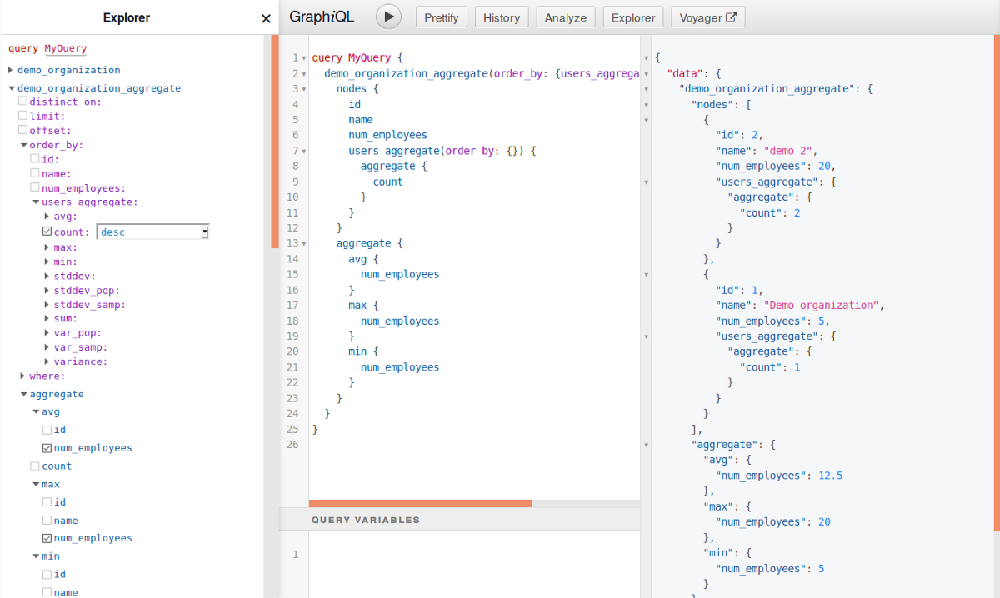
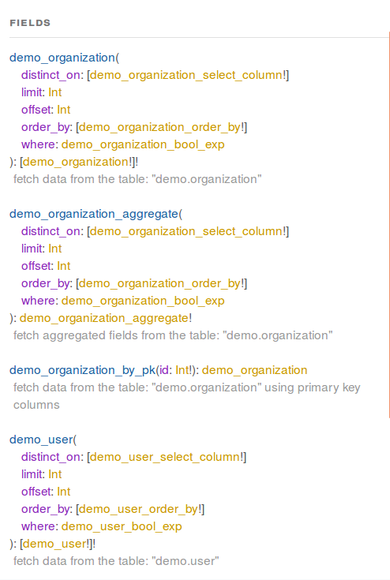
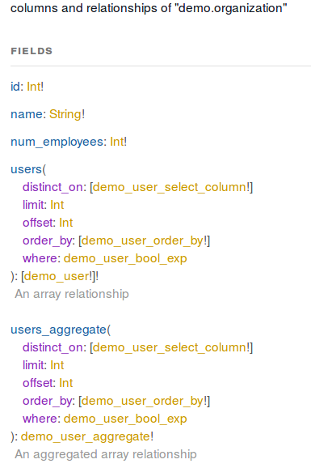

# 与Hasura深入了解GraphQL


我之前写过有关Hasura GraphQL引擎的第一印象。 我将继续对该系列进行更深入的分析，并深入探讨Hasura和自动生成的架构的优缺点。

快速复习：

GraphQL是用于实现API的查询语言。 开发人员创建一个描述可用数据以及如何查询数据的架构。 客户端在GraphQL中编写查询，以精确指定要检索的数据（直至各个字段的级别）。

Hasura是Postgres数据库的GraphQL引擎。 它会自动创建，管理和公开直接从基础数据库架构派生的GraphQL架构。 因此，给定一个干净的数据库架构，Hasura会为您完成所有API的工作。

这种方法的缺点是GraphQL模式是自动生成的。 您无法控制它。

因此，在某些情况下，使用Hasura无疑是明智之举，并且推出自己的API几乎没有意义。

但是，在某些API用例中，GraphQL的详细信息对客户端开发人员至关重要，而面向数据库的自动生成的架构可能无法解决。 在这篇文章中，我们将使用Hasura生成的架构来探讨问题，并考虑何时可能可行，也可能不可行。

让我们仔细看看从Hasura获得的架构。

我们的示例表保存在称为演示的专用Postgres模式中。 我们有两个：
```
organization ------------- id: integer, primary key name: text, unique, non-null num_employees: integer, non-null user ------------- id: integer, primary key name: text, unique, non-null organization_id: integer, foreign key to organization.id
```

社论：ID请勿使用整数。 曾经 请。 我在演示模式中这样做是有原因的，我们将在稍后介绍。

用于此模式的典型的用户友好型API应该支持基本的CRUD，包括通过ID，名称等检索用户和组织的能力。

Hasura控制台的资源管理器提供了一个不错的UI，可用于同时检查架构和格式化查询。 让我们看一下顶级查询：


我们可以在这里看到Hasura为每个表生成一组查询。

它为每个查询加上数据库模式名称的前缀，默认公共模式中的表除外。 如果您要在单个GraphQL端点和架构上公开多个数据库方案，则这有助于使事情井井有条，并避免名称空间冲突。 但是，这也会使查询名称更加冗长，除非架构的命名方式与对应于对客户开发人员有意义的功能集或实体组相对应，否则会造成混淆。

如果您要开发的API是面向数据库的，并且供熟悉您数据库实现的开发人员内部使用，即使他们没有直接访问它的权限，此模型也是有意义的。

但是，如果您的API的目的是向大量不同的开发人员公开功能集，则您的数据库只是实现细节。 说开发人员，您的利益相关者，不了解您的数据库，不关心它，也不想被它打扰。 有些人可能是缺乏数据库专业知识的前端专家。

因此，我们已经通过将数据库级模式分离烘焙到API中而遇到麻烦。 设计数据库时必须特别考虑GraphQL和Hasura。 在撰写本文时，我还没有找到解决方法。 您可以站起来多个Hasura实例，并配置每个实例以在不同的数据库架构中跟踪表，从而生成三个GraphQL端点，每个端点都有各自独立的架构。 但是，它们仍将为每个查询添加模式名称前缀。

理想情况下，此行为是可配置的。 但是我可以接受它，尤其是在一个新的，干净的，针对Hasura构建的数据库中。

现在，让我们看一下每个表查询的详细信息。

这是组织查询的可用参数和响应字段。 在下面的示例中，我填写了一些参数，以便我们获得10个组织的首页，并按名称按升序排列。 这是简单明了的东西。 Hasura使用偏移量/限制实现分页，并镜像SQL，这是REST和GraphQL中的常用方法。


现在，让我们看一下嵌套的用户字段。


由于users.organization_id与organization.id具有外键关系，因此Hasura在organization下创建了一个users字段。 Organization.users完全反映了顶级demo_users查询。

注意，它会自动过滤周围组织的organization_id。 在其用户字段中仅显示来自演示组织1的用户。 并且用户类型具有一个组织字段，其中填充了包含的组织。

太酷了 GraphQL客户端开发人员绝对期望并依靠这种嵌套。 有了组织ID，他们就不必进行一次查询来获取组织的元数据，而不必进行一次查询来获取其用户。 而且，只要提供一个用户ID，他们就不必查询一次即可找到用户的组织ID，而又可以通过随后的查询来获取组织本身。 相对于典型的REST API，这种轻松嵌套相关实体类型是GraphQL的主要优势之一。

但是，由于嵌入式用户字段与demo_users查询完全匹配，因此我们也可以这样做：


我已经按organization_id过滤了嵌入式用户字段，即使该字段已按organization ID进行了过滤。 结果是正确的-组织2的用户被[1,2]过滤，因此我们得到的结果为空（组织2有两个用户）。 但这有点奇怪。 该参数可用，但没有用。

这种类型的东西（如果不是结构良好的字段中的无用/孤立参数）可能看起来是良性的。 但是，以我的经验来看，许多客户开发人员要么scratch之以鼻地试图弄清楚它的用途，要么只是尝试使用它而沮丧，因为它没有达到他们的期望。

现在假设我们只想通过ID获得一个组织。 demo_organizations查询的操作如下：


我们拥有广泛的where子句功能，可让我们针对组织自己的数据和下级对象（例如用户）形成复杂的条件； 例如，我们可以使用此查询来找出哪些组织的用户名为“ Scott”。

一方面，这真的很酷。 它功能强大，灵活，可为API开发人员节省大量代码和测试代码。 精通SQL的客户开发人员可以快速掌握此API，并完成很多工作。

另一方面，并非所有的客户端开发人员都精通SQL，即使那些客户端开发人员也不必为了获得单个对象而不得不做一些复杂的事情。

Hasura还为具有主键的表生成_by_pk版本：

这更加用户友好。 给定ID，您只需在一个名为id的参数中传递它即可。 但是，您确实知道pk表示什么。 对于面向数据库的开发人员来说，pk =“主键” = id可能很明显。 但是其他人第一次尝试掌握该架构，可能就无法理解。

我喜欢这样的东西：
```
# Retrieve multiple organizations based on a set of filters organizations(...) # Retrieve a single organization by ID organization(id: ID!)
```

对于具有数据库和GraphQL经验的开发人员来说，这似乎很愚蠢。 我花了整整十秒钟的时间来理解Hasura的查询结构。

但是，如果我们要构建供大量不同类型的开发人员使用的GraphQL，那么我们将有效地与REST竞争，而REST是大多数开发人员期望使用的。

在REST中，检索组织将很简单：
```
GET /organization/:id
```

过滤列表可能很简单：
```
GET /organization?name=foo
```

快速采用API的任何摩擦都是责任。 即使是喜欢学习新工具的精明和有经验的开发人员也可以将这些小事情挂在嘴上，只要花30秒钟在这里和那里花掉他们，并且他们有30分钟的时间才能完成工作，然后就必须放弃并继续前进。

无论如何，让我们继续进行该demo_organization_aggregate查询。


生成的demo_organization_aggregate_fields类型具有大量统计信息，您可以轻松地将其应用于任何合适的字段。 我添加了一个num_employees字段来使用它。 这很方便，因为最终客户开发人员可能会要求提供此类数据，我们可以免费提供。

另一方面，该架构将使您可以获取适用类型的任何字段的汇总统计信息，而无需考虑该字段的含义。 所以在这里，您可以看到，我得到了有关num_employees的一些统计信息，这很有意义。

但是我也得到了一些id的统计信息，只是因为它碰巧是一个整数（这就是我将id设置为整数的原因。同样，在现实生活中绝对不要这样做！）。 那没有道理，而且会弄乱API。 如果架构管理用户界面允许您将列标记为支持聚合或不支持聚合，那就太好了。

就像demo_organization.users.organization_id上的虚假过滤器一样，我们有一个API功能，该功能显示在架构中，但无济于事。 开发人员可能会感到困惑，试图弄清楚是否应该使用它，或者只是使用它而对它“不起作用”感到沮丧。

聚合查询还可以让您取回为其生成统计信息的匹配对象。 这支持一些不错的技巧。 例如，下面我们返回一个组织列表，按每个组织中的用户数量排序：


不过，在撰写本文时，您不能将其扩展到where子句。

一方面，这太棒了。 免费提供许多功能。

另一方面，您无法将其关闭。 某些字段（例如我的id示例）实际上不应进行汇总。 或者在其他情况下，汇总的统计信息可能仅适合您的API的任何实际用例，或者您可能不希望对其进行支持（开发是免费的，或者使用Hasura进行自动化，而文档和支持则不行！）。

我没有涉及突变（查询等功能，用于修改数据）和订阅（客户端用于直接推动对象更新而不是轮询）的订阅。 简而言之，结果是相似的-功能强大且灵活，但对GraphQL初学者而言不是最用户友好的。

这里的另一个大优点是GraphQL模式始终是完全一致的，因为每个类型，字段，查询，变异和参数都是以完全相同的方式生成的，并且100％适用于Hasura约定。

即使是很小的团队，也要始终注意跨变更保持API一致性。 对于较大的团队，尤其是由多个团队维护的API，这是一个很大的挑战。 因此，Hasura为我们节省了一些工作，并确保例如不会以两种不同的模式进行分页或排序。

另一方面，在某种程度上，一致性问题只是被推送到数据库中。 如果表和列的名称不一致，则结果类型和字段也不会相同。 因此，Hasura用于管理用于生成和更新架构的SQL的那些迁移文件需要经过严格的代码检查，就像（希望）使用.graphql文件一样。

最后，让我们看一下架构文档。

GraphQL模式定义语法支持内置文档。 如果定义自己的架构，则如下所示：
```
# Entity representing an application user type User {   # The user's unique ID   id: ID!   # The user's display name   name: String!   # The ID of the organization the user is associated with.   # A user can only belong to one organization.   organizationId: ID! }
```

GraphiQL和其他GraphQL UI工具使用此嵌入式数据来显示类型，字段和参数的架构文档。 其他工具可用于在构建时生成HTML，降价和其他格式。

在这里，我们查看了用于示例模式的GraphiQL文档面板的快照：


这是demo_organization类型的面板：


首先，尼特。 请注意，类型，字段和查询全为蛇形，并且类型及其主要查询相同，例如demo_organization。 也许只有我一个人，来自Java / OO背景，但是我希望看到类型，类型上的属性或函数清楚地标出。 因此，组织用于查询的类型和organization（）。 再次，只是尼特。 实际上，类型名称在GraphQL中并没有多大关系，除非出于文档目的。

说到文档，请检查一下。

没有。

如果客户端开发人员还拥有该数据库并且知道该表的用途以及其所有列的含义，那么从表demo.user中获取数据就可以了。

但是，客户开发人员可能不了解也不关心数据库。 他们看到您的API，只有您的API。

到目前为止，您还无法将自己的架构文档插入Hasura，因此任何使用从该架构格式化文档的UI的人都只会显示存根。 通过将架构提取到.graphql文件中，添加文档，然后使用外部工具自动生成HTML，可以支持自己的文档。

如果可以在Hasura的数据库架构管理器中插入表格和列的文档，那就太好了。 我可以看到为什么还没有-这些文档可能必须在单独的私有Postgres表中进行管理。

综上所述，Hasura在许多用例中都是轻而易举的，包括开发时间非常宝贵的超瘦操作（就是我），前端和后端紧密联系的全栈应用程序团队以及API开发人员团队 正在使用GraphQL但没有丰富的经验。

但是对于必须支持庞大且多样化的开发者生态系统的产品，我不确定是否有任何面向数据库的自动生成方法都行得通。 该API实际上确实需要手动设计，而我们最好采用另一种方法，即使用从GraphQL模式生成数据库的工具。

到目前为止，我们仅研究了用于检索数据的查询。 下次，我将深入探讨用于添加，修改和删除数据的突变。

上一篇系列文章
