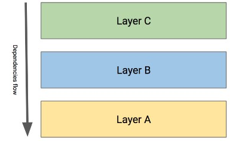
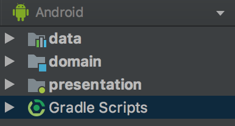
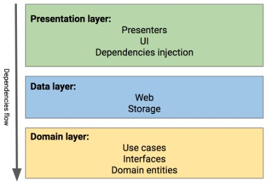
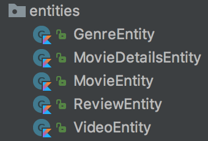
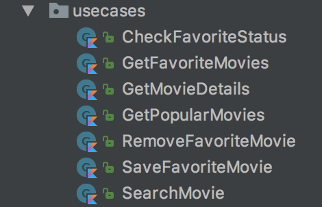

## mrsegev /电影之夜
### MovieNight是使用干净架构方法的示例Android应用程序，由Kotlin编写。
# 干净的体系结构代码库内的导览。

最近，我发布了一个名为MovieNight的开源示例项目。在过去的几周中，我对应用程序体系结构有很多疑问，因此，我决定撰写此博客文章。 我将描述正在使用的不同组件以及它们之间的关系，并讨论我在此过程中做出的一些架构决策。

> Photo by Chris Lawton on Unsplash


我会尽力突出代码库中更有趣的部分，但是我可以在一篇文章中写很多东西。 如果您发现有趣的主题，建议您克隆项目并亲自探索代码库。

您可以在此处找到MovieNight的源代码：
## mrsegev /电影之夜
### MovieNight是使用干净架构方法的示例Android应用程序，由Kotlin编写。
## 在开始＃1之前

该博客文章假定您具有以下主题的知识：Kotlin，RxJava，依赖项注入和测试。 我尽力添加链接，以便在整个帖子中进一步阅读。 如果您不熟悉某个主题，建议您稍作休息，然后再读一读。 因此我们可以留在同一页面上。
## 在开始＃2之前

一丁点钱带走您要阅读的所有内容。 从本质上讲，建筑是动态的并且不断发展。 没有“完美的体系结构”之类的东西，对于每个问题总是有几种解决方案。 请记住，每个架构决策都是一个权衡。

现在，为自己喝杯咖啡/茶/啤酒（？），确保您已经掌握了源代码，然后让我们开始吧。
# 干净的方法

MovieNight的架构在很大程度上受到Bob叔叔的简洁架构的影响。 理解清洁方法背后的原理是我们导游的关键。

尽管乍一看，干净的架构可能有点让人不知所措，但是一旦您了解了所有内容，就很容易理解。

清洁方法的核心原则可总结如下：
+ 应用程序代码分为几层，这些层定义了代码库内部关注点的分离。
+ 这些层遵循严格的依赖关系规则，每个层只能与其下面的层进行交互。
+ 随着我们进入底层，代码变得通用。底层指示策略和规则，高层指示实现细节，例如数据库，网络管理器和UI。

考虑以下抽象示例：

> Dependencies flow between the layers.

+ C层可以访问B层和A层。
+ B层可以访问A层中的所有内容，但不知道C层中的任何内容。实际上，B层甚至不知道C层存在。
+ A层位于最底层，她没有意识到自己范围以外的任何事物，而且我们很快就会发现，她的无知确实是一种幸福。

而已。 其他所有架构细节都仅用于服务这些核心原则。
## 为什么要使用干净的方法？

您是否曾经有过用内置的异步数据库替换内存中同步数据存储的“乐趣”？ 😰

要求将改变。 设计将改变。 基本上，所有实现细节都非常容易发生更改。通过将代码分成几层，我们可以将这些细节“推”到上层，并且通过遵循依赖关系规则，我们可以将它们与我们的核心功能隔离开来。 应用。

这种隔离使我们能够编写可测试性更高的代码，并且不受任何外部因素的影响，因此，当发生更改“命中”时，我们可以快速，有效地对它做出反应，而不会破坏太多壁垒。

现在我们在同一页上，我们可以看一下MovieNight的实际体系结构层。
# MovieNight体系结构层

该应用程序包括三层：域层，数据层和表示层。

查看MovieNight的高级项目结构，您会看到每个层都由项目中的模块表示。

> MovieNight high-level project structure.


就像本文中的所有内容一样，这种项目结构只是做事的一种方式。 我喜欢它是因为它可以帮助我避免各层之间的意外“泄漏”，因为我必须在每个模块build.gradle文件中指定它依赖于其他模块（即各层）。

以下是各层及其用途的高级图表：

> MovieNight architecture layers.


如果这张图表现在看起来有点令人不知所措-请不要大汗淋漓！ ll我们将探索每层实施的详细信息，很快，一切都会（希望）有意义。

让我们从最底层开始深入研究每一层-域层。
# 域层

域层是应用程序的基准。 其目的是描述应用程序是什么以及它可以做什么（很快我们将看到此语句的具体示例）。 还记得我们讨论的第三个干净方法原则吗？ 随着我们走向底层，代码变得通用。

这里的每一段代码都是通用的。 具体的实现和细节属于上层。在底层，域层没有意识到应用程序中的任何其他内容，以致此处的代码与Android框架无关，只是“纯”的Kotlin。 为什么？ 因为它与域层的目的无关。

该层主要包含域实体，接口和称为用例的特殊类。
## 域实体

这些是我们应用程序的基本构建块，并且是在外部发生某些更改时最不可能更改的构建块。 对于MovieNight，您会在此处找到描述我们使用的基本数据结构的类，例如MovieEntity和VideoEntity。 这是实体包装：

> MovieNight domain entities.


这是我写领域层描述应用程序是什么以及它可以做什么的意思的一部分：查看实体包，很清楚MovieNight处理的是哪种数据-电影，电影评论等。
```
data class MovieEntity(

        var id: Int = 0,
        var title: String,
        var overview: String? = null,
        var voteCount: Int = 0
        // ...
)
```

在我们的应用程序案例中，这里没有什么幻想，这些类仅充当数据容器，因此我选择将它们创建为Kotlin数据类。
## 用例

用例也称为交互器，它封装了可以执行的单个非常特定的任务。 这些用例稍后将由上层使用。 看一下用例包：

> MovieNight use cases.


同样，我们描述应用程序。 只需查看文件名，就可以很明显地看出应用程序可以执行的操作：我们可以浏览热门电影，可以管理收藏的电影列表，还可以搜索电影。

所有用例都扩展了抽象用例类：
```
abstract class UseCase<T>(private val transformer: Transformer<T>) {

    abstract fun createObservable(data: Map<String, Any>? = null): Observable<T>

    fun observable(withData: Map<String, Any>? = null): Observable<T> {
        return createObservable(withData).compose(transformer)
    }
}
```

这是获取流行电影的更具体的用例：
```
class GetPopularMovies(transformer: Transformer<List<MovieEntity>>,
                       private val moviesRepository: MoviesRepository) : UseCase<List<MovieEntity>>(transformer) {
  
    override fun createObservable(data: Map<String, Any>?): Observable<List<MovieEntity>> {
        return moviesRepository.getMovies()
    }
}
```

这里有几件事值得一提：
+ 所有用例的输出都是可观察的，这里没有太多要说的了。 可观察变量使我们能够以一种更具功能性和反应性的方式编写代码，这是我喜欢的。
+ 所有用例必须在其构造函数中接收一个Transformer对象。 Transformer类只是一个简单的ObservableTransformer。 使用Transformer可以使我们动态控制用例在哪个线程上运行。这在编写测试时尤其有用，例如：当我们获取流行电影的列表时，我们希望它运行工作线程而不是阻塞线程。 主线程，但是在测试时，我们希望代码同步运行。 值得注意的是，出于测试目的，我想不出有什么充分的理由在主线程上运行用例。
+ 我们可以将可选数据传递到用例中。有时，我们需要将一些数据传递到用例中，Kotlin可选值和默认值在这里很有用，因为在不需要数据时不必指定空值。

如您所见，GetPopularMovies用例在创建时收到了MoviesRepository对象，这将我们带到域层的下一种驻留类型-接口。
## 介面

域层接口规定了上层必须遵循的契约。 这些抽象确保应用程序核心功能将保持正确，而不管任何实现细节更改如何。 让我们再次看一下GetPopularMovies用例：调用时，用例返回一个Observable，该Observable从MoviesRepository获取数据。

这是MovieRepository的实现：
```
interface MoviesRepository {
    fun getMovies(): Observable<List<MovieEntity>>
    fun search(query: String): Observable<List<MovieEntity>>
    fun getMovie(movieId: Int): Observable<Optional<MovieEntity>>
}
```

这只是一个界面。 为什么？ 因为存储库的实现细节与GetPopularMovies用例的功能无关。

看一下第5行的GetPopularMovies代码：movieRepository.getMovies（）从远程API或本地数据库返回数据是否重要？ 不，只要实际的实现实现了MoviesRepoitory接口，GetPopularMovies就可以正常工作！

在继续游览之前，让我们花一点时间谈论测试。
## 单元测试用例

域层的“无知”使我们能够轻松测试用例。这里是GetPopularMovies单元测试：
```
@Test
fun testGetPopularMovies() {
    val movieRepository = Mockito.mock(MoviesRepository::class.java)
    Mockito.`when`(movieRepository.getMovies()).thenReturn(Observable.just(generateMovieEntityList()))
    val getPopularMovies = GetPopularMovies(TestTransformer(), movieRepository)
    getPopularMovies.observable().test()
            .assertValue { results -> results.size == 5 }
            .assertComplete()
}
```

看第4行：由于MoviesRepository只是一个接口，我可以轻松地使用Mockito模拟其行为，并在调用getMovies（）时返回带有存根数据的Observable。

记住，用例在创建时会收到一个Transformer吗？ 在第5行，我正在使用TestTransformer来确保用例的同步执行，以便我可以更轻松地进行测试。

在第7行，第8行，我将通过评估用例发出的数据并确保它与我在第4行中模拟的数据相同来完成测试。
## 总结领域层

域层位于我们代码库的最底层。 在这里，我们定义了上层要使用的域实体，接口和用例。 我们尽可能保持通用性，以保护核心功能不受更改，从而将处理实现细节的麻烦留给了上层。

好。 让我们进入数据层。 🆙
# 数据层

在域层之上，我们可以找到数据层。 其目的是提供应用程序需要运行的所有数据。

我们不再是域层的通用仙境。 在这里，我们将找到MovieNight使用的不同数据提供者的具体实现。 我们还可以在这里看到一种新的特殊类型的类-映射器，但稍后我们将介绍它们。

请记住，表示层在数据层之上，因此数据提供者不知道如何以及何时调用它们，这是一件好事。
## 数据提供者实施细节

数据提供程序的实现详细信息（例如缓存机制，数据库和网络管理器）都在这里，因此您可以找到对诸如Retrofit和Room之类的库的引用。 当然，这些库由与领域层定义的接口相对应的类包装，以隐藏它们的存在。

这是一个示例：域层的MoviesRepository接口在数据层中变为MoviesRepositoryImpl（真是个糟糕的名字！）。

让我们看一下MoviesRepositoryImpl类：
```
class MoviesRepositoryImpl(api: Api,
                           private val cache: MoviesCache,
                           movieDataMapper: Mapper<MovieData, MovieEntity>,
                           detailedDataMapper: Mapper<DetailsData, MovieEntity>) : MoviesRepository {

    private val memoryDataStore: MoviesDataStore
    private val remoteDataStore: MoviesDataStore

    init {
        memoryDataStore = CachedMoviesDataStore(cache)
        remoteDataStore = RemoteMoviesDataStore(api, movieDataMapper, detailedDataMapper)
    }

    override fun getMovies(): Observable<List<MovieEntity>> {
        return if (!cache.isEmpty()) {
            return memoryDataStore.getMovies()
        } else {
            remoteDataStore.getMovies().doOnNext { cache.saveAll(it) }
        }
    }

    override fun search(query: String): Observable<List<MovieEntity>> {
        return remoteDataStore.search(query)
    }

    override fun getMovie(movieId: Int): Observable<Optional<MovieEntity>> {
        return remoteDataStore.getMovieById(movieId)
    }
}
```

这里值得一提的是：
+ MoviesRepositoryImpl实现了MoviesRepository接口，因此可以在域用例中使用。
+ 此类充当工厂，可以在远程数据存储和本地数据存储之间“变戏法”。 getMovies（）实现在访问API之前检查缓存数据的存在。 其他方法（例如search（））直接调用API。
+ 数据源实现是抽象的，即使它们与MoviesRepositoryImpl属于同一层，从技术上讲，我们也不会通过揭示它们的实现来打破依赖关系规则，有关数据源的任何详细信息的知识与MoviesRepositoryImpl的功能无关。 在MoviesDataStore接口后面抽象它们。 （当然，MoviesDataStore是在域层内部定义的）
+ 我正在本节的开头提到映射器，现在是时候讨论它们了。
## 映射器

顾名思义，映射器是“知道”如何将类A映射到类B的类。MovieNight中的所有映射器都扩展了Mapper抽象类：
```
abstract class Mapper<in E, T> {
    
    abstract fun mapFrom(from: E): T

    fun mapOptional(from: Optional<E>): Optional<T> {
        from.value?.let {
            return Optional.of(mapFrom(it))
        } ?: return Optional.empty()
    }

    fun observable(from: E): Observable<T> {
        return Observable.fromCallable { mapFrom(from) }
    }

    fun observable(from: List<E>): Observable<List<T>> {
        return Observable.fromCallable { from.map { mapFrom(it) } }
    }
}
```

这里有很多便利方法，但是核心功能非常简单（第3行）：从一侧插入A类，从另一侧插入B类。
## 为什么我们需要映射器？

域实体是我们应用程序的基本数据结构，在域层中定义。 他们不应该对“外部世界”有任何了解，否则他们的“纯度”会受到损害（我希望您现在明白为什么这是一件坏事）。

问题在于数据层包含特定的实现，并且特定的实现往往具有特定的需求。 改造就是一个明显的例子：为了使改造能够解析网络响应，我们经常使用诸如GSON之类的库。 为了使解析工作更加有条理，我们可以使用GSON注释来指示解析器。 没有注释意味着没有解析，但我们可能无法使用GSON注释来注释域实体。 域层不知道什么是GSON。

我们可以做什么？ 我们可以创建一组新的实体，这些实体可以添加注释并可以与Retrofit一起使用。 这些实体将位于数据层内部，与域实体相距很远。 这样的类就是MovieData：
```
@Entity(tableName = "movies")
data class MovieData(

        @SerializedName("id")
        @PrimaryKey
        var id: Int = -1,

        @SerializedName("vote_count")
        var voteCount: Int = 0,

        @SerializedName("vote_average")
        var voteAverage: Double = 0.0
        
        // ...
}
```

要点很难说，但是MovieData与域实体MovieEntity非常相似，它们之间的唯一区别是MovieData包含特定的实现代码（Retrofit和Room库注释）。

因此，如果Retrofit响应包含电影列表，则它们现在由MovieData对象数组而不是MovieEntity对象表示。 问题解决了？ 不。 😟

还有一个问题：用例（域层居民）不知道MovieData是什么，只熟悉MovieEntity！ 我们可以做什么？ 每当我们跨越数据层与域层之间的边界时，我们就可以将MovieData映射到MovieEntity －>输入映射器。
## 测试数据层

这里的大多数测试都是单元测试（Room取决于Android框架，因此我使用工具对其进行测试），并且由于我们对大多数实现进行了抽象，即使是在数据层的居民之间，因此测试核心功能也非常容易。 让我们看一下MoviesRepositoryImpl测试套装的一小部分：
```
@Before
fun before() {
    api = mock(Api::class.java)
    movieCache = TestMoviesCache()
    movieRepository = MoviesRepositoryImpl(api, movieCache, movieDataMapper, detailsDataMapper)
}

@Test
fun testWhenCacheIsNotEmptyGetMoviesReturnsCachedMovies() {

    movieCache.saveAll(generateMovieEntityList())
    movieRepository.getMovies().test()
            .assertComplete()
            .assertValue { movies -> movies.size == 5 }

    verifyZeroInteractions(api)
}

@Test
fun testWhenCacheIsEmptyGetMoviesReturnsMoviesFromApi() {
   val movieListResult = MovieListResult()
   movieListResult.movies = TestsUtils.generateMovieDataList()
   `when`(api.getPopularMovies()).thenReturn(Observable.just(movieListResult))
    movieRepository.getMovies().test()
            .assertComplete()
            .assertValue { movies -> movies.size == 5 }
}
```

如我们所见，MoviesRepositoryImpl使用的所有数据源都是通过接口抽象的，因此我们可以轻松地使用Mockito对其进行模拟，也可以创建一个简单的实现用于测试目的，以测试缓存机制而不会产生太多麻烦。
## 总结数据层

数据层位于域层和表示层之间。 在这里，我们定义了数据提供程序的实现细节。 我们仍然尝试抽象不同的组件，并将它们的实现彼此隐藏起来，以支持更改并轻松测试核心功能。

接下来-表示层。
# 表示层

我们已经登顶！ 表示层将所有不同部分连接到一个单独的功能单元中，即应用程序。 在这里，我们将在MVP架构，映射器和依赖项注入框架（某种程度上）下找到活动和片段，UI和演示者，这些框架将整个应用程序关联在一起。
# 表示层架构

注意大标题吗？ 是的，因为这部分很容易成为其自己的博客文章，但是我假设（希望吗？）您已经掌握了MovieNight源代码。 我会尽量精简这一部分，让您自己找出所有不同的细节。 *拳头**

表示层是由类似于MVP架构的东西组织的。 实际上，这是我目前正在尝试👽的几种架构思想之间的混合体。
## 视图和视图状态

与MVP中的视图不同，视图并没有实现演示者调用的接口。 相反，该视图正在观察ViewState对象中的更改。 这些ViewState由LiveData对象传递。 LiveData对象正在更新，并且是演示者的一部分。 值得一提的是，演示者可以容纳多个LiveData对象，并且视图将注册到所有这些对象。

ViewState只是一个数据容器，其中包含视图需要呈现的所有信息。 让我们看一个简单的例子； 这是流行电影屏幕的ViewState：
```
data class PopularMoviesViewState(
        var showLoading: Boolean = true,
        var movies: List<Movie>? = null
)
```

是不是很简单？ 通过“读取” ViewState，视图可以知道是否应该显示加载指示器或要显示哪些Movie对象。 （是的，这里有一个新的电影对象）。

这是ViewPopularMoviesFragment处理ViewState的方法：
```
private lateinit var progressBar: ProgressBar
private lateinit var popularMoviesAdapter: PopularMoviesAdapter

// ...

private fun handleViewState(state: PopularMoviesViewState) {
        progressBar.visibility = if (state.showLoading) View.VISIBLE else View.GONE
        state.movies?.let { popularMoviesAdapter.addMovies(it) }
}
```

正如我已经提到的，演示者正在更新ViewState对象。
## 主持人

MovieNight中的演示者是Android的ViewModel对象。 我知道，这有点令人困惑。 如果有人保持得分，请在“讨厌的命名约定”类别下向Google +1。 但是足够的咆哮，让我们继续。 值得注意的是，主持人模型实际上是域层用例。
## 为什么要使用ViewModels？

有些人会正确指出，主持人应该远离Android框架。 通过使用ViewModels，我可以“告诉”演示者有关Android生命周期事件的信息，但这并不理想。 那我为什么选择这样做呢？

因为一切都是权衡的。 我选择牺牲某种程度的抽象并获得无缝的，经过“战斗测试”的生命周期事件处理。 就这么简单。

让我们看一下演示者示例。 这是PopularMoviesViewModel：
```
class PopularMoviesViewModel(private val getPopularMovies: GetPopularMovies,
                             private val movieEntityMovieMapper: Mapper<MovieEntity, Movie>):
        BaseViewModel() {

    var viewState: MutableLiveData<PopularMoviesViewState> = MutableLiveData()
    var errorState: SingleLiveEvent<Throwable?> = SingleLiveEvent()

    init {
        viewState.value = PopularMoviesViewState()
    }

    fun getPopularMovies() {
        addDisposable(getPopularMovies.observable()
                .flatMap { movieEntityMovieMapper.observable(it) }
                .subscribe({ movies ->
                    viewState.value?.let {
                        val newState = this.viewState.value?.copy(showLoading = false, movies = movies)
                        this.viewState.value = newState
                        this.errorState.value = null
                    }
                }, {
                    viewState.value = viewState.value?.copy(showLoading = false)
                    errorState.value = it
                }))
    }
}
```

这里发生了许多有趣的事情，让我们“按出现顺序”解决它们：

第5、6行：这些是视图将观察的LiveData对象。 其中一个带有ViewState对象，另一个带有可选的Throwable。 请注意，errorState是LiveData的一种特殊类型，称为SingleLiveEvent，其目的是仅发送一次更新事件，这在配置更改期间非常有用。

第13行：addDisposable（）是BaseViewModel方法，该方法将RxJava订阅注册到CompositeSubscription。 调用ViewModel onCleared（）时，BaseViewModel调用CompositeDisposable.clear（）。

第13-19行：在这里我们可以看到演示者如何将用例用作模型：
+ 第13行：演示者订阅了可观察的用例。
+ 第14行：使用映射器将域层实体映射到表示层实体。
+ 第16-19行：使用新的ViewState对象更新LiveData值。 请注意copy（）方法的用法，该方法将对象参数复制到全新的对象中，使我们能够保持ViewStates不可变。 通过将Kotlin数据类用于ViewState，我们可以“免费”获得copy（）方法。

这就完成了演讲者部分。 现在该讨论表示层的另一部分-依赖项注入。
## 依赖注入

如前所述，依赖项注入（从现在开始将其称为DI）将整个应用程序连接起来。 DI负责在由抽象控制的代码库中提供具体的实现。

MovieNight DI基于Dagger2库。 如果您熟悉Dagger2，值得一提的是，我正在使用具有自定义范围的子组件来控制不同进样的范围。 这样就可以在不再需要特定于屏幕的注入对象（例如用例和ViewModel工厂）时从内存中释放它们。

而已。 总体而言，DI尤其是Dagger2是真正值得拥有自己的博客文章（或两篇）的庞大主题，因此我将其保留。

是时候再谈论测试了。
## 测试演示者

测试演示者就像调用一个动作一样简单，并且断言ViewState更新符合我们的期望。

这是PopularMoviesViewModel测试套装的一小部分：
```
@Before
@UiThreadTest
fun before() {
    moviesRepository = Mockito.mock(MoviesRepository::class.java)
    val getPopularMoviesUseCase = GetPopularMovies(TestTransformer(), moviesRepository)
    popularMoviesViewModel = PopularMoviesViewModel(getPopularMoviesUseCase, movieEntityMovieMapper)
    viewObserver = mock(Observer::class.java) as Observer<PopularMoviesViewState>
    errorObserver = mock(Observer::class.java) as Observer<Throwable?>
    popularMoviesViewModel.viewState.observeForever(viewObserver)
    popularMoviesViewModel.errorState.observeForever(errorObserver)
}

@Test
@UiThreadTest
fun testShowingMoviesAsExpectedAndStopsLoading() {
    val movieEntities = DomainTestUtils.generateMovieEntityList()
    `when`(moviesRepository.getMovies()).thenReturn(Observable.just(movieEntities))
    popularMoviesViewModel.getPopularMovies()
    val movies = movieEntities.map { movieEntityMovieMapper.mapFrom(it) }

    verify(viewObserver).onChanged(PopularMoviesViewState(showLoading = false, movies = movies))
    verify(errorObserver).onChanged(null)
}
```

在上面的示例中，我使用Mockito模拟所有依赖项，调用getPopularMovies（）方法，最后-验证我的模拟观察器是否已使用具有特定参数的更新ViewState进行了调用。
# 而且...就是这样！

！ 那是一篇很长的文章，但是，我很确定，到目前为止，我已经涵盖了所有我想写的东西。 这篇博客文章旨在重点介绍MovieNight代码库中一些有趣的部分以及我做出的一些决定。

我希望您发现此处提到的主题和思想有趣且具有教育意义。

感谢您的阅读。 😄
```
(本文翻译自Yossi Segev的文章《A Guided Tour inside a clean architecture code base.》，参考：https://proandroiddev.com/a-guided-tour-inside-a-clean-architecture-code-base-48bb5cc9fc97)
```
