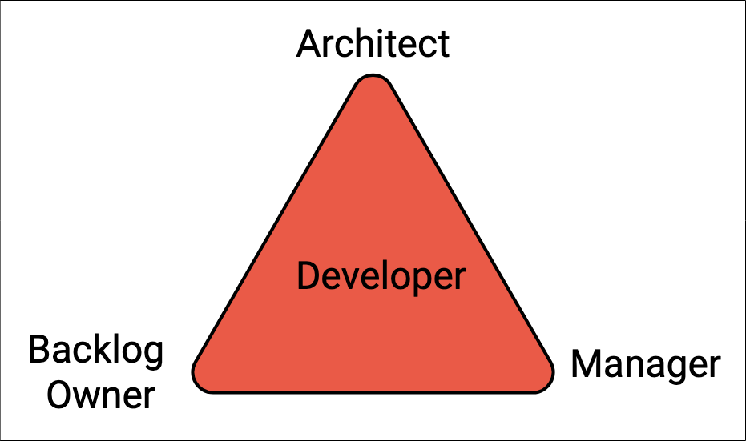

最初于2019年8月17日发布在https://stuff.greger.io。
# 工程领导的实用方法

在上一篇有关devops世界所需的新工程领导技能的文章中，我呼吁采用更系统的方法来发展工程领导能力。 但是我没有给出答案。 在这篇文章中，我将分享我在工程组织中发展领导能力的实用方法。

在开发出色的软件时，所有工程师都存在一些基本问题：
+ 我能决定什么？
+ 谁可以对我无法决定的事情做出决定？
+ 解决问题时，我需要与谁交谈或参与？
+ 谁确定我们制造的目标，如何制造以及如何进行制造？
+ 我对我有什么期望，当我达到期望时会得到什么样的奖励？

在小型启动团队中，您实际上并不需要很多这些明确的东西。 目标，行动和奖励大部分在团队中共享，每个人都在他们认为需要的地方做出贡献。 整个团队拥有相同的优先级，权衡是不断决定的，并且变化的过程很快完成。

但是，如果不在不同团队或角色中引入稍有不同的优先级，您就无法成长为一个组织。 您开始介绍协调成本。 有一阵子，您可以通过某种协调过程或会议使每个人围绕相同的优先事项进行协调，从而使您“本周要完成的五件事”。 但是要实现快速增长，您需要在某个时候让不同的人或团队专注于不同的优先事项。 我已经看到了许多解决最终协调问题的方法，并且大多数要么引入过多的过程，要么引入过多的过程。

在任何情况下，没有一个适用于每个人的答案。 但是，如果我们着眼于如何构建出色软件的基础，则始终必须以某种方式涵盖四个不同的领域：
+ 建立高质量的代码，设计和其他有形的东西
+ 知道如何解决客户的问题
+ 知道如何从技术上解决问题并交付可以长期使用的产品
+ 知道如何制作诸如代码之类的有形东西，并实际交付了达成的共识

这四个领域中的每个领域的技能都非常不同。 参与的人员越多，就需要进行更多的协调和协作以确保每个人都朝着同一方向前进。 理想情况下，您希望每个人都具有100％的生产力，但这是不可能的，只要人们应该做的事情之间存在某种依赖关系即可。 您如何获得尽可能高的生产率百分比？

通常，这些职责中的每一个都转换为以下四个角色之一（不是个人）：

+ 开发人员构建东西
+ 待办事项的所有者管理优先级和要进行的定义
+ 技术架构师确定如何从技术上解决问题
+ 工程经理领导人员，开发过程，将合适的人分配给正确的任务并确保速度

这些是角色，而不是个人，因此许多工程师会戴上帽子。 另外，这里缺少一个部分：服务或产品。 每个组织都必须分解其服务和产品（以及代码库），并以明智的方式对其进行分组。 完成此操作后，应该可以确定每个开发人员，积压所有者，经理和架构师。 工程师可以是一个代码库/服务上的开发人员，而另一个代码库/服务上的架构师，以及管理可交付成果。

分解成模块和组件对于您的工程组织的工作效率至关重要，并遵守Conway的法律。

除非您将确定的所有权和角色与模块和组件进行匹配，并且相对于您的组织结构而言正确无误，否则您将在软件体系结构和人们的沟通方式中引入低效率。 这是一个连续的过程，需要针对功能和基础系统体系结构适应不断变化的需求。

回到本文开头的问题（大多数人在软件开发组织中都有），现在应该可以回答这些问题了。 您不必经过中央经理或（..！）委员会或程序，您可以直接与可以做出决定的负责人联系。 例如。 如果您是待办事项的所有者，并且需要更多的工程师来处理待办事项，则可以与经理联系。 如果需要评估如何实现某些功能，请与架构师联系。 如果几个组件需要通过API进行通信，则您确切知道邀请谁来讨论。

这样，您将得到一个无需中央协调即可解决大多数日常事务的组织。

通常，对于每个主要组件，您都会有三人一组的领导者：经理，架构师和积压所有者。 因此，开发团队可以从这三个团队的每一个那里获得帮助，从而提高工作效率。 理想情况下，这三个角色/人员在物理上位于同一位置，以实现最高的生产率，因为高速需要快速且频繁的接触点。

此图中还缺少其他两个角色：如果团队是产品团队，则需要一个产品经理角色（根据技术水平，他还可以是积压所有者）。 如果您的组件或产品具有UI，则还应该有一个UX负责人，可以与积压工作所有者和产品经理一起工作，以使交付物更加清晰。 另请参见关于积压和产品所有者角色的较早文章。

这种模式也有利于培训和职业发展。 可以根据个人兴趣在四个方面建立技能。 随着工程师从初级成长为高级，他们将承担更多的角色并扩大所有权。 有些人可能想担任经理角色并领导团队。 有些人可能想深入研究非常狭窄的技术领域并成为首席架构师。

请记住，组织中的任何更改都将花费时间。 您需要反复澄清期望，机遇，表明做出这些决定的真正权力是权威，并系统地鼓励人们拥有所有权。 如果人们不确定，则需要举例说明哪些具体任务和行动是必要的和预期的。

奖励是一个授权的工程组织，可以高速交付出色的软件！
