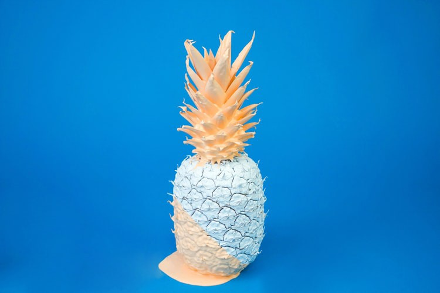

# 人工智能，机器学习和营销的未来
## 人工智能如何帮助数字营销专业人员塑造策略并建立影响力

> Image Source: Unsplash


人工智能和机器学习可以帮助塑造P.R.研究和市场影响力的未来。

我们生活在一个AI正在改善我们研究产品，做出购买决定并相互影响的能力的世界中。
# AI有两种形式：

·纯AI：机器在哪里思考人类的方式。

·实用AI：包括自然语言处理和机器学习（分析信息然后使用它来尝试预测会发生的事情的算法）的一组技术。

两种类型的产品都可以用来增强营销机构的能力，因为它们努力为客户实现最佳结果。

当前，AI通过三种方式帮助增强数字营销部门：
# 增强的用户体验：

> Image Source: Pixabay


成功的数字营销策略最重要的方面之一就是客户体验。

当内容与用户相关时，他们更有可能转化并成为老客户，并忠于品牌。

人工智能可以根据历史数据，位置和过去的行为来整理数据并确定最适合个人的内容，从而帮助实现这一目标。

通过这样做，用户认为该品牌是专门为他们打造的。

在零售领域，我们已经看到增强现实技术的发展，这些技术使客户甚至无需进入服装店就可以“试穿衣服”。

语音搜索技术也是一种出色的AI工具，可以帮助数字营销人员获得更快的结果。 公司现在可以编写其网站，使其与Alexa，SIRI和Google Home等虚拟助手相吻合。

如果营销人员正确地做到这一点，他们可以将自己的业务转移到语音搜索的第一位，从而提升品牌知名度。
# 预测客户行为：

> Image Source: Pixabay


AI可以根据客户过去的行为来帮助个性化客户体验。 它还可以猜测新客户和现有客户的行为模式。

借助无数的数据管理平台来整理第二方和第三方数据，人工智能现在可以爬网收集有关您客户的信息。

这些数据可以通过用户旅程和个人资料自动根据您的需求个性化您的服务。

这样一来，营销人员就可以定位潜在的潜在客户，并排除那些不太可能转化的潜在客户。

有了这些流程，企业可以将更多的时间花费在创建和执行有效的营销策略上。

人工智能不断收集，解释和分析数据，以更明智地将其用于营销目的。

随着新算法的不断推出，客户旅程的准确性将变得更加高效，并有助于确定ROI和销售预测。

这意味着企业将能够为客户提供最佳体验，并确定合适的工具来增加其行业的成功。
# 实时客户支持：

> Image Source: Pixabay


当客户在线购物时，他们希望企业能够迅速做出响应并做出解决方案。

AI聊天机器人可帮助实时提供这些体验。

可以对聊天机器人进行编程，使其使用使它们看起来更像“人类”的术语，并且它们可以回答基本问题，完成订单并帮助解决简单的问题。

去年，Facebook Messenger已将其聊天机器人功能集成到Facebook企业页面中，以帮助增强企业的客户服务。

这些漫游器可以24/7全天候可用，并且可以减少遇到问题的客户的呼叫等待时间，从而可以总体上提高客户满意度。 人工智能和营销的未来：

> Image Source: Pixabay


想象一下，如果您愿意，那么一个可以刮擦互联网并整理所有潜在影响者（包括拥有大量社交媒体追随者的非专业人士）的AI工具。

在将网络投放到宏伟的网络之前，您可以输入搜索项和参数的工具。

这样的工具可以确定哪些影响者会接受P.R.宣传，从而排除那些影响其客户KPI的影响者。

这些工具确实存在，但是它们都不是万无一失的，通常需要P.R.专业人员进行监视，以便在发出音调之前掌握最后的信息。

在您阅读本文时，正在创建AI软件，该软件将使P.R.和市场营销机构可以“与”潜在客户“会面”，“感知”他们的需求，探索其叙述和文化并确定主要的目标受众。

该软件将能够回答有关您公司的问题，激发信心并导致大量新的，特别定制的帐户涌入，这些帐户符合公司的精神和个性。

接下来，我们必须考虑随着人们对品牌和个性化营销的期望增加，人工智能如何帮助公众。

成功的秘诀在于对两个研究人员都使用AI，并提供可以跨多种渠道，格式和设备类型定期交流，吸引和取悦客户的个人体验。

去年，超过50％的公司将投资重定向到客户体验创新上。

营销部门必须通过对AI和机器学习营销工具进行明智的投资来进入这个市场，这一点至关重要。

借助AI，可以将当今社会可用的信息传递给我们信任的品牌，以使喜爱它们的人们感到高兴。

您的企业如何使用AI或ML增强其营销流程？
```
(本文翻译自Marcel Deer的文章《AI, Machine Learning, and the Future of Marketing》，参考：https://towardsdatascience.com/ai-and-machine-learning-and-the-future-of-marketing-fbc777b2fbf9)
```
