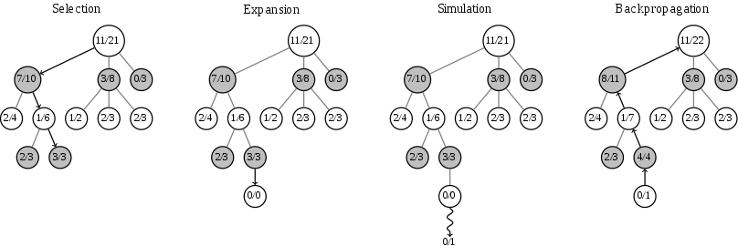

# AI：蒙特卡洛树搜索（MCTS）


蒙特卡洛树搜索（Monte Carlo Tree search）是一种专门用于游戏的人工智能算法的名字。 据报道，Alpha Go将这种算法与神经网络结合使用。 在此之前，MCTS已在许多其他应用程序中使用。

在这里，我解释什么是算法，以及它是如何工作的。
## 什么是蒙特卡洛树搜索

顾名思义，MCTS是一种搜索树的方法。 在此树中，其节点表示状态，节点之间的弧线表示从一个状态到另一个状态的选择。

下图显示了井字游戏，以及如何将其可能的状态表示为一棵树。

> Example of a state tree for tic-tac-toe. Source


该名称的蒙特卡洛部分与其他种类的树搜索有所不同。 蒙特卡洛算法是概率算法的一类broder。 这意味着该算法通常仅返回实际结果的近似值。 但是在几种情况下，当运行到无穷远时，已证明可以收敛到实际结果。

蒙特卡罗算法的经典示例是用于近似数字Pi的示例。 为此，绘制一个大小为1的正方形，并在正方形上刻一个圆圈。 正方形的面积应等于1，而内切圆的面积应等于pi *（1/2）²。 然后，正方形的面积与圆形的面积之比应为4 / pi。 因此，为了估计PI，我们可以在均匀分布后的区域内随机放置点。 落在圆内的点与总点的比例将得出两个图形的面积比的近似值。 这反过来将给出PI的近似值。

下图显示了估算Pi的算法，但仅使用了四分之一圆。

> Estimation of PI by using the ratio of areas of the square and circle using a Monte Carlo method. Source

## MCTS如何运作

该算法可分为3个步骤：
+ 选择：从游戏的当前状态开始，进入已探索状态的状态树。 有一些方法可以选择要选择的已探索状态中的哪一个，例如“最高置信度”（UCT），但这里不再讨论。 当我们达到从未有过的状态时，我们进入了扩张阶段
+ 推出：从我们之前从未见过的这种状态开始，模拟连续的状态，直到达到赢/平/亏损。 在纯蒙特卡洛方法中，可以随机选择接下来要探索的状态。 因此，我们可以继续选择随机动作，直到游戏结束。 到达终点后，我们必须对结果进行反向传播。
+ 反向传播：这是在完成一次发布后执行的，因此在达到赢/平/亏损状态之后执行。 在达到此终端状态之前，我们将更新所经历的任何状态的Win / Loss / Draw的值。

只要有时间，我们就可以执行上述步骤。 然后，当需要选择移动时，我们可以选择赢率最高的移动。

下图显示了上述步骤的一个迭代示例

> One iteration of MCTS. Source


在图中，白色节点表示玩家1轮到的状态。 黑色节点代表相反，这是玩家2的回合。 每个节点中的数字表示在通过该节点进行的部署总数中获胜的次数。
## 实作

如果您想尝试，我建议检查以下库之一

Python：https：//github.com/int8/monte-carlo-tree-search

Javascript：https：//github.com/dbravender/mcts
```
(本文翻译自Pedro Torres Perez的文章《AI: Monte Carlo Tree Search (MCTS)》，参考：https://medium.com/@pedrohbtp/ai-monte-carlo-tree-search-mcts-49607046b204)
```
