# 时间序列预测模型概述
## 我们描述了10种预测模型，并将其应用于预测工业生产指数的演变

> Photo by Drew Beamer on Unsplash

这篇文章是关于什么的？

本文概述了可用于对时间序列进行建模和预测其演变的主要模型。 这些模型是用R和Python开发的。 相关代码可在此处获得。

时间序列预测是一个热门话题，具有许多可能的应用，例如股票价格预测，天气预报，业务计划，资源分配等。 尽管可以将预测视为监督回归问题的子集，但由于观测的时间性质，某些特定的工具是必需的。

什么是时间序列？

通常通过随机过程Y（t）来建模时间序列，即随机变量序列。 在预测设置中，我们在时间t处发现自己，并且我们仅使用时间t处可用的信息来估计Y（t + h）。

如何验证和测试时间序列模型？

由于时间序列数据的时间依赖性，我们不能依赖常规的验证技术。 为了避免评估结果有偏差，我们必须确保训练集包含的观察值早于验证集中的观察值。

解决此问题的一种可能方法是使用滑动窗，如此处所述。 此过程称为时间序列交叉验证，并在下图中概述，其中蓝点代表每个“折叠”中的训练集，红点代表相应的验证集。
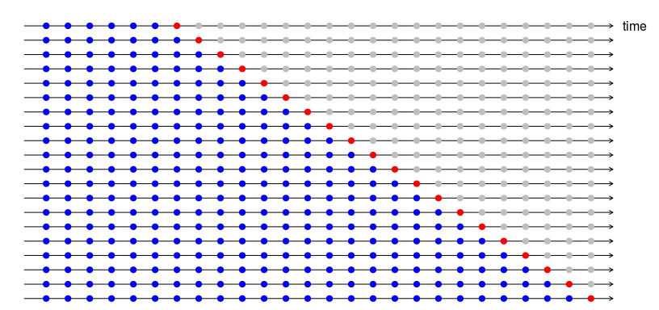
> Time series cross-validation. Credits to Rob J Hyndman

如果我们有兴趣预测接下来的n个时间步长，则可以对交叉的1,2，…，n个步长应用交叉验证程序。 这样，我们还可以比较不同时间范围内的预测的优势。

选择最佳模型后，我们就可以将其拟合到整个训练集中，并在随后的单独测试集中评估其性能。 可以通过使用与交叉验证相同的滑动窗口技术来完成性能估计，但无需重新估计模型参数。
# 简短的数据探索

在下一部分中，我们将应用不同的预测模型来预测工业生产指数的演变，该指数量化了在欧元区制造的电气设备。

可以通过R中的fpp2软件包轻松下载数据。要使数据在R之外可用，您只需在R环境中运行以下代码即可。

该数据集对应于1996年1月至2012年3月期间欧元区（17个国家）的电气设备（计算机，电子和光学产品）的月度制造。我们保留最近的两年用于测试。
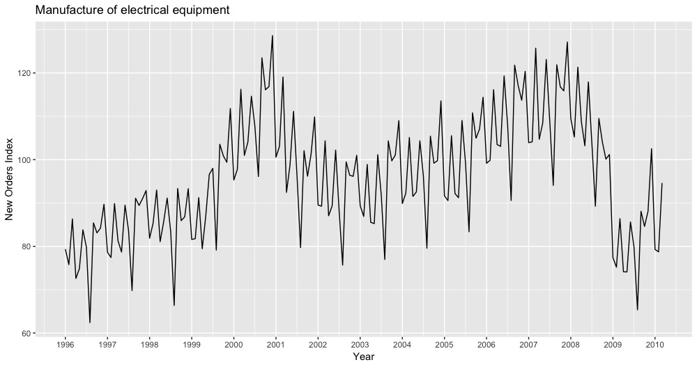

时间序列在2000年底达到峰值，在2007年达到另一个峰值。我们在2008年底观察到的大幅下降可能是由于该年发生的全球金融危机所致。

似乎每年都有季节性模式。 为了更好地可视化，我们分别以原始坐标和极坐标显示了每年的数据。
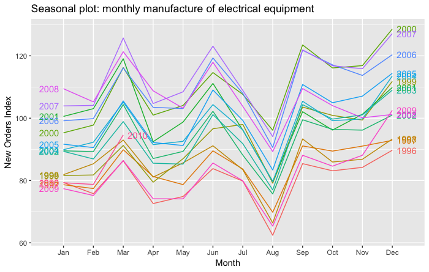
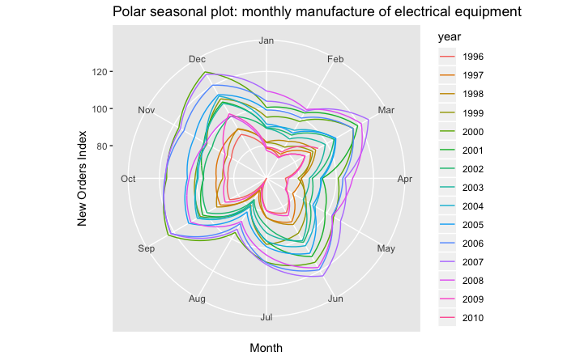

我们观察到强烈的季节性模式。 特别是由于暑假，八月份的产量大幅下降。
# 时间序列预测模型

我们将考虑以下模型：

我们有兴趣预测12个月的工业生产指数。 因此，给定时间t之前的数据，我们希望预测索引在时间t + 1，…，t + 12时所取的值。

我们将使用平均绝对误差（MAE）来评估模型的性能。
## 1）天真，天真

在朴素模型中，每个视野的预测都对应于最后一个观测值。

Ŷ（t + h | t）= Y（t）

这种预测假设生成时间序列的随机模型是随机游动。

天真的模型的扩展由SNaïve（季节性天真）模型给出。 假设时间序列具有季节性成分，并且季节性周期为T，则SNaïve模型给出的预测如下：

Ŷ（t + h | t）= Y（t + h-T）

因此，接下来的T个时间步长的预测等于以前的T个时间步长。 在我们的应用中，对明年的SNaïve预测等于去年的观测值。

这些模型通常用作基准模型。 下图显示了使用这两种模型获得的2007年预测。
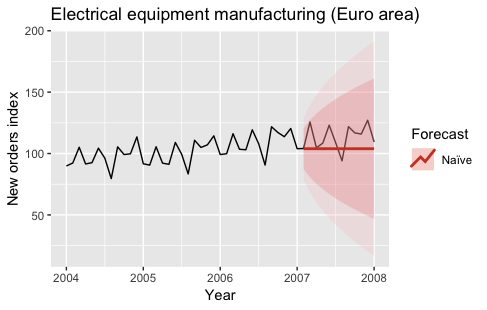
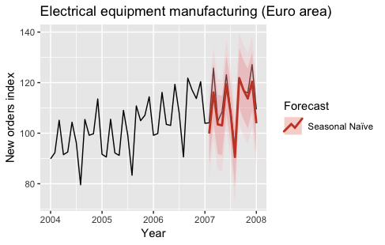

通过使用预测R包的幼稚和自然功能对模型进行拟合。
## 2）季节性分解（+任何模型）

如果数据显示某些季节性（例如每天，每周，每季度，每年），则将原始时间序列分解为三个部分的总和可能会很有用：

Y（t）= S（t）+ T（t）+ R（t）

其中S（t）是季节性成分，T（t）是趋势周期成分，R（t）是余量成分。

存在几种估计这种分解的技术。 最基本的一种称为经典分解，它包括：

经典分解已通过多种方式扩展。 它的扩展允许：
+ 季节性不固定
+ 计算分解的初始值和最后值
+ 避免过度平滑

要获得时间序列分解方法的概述，请单击此处。 我们将利用STL分解的优势，该分解功能广泛且功能强大。
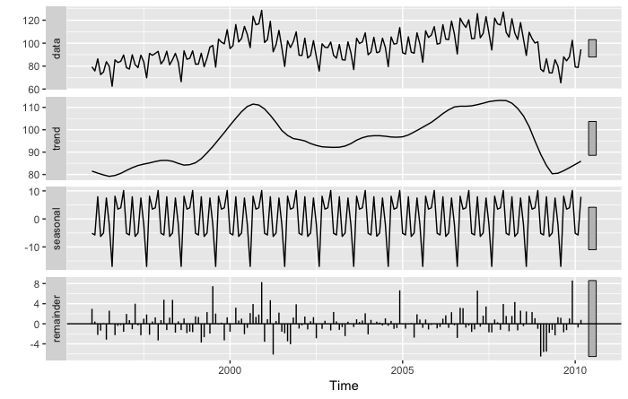
> STL decomposition on industrial production index data

将分解用于预测目的的一种方法如下：

在下图中，我们显示了经过季节性调整的工业生产指数时间序列。
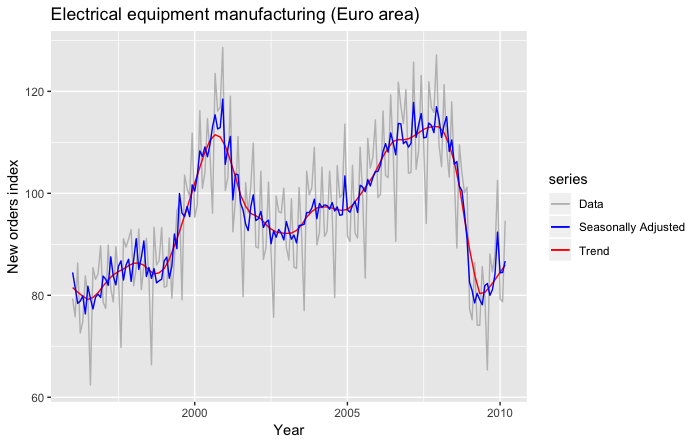

下图显示了通过使用STL分解和朴素模型来拟合季节性调整后的时间序列而获得的2007年预测。
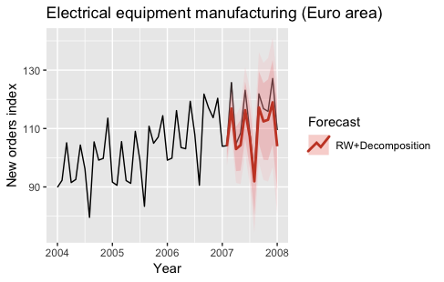

使用stats R包的stl函数拟合分解结果。
## 3）指数平滑

指数平滑是最成功的经典预测方法之一。 它的基本形式称为简单指数平滑，其预测如下：

Ŷ（t + h | t）=⍺y（t）+⍺（1-⍺）y（t-1）+⍺（1-⍺）²y（t-2）+…

0 <⍺<1。

我们可以看到，预测等于过去观察的加权平均值，并且随着时间的推移，相应的权重呈指数下降。

为了包括趋势或衰减趋势和季节性，已经提出了简单指数平滑的几个扩展。 指数平滑族由9个模型组成，此处将对其进行全面描述。

下图显示了通过使用指数平滑模型（自动选择）来拟合原始时间序列和季节性调整后的时间序列而获得的2007年预测。
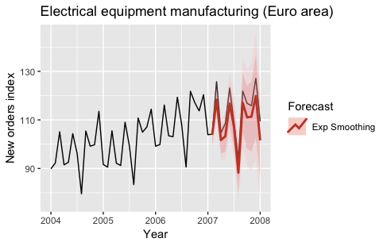
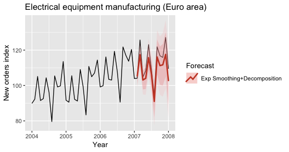

通过使用预测R包的ets函数对模型进行拟合。
## 4）ARIMA，SARIMA

关于指数平滑，ARIMA模型也是时间序列预测中使用最广泛的方法之一。 该名称是AutoRegressive集成移动平均线的首字母缩写。

在自回归模型中，预测对应于变量过去值的线性组合。 在移动平均模型中，预测对应于过去预测误差的线性组合。

基本上，ARIMA模型将这两种方法结合在一起。 由于它们要求时间序列是固定的，因此对时间序列进行微分（积分）可能是必要的步骤，即考虑差异的时间序列而不是原始时间序列。

SARIMA模型（季节性ARIMA）通过添加季节性过去值和/或预测误差的线性组合来扩展ARIMA。

有关ARIMA和SARIMA模型的完整介绍，请单击此处。

下图显示了通过季节性调整后的时间序列使用SARIMA模型和ARIMA模型获得的2007年预测。
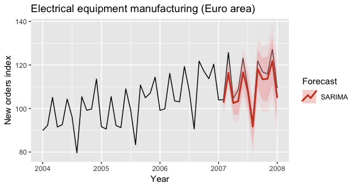
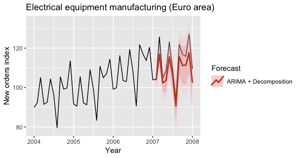

通过使用预测R包的auto.arima和Arima函数对模型进行拟合。
## 5）GARCH

先前的模型假设在生成时间序列的随机过程中的误差项是异方差的，即具有恒定的方差。

取而代之的是，GARCH模型假定误差项的方差遵循自回归移动平均（ARMA）过程，因此允许其随时间变化。 这对于建模随时间变化的金融时间序列特别有用。 该名称是广义自回归条件异方差的首字母缩写。

通常，均值也假定采用ARMA过程。 有关GARCH模型的完整介绍，请单击此处和此处。

下图显示了使用GARCH模型拟合季节性调整后的时间序列得出的2007年预测。
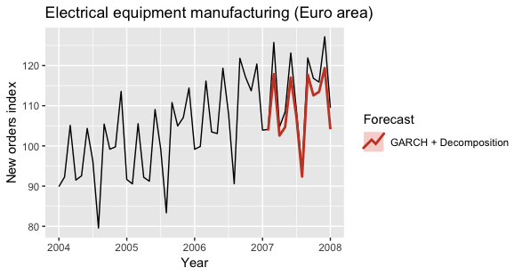

通过使用rugarch R包的ugarchfit函数拟合模型。
## 6）动态线性模型

动态线性模型代表了用于时间序列预测的另一类模型。 想法是，这些模型每次都对应于一个线性模型，但是回归系数随时间变化。 动态线性模型的示例如下。

y（t）=⍺（t）+tβ（t）+ w（t）

⍺（t）=⍺（t-1）+ m（t）

β（t）=β（t-1）+ r（t）

w（t）〜N（0，W），m（t）〜N（0，M），r（t）〜N（0，R）

在先前的模型中，系数⍺（t）和β（t）遵循随机游走过程。

动态线性模型可以在贝叶斯框架中自然建模。 但是，最大似然估计技术仍然可用。 有关动态线性模型的完整概述，请单击此处。

下图显示了通过使用动态线性模型来拟合季节性调整后的时间序列获得的2007年预测。 由于沉重的计算成本，我不得不使模型保持极其简单，从而导致预测不佳。
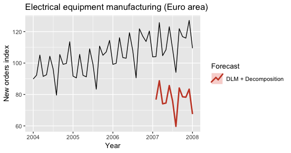

通过使用dlm R软件包的dlmMLEfunction拟合模型。
## 7）TBATS

TBATS模型是基于指数平滑的预测模型。 该名称是“三角函数”，“ Box-Cox变换”，“ ARMA错误”，“趋势”和“季节性”组件的首字母缩写。

TBATS模型的主要特征是它能够通过使用基于傅立叶级数的三角表示对每个季节建模来处理多个季节。 复杂的季节性的经典示例是对销售量的每日观察，该观察通常具有每周和每年的季节性。

有关TBATS模型的完整介绍，请单击此处。

下图显示了使用TBATS模型拟合时间序列获得的2007年预测。
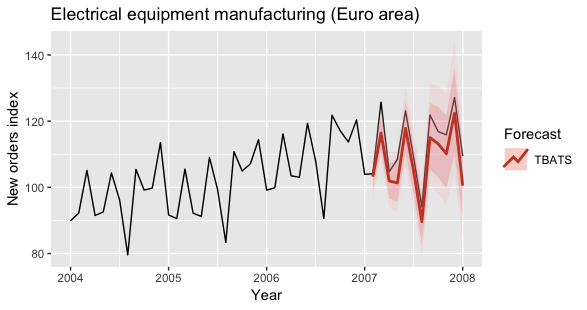

通过使用预测R包的tbats函数拟合模型。
## 8）先知

先知是另一个可以处理多个季节的预测模型。 这是Facebook核心数据科学团队发布的开源软件。

先知模型假定时间序列可以分解如下：

y（t）= g（t）+ s（t）+ h（t）+ε（t）

g（t），s（t）和h（t）这三个术语分别对应于趋势，季节性和假日。 最后一项是错误项。

模型拟合被构造为曲线拟合练习，因此没有明确考虑数据中的时间依赖性结构。 这也允许具有不规则间隔的观察。

趋势时间序列有两种选择：饱和增长模型和分段线性模型。 多期季节性模型依赖于傅立叶级数。 可以将已知和自定义的节假日的效果轻松纳入模型。

先知模型被插入贝叶斯框架中，并允许进行完全后验推断，以将模型参数不确定性包括在预测不确定性中。

有关Prophet模型的完整介绍，请单击此处。

下图显示了通过使用Prophet模型拟合时间序列获得的2007年预测。
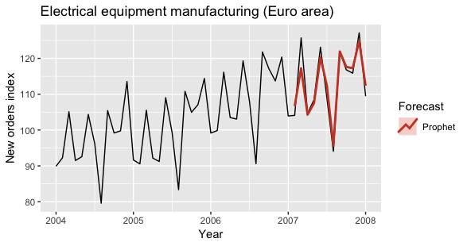

通过使用先知R包的先知功能对模型进行拟合。
## 9）NNETAR

NNETAR模型是一个完全连接的神经网络。 首字母缩写词代表“神经网络自回归”。

NNETAR模型输入直到时间t为止序列的最后一个元素，并在时间t + 1处输出预测值。 为了执行多步骤预测，需要迭代地应用网络。

在存在季节性的情况下，输入还可以包括季节性滞后的时间序列。 有关NNETAR模型的完整介绍，请单击此处。

下图显示了使用具有季节性滞后输入的NNETAR模型和经过季节性调整的时间序列的NNETAR模型获得的2007年的预测。
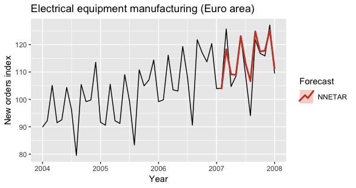
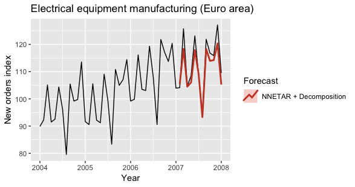

使用预测R包的nnetar函数拟合模型。
## 10）LSTM

LSTM模型可用于预测时间序列（以及其他递归神经网络）。 LSTM是首字母缩写词，代表长期记忆。

LSTM网络的状态通过状态空间向量表示。 这种技术可以跟踪新观测值与过去观测值（甚至很远的观测值）之间的依存关系。

如此处所示，即使将LSTM应用于标准时间序列，也可以从迁移学习技术中受益。 但是，它们通常用于非结构化数据（例如音频，文本，视频）。

有关使用LSTM预测时间序列的完整介绍，请单击此处。

下图显示了通过在季节性调整的时间序列上拟合LSTM模型获得的测试集中第一年的预测。
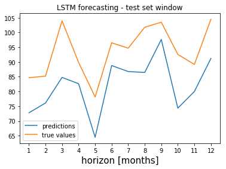

该模型通过使用Python中的Keras框架进行拟合。
# 评估

我们通过前面描述的交叉验证过程执行了模型选择。 由于动态线性模型和LSTM模型的计算成本较高且性能较差，因此我们并未对其进行计算。

在下图中，我们显示了每个模型和每个时间范围的交叉验证的MAE。
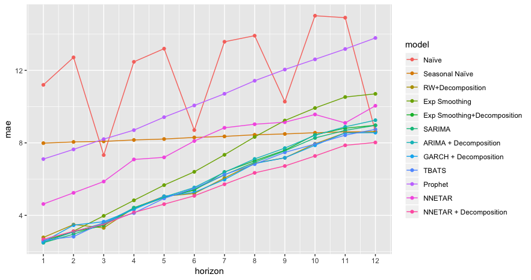

我们可以看到，对于大于4的时间范围，经季节性调整的数据的NNETAR模型的效果要优于其他模型。 让我们检查通过对不同时间范围进行平均计算得出的总体MAE。
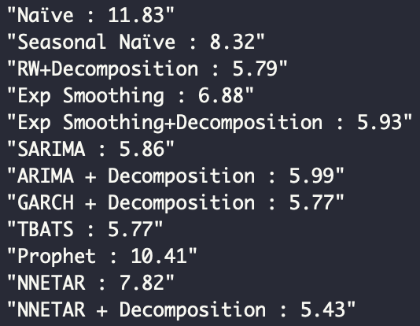
> Cross-validated MAE

经季节性调整的数据上的NNETAR模型是此应用程序的最佳模型，因为它对应于最低的交叉验证的MAE。

为了获得最佳模型性能的无偏估计，我们在测试集上计算了MAE，得出的估计值等于5,24。 在下图中，我们可以看到每个时间范围内测试集上估计的MAE。
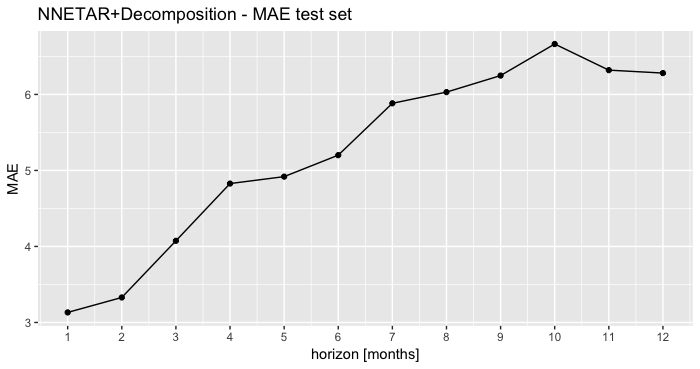
## 如何进一步提高绩效

其他提高模型性能的技术可能是：
+ 针对不同的时间范围使用不同的模型
+ 结合多个预测（例如考虑平均预测）
+ 自举聚合

最后一种技术可以总结如下：

有关Bootstrap聚合的完整介绍，请单击此处。
## 其他型号

此列表中未包括的其他模型例如：
+ 以时间为输入的任何标准回归模型（和/或其他功能）
+ 编码器解码器模型，通常用于NLP任务（例如翻译）
+ Wavenet和其他Attention网络，通常用于非结构化数据（例如，文本到语音）
# 结束语

该项目的目的不是要适合工业生产指数的最佳预测模型，而是要概述预测模型。 在实际应用中，应在预处理，特征工程和特征选择上花费大量时间。

先前描述的大多数模型都可以轻松地合并时变预测变量。 这些可以从相同的时间序列中提取，也可以对应于外部预测变量（例如，另一个索引的时间序列）。 在后一种情况下，我们应注意不要使用将来的信息，这可以通过预测预测变量或使用其滞后版本来满足。
