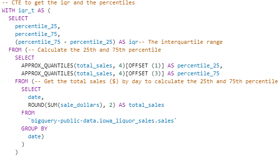
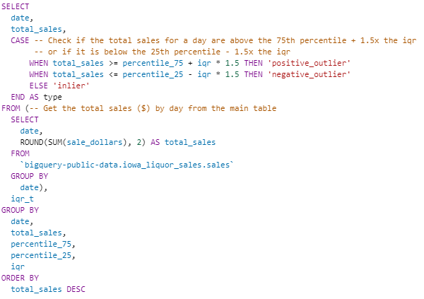
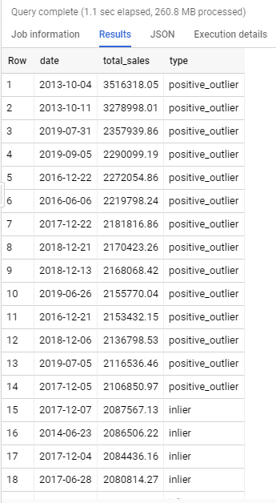
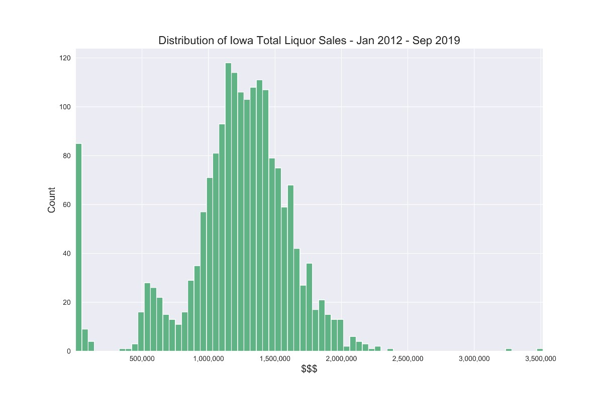
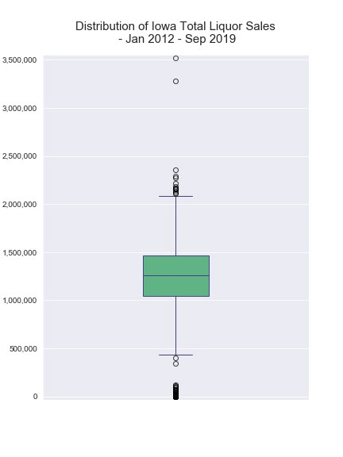
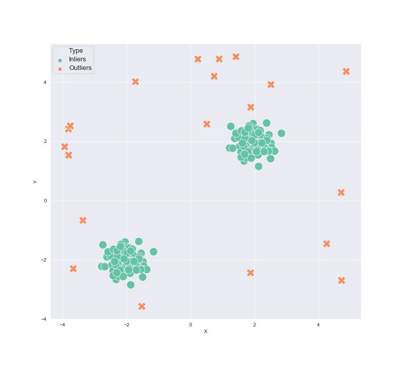
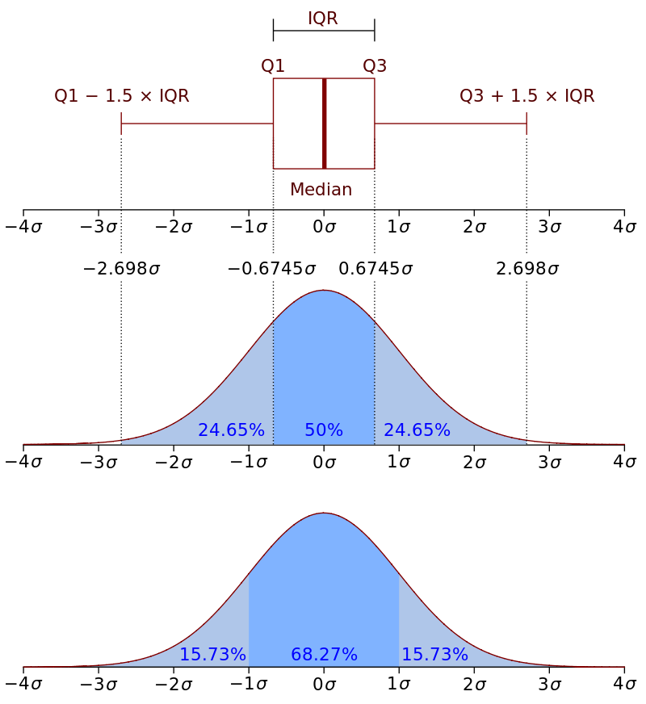

# 例

我将使用BigQuery中可用的公共数据集之一，以便您自己重新创建它。 这是“爱荷华州酒类销售”数据集（`bigquery-public-data.iowa_liquor_sales.sales`），其中包含爱荷华州的每日白酒销售量可以追溯到2012年。

酒类的销售方式有很多，包括城市，县，经纬度，类别，已售出的瓶子，已售出的数量等。在本例中，我只是按天查看总销量，但您可以检测到异常情况 在表格中的任何突破中。

带有注释的完整查询可以在我的GitHub页面上找到，这是要点。 让我们细分一下查询的功能。

我要做的第一件事是创建一个CTE（公用表表达式）以构成一个表，该表包含按天计的白酒总销量的25％，75％和IQR，以在查询的主要部分中使用。

为了获得四分位数，我正在使用BigQuery的近似分位数功能。 我们要说的是要有4个分位数来创建一个数组，所以我们只需要使用offset函数从数组中选择想要的分位数。

返回的数组看起来像这样[min，25，50，75，max]。 如您所见，它还返回最小值和最大值。 索引从零开始，因此它将是[0、1、2、3、4]。 因此，对于第25个百分位数，我们选择位置1处的元素，依此类推，使用offset函数。

接下来，我们进入查询的主要部分：

从内部查询开始，我们将再次获取每天的白酒总销量，然后与上面创建的IQR CTE进行交叉联接（不过要注意大型数据集的交叉联接）。 然后，我们将创建一个案例说明，以说明当日的白酒销售额是否为正值/负值（异常值）。 出于展示目的，我们还按每日总销售额递减的方式获取当天的总销售额以及日期和订单。 这给了我们：

现在，我们有一个名为“类型”的列，该列将告诉我们当天的白酒销售是异常值，正异常值还是负异常值。

让我们看一下数据分布，以确认查询是否有效。 这是一个直方图，左侧显示一整天几乎没有任何销售，右侧显示了几天的真正高销售。 两者都应进一步研究。

这是显示异常值的箱线图。 您可以看到该箱线图反映了查询，并在$ 2.1MM左右标识了正离群值，如上面的输出所示。

现在，您可以安排此查询每天运行（或根据需要频繁运行）并输出到表中。 然后，您会得到一个表格，该表格会自动更新，以标识可以连接到您所选择的可视化工具的异常值。

您还可以更进一步，并在云功能/ lambda中运行它，并在检测到异常并带有一些有关异常的基本信息时自动通过api发送松弛警报/电子邮件。 我以这种方式针对工作异常情况自动执行了松弛警报，并且效果非常好。 以后我会写一篇关于它的文章。

像这样的事情对于任何可以使用SQL的人（分析师，数据科学家，工程师等）来说，都很容易在短时间内启动并运行，并且非常有效。 现在您可以回到机器/深度学习learning
# 使用SQL进行异常检测

有很多方法可以检测数据异常，就像生活中的大多数事物一样，并不是真正清晰明了的“正确方法”。 您采用的方法将取决于您的数据以及项目的要求。

这是否需要尽可能准确的信息（例如信用欺诈检测）？您是否只需要监视一些潜在问题的指标？是否需要快速启动并运行？或者您有6个月的时间才能投入生产？ 您有哪些可用资源等。

> Anomalies Detected!!

有两种基本的异常检测方法。 您可以走基于规则的路线，也可以走机器学习路线。 诸如隔离林，局部离群因子，自动编码器等机器学习模型都可以用于成功检测异常。 如果您要沿着那条路走，则应该查看sklearn的软件包以及《动手无监督学习》一书作为良好的起点。

但是，基于规则的方法可以很好地工作，易于实现，更易于投入生产并且可以更快地启动和运行。 根据您的要求，它们可能是最好的解决方案。

我明白了，每个人都想立即进行机器/深度学习来解决问题，因为面对现实吧，这既有趣又充满挑战。 但是，走机器学习路线并不总是最好的选择，尤其是在商业环境中。

一种有效且易于在SQL中实现的基于规则的方法是使用四分位间距。 IQR定义为数据集的75％和25％之间的差异。

如果数据点高于75％百分率IQR的1.5倍或更多，或低于25％百分率IQR的1.5x或以下，则可以将它们视为离群值。
+ 正离群值= 75％+ 1.5 *（75％-25％）
+ 负离群值= 25％-1.5 *（75％-25％）

为什么是1.5倍而不是2倍或3倍？ 1.5倍与平均值之上的3个标准差非常相似（请参见下图）。 当然，您可以将其更改为1.75x或2.25x等，具体取决于您希望异常检测的“敏感度”如何，这是使用IQR的另一件事。

由于IQR使用的是中位数而不是平均值，因此它被认为是衡量规模的可靠方法，并且与使用平均值（例如标准偏差）的度量值相比，它不太可能受到一些离群值的影响。 这将使识别实际异常值更加容易。

如果您曾经看过箱形图，那只是可视化的IQR异常值检测方法。 您可以从下图中看到，“框”是IQR，“晶须”位于第25和第75个百分位，高于这些值的任何数据点（称为“传单”）都是离群值：

> Source: Wikipedia

在进入示例之前，还有一些关于异常检测的注意事项。 异常检测可以是单变量或多变量的。 单变量更容易理解，因为您可以轻松知道哪个指标触发了异常。 如果您有多个指标，则可以仅设置单独的查询以检测每个指标的异常情况，从而使最终产品的解释性更高。 如果您要使用多元路线，则机器学习可能更适合于此。 异常检测也可以是有监督的，也可以是无监督的，但是在大多数情况下，就像我们在这里所做的那样，是无监督的。
