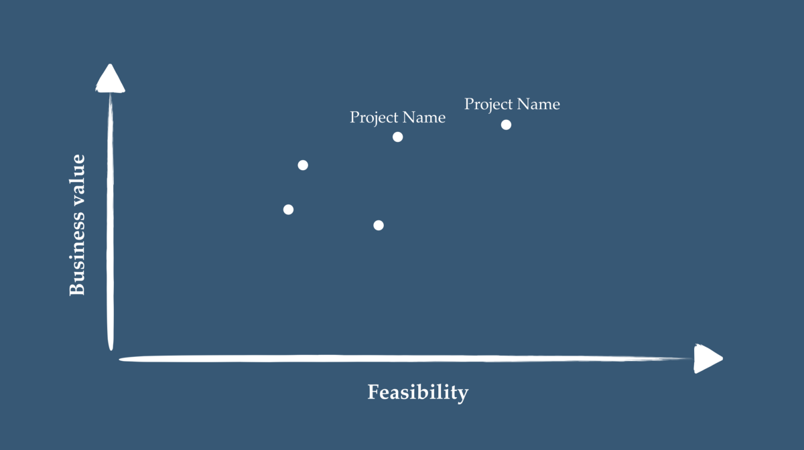

感谢Anne Bonner，Haebichan Jung和Anton Muehlemann。

谢谢阅读。 如果您有任何疑问想问我们的团队，可以在这里进行。
# 4.什么是出色的文章？

我们已经尝试在作家指南中回答这个问题。 为了简短起见，这是对我们团队的出色文章：
+ 作者有话要说。 它可以是重要的信息，值得一听的观点或重要的想法。 💡
+ 我们有理由要关心。 作者演示了为什么我们应该阅读他们的文章以及所产生的影响。
+ 答案匹配问题。 无论论据是否令人信服，我们都会按顺序叙述它们，并尝试回答作者提出的关键问题。
+ 这个故事是可见的。 正如心理学家史蒂文·平克（Steven Pinker）所说：“好作家讲述了一个故事，主人公把事情变为现实。”作者不仅告诉我们正在发生的事情，还告诉我们正在发生的事情。 我们可以通过隐喻，类比，图形，图像和示例亲眼看到它。
+ 这篇文章值得分享。 阅读后，我们感到不得不共享它，因为我们看到它会帮助其他人。
# 3.在TDS上学习时，最重要的事情是什么？

使我们的出版物保持简单对完成我们共享概念，想法和代码的使命至关重要。

TDS增长如此之快，以至于我们很容易忘记最初的使命。 我们本可以尝试做太多事情，或者只专注于肤浅的事情。 保持出版物的简洁性使我们能够专注于基本内容，即观众和贡献者希望我们做的事情。

但是保持TDS简单并不像看起来那样容易。

我们不断地提醒自己为什么要做我们正在做的事情。 我们不想仅仅因为它是新颖而闪亮的东西就着急。 我们正在学习耐心。 在构建像TDS这样的东西时，耐心比我以前想象的要重要得多。
# 2.如何说服我的经理投资数据科学？

尝试清楚地说明您的数据科学项目将为公司带来哪些业务价值。

您的经理将始终挑战您的想法，这就是为什么您需要做好准备。

如果您可以证明您的数据科学项目将在合理可行的情况下带来关键的业务价值，那么您的经理将没有什么理由拒绝它们！

首先在一个简单的图形上绘制所有潜在的数据科学项目，然后与您的团队讨论。 您的目标是要有足够的创造力，以找到有价值且可实现的项目。

# 1.您会给初学者最被忽视的建议是什么？

花点时间找出自己是否真的是梦想中的数据科学家。

研究表明，大多数人在工作中感到放松。 数据科学家也不例外。 根据Kaggle的一项调查，大多数在野外工作的人表示，他们每周花费1-2个小时寻找新工作。

这是为什么？ Jonny Brooks-Bartlett提到了几个原因，包括：
+ “期望与现实不符。”
+ “政治至高无上。”
+ “您是任何数据的入门者。”
+ “在一个孤立的团队中工作。”

他的文章是《迈向数据科学》（Towards Data Science）中2018年浏览量最高的文章，并首次出现在Google上的“数据科学”关键字上。

脱离工作是一种长期而乏味的经历。 在您的职业生涯中，您可能会花费大约80,000个小时的工作时间。 因此，请务必认真思考这80,000小时。

您真的想在这段时间里做什么？

不要仅仅遵循职务。 不要只是追求一个没有根据的梦想。 以数据为驱动力：从当前的科学研究中收集最佳信息，仔细考虑并在必要时改变主意。

您应该花时间确保自己对未来的职业做出明智的决定。 我建议您使用此路径的建议是查看https://80000hours.org。 他们研究对社会有积极影响的工作，并提供职业建议。

‘您的职业生涯大约有80,000个工作小时。 这意味着您对职业的选择是您将做出的最大的决定之一，因此，真的值得弄清楚如何善用这段时间。’— 8万小时的团队。
## 询问我们任何事情
# 回答四个最常见的问题
## 从“对于初学者来说最被忽略的建议是什么？”到“什么才是出色的文章？”

> Picture by Kelly Sikkema


大约三年前，我们推出了“迈向数据科学”（Towards Data Science），但我们仍然感到非常惊讶，看到如此多的人参与其中。 今天，我们是一个由4名编辑和20名编辑助理组成的团队，并且由于我们一直在收到您的问题，因此我们决定尽力开始回答这些问题。 我希望您发现这四个回复有用！
```
(本文翻译自Ludovic Benistant的文章《Answers to four most commonly asked questions》，参考：https://towardsdatascience.com/answers-to-four-questions-commonly-asked-73bdbc9feb92)
```
