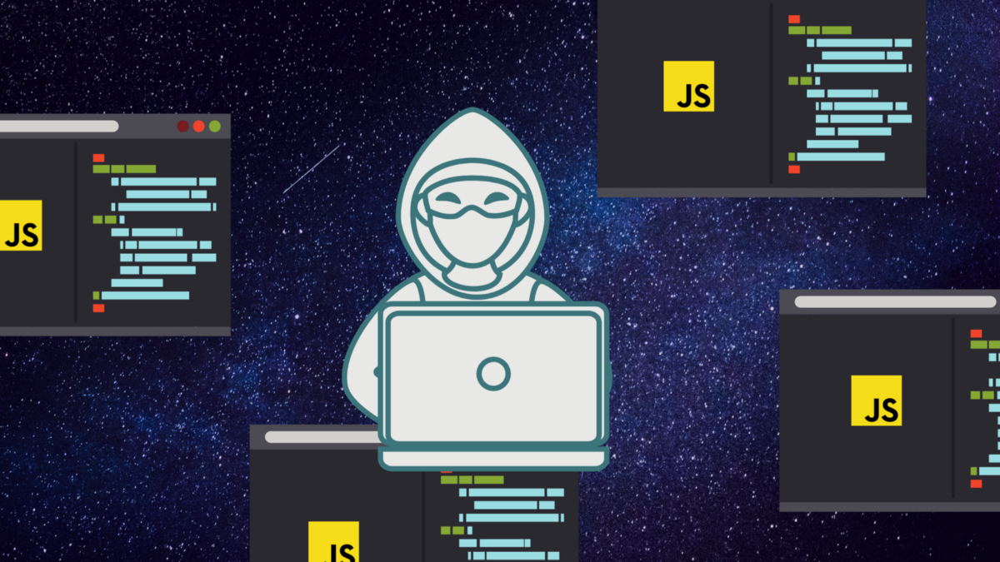

# 最后的想法

创建一致，干净的代码是需要实践的过程。 我们对自己进行的清理工作越多，就越容易识别我们个人的缺陷模式和习惯。

有时，它需要学习一些新知识，并克服您对编写更简单但可能存在问题的代码的抵触。 我们倾向于依靠我们最了解的知识，但这并不总是意味着它实际上是最好的模式或方法。

实际上，代码中没有“最好”的东西。 而是根据时间限制和可用资源来最有效地满足您项目的要求。

感谢您的阅读。
# 确切地说，您正在尝试捕获什么？

代码总是有目的的。 它的存在代表事物。 问题变成了，您的代码到底代表什么？

什么是预期的输出？ 我们如何达到预期的输出？ 在我们的名称和功能过程中含糊不清会导致不稳定的代码，没有明确的界限或存在的目的。

当业务需要添加新元素时，那就是增长带来的变化。 这种增长会打破原来的组成部分吗？ 还是它具有足够的隔离性和清晰的边界，以使影响最小？

灵活的代码并不是关于它可以覆盖多大的范围。 相反，它关系到更改的弹性。 当您知道预期的结果是什么时，可以通过单一责任方法更容易地围起来并加以保护。
# 你以前写过这个吗？

有些事情一遍又一遍地重复。 有时，我们会在代码中识别出模式，并意识到我们已经在其他函数，类或方法中编写过某些内容。

或者，也许有人在另一个地方写了它。 在这里，必须进行抽象和重构，以保持代码的凝聚力并防止重复。

如果看起来很熟悉，很可能是因为您已经在其他地方编写了相同的模式。 重构是重构代码的行为和过程，以适应代码库的增长并保持内聚执行的长期稳定性。

重构本身并不需要大规模。 当我们编写自己的代码并花时间使捕获业务逻辑过程中出现的效率低下时，微重构通常会实时进行。
# 您的名字实际上有用吗？

说到代码，复杂的代码不是性感代码。 您并不是想让自己的方式吸引未来的开发人员阅读您所写的内容。

具有冗长描述的长名称通常会导致不必要的代码杂音。 简短的首字母缩略词对未预示的未来灾难没有意义，因为含义不再是明确的，而是由可能离开公司，再也不会被看到或听到的人所拥有。

知识在任何文明中流失只需要一代人的时间。 只需要一名开发人员离开公司就可以丢失tracusboo函数应该表示的任何隐式信息。

因此，写下有用的名称。 照原样告诉它。 如果名称太长，则意味着您正试图捕获太多信息，因此可能需要抽象出一些东西。 您的代码不是好莱坞的“矩阵”屏幕，因此请不要像这样编写。
# 您是过度抽象还是抽象不足？

有时，我们会因编纂业务需求的行为而发疯。 我们沉迷于模块化的想法，或者只是太着迷于尝试捕捉一个复杂的想法。

当我们试图使代码过于模块化时，就会发生过度抽象的情况，因为我们被告知这是做事的方法。 摘要不足是指我们面临着一系列复杂的规则，而我们还没有弄清楚如何简化这些规则。 在练习结束时，抽象在精神上太费力了，无法进行重构，否则我们就快用完了。

那么正确的抽象量到底是多少呢？

抽象的目的是提取出可重复代码的明确边界。 当我们不过度规划潜在使用量，也不再在相同的作用域空间中再次编写相同的逻辑时，就会发生适当数量的抽象。

嵌套通常是抽象不足的第一个迹象。 多次注入和调用大量外部功能是过度抽象的关键标志。
# 是否需要公开？

并非所有事物都必须是全局状态或作为公共功能存在。 有时，代码隐私是一件好事； 它可以防止范围蠕变并为变量创建安全性。

将所有内容公开都很容易，但这并不是可访问性范围的重点。

当您公开所有内容时，服务和工厂内部的代码很容易受到外部可变性的影响。 这将扩大更改范围，并使更改范围超出您的潜在和预期情况。

在JavaScript中，所有内容在技术上都是可访问的并且是全局的。 但是随着TypeScript的出现及其不断增长的广泛使用，在公共变量和私有变量与函数之间建立了明显的区别，从而使您的代码具有强大的鲁棒性，可以防止不必要的访问和更改。
# 它的功能如何？

尽管我们喜欢面向对象模式的思想，但是功能意识形态也可以存在于类和方法中。 函数式编程根据给定的情况处理数据的处理方式，并且强烈反对依赖关系。

依赖关系还不错，但是过多的依赖关系会导致有害的蜘蛛网。

由依赖项注入引起的链接效应降低了代码的模块化。 您需要依靠上一项才能正常工作，从而产生串联电路效果。

功能模式将您的编码方式转换为可以独立存在的并行状态集，从而提高了模块化—这是隔离并创建清晰的逻辑域的行为。 当代码是模块化的时，它不会中断太多或频繁。

尽管已创建逻辑环围，但依赖关系也可以存在于函数本身内，从而创建冗余。 这通常以不同名称下的重复值，循环内的循环或嵌套逻辑的形式出现。 如果发生这种情况，最好的快速解决方案是将逻辑弄平并抽象出来。
# 您写太多代码了吗？
## 问问自己这六个问题，找出答案

> Image by Aphinya Dechalert.


对于许多初学者而言，代码是编写if else语句并试图弄清楚如何使其正常工作的行为。 在此过程中，生成的代码变成了回旋的庞然大物，其意外的情节曲折可与《权力的游戏》中的《红色婚礼》相媲美。

编写更多代码并不总是更好的代码。 当然，在您编写它时，它是有道理的-直到您回头看并试图揭开您无意间创造的神秘小说时，没有清晰的方向，结构和绊倒线性过程的主要情节漏洞。

当开发人员的知识存在空白时，就会发生错误，这些错误主要是由于不了解有效的代码模式而产生的。 即使产生的代码有效，结构性遗忘的幸福也常常持续很长时间。 但是，随着时间的流逝，它会加剧由于过于混乱而引起的挫败感。

这里有一些问题可以帮助您构建逻辑并提高对软件开发中重要模式的认识。
```
(本文翻译自Aphinya Dechalert的文章《Are You Writing Too Much Code?》，参考：https://medium.com/better-programming/are-you-writing-too-much-code-fb4a9605375)
```
