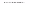
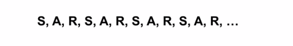
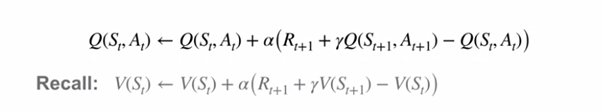
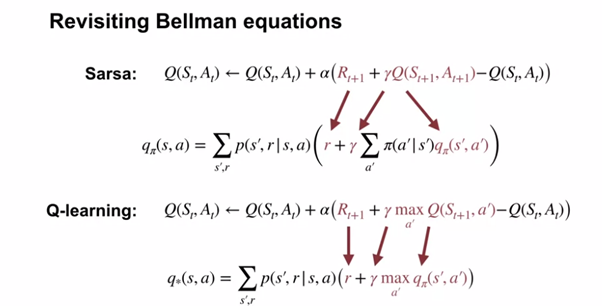
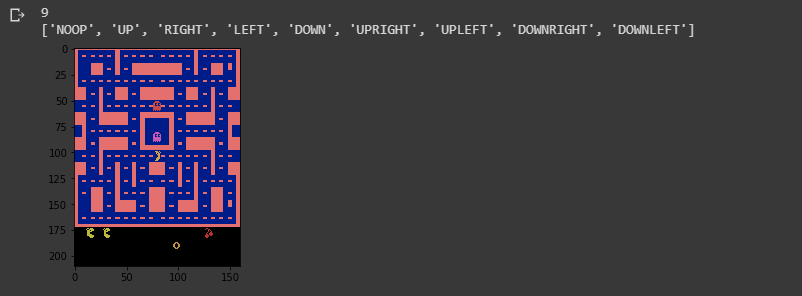
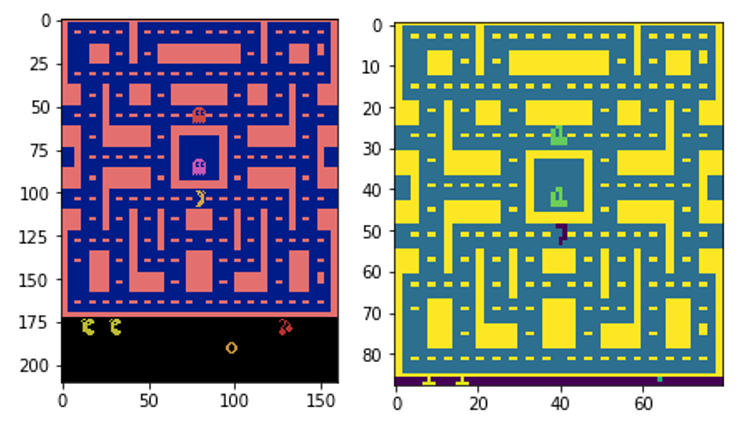
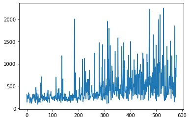
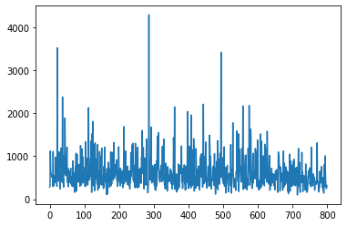

# 通过深度Q学习使吃豆人自动化：Tensorflow中的一种实现。
## 强化学习基础
# 介绍

在涉及GradientCrescent强化学习基础的文章中，我们研究了基于模型和基于样本的强化学习方法。 简而言之，前一类的特征是需要了解所有可能状态转换的完整概率分布，并且可以通过马尔可夫决策过程来举例说明。 相反，基于样本的学习方法只需要通过反复观察即可确定状态值，而无需进行转换动力学。 在这一领域中，我们涵盖了蒙特卡洛和时差学习。 简而言之，可以用状态值更新的频率将两者分开：虽然蒙特卡洛方法要求完成一集才能进行一轮更新，但时差方法使用状态的旧估计来增量更新内集 值与折扣奖励一起生成新的更新。

TD或“在线”学习方法的快速反应性使其适合于高度动态的环境，因为状态和动作的值会通过估算集在整个时间内不断更新。 也许最值得注意的是，TD是Q学习的基础，Q学习是一种更高级的算法，用于训练特工应对诸如OpenAI Atari体育馆中观察到的游戏环境之类的游戏环境，也是本文的重点。
# 超越TD：SARSA和Q学习

回想一下在时间差异学习中，我们观察到一个主体通过状态（S），动作（A）和（奖励）的顺序在环境中循环地行为。



由于这种周期性行为，我们可以在到达下一个状态后立即更新前一个状态的值。 但是，就像我们之前对马尔可夫决策过程所做的那样，我们可以将培训的范围扩展到包括国家行动值。 这通常称为SARSA。 让我们比较状态动作和状态值TD更新方程：


Q学习通过在更新过程中强制选择具有最高动作值的动作来更进一步，这类似于使用Bellman最优性方程式观察到的方式。 我们可以在下面的Bellman和Bellman最优性方程式旁边检查SARSA和Q学习：


考虑到需要不断地为现有动作值最高的状态选择动作，您可能想知道如何确保对状态动作空间的完整探索。 从理论上讲，我们可能仅通过不首先评估就可以避免最佳行动。 为了鼓励探索，我们可以使用递减的电子贪婪策略，从本质上讲，它迫使代理程序选择一个明显的次优操作，以便在一定百分比的时间内了解其价值。 通过引入衰减过程，我们可以在评估完所有状态后限制探索，然后我们将为每个状态永久选择最佳操作。

在我们之前使用基于MDP的模型处理Pong时，让我们了解一下有关Q学习的知识，并将其应用于Atari的《吃豆人》游戏。
# 实作

我们的Google合作实验室实现是使用Tensorflow Core用Python编写的，可以在GradientCrescent Github上找到。 它基于Ravichandiran等人的观点。 ，但已升级为与Tensorflow 2.0兼容，并进行了显着扩展以促进更好的可视化和说明。 由于此方法的实现非常复杂，因此，我们总结一下所需的操作顺序：
+ 我们定义了我们的深度Q学习神经网络。 这是一个CNN，可获取游戏中的屏幕图像并输出Ms-Pacman游戏空间中每个动作或Q值的概率。 为了获得概率张量，我们在最后一层不包括任何激活函数。
+ 由于Q学习需要我们了解当前状态和下一状态，因此我们需要从数据生成开始。 我们将代表初始状态s的游戏空间的预处理输入图像输入网络，并获取动作或Q值的初始概率分布。 在训练之前，这些值将显示为随机且次优。
+ 利用概率张量，然后使用argmax（）函数选择当前概率最高的操作，并使用它来构建epsilon贪婪策略。
+ 然后，根据我们的政策，我们选择动作a，并在体育馆环境中评估我们的决定，以接收有关新状态s，奖励r和情节是否结束的信息。
+ 我们将此信息组合以列表形式<s，a，r，s’，d>存储在缓冲区中，并重复步骤2-4进行预设次数，以建立足够大的缓冲区数据集。
+ 第5步完成后，我们开始生成损耗计算所需的目标y值R'和A'。 尽管前者只是从R打折而来，但我们通过将S'输入到我们的网络中来获得A'。
+ 有了所有组件之后，我们就可以计算损失来训练我们的网络。
+ 培训结束后，我们将以图形方式并通过演示评估代理的性能。

让我们开始吧。 随着Tensorflow 2在协作环境中的出现，我们已经使用新的compat软件包将代码转换为TF2兼容。 请注意，此代码不是TF2本机代码。

让我们导入所有必需的程序包，包括OpenAI体育馆环境和Tensorflow核心。
```
import numpy as npimport gymimport tensorflow as tffrom tensorflow.contrib.layers import flatten, conv2d, fully_connectedfrom collections import deque, Counterimport randomfrom datetime import datetime
```

接下来，我们定义一个预处理功能，以从健身房环境中裁剪图像并将其转换为一维张量。 我们在Pong自动化实施中已经看到了这一点。
```
def preprocess_observation(obs):  # Crop and resize the image  img = obs[1:176:2, ::2]  # Convert the image to greyscale  img = img.mean(axis=2)  # Improve image contrast  img[img==color] = 0  # Next we normalize the image from -1 to +1  img = (img — 128) / 128–1  return img.reshape(88,80,1)
```

接下来，让我们初始化健身环境，检查几个游戏画面，并了解游戏空间中可用的9种动作。 当然，我们的代理商无法获得此信息。
```
env = gym.make(“MsPacman-v0”)n_outputs = env.action_space.nprint(n_outputs)print(env.env.get_action_meanings())observation = env.reset()import tensorflow as tfimport matplotlib.pyplot as pltfor i in range(22):  if i > 20:    plt.imshow(observation)    plt.show()observation, _, _, _ = env.step(1)
```

您应注意以下几点：


我们可以借此机会比较原始和预处理的输入图像：


接下来，让我们定义我们的模型，即深度Q网络。 本质上，这是一个三层卷积网络，它获取预处理的输入图像，展平并将其馈送到完全连接的层，并输出在游戏空间中采取每个动作的概率。 如前所述，这里没有激活层，因为一个激活层会导致二进制输出分布。
```
def q_network(X, name_scope):# Initialize layers  initializer = tf.compat.v1.keras.initializers.VarianceScaling(scale=2.0)  with tf.compat.v1.variable_scope(name_scope) as scope:    # initialize the convolutional layers    layer_1 = conv2d(X, num_outputs=32, kernel_size=(8,8), stride=4, padding=’SAME’, weights_initializer=initializer)    tf.compat.v1.summary.histogram(‘layer_1’,layer_1)    layer_2 = conv2d(layer_1, num_outputs=64, kernel_size=(4,4),    stride=2, padding=’SAME’, weights_initializer=initializer)    tf.compat.v1.summary.histogram(‘layer_2’,layer_2)    layer_3 = conv2d(layer_2, num_outputs=64, kernel_size=(3,3), stride=1, padding=’SAME’, weights_initializer=initializer)    tf.compat.v1.summary.histogram(‘layer_3’,layer_3)    flat = flatten(layer_3)    fc = fully_connected(flat, num_outputs=128, weights_initializer=initializer)    tf.compat.v1.summary.histogram(‘fc’,fc)    #Add final output layer    output = fully_connected(fc, num_outputs=n_outputs, activation_fn=None, weights_initializer=initializer)    tf.compat.v1.summary.histogram(‘output’,output)    vars = {v.name[len(scope.name):]: v for v in tf.compat.v1.get_collection(key=tf.compat.v1.GraphKeys.TRAINABLE_VARIABLES, scope=scope.name)}    #Return both variables and outputs togetherreturn vars, output
```

让我们也借此机会为模型和训练过程定义我们的超参数
```
num_episodes = 800batch_size = 48input_shape = (None, 88, 80, 1)#Recall shape is img.reshape(88,80,1)learning_rate = 0.001X_shape = (None, 88, 80, 1)discount_factor = 0.97global_step = 0copy_steps = 100steps_train = 4start_steps = 2000
```

回想一下，Q学习要求我们选择具有最高动作值的动作。 为了确保我们仍然可以访问每个可能的国家行为组合，我们将让代理商遵循epsilon-greedy政策，探索率为5％。 由于最终假设所有组合都已被探索，因此我们将设定此探索速率随时间衰减-在此之后的任何探索只会导致强制选择次优动作。
```
epsilon = 0.5eps_min = 0.05eps_max = 1.0eps_decay_steps = 500000#def epsilon_greedy(action, step):  p = np.random.random(1).squeeze() #1D entries returned using squeeze  epsilon = max(eps_min, eps_max — (eps_max-eps_min) * step/eps_decay_steps) #Decaying policy with more steps  if np.random.rand() < epsilon:    return np.random.randint(n_outputs)  else:    return action
```

回想一下上面的公式，Q学习的更新功能需要满足以下条件：
+ 当前状态
+ 当前动作
+ 当前动作后的奖励
+ 下一个州
+ 下一个动作是

为了以有意义的数量提供这些参数，我们需要根据一组参数评估当前策略，并将所有变量存储在缓冲区中，在训练期间，我们将从这些缓冲区中提取数据。 在Pong，我们使用了增量方法。 让我们继续创建缓冲区和一个简单的采样函数：
```
buffer_len = 20000#Buffer is made from a deque — double ended queueexp_buffer = deque(maxlen=buffer_len)def sample_memories(batch_size):  perm_batch = np.random.permutation(len(exp_buffer))[:batch_size]  mem = np.array(exp_buffer)[perm_batch]  return mem[:,0], mem[:,1], mem[:,2], mem[:,3], mem[:,4]
```

接下来，让我们将原始网络的权重参数复制到目标网络中。 这种双网络方法使我们可以在训练过程中使用现有策略生成数据，同时仍为下一次策略迭代优化参数。
```
# we build our Q network, which takes the input X and generates Q values for all the actions in the statemainQ, mainQ_outputs = q_network(X, ‘mainQ’)# similarly we build our target Q network, for policy evaluationtargetQ, targetQ_outputs = q_network(X, ‘targetQ’)copy_op = [tf.compat.v1.assign(main_name, targetQ[var_name]) for var_name, main_name in mainQ.items()]copy_target_to_main = tf.group(*copy_op)
```

最后，我们还要定义损失。 这只是我们的目标操作（具有最高操作值）和我们的预测操作的平方差。 我们将使用ADAM优化器来最大程度地减少训练过程中的损失。
```
# define a placeholder for our output i.e actiony = tf.compat.v1.placeholder(tf.float32, shape=(None,1))# now we calculate the loss which is the difference between actual value and predicted valueloss = tf.reduce_mean(input_tensor=tf.square(y — Q_action))# we use adam optimizer for minimizing the lossoptimizer = tf.compat.v1.train.AdamOptimizer(learning_rate)training_op = optimizer.minimize(loss)init = tf.compat.v1.global_variables_initializer()loss_summary = tf.compat.v1.summary.scalar(‘LOSS’, loss)merge_summary = tf.compat.v1.summary.merge_all()file_writer = tf.compat.v1.summary.FileWriter(logdir, tf.compat.v1.get_default_graph())
```

定义好所有代码后，我们就可以运行我们的网络并完成培训过程。 我们在初始摘要中已定义了大部分内容，但让我们回顾一下后代。
+ 对于每个时期，在使用epsilon-greedy策略选择下一个动作之前，我们将输入图像馈入网络以生成可用动作的概率分布。
+ 然后，我们将其输入到体育馆环境中，并获取有关下一个状态和伴随奖励的信息，并将其存储在我们的缓冲区中。
+ 在缓冲区足够大之后，我们将下一个状态采样到我们的网络中以获得下一个动作。 我们还通过折现当前奖励来计算下一个奖励
+ 我们通过Q学习更新功能生成目标y值，并训练我们的网络。
+ 通过最大程度地减少训练损失，我们更新了网络权重参数，以便为下一个策略输出改进的状态操作值。
```
with tf.compat.v1.Session() as sess:  init.run()  # for each episode  history = []  for i in range(num_episodes):    done = False    obs = env.reset()    epoch = 0    episodic_reward = 0    actions_counter = Counter()    episodic_loss = []    # while the state is not the terminal state    while not done:    # get the preprocessed game screen   obs = preprocess_observation(obs)    # feed the game screen and get the Q values for each action,     actions = mainQ_outputs.eval(feed_dict={X:[obs],     in_training_mode:False})    # get the action    action = np.argmax(actions, axis=-1)    actions_counter[str(action)] += 1    # select the action using epsilon greedy policy    action = epsilon_greedy(action, global_step)    # now perform the action and move to the next state, next_obs, receive reward    next_obs, reward, done, _ = env.step(action)    # Store this transition as an experience in the replay buffer! Quite important    exp_buffer.append([obs, action, preprocess_observation(next_obs), reward, done])    # After certain steps we move on to generating y-values for Q network with samples from the experience replay buffer    if global_step % steps_train == 0 and global_step > start_steps:        o_obs, o_act, o_next_obs, o_rew, o_done = sample_memories(batch_size)        # states        o_obs = [x for x in o_obs]        # next states        o_next_obs = [x for x in o_next_obs]        # next actions        next_act = mainQ_outputs.eval(feed_dict={X:o_next_obs, in_training_mode:False})        #discounted reward for action: these are our Y-values        y_batch = o_rew + discount_factor * np.max(next_act, axis=-1) * (1-o_done)        # merge all summaries and write to the file        mrg_summary = merge_summary.eval(feed_dict={X:o_obs, y:np.expand_dims(y_batch, axis=-1), X_action:o_act, in_training_mode:False})        file_writer.add_summary(mrg_summary, global_step)        # To calculate the loss, we run the previously defined functions mentioned while feeding inputs        train_loss, _ = sess.run([loss, training_op], feed_dict={X:o_obs, y:np.expand_dims(y_batch, axis=-1), X_action:o_act, in_training_mode:True})        episodic_loss.append(train_loss)  # after some interval we copy our main Q network weights to target Q network  if (global_step+1) % copy_steps == 0 and global_step > start_steps:    copy_target_to_main.run()  obs = next_obs  epoch += 1  global_step += 1  episodic_reward += reward  history.append(episodic_reward)print(‘Epochs per episode:’, epoch, ‘Episode Reward:’, episodic_reward,”Episode number:”, len(history))
```

训练完成后，我们可以针对增量情节绘制奖励分布。 前550集（大约2小时）如下所示：


再过800集后，这会收敛到以下内容：


为了在协作环境的限制内评估结果，我们可以记录整个情节并使用基于IPython库的包装在虚拟显示器中显示它：
```
“””Utility functions to enable video recording of gym environment and displaying it. To enable video, just do “env = wrap_env(env)””“”def show_video():  mp4list = glob.glob(‘video/*.mp4’)  if len(mp4list) > 0:    mp4 = mp4list[0]    video = io.open(mp4, ‘r+b’).read()    encoded = base64.b64encode(video)    ipythondisplay.display(HTML(data=’’’<video alt=”test” autoplay          loop controls style=”height: 400px;”>          <source src=”data:video/mp4;base64,{0}” type=”video/mp4" />          </video>’’’.format(encoded.decode(‘ascii’))))  else:    print(“Could not find video”)    def wrap_env(env):  env = Monitor(env, ‘./video’, force=True)  return env
```

然后，我们使用模型运行环境的新会话并进行记录。
```
#Evaluate model on openAi GYMobservation = env.reset()new_observation = observationprev_input = Nonedone = Falsewith tf.compat.v1.Session() as sess:  init.run()  while True:    if True:    #set input to network to be difference image    obs = preprocess_observation(observation)    # feed the game screen and get the Q values for each action    actions = mainQ_outputs.eval(feed_dict={X:[obs], in_training_mode:False})    # get the action    action = np.argmax(actions, axis=-1)    actions_counter[str(action)] += 1    # select the action using epsilon greedy policy    action = epsilon_greedy(action, global_step)    env.render()    observation = new_observation    # now perform the action and move to the next state, next_obs, receive reward    new_observation, reward, done, _ = env.step(action)    if done:      #observation = env.reset()      break  env.close()  show_video()
```

您应该观察游戏的一些回合！ 这是我们录制的几集。

对于经过数小时训练的模型来说，还不错，得分超过400。特别是，当我们的探员直接被幽灵追赶时，它的表现似乎不错，但在预测来袭者方面仍然表现欠佳，可能是因为它还不够用 体验观察他们的动作呢。

到此结束了对Q学习的介绍。 在我们的下一篇文章中，我们将从Atari的世界转向解决世界上最著名的FPS游戏之一。 敬请关注！

我们希望您喜欢本文，也希望您阅读有关GradientCrescent的其他许多文章，涵盖AI的应用和理论方面。 要了解GradientCrescent的最新更新，请考虑遵循出版物并遵循我们的Github存储库。

参考文献

萨顿等 al，强化学习

白等。 al，艾伯塔大学强化学习基础

席尔瓦（Silva）等。 al，强化学习，UCL

Ravichandiran等。 al，使用Python进行动手强化学习
```
(本文翻译自Adrian Yijie Xu的文章《Automating Pac-man with Deep Q-learning: An Implementation in Tensorflow.》，参考：https://towardsdatascience.com/automating-pac-man-with-deep-q-learning-an-implementation-in-tensorflow-ca08e9891d9c)
```
