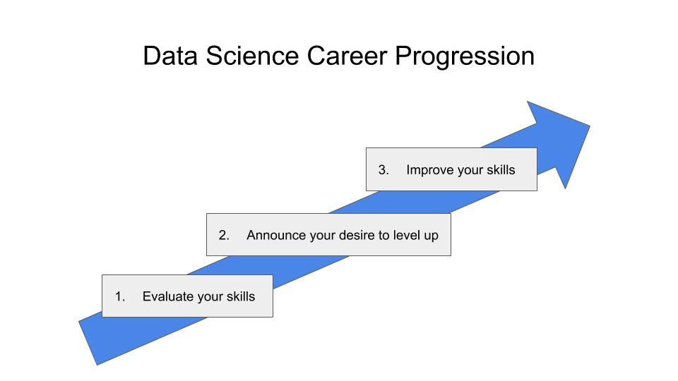
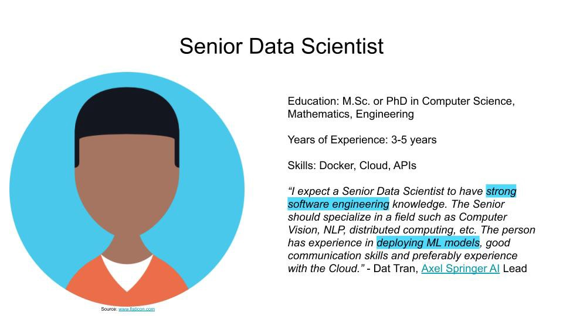
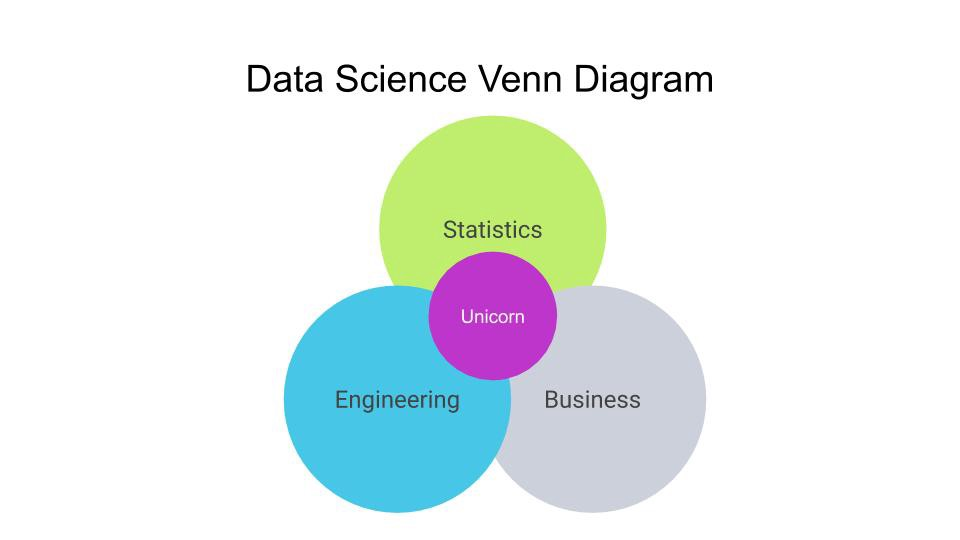
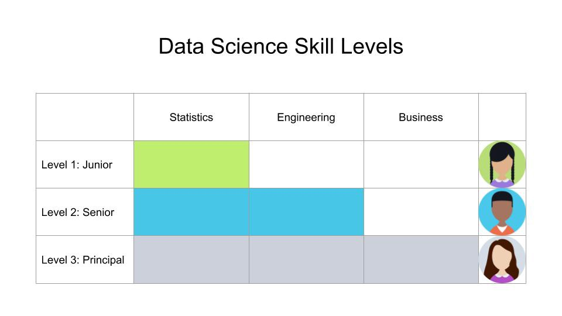

这篇文章延续了正在进行的一系列培训数据科学家的知识，使其变得精通业务。 该系列旨在帮助您提高整体数据科学技能。 如果您喜欢这种格式，请在LinkedIn或Medium上关注我，以获取最新的文章。

> Photo by Mirko Blicke on Unsplash

# 重要要点

导航数据科学职业级别很有趣。 请记住以下关键要点：
+ 初级数据科学家具有良好的统计技能
+ 高级数据科学家擅长将模型投入生产
+ 首席数据科学家知道如何创造业务价值
+ 要升级，评估您的技能，宣布您对进步的渴望并致力于出色的技能

在不同的数据科学职业级别中存在细微差别。 例如，SébFoucaud宁愿在Junior Data Scientists中寻找强大的工程技术，而不是数学技能。 一些高级数据科学家可能会发现他们对建立可伸缩数据管道和过渡到数据工程角色的热情。 一些首席数据科学家喜欢发展技术专长，而另一些则很高兴专注于业务技能。 无论您采取哪种职业道路，围绕数据科学专业知识的三个主要领域发展自己的技能将使您走得更远。
# 提升您的数据科学职业

无论您是想进入1.0级的Data Science Career游戏，还是要升级到更高的级别，都没有关系。 请采取以下步骤，使您的下一个职业发展。

## 1.评估你的技能

第一步，将您的技能与数据科学技能列表进行比较。 您的统计能力如何？ 您的工程技术水平如何？ 您的业务情况如何？
## 2.计划您的促销

许多公司都有年度晋升周期以提升其员工。 Facebook产品设计副总裁朱莉卓（Julie Zhuo）推荐您，首先要获得晋升，使自己的晋升愿望得到提升。 在晋升周期开始时，说明您想将职业发展为经理。 询问您的经理，她如何评价您当前的技能水平，以及期望达到下一个数据科学职业水平的条件。
## 3.提高你的技能

在您分析了技能并宣布希望升职之后，就该提高您的技能了。

> Photo by Samuel Zeller on Unsplash

你想闯入人工智能吗？ 然后深入了解统计模型，并学习如何解决结构化数据集的问题。 您想进入3.0级吗？ 确保掌握数学，工程和业务技能。 有了这些要点，您就做好了与经理进行促销谈判的准备。
# 首席数据科学家-Endgame Level 3.0

首席数据科学家是数据科学团队中经验最丰富的成员。 她拥有5年以上的经验，并且精通各种类型的数据科学模型。 她了解将模型付诸实践的最佳实践。 她知道如何高效地编写代码，并且潜伏着寻找具有高影响力的业务项目。

除了她无可挑剔的工程技能和对所使用的科学模型的深刻理解之外，她还牢牢地了解公司所从事的业务。她拥有使用Data Science影响业务基准的记录。

首席数据科学家在编写一行代码之前，需要对正在解决的业务问题有很好的了解。 这意味着，他们需要具备在实施之前验证想法的能力。 这种方法提高了数据科学项目的成功率。 — eBay AI产品负责人Adnan Boz
## 他们做什么

首席数据科学家负责创建高影响力的数据科学项目。 在与利益相关者的密切协调下，她负责领导一个潜在的跨职能团队，为特定问题提供最佳解决方案。 因此，从1.0和2.0级开始，她的领导能力得到了发展。 首席数据科学家担任来自不同部门的产品经理的技术顾问。 凭借在主要数据科学领域的丰富经验和技能，她成为任何项目的极有价值资产。
## 他们不做什么

在讨论有关所需技能的讨论时，首席数据科学家没有责任招募新的团队成员。 尽管她了解公司的业务并提出了具有影响力的新产品，但产品经理仍负责市场采用。 她还领导团队，但是职业发展决定仍由团队领导做出。

首席数据科学家应独立于数据科学负责人指导项目。 期望此人具有首要的领导技能，因此，重要的是，此人应保持清晰的沟通，善解人意并具有良好的视线。 -Dat Tran

首席数据科学家已经了解了为什么产品会失败，从而成功推动了新项目。 她是产品讨论的重要贡献者，并且喜欢为公司提供有关Data Science的教育。 凭借在交付具有影响力的数据科学解决方案方面的经验，她是数据科学部门中最有价值的资产。

> Photo by Val Vesa on Unsplash

现在，您已经看到了数据科学家从1.0级到2.0级到3.0级的不同期望，让我们了解如何利用这些知识来促进自己的职业生涯。
# 资深数据科学家-达到2.0级

该高级数据科学家已经担任初级数据科学家，软件工程师或完成博士学位。 他在该领域具有3-5年的相关经验，编写可重用的代码，并在云环境中建立了弹性的数据管道。

高级数据科学家应该能够解决数据科学问题。 优秀的候选人具有从过去的数据科学经验中获得的深刻见解。 我还将更深入地研究他们编写生产代码的能力。 —凯恩·卡坦福鲁什

公司喜欢雇用高级数据科学家，因为他们以合理的薪水提供了巨大的价值。 他们比初级数据科学家更有经验，因此省去了代价高昂的新手错误。 它们也没有首席数据科学家贵，但仍有望在生产中交付数据科学模型。 这是一个非常有趣的关卡，已经超过了1.0级，但仍有发展到3.0级的空间。
## 他们做什么

高级数据科学家精通将数学模型投入生产的艺术。 当首席数据科学家或业务经理分配任务时，高级数据科学家以构建结构良好的产品而感到自豪。 他避免了模型中的逻辑缺陷，怀疑系统性能是否良好，并为正确准备数据感到自豪。 高级数据科学家指导初级数据科学家，并向管理层回答业务问题。
## 他们不做什么

预计高级数据科学家不会领导整个团队。 由于新产品的想法是由经验更丰富的同事和经理产生的，因此高级数据科学家没有责任提出新产品的想法。 尽管高级数据科学家了解他们所构建产品的详细信息，但他们并不希望他们了解所有数据驱动产品的总体架构。 与1.0级数据科学家相比，2.0级数据科学家在统计方面和技术水平方面更高，但偏离了3.0级的非趣味业务部分。

高级数据科学家必须能够将其代码投入生产（在数据工程师的一些支持下）。 老年人应该能够完成独立完成的项目。 — Xing数据科学副总裁SébastienFoucaud

高级数据科学家通过其模型产生的影响来衡量。 他对统计模型的内部运作以及如何实现它们有很好的直觉。 他正在更好地了解公司的业务，但预计目前尚无法为业务问题提供解决方案。

> Photo by Carl Raw on Unsplash

既然我们已经研究了Level 2.0，现在让我们看看最终的Level 3.0是什么样子。
# 初级数据科学家-进入1.0级

典型的初级数据科学家是一名年轻毕业生。 流行的研究领域包括计算机科学，数学或工程学。 一位初级数据科学家具有0–2年的工作经验，并且熟悉使用Python或R创建带有结构化数据集的原型的经验。她参加过kaggle竞赛，并拥有GitHub个人资料。

初级数据科学家可以为公司提供巨大的价值。 他们刚参加在线课程，可以立即提供帮助。 他们通常是自学成才的，因为很少有大学提供数据科学学位，因此显示出巨大的决心和好奇心。 他们对所选领域充满热情，并渴望了解更多。 初级数据科学家擅长于原型解决方案，但仍缺乏工程和业务思维的能力。

初级数据科学家应该对机器学习充满热情。 您可以通过对开源项目做出贡献或参与kaggle挑战来展示自己的热情。 — Axel Springer AI总监Dat Tran
## 他们做什么

如果公司正在招聘初级数据科学家，通常已经有一个数据科学团队。 然后，该公司正在寻求帮助，以使经验丰富的同事更轻松地生活。 这涉及快速测试新想法，调试和重构现有模型。 您将与团队作为陪练伙伴讨论想法。 您会提出如何做得更好的新想法。 您对代码负责，并不断努力提高代码质量和影响力。 您是一个出色的团队合作者，不断寻求支持您的队友构建出色数据产品的使命。
## 他们不做什么

初级数据科学家没有设计复杂产品解决方案的经验。 Ergo，她在一个团队中工作，将数据科学模型投入生产。 由于初级数据科学家刚刚加入公司，因此她没有沉迷于公司的业务。 因此，预计她不会提出新产品来影响基本业务方程式。 但是，始终期望学习和提高技能的愿望。

我对初级数据科学家能够完成一项重要项目的能力感兴趣。 所谓完成，是指该项目是由个人（或一个小组）从头到尾完成的，最终达到完全冲洗的产品状态。 我发现它与数据科学家领导这项工作的能力有关。 — Kian Katanforoosh，斯坦福大学CS讲师deeplearning.ai的创始成员

如果您擅长作为初级数据科学家，那么您将具有理解数据科学模型的强大背景。 您表现出无限的好奇心，以了解您的工程技术和公司业务以提高技能。

下一级别是什么样的？ 接下来，让我们了解高级数据科学家。
# 数据科学技能矩阵

预计数据科学家将在三个领域拥有知识：统计，工程和业务。 但是，您不应该一开始就掌握所有这三个领域。 寻找入门级职位时应重点关注哪些技能？ 随着职业发展，哪些技能变得越来越重要？

下图显示了从1.0到3.0的每个数据科学水平的市场预期。 结果基于我在该领域的个人经验以及与斯坦福大学，eBay，Axel Springer和Xing的专家和影响者的对话。 为避免混淆，我们将职位称为1.0到3.0级。

让我们在下面详细分析这些职位的期望。
# 成为3.0级数据科学家
## 想要成为初级，高级或首席数据科学家？ 找出导航Data Science Career游戏所需要做的事情。

公司在三个级别上招聘数据科学家：初级，高级或负责人。 无论您是刚开始使用Data Science还是想转行，您都将不可避免地身处其中之一。

> Photo by Kelly Sikkema on Unsplash

这篇文章旨在阐明每个数据科学职业级别的期望和范围之外的内容。 尽管公司可能具有不同的职位，但该职位提供了一个总体基准。 此外，该帖子以实践技巧作为结尾，介绍了如何为转入AI或当之无愧的晋升做好准备。

让我们升级。 🎚
