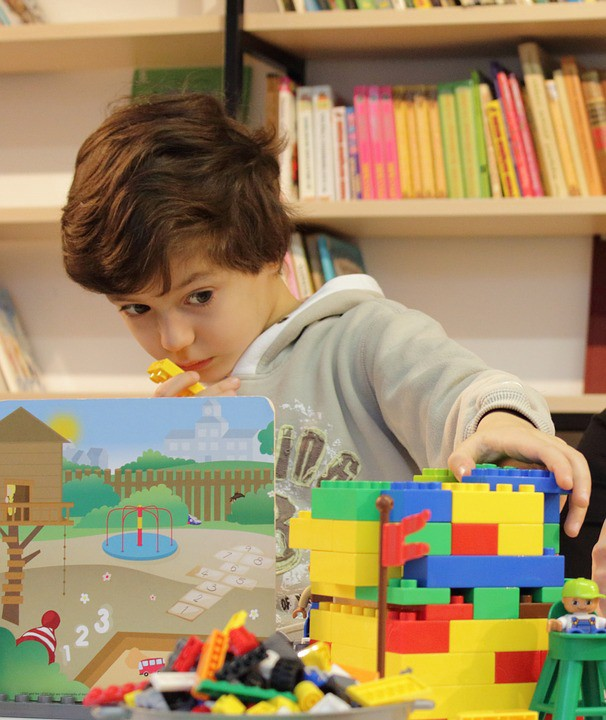

# 成为软件架构师


所以，是的，我是一名“软件架构师”-首席工程师。 我喜欢我的工作。 它具有挑战性，很有趣，而且很痒。 我也有点难过，因为我很难编写自己想要的代码。 我必须始终努力寻找时间来获取代码并构建东西。

我并没有打算要这份工作。 我刚刚开始工作，随着时间的推移，我发现了这个角色，发现自己喜欢它。 因此，当对发展事业有兴趣的年轻工程师问我到这里做了什么时，我发现自己有些迷惑。 我怎么到这里了？
# 物以类聚，人以群分

在讲这个故事之前，我想强调一下，每个人的道路都是不同的。 对我有用的东西可能对您不起作用。 实际上，对您有用的可能会大不相同。

我与很多主要工程师一起工作，每个人都带来了截然不同的风格和技能。 有些人确实擅长沟通，引导方向，提出高级设计和策略。 其他人在一个非常专业的领域具有深刻的理解，并能够在该特定领域取得奇迹。 有些人是伟大的领导者和导师。 因此，仅仅因为我遵循了某个角色的特定道路，并不意味着您需要遵循相同的道路。 我会说，总的来说，找到您的热情，并对此有所帮助。

另一个重要方面是，我很荣幸–我是一位白人男性，在美国受过良好教育的父母中长大。 因此，我在成长中拥有优势，并且在我的职业生涯中遇到了不利因素。 当我大声说出来时，人们不会认为我是在“生气”，“侵入”或“烦人”。人们通常会给我带来疑问的好处。 我不必处理体制歧视。 如果您处于少数地位，我怀疑这是完全不同的故事，您可能需要一个非常不同的策略。

综上所述，我注意到我已经做了并将继续做一些事情，也许这是帮助我获得这一角色的一部分。
# 寻找潜在的主题和模式


当我发现自己或团队正在为劣质代码或困难的流程而苦苦挣扎，或者事情要做的时间比他们应做的要长得多时，我发现自己在问为什么？ 我们怎样才能使它更好？ 我对尝试理解根本原因充满热情。 我没有耐心接受事情的现状。

我从未真正正式练习过“为什么五个”技巧，但这实际上就是我所做的。

在出色的书《系统中的思考》中，唐纳拉·梅多斯（Donella Meadows）鼓励我们远离仅仅注意到发生在我们身上的一系列事件，以便更深入地了解和理解导致这些事件发生的潜在结构。 当您了解结构时，您就会发挥作用，而不仅仅是对事件做出反应。 这篇博客文章很好地总结了如何看待一系列事件中的结构。
# 阅读


我对梅多斯女士的书的引用将我带到了下一点。 我们不是孤立生活。 如果我们可以利用它，那么那里就有很多智慧。

我对某些书籍或文章的记忆使我完全睁开了对新思维的视野。 我仍然记得阅读Werner Vogels关于最终一致性以及如何解锁我们如何在网络规模上管理数据的文章。 或者当我阅读Jay Kreps关于基于日志的体系结构的开创性文章时，意识到有一种干净，可扩展，分离的方式在系统组件之间集成数据。 或者，当有人将我的Eric Evans关于域驱动设计的书递给我时，它使用户驱动域建模的方法得以实现。

在寻求理解行为的结构和方式的过程中，我阅读的书籍和文章一直是我旅途中的重要里程碑。 我从他们那里学习和实践的内容已经成为我工具箱中的关键工具。

除非您学习和改变，重击学校并不是真正的学校，阅读使我成为可能。

那么，您如何找到这些书籍和文章？ 对我而言，最有效的方法是倾听我所尊重的人，并追踪他们与原始资料之间的链接。 我主要是通过策划Twitter上我所尊重和信任的人们的饲料来实现的。 仍然有很多噪音，Twitter已经开始以烦人的方式为我“整理”我的提要，但是通常这对我来说效果最好。 每天我都会在Twitter上查看几次，在所有的喧闹声和食物图片中，我得到了许多很棒的新信息，这些新信息使我的知识不断发展。
# 写作


在成为软件工程师之前，我想成为一名科学作家。 我一直很喜欢写作。 当我长大时，我们旅行了很多次，还有我的父母，然后是我的兄弟姐妹，我会互相打长信。

对写作的热爱在我的软件职业生涯中为我提供了很好的服务，并且我认为这使我得到了管理层和我的同事的认可和尊重。 许多软件开发人员不是作家，他们喜欢使事情正常运转，而不是撰写文章。 但是，在您的职业生涯的某个特定阶段，如果您无法写下并解释自己的想法，并利用这些想法与他人进行交流，将会使您难以晋升。

写作不是每个人都自然而然的事，这对我来说总是很容易的。 因此，也许我不是提供建议的最佳人选。 但是在指导其他人之后，我认为最好的办法就是做到这一点。 寻找一种方式来留出时间定期进行一些技术写作。 另外，顺便说一句，阅读可以提高写作水平，因此请参见上文。

哦，并且，当您编写时，请使用图表和图像。 人们在视觉上吸收和理解概念方面要比直接写作要好得多。 Lucidchart是你的朋友。
# 教学


每当我真的想学习一些东西时，我都会宣布要发表一个演讲。 它每次都起作用。 此外，就有趣的主题进行演示有助于使您和您的想法对其他人可见，这总是有用的。

与写作一样，这样做会使您变得更好。 这样做的前几次需要胆量，但是随着您做的越来越多，它变得舒适甚至有趣。
# 做脏事


所有这些思考，阅读和交流都很棒，但是您还必须采取行动来支持它。 最终，这才是您所有想法的基础和现实，并赢得了尊重，这是成为领导者的关键方面。

进行其他人不想做的项目或重构。 努力与团队一起组织新的实践。 升级没有其他人要升级的库。 构建该自动化脚本以消除团队中的手动工作。 采取主动和肮脏的工作表明了自己的承诺并受到关注。
# 祝好运！

我认为成功是运气，辛勤工作，挫折和突飞猛进的结合。 我知道在某个时候我意识到我喜欢建筑师的角色，但是我并没有制定一个宏伟的计划。 它像其他任何东西一样进化。

我们都有自己的旅程。 愿您充满变革，学习和成就！
```
(本文翻译自David Van Couvering的文章《Becoming a software architect》，参考：https://medium.com/@david.vancouvering/becoming-a-software-architect-6c5ca8508422)
```
