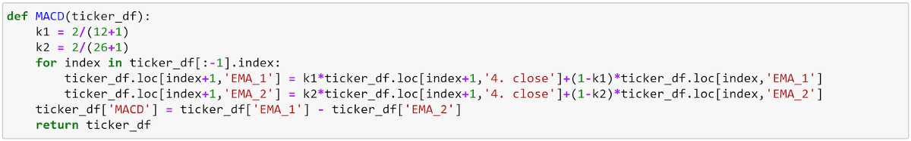
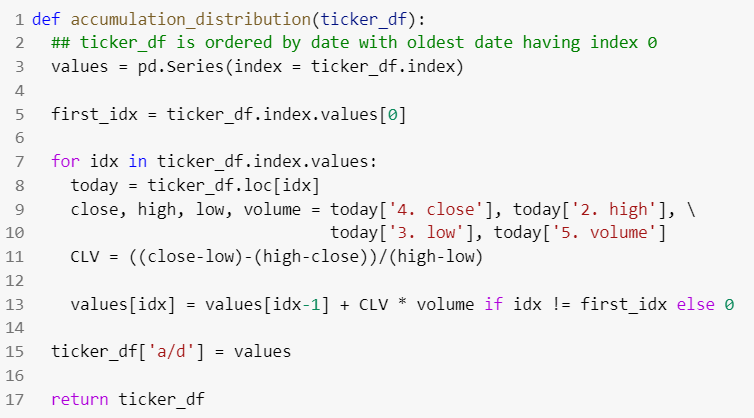
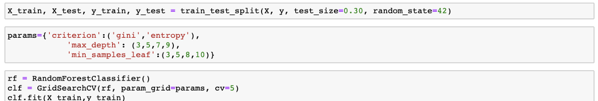
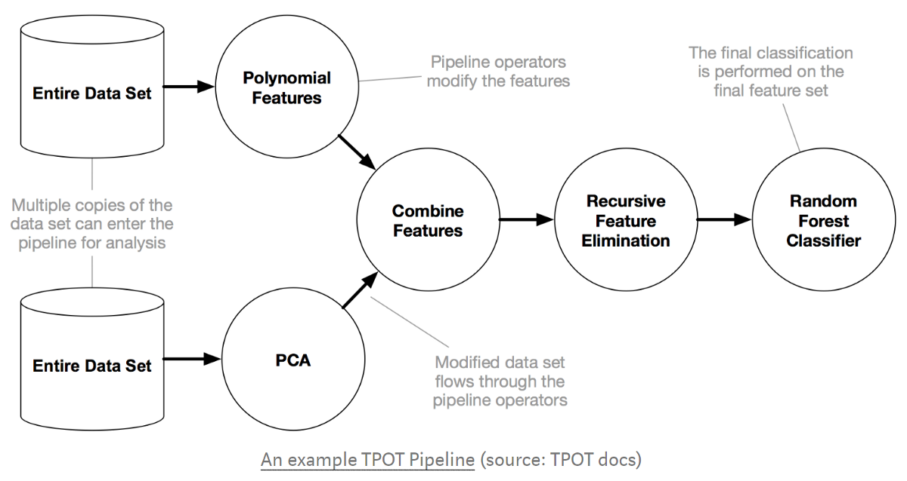

# 机器学习可以预测股市吗？
## 我们进行测试，看看技术是否足够强大以解决金融市场的奥秘


如果正确，明智地进行投资，美国股市会产生惊人的回报。 遵循“两个西格玛”和“城堡”之类的定量投资公司的步骤，我们有兴趣知道是否可以使用机器学习来预测股价走势。
# 数据

我们使用Alpha Vantage API提取了五只ETF（QQQ，TQQQ，VTI，IWM，SPY）的每日价格数据，并以开盘，最高，最低，收盘和成交量开始。

# 特征生成

我们决定在python中手动创建函数，以计算交易中一些使用频繁的技术指标：Chaikin A / D，BBAND，CCI，EMA，MACD，OBV，RSI，SMA和STOCH。
## 简单移动平均线

移动平均线用于平滑数组中的数据，以帮助消除噪音并确定趋势。 从字面上看，简单移动平均线是移动平均线的最简单形式。 每个输出值是前n个值的平均值。 在简单移动平均线中，时间段中的每个值均具有相等的权重，该时间段以外的值不包括在平均值中。 这使得它对数据的最新更改的响应较慢，这对于过滤掉这些更改很有用。

## 指数移动平均线

指数移动平均线是技术分析的主要内容，并用于无数技术指标中。 在简单移动平均线中，时间段中的每个值均具有相等的权重，该时间段以外的值不包括在平均值中。 但是，指数移动平均值是包括所有数据在内的累积计算。 过去的值对平均值的贡献减小，而最近的值对平均值的贡献更大。 这种方法使移动平均值对数据的变化更加敏感。

## 移动平均收敛散度

移动平均收敛散度（MACD）是两个指数移动平均数之间的差。 信号线是MACD的指数移动平均线。

MACD信号趋势变化并指示新趋势方向的开始。 高值表示超买情况，低值表示超卖情况。 价格差异表明当前趋势已结束，尤其是如果MACD处于极高或极低的值时。 当MACD线穿过信号线上方时，将产生买入信号。 当MACD在信号线下方穿过时，会产生卖出信号。 为了确认信号，MACD对于买入应该高于零，对于卖出应该低于零。

MACD的时间周期通常为26和12。但是，该函数实际上使用的指数常数为0.075和0.15，这更接近25.6667和12.3333周期。 要使用MACD内置的时间段以外的其他时间段创建类似的指标，请使用价格振荡器功能。

## 随机振荡器

随机指标测量收盘价相对于近期交易区间的收盘价。 值范围从零到100。超过75的％D值表示超买状态； 低于25的值表示超卖情况。 当快速％D超过缓慢％D时，这是一个买入信号； 当它穿过下方时，这是一个卖出信号。 通常认为Raw％K太不稳定，无法用于分频信号。

## 积累/分配线

累积/分配行类似于平衡时的交易量（OBV），该交易量基于收盘价是否高于上一个收盘价而将交易量乘以+ 1 / -1。 但是，“累积/分配”指示器会将音量乘以关闭位置值（CLV）。 CLV基于问题在单个条形内的移动，可以为+ 1，-1或零。

通过在指标相对于价格的方向上寻找差异来解释“累积/分配线”。 如果累积/分配线呈上升趋势，则表示价格可能跟随。 同样，如果在价格仍在上涨（或下降）时累积/分配线变平，则表示价格即将趋于平缓。

## 布林乐队

布林带由三行组成。 中间带是典型价格（TP）的简单移动平均线（通常为20个周期）。 上带和下带是中带上方和下方的F标准偏差（通常为2）。 当价格的波动性更高或更低时，波段分别变宽和变窄。

布林带本身不会产生买入或卖出信号； 它们指示超买或超卖情况。 当价格接近上限或下限时，表明可能即将发生反转。 中带成为支撑或阻力位。 上限和下限也可以解释为目标价格。 当价格从较低的区域反弹并越过中间的区域时，则较高的区域成为价格目标。

## 平衡量

平衡量（OBV）是上下量的累积总计。 当收盘价高于上一个收盘价时，该交易量将被添加到运行总计中；当该收盘价低于上一个收盘价时，将从运行总额中减去该交易量。

要解释OBV，请寻找随价格移动或先于价格移动的OBV。 如果价格在OBV之前移动，那么这是未经确认的移动。 OBV中出现一系列上升或下降的趋势，表明趋势很明显。 如果OBV持平，则市场没有趋势。

# 特征生成后的数据

# 我们的假设

我们最初希望使用来自所有ETF（QQQ，TQQQ，SPY，VTI，IWM）的数据建立一个单一模型，以预测在交易所交易的股票的长期价格趋势。 如果未来20个交易日的回报率> 3％，我们将标签设置为1，否则设置为0。

但是，我们发现每个ETF之间的数据差异很大，因此我们决定需要为每个ETF建立单独的模型。 我们最终仅使用QQQ ETF数据集来构建模型。
# 实验1（20天的回报率> 3％作为标签）
## LSTM：测试AUC 0.476


## MLP神经网络：测试AUC 0.577


## 随机森林：测试AUC 0.917




# 太好了不能成为现实-一个虚假的希望

使用QQQ数据集的最佳模型得出的AUC为.917。 我们以为我们想出了一种预测股市的方法。 但是，情况并非如此，因为我们发现模型存在重大缺陷。

众所周知，在机器学习中，您需要重新整理数据集以创建训练和测试集。 这样做是有必要的，因为您希望测试集中的数据来自与训练数据相同的分布。 但是，由于历史库存数据是随时间变化的，这意味着随后几天的数据要等到随后几天出现后才存在，对我们的数据进行混排将意味着训练数据集将可以访问将来实际设置的某些数据。 例如，假设，如果我们要使用具有2018年数据的数据集在2017年训练模型，则实际上不能使用此训练数据集来训练模型，因为在2017年还不存在2018年的数据。 因此，在创建训练和测试数据集时，我们无法洗牌。

对于下一个模型，我们使用2010年至2016年的数据作为训练集，并使用2017年至2019年的数据作为测试集。 此分布拆分也很有用，因为它基本上使我们可以“模拟”我们的模型如何处理将来的数据。

令人遗憾的是，使用相同的随机森林分类器，该模型的AUC得分显着下降至0.44。
## 随机森林：测试AUC 0.440


# 重新思考标签分配


正如您在此处的样本数据集中看到的那样，所有这些行都有非常相似的20-MA，分别是打开和关闭。 如果1/4/2019之后的20天增加了> 3％，那么1/4/2019左右的那一天也将增加> 3％，对于任何股票来说都是如此，标签中的决定因素将上升 通常在20天之内无法确定20天。 确定记录在其20个未来交易期间中有重叠期间的天数。 在这种情况下，如果我们提取1/6/2019作为测试集并对其进行训练，则该模型将确定为测试数据分配一个标签，因为其所有功能都与日期相似 它形成一个集群。 如前所述，这种方法的另一个问题是该模型允许训练集使用将来的数据进行预测。 例如，训练集包括1/7/2019 -1/11/2019，以预测1/6/2019，这在现实世界中是不可能做到的。


当我们不对原始数据集进行混洗时，以及当我们使用以后的日期作为测试集时，这将成为一个问题。 在这种情况下，训练集中的收盘价徘徊在每股20美元左右，但是由于我们使用2019年作为测试集，因此价格差异很大，因此该模型在为它们分配正确的标签方面表现不佳，尤其是 考虑我们的记录的特征，这些特征具有训练集中不存在的一系列值。


我们想出的解决方案是将标签更改为每日股价变动。 如果第二天的收盘价大于当天的收盘价，则标签为1。这里，第二天的一天的股价是否上涨彼此独立，这解决了我们形成集群和查看未来数据的问题。 。
# 实验2（第二天价格上涨/下跌作为标签）
## 1. TPOT


参考文献：

https://towardsdatascience.com/tpot-automated-machine-learning-in-python-4c063b3e5de9

https://epistasislab.github.io/tpot/using/

TPOT是一个开放源代码的AutoML python软件包，它通过特征工程和模型选择的许多不同组合来运行。 TPOT自动创建许多管线，这些管线包括不同的特征工程方法（PCA，MaxAbsScaler，MinMaxScaler等）以及具有各种超参数混合的不同模型。

TPOT的性能在很大程度上取决于管道的数量以及允许它运行的时间。 管道总数等于POPULATION_SIZE + GENERATIONS x OFFSPRING_SIZE，可以在TPOT的参数中确定。


由于我们只让TPOT运行了150条管道，只用了不到15分钟的时间，所以性能并不理想：TEST AUC 0.509。 但是，如果有足够的时间（数十小时甚至几天），TPOT可能是一种非常强大且容易的工具，可以产生出色的结果。

此外，TPOT会自动存储搜索到的最佳管道，并允许用户将这些结果导出为.py文件。 如您所见，在我们的案例中，TPOT对我们的数据执行了PCA，并选择了GaussianNB作为最佳分类模型。

## 2. XGBoost

使用XGBClassifier，除了学习率，最大深度，n_estimators和子样本外，我们无需进行其他配置。 使用交叉验证和AUC评分标准，我们优化了超参数。 最后，我们使用优化的超参数在X_train和y_train上建立最终模型。 测试仪的准确度（不是AUC）为50.5％


使用XGBClassifier，我们获得0.478测试集AUC分数

## 3.随机森林

使用随机森林分类器，我们使用蛮力网格搜索交叉验证在值的范围内调整了超参数。 最佳参数显示为max_depth = 3和min_samples_leaf = 3。


使用该随机森林分类器，我们获得0.519测试集AUC得分

## 4. Google AutoML

随着AutoML的日益普及，我们决定将数据集输入到Google Cloud AutoML中，以查看它是否可以预测比我们更好的AUC分数。 Google AutoML具有非常友好的用户界面，可在您上传数据集后自动吐出一些统计信息。


在像我们这样的分类项目中，Google AutoML允许用户选择不同的性能指标来优化最终模型。


那么Google AutoML的表现如何？ 经过仅一个小时的培训，它的AUC值为0.529，是迄今为止我们过程中最高的。 重要的是要注意，具有随机森林的AUC达到0.519，仅比Google AutoML低0.01。

# 结论与见解

技术分析的弱点：在金融界，技术分析（使用历史股价预测未来股价）已被证明是徒劳的。 可以在进一步分析中考虑其他功能：
+ 推文废弃：对推文的情绪分析
+ 收益电话会议记录：分析收益电话会议中高管的语气； 评估主管/分析师正在讨论的主题
+ 卫星数据（油井上的卫星图像可用于预测油价）

击败股市的唯一真实方法就是拥有更多信息，例如访问未来数据或提前知道季度收益结果，从而导致不可能或违法行为。 使用技术指标可以告诉您部分情况，但预测第二天的库存方向过于随机，并且受外界因素的影响，无法创建一个可靠的模型。

关键要点：机器学习项目只有在用于训练模型的数据和模型将来遇到的数据来自同一分布的情况下才有用且有效，而在独立且动荡的股市每日收益中使用则不是这种情况 作为标签。
# 贡献者

约瑟夫·钦（Joseph Chin），犹他州奥斯汀MSITM ’20：joseph.chin@utexas.edu

郝伦Colin Chu，UT奥斯汀MSITM ’20：colinchu@utexas.edu

犹他州威尔希尔·刘（Wilshire Liu），奥斯汀MSITM二十：wilshire.liu@utexas.edu

布莱恩·史密斯（Brian Smith-Eitches），犹他州奥斯汀MSITM ’20：smitheitches@gmail.com

卓文，犹他州奥斯汀MSITM ’20：wenzhuo@utexas.edu
```
(本文翻译自Wilshire Liu的文章《Can Machine Learning Predict The Stock Market?》，参考：https://towardsdatascience.com/can-machine-learning-predict-the-stock-market-8562be3b3d05)
```
