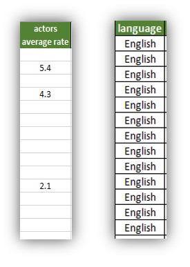
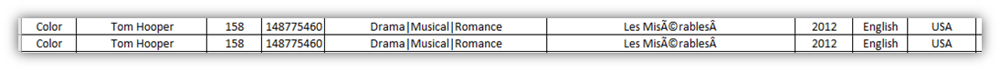

# 用于清理数据的Python代码
```
{
 "cells": [
  {
   "cell_type": "code",
   "execution_count": 1,
   "metadata": {},
   "outputs": [],
   "source": [
    "# Import python libraries\n",
    "import numpy as np\n",
    "import pandas as pd\n",
    "%matplotlib notebook"
   ]
  },
  {
   "cell_type": "code",
   "execution_count": 2,
   "metadata": {},
   "outputs": [],
   "source": [
    "# Import data\n",
    "dataset = pd.read_csv('movie_sample_dataset.csv', encoding='utf-8')\n",
    "\n",
    "# Drop useless attributes\n",
    "dataset.drop(['color','language'], axis=1, inplace=True)\n",
    "\n",
    "# Handle text attributes\n",
    "dataset['director_name'].fillna('', inplace=True)\n",
    "\n",
    "# Handle numeric attributes\n",
    "dataset['gross'].fillna(0, inplace=True)\n",
    "# dataset['gross']=pd.to_numeric(dataset['gross']).astype('float64')\n",
    "dataset['budget'].fillna(0, inplace=True)\n",
    "\n",
    "# Unify countries names\n",
    "dataset['country']=dataset['country'].str.upper()\n",
    "dataset['country'] = np.where(dataset['country']=='UNITED STATES','USA', dataset['country'])\n",
    "\n",
    "# Bad data entry\n",
    "dataset['director_name'] = np.where(dataset['director_name']=='N/A','', dataset['director_name'])\n",
    "dataset['director_name'] = np.where(dataset['director_name']=='Nan','', dataset['director_name'])\n",
    "dataset['director_name'] = np.where(dataset['director_name']=='Null','', dataset['director_name'])\n",
    "dataset['movie_title'] = dataset['movie_title'].str.replace('Â', '')\n",
    "\n",
    "# Handling outliers\n",
    "dataset[\"gross\"]=dataset[\"gross\"].astype(float)\n",
    "dataset[\"duration\"]=dataset[\"duration\"].astype(float)\n",
    "dataset[\"budget\"]=dataset[\"budget\"].astype(float)\n",
    "\n",
    "dataset['duration'] = np.where(dataset['duration']<=10,0, dataset['duration'])\n",
    "dataset['duration'] = np.where(dataset['duration']>300,0, dataset['duration'])\n",
    "dataset['imdb_score'] = np.where(dataset['imdb_score']<=0,0, dataset['imdb_score'])\n",
    "dataset['title_year'] = np.where(dataset['title_year']<2010,0, dataset['title_year'])\n",
    "\n",
    "# Normalize data\n",
    "\n",
    "# spliting actors\n",
    "actor_list = dataset[\"actors\"].str.split(\",\", n = 2, expand = True) \n",
    "dataset[\"actor1\"]= actor_list[0] \n",
    "dataset[\"actor2\"]= actor_list[1] \n",
    "dataset[\"actor3\"]= actor_list[2] \n",
    "dataset.drop(columns=['actors'], inplace=True)\n",
    "\n",
    "# Adding new feature\n",
    "\n",
    "# Add a new metric GOB(Gross over Budget)\n",
    "dataset['GOB'] = dataset.apply(lambda row: row['gross']/row['budget'] if row['budget']!=0 else 0, axis=1)\n",
    "top_GOB=dataset.sort_values('GOB',ascending=False).head(15)\n",
    "\n",
    "# dataset['title_year'] = dataset['title_year'].apply(np.int64)\n",
    "# dataset['duration'] = dataset['duration'].apply(np.int64)\n",
    "\n",
    "dataset.to_csv('output_IMDB.csv')"
   ]
  }
 ],
 "metadata": {
  "kernelspec": {
   "display_name": "Python 3",
   "language": "python",
   "name": "python3"
  },
  "language_info": {
   "codemirror_mode": {
    "name": "ipython",
    "version": 3
   },
   "file_extension": ".py",
   "mimetype": "text/x-python",
   "name": "python",
   "nbconvert_exporter": "python",
   "pygments_lexer": "ipython3",
   "version": "3.6.3"
  }
 },
 "nbformat": 4,
 "nbformat_minor": 2
}

```

在python中读取CSV文件

在下一行中，我们使用read_csv命令读取IMDB子数据集。
```
dataset = pd.read_csv(‘movie_sample_dataset.csv’, encoding=’utf-8')
```

首先，我们删除无用的列：
```
dataset.drop([‘color’,’language’], axis=1, inplace=True)
```

在下一步中，我们将两个数字列的空值填充为：总额和预算为0。
```
dataset[‘gross’].fillna(0, inplace=True)dataset[‘budget’].fillna(0, inplace=True)
```

然后，我们统一其他列的值，例如国家/地区，导演姓名或电影名称：
```
# Uppercase all the country valuesdataset['country']=dataset['country'].str.upper()dataset['country'] = np.where(dataset['country']=='UNITED STATES','USA', dataset['country'])# Bad data entrydataset['director_name'] = np.where(dataset['director_name']=='N/A','', dataset['director_name'])dataset['director_name'] = np.where(dataset['director_name']=='Nan','', dataset['director_name'])dataset['director_name'] = np.where(dataset['director_name']=='Null','', dataset['director_name'])dataset['movie_title'] = dataset['movie_title'].str.replace('Â', '')
```

如上所述，解决离群值的一种方法是用适当的数字填充对应的行。 例如，我们数据集中的电影时长不能少于10分钟或超过300分钟。 对于这些情况，我们用零值填充单元格。
```
dataset['duration'] = np.where(dataset['duration']<=10,0, dataset['duration'])dataset['duration'] = np.where(dataset['duration']>300,0, dataset['duration'])dataset['imdb_score'] = np.where(dataset['imdb_score']<=0,0, dataset['imdb_score'])dataset['title_year'] = np.where(dataset['title_year']<2010,0, dataset['title_year'])
```

为了规范化数据，我们将参与者分成三个不同的属性，并按如下所示删除实际列：
```
actor_list = dataset["actors"].str.split(",", n = 2, expand = True) dataset["actor1"]= actor_list[0] dataset["actor2"]= actor_list[1] dataset["actor3"]= actor_list[2] dataset.drop(columns=['actors'], inplace=True)
```

最后，我们定义一个称为GOB的新指标，该指标显示每部电影的预算超支：
```
# Add a new metric GOB(Gross over Budget)dataset['GOB'] = dataset.apply(lambda row: row['gross']/row['budget'] if row['budget']!=0 else 0, axis=1)top_GOB=dataset.sort_values('GOB',ascending=False).head(15)
```

并将结果保存在另一个csv文件中以进行验证：
```
dataset.to_csv('output_IMDB.csv')
```

感谢您阅读本文！ 我可能还会写另一篇有关分析以及可视化此干净数据集的文章。

## 标准化值

为了最大程度地减少异常，避免数据修改问题并简化查询，我们应该标准化数据集中的数据。 属性应包含原子值，而不应包含多个值的组合。 在我们的示例中，一列中存储了三个参与者。 为了规范化此列，我们应该将它们分为三个属性（例如Actor1，Actor2和Actor3）。

数据标准化的另一个步骤可以是向数据集添加新指标。 例如，我们可能希望向表中添加一个名为“预算总额”的指标，以便为最终分析提供一个计算指标。
## 资料验证

清理数据后，应将最终数据集与原始数据集进行比较，以确保数据准确性。 此步骤至关重要，因为我们想知道我们是否由于数据清理而丢失数据。

## 标准化价值

数据清理的另一个步骤是使数据标准化。 首先，数据应放置在右列中，并且值具有正确的数据类型。 另外，列中的值应统一。 例如，如果存在日期时间格式的属性，则该列中的所有值均应以相同的格式统一（例如YYYY-MM-dd）。 文本值也应统一，并且文本中的不良字符应得到识别和修复。 例如，如果我们有一个“国家/地区”列，则所有加拿大，加拿大和加拿大都应转换为加拿大或加拿大。
# 数据清理

数据清理是一个科学的过程，用于探索和分析数据，处理错误，标准化数据，标准化数据并最终针对实际数据集和原始数据集进行验证。

> Data cleaning tasks

## 样本数据集

为了执行数据清理，我从IMDB电影数据集中选择了100条记录的子集。 它包括大约20个属性，在我们的分析中减少为12个属性。 数据集可在此处获得。 我使用Python作为一种强大，灵活且开源的语言进行分析。 Python有一组用于数据处理，分析和可视化的库。 但是，您可以选择其他数据分析工具来进行数据清理，例如：Tableau，R，QlickView，SAP，Excel，Apache SPARK等。

> Data cleaning process

## 数据探索

数据清理的第一步是通过探索数据集及其属性来理解数据。 每个属性类型的分析类型可能不同。 下表显示了我们考虑用于其数据类型的数据清理的12个属性。 我将属性分为不同的组：

> dataset’ attributes

+ 标称：属性可以是类似于颜色的类别，可以包含一组受限值（例如，蓝色，红色，棕色，...）
+ 文本：属性可以是自由文本或字符串。
+ 数字：属性可以是数字（例如货币，分数）。

> Missing or repetitive values in columns

## 处理错误

根据错误的类型，我们选择一种特定的策略来处理它。 如果我们缺少一个属性的值或重复值，则可以决定从分析中删除该列。 根据经验，如果超过60％的列包含空值，我们可以删除该列以进行分析。 对于一列的重复值，这是正确的。 如果一列的所有值都相同，则绝对没有用。 在我们的示例中，所选数据集中的所有电影都是英语的，可以将其删除以进行分析。

重复的记录也会误导我们进行精确的分析。 假设我们有以下数字：4,6,8,10。 这些数字的平均值7。 但是，如果我们将另外8个错误地添加到该集合（4,6,8,8,10），则平均值将为7.2，这不等于先前的平均值。 删除数据集中的重复记录是分析中必不可少的步骤。

> Duplicate records


识别数据集中的无效离群值也非常重要，因为它会影响分析结果。 有多种方法可以识别数据集中的异常值。 一种是简单地找到最小和最大数量。 另一种方法是在箱图中可视化数字数据，以查看数据中是否存在异常值。 一些离群值可能是有效的，应该在数据集中进行精确处理（例如健康数据，其中可能包括一些超出范围的数字，并显示出医学检验结果的特定行为）。 筛选无效的离群值或将其填充为默认值或适当的值是在数据分析中面临此问题的另外两个解决方案。

> Outliers can be depicted with box-plots


# 使用Python清理凌乱的数据集

根据图8在2016年进行的一项调查，数据科学家将近60％的时间都花在了清理和整理数据上。 您可以在这里找到调查结果。

> Spent time by data scientists in 2016 survey


现实世界中的数据来自不同的来源，并且可能是不完整的，嘈杂的和不一致的。 可能由于人为错误，集成的单独系统或不断变化的需求而产生脏数据。 不良的数据质量可能导致数据分析结果不准确，并导致错误的决策制定。 在这篇文章中，我打算经历一个数据清理过程，为最终分析准备一个凌乱的数据集。

下图描绘了一组IMDB记录，这些记录是我在此处从IMDB数据源下载的。

> A sample messy dataset


如您所见，数据集中的错误类型可能不同：
+ 离群值：离群值是列中超出范围的数字。 实际上，离群值位于数据集中其他大多数值的外部（图中的红色单元格）。
+ 重复项：数据集可以包含重复的行或记录（图中的紫色行）。
+ 值丢失：由于人为错误或信息丢失（图中的橙色单元格），我们可能会丢失数据。
+ 错误的字符或NULL值：某些值可能包含错误的字符，例如₮或NULL值。 有时，可以使用不同的值（例如N / A或NA或NAN）指定空数据（图中的亮或暗单元格）。
