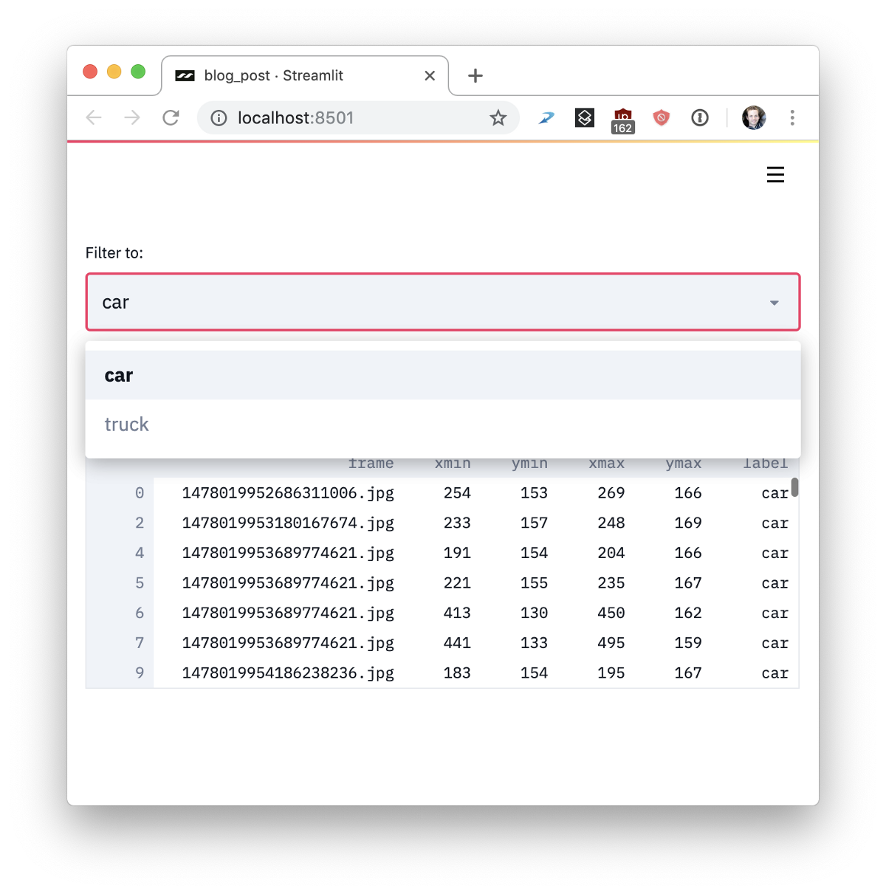

感谢Amanda Kelly，Thiago Teixeira，TC Ricks，Seth Weidman，Regan Carey，Beverly Treuille，GenevièveWachtell和Barney Pell在本文中提供的有益帮助。

参考文献：

[1] J. Redmon和A. Farhadi，YOLOv3：增量改进（2018），arXiv。

[2] T. Karras，T。Aila，S。Laine和J. Lehtinen，《渐进式增长GAN以提高质量，稳定性和变异性》（2018年），ICLR。

[3] S. Guan，《使用新型TL-GAN模型进行受控图像合成和编辑》（2018年），Insight Data Science Blog。

这只是您使用Streamlit可以做的事情的表面。 Streamlit最令人兴奋的方面之一是如何将这些原语轻松地组合成看起来像脚本的复杂应用程序。 关于架构的工作原理和计划的功能，我们还有很多话要说，但我们会保留下来，以备将来之用。

> Block diagram of Streamlit’s components. More coming soon!


我们很高兴能最终与当今的社区共享Streamlit，并看到大家使用它构建的东西。 我们希望您会发现将Python脚本转换为漂亮的ML应用变得轻松而愉快。

在与机器学习团队合作进行自己的项目时，我们意识到这些简单的想法产生了许多重要的好处：

Streamlit应用程序是纯Python文件。 因此，您可以在Streamlit中使用自己喜欢的编辑器和调试器。

> My favorite layout for writing Streamlit apps has VSCode on the left and Chrome on the right.


纯Python脚本可与Git和其他源代码控制软件无缝配合，包括提交，拉取请求，问题和注释。 由于Streamlit的基础语言是纯Python，因此您可以免费获得这些出色的协作工具的所有好处。

> Because Streamlit apps are just Python scripts, you can easily version control them with Git.


Streamlit提供了即时模式实时编码环境。 当Streamlit检测到源文件更改时，只需单击始终重新运行。

> Click “Always rerun” to enable live coding.


缓存简化了计算管道的设置。 令人惊讶的是，链接缓存的功能会自动创建高效的计算管道！ 请考虑以下代码，这些代码是从我们的Udacity演示改编而成的：
```python
import streamlit as st
import pandas as pd

@st.cache
def load_metadata():
    DATA_URL = "https://streamlit-self-driving.s3-us-west-2.amazonaws.com/labels.csv.gz"
    return pd.read_csv(DATA_URL, nrows=1000)

@st.cache
def create_summary(metadata, summary_type):
    one_hot_encoded = pd.get_dummies(metadata[["frame", "label"]], columns=["label"])
    return getattr(one_hot_encoded.groupby(["frame"]), summary_type)()

# Piping one st.cache function into another forms a computation DAG.
summary_type = st.selectbox("Type of summary:", ["sum", "any"])
metadata = load_metadata()
summary = create_summary(metadata, summary_type)
st.write('## Metadata', metadata, '## Summary', summary)
```

基本上，管道是load_metadata→create_summary。 每次运行脚本时，Streamlit只会重新计算需要正确的答案的管道子集。 凉！

> To make apps performant, Streamlit only recomputes whatever is necessary to update the UI.


Streamlit是为GPU构建的。 Streamlit允许直接访问机器级原语，例如TensorFlow和PyTorch，并补充了这些库。 例如，在此演示中，Streamlit的缓存存储了整个NVIDIA名人头像GAN [2]。 当用户更新滑块时，这种方法几乎可以实现瞬时推断。
![This Streamlit app demonstrates NVIDIA celebrity face GAN [2] model using Shaobo Guan’s TL-GAN [3].](1*188SkUE1onGcpQIuSZsiMQ.gif)
> This Streamlit app demonstrates NVIDIA celebrity face GAN [2] model using Shaobo Guan’s TL-GAN [3].


Streamlit是一个免费的开源库，而不是专有的Web应用程序。 您可以在不与我们联系的情况下在本地提供Streamlit应用程序。 您甚至可以在没有Internet连接的笔记本电脑上本地运行Streamlit！ 此外，现有项目可以逐步采用Streamlit。

> Several ways incrementally adopt Streamlit. (Icons courtesy of fullvector / Freepik.)


好。 你从分形玩回来了吗？ 这些可能会令人着迷。

这些想法的简单性不会阻止您使用Streamlit创建令人难以置信的丰富实用的应用程序。 在Zoox和Google X期间，我看着无人驾驶汽车项目激增为数以十亿计的视觉数据，需要对其进行搜索和理解，包括在图像上运行模型以比较性能。 我见过的每个自动驾驶汽车项目最终都会让整个团队都在使用这种工具。

在Streamlit中构建这样的工具很容易。 这个Streamlit演示使您可以在整个Udacity自动驾驶汽车照片数据集中执行语义搜索，可视化带有人工注释的地面真相标签，并可以从应用程序内部实时运行完整的神经网络（YOLO）[1]。

> This 300-line Streamlit demo combines semantic visual search with interactive neural net inference.


整个应用程序是一个完全自包含的300行Python脚本，其中大多数是机器学习代码。 实际上，整个应用程序中只有23个Streamlit调用。 您可以立即自己运行它！
```
$ pip install --upgrade streamlit opencv-python$ streamlit runhttps://raw.githubusercontent.com/streamlit/demo-self-driving/master/app.py
```
# 将Python脚本变成漂亮的ML工具
## 介绍Streamlit，这是专为ML工程师打造的应用程序框架

> Coding a semantic search engine with real-time neural-net inference in 300 lines of Python.


以我的经验，每个不平凡的机器学习项目最终都将使用漏洞缠身且无法维护的内部工具进行缝合。 这些工具（通常是Jupyter Notebook和Flask应用程序的拼凑而成）难以部署，需要对客户端-服务器架构进行推理，并且无法与Tensorflow GPU会话等机器学习结构很好地集成。

我首先在卡内基·梅隆大学（Carnegie Mellon），然后在伯克利（Berkeley），谷歌X（Google X），以及后来在Zoox构建自动机器人时就看到了。 这些工具通常是在Jupyter笔记本电脑中诞生的：传感器校准工具，模拟比较应用程序，LIDAR对准应用程序，场景重播工具等等。

随着工具重要性的提高，项目经理介入了。过程萌芽了。 要求开花。 这些单独的项目孕育成脚本，并逐渐成为繁琐的维护噩梦。

> The machine learning engineers’ ad-hoc app building flow.


当工具变得至关重要时，我们召集了工具团队。 他们写了流利的Vue和React。 他们在笔记本电脑上贴上声明性框架的标签。 他们有一个设计过程：

> The tools team’s clean-slate app building flow.


太棒了 但是这些工具都需要新功能，例如每周一次。 工具团队正在支持其他十个项目。 他们会说：“我们将在两个月内再次更新您的工具。”

因此，我们回到了构建自己的工具，部署Flask应用程序，编写HTML，CSS和JavaScript，以及尝试对从笔记本到样式表的所有内容进行版本控制的过程。 因此，我的老Google X朋友Thiago Teixeira和我开始思考以下问题：如果我们能够使构建工具像编写Python脚本一样容易，该怎么办？

我们希望机器学习工程师无需工具团队就能创建精美的应用程序。 这些内部工具应作为ML工作流程的自然副产品而出现。 编写此类工具应该像在Jupyter中训练神经网络或执行即席分析一样！ 同时，我们希望保留功能强大的应用程序框架的所有灵活性。 我们想要创建工程师可以炫耀的漂亮，高性能的工具。 基本上，我们想要这样：

> The Streamlit app building flow.


我们拥有一个了不起的Beta社区，其中包括来自Uber，Twitter，Stitch Fix和Dropbox的工程师，我们工作了一年时间，为Stream ML创建了Streamlit，这是一个完全免费的开源应用程序框架。 对于每个原型，Streamlit的核心原理变得越来越简单。 他们是：

＃1：拥抱Python脚本。 Streamlit应用程序实际上只是从上到下运行的脚本。 没有隐藏状态。 您可以使用函数调用来分解代码。 如果您知道如何编写Python脚本，则可以编写Streamlit应用程序。 例如，这是您写入屏幕的方式：
```
import streamlit as stst.write('Hello, world!')
```

> Nice to meet you.


＃2：将小部件视为变量。 Streamlit中没有回调！ 每次交互都只是从上到下重新运行脚本。 这种方法可以产生非常干净的代码：
```
import streamlit as stx = st.slider('x')st.write(x, 'squared is', x * x)
```

> An interactive Streamlit app in three lines of code.


＃3：重用数据和计算。 如果您下载大量数据或执行复杂的计算该怎么办？ 关键是跨运行安全地重用信息。 Streamlit引入了一种缓存原语，其行为类似于持久的默认情况下不可变的数据存储，可让Streamlit应用程序安全，轻松地重用信息。 例如，此代码仅从Udacity自动驾驶汽车项目下载一次数据，从而产生一个简单，快速的应用程序：
```python
import streamlit as st
import pandas as pd

# Reuse this data across runs!
read_and_cache_csv = st.cache(pd.read_csv)

BUCKET = "https://streamlit-self-driving.s3-us-west-2.amazonaws.com/"
data = read_and_cache_csv(BUCKET + "labels.csv.gz", nrows=1000)
desired_label = st.selectbox('Filter to:', ['car', 'truck'])
st.write(data[data.label == desired_label])
```

> The output of running the st.cache example above.


简而言之，Streamlit的工作方式如下：
+ 对于每个用户交互，整个脚本都是从头开始运行的。
+ Streamlit在给定小部件状态的情况下为每个变量分配一个最新值。
+ 缓存允许Streamlit跳过冗余数据获取和计算。

或在图片中：

> User events trigger Streamlit to rerun the script from scratch. Only the cache persists across runs.


如果这听起来很有趣，那么您可以立即尝试！ 赶紧跑：
```
$ pip install --upgrade streamlit $ streamlit hello   You can now view your Streamlit app in your browser.   Local URL: http://localhost:8501   Network URL: http://10.0.1.29:8501
```

这将自动弹出打开一个指向您本地Streamlit应用程序的Web浏览器。 如果没有，只需单击链接。

> To see more examples like this fractal animation, run streamlit hello from the command line.

