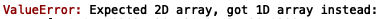

# Python中常见的机器学习编程错误
## 机器学习中常见的Python错误

> Source


在本文中，我将介绍在模型构建和开发过程中在python中遇到的一些最常见的错误。 出于演示目的，我们将使用在Kaggle上可以找到的身高/体重数据。 数据包含性别，身高（英寸）和体重（磅）。

我遇到的最常见错误如下：

进口商品
+ NameError
+ ModuleNotFoundError
+ AttributeError
+ ImportError

读取数据

6. FileNotFoundError

选择列

7. KeyError

数据处理

8. ValueError

我们将建立一个简单的线性回归模型并修改代码，以显示上述错误在实践中是如何产生的。

首先，我们使用熊猫导入数据并打印前五行：
```
import pandas as pddf = pd.read_csv("weight-height.csv")print(df.head())
```


如您所见，数据集非常简单，包含性别，身高和体重列。 我们可以做的下一件事是使用matplotlib和seaborn可视化数据：
```
import matplotlib.pyplot as pltplt.scatter(df['Weight'],  df['Height'])plt.xlabel("Weight")plt.ylabel("Height")plt.show()
```


查看体重与身高的散点图，我们发现该关系是线性的。

接下来，我们定义输入（X）和输出（y）并拆分数据以进行训练和测试：
```
from sklearn.model_selection import train_test_splitimport numpy as npX = np.array(df["Weight"]).reshape(-1,1)y = np.array(df["Height"]).reshape(-1,1)X_train, X_test, y_train, y_test = train_test_split(X, y, random_state = 42, test_size = 0.33)
```

然后，我们可以定义一个线性回归模型，以适合我们的训练数据，对测试集进行预测，并评估模型的性能：
```
from sklearn.linear_model import LinearRegressionreg = LinearRegression()reg.fit(X_train, y_train)y_pred = reg.predict(X_test)print("R^2 Accuracy: ", reg.score(X_test, y_test))
```


我将在NameError中讨论的第一个错误，例如，如果我忘记导入包，就会发生。 在以下代码中，我删除了“将numpy导入为np”：
```
from sklearn.model_selection import train_test_splitX = np.array(df["Weight"]).reshape(-1,1)y = np.array(df["Height"]).reshape(-1,1)X_train, X_test, y_train, y_test = train_test_split(X, y, random_state = 42, test_size = 0.33)
```

如果我尝试在缺少该行代码的情况下运行脚本，则会出现以下错误：


如果省略seaborn，matplotlib和pandas的import语句，我会收到类似的消息：


另一个问题是由于拼写错误而试图导入一个不存在的软件包，这会导致ModuleNotFoundError。 例如，如果我将“ pandas”拼写错误为“ pandnas”：
```
import pandnas as pd
```


或者，如果我在matplotlib scatterplot导入中忘记了“ pyplot”，则会收到AttributeError：
```
import matplotlib as plt
```


同样，如果我在sklearn导入中忘记了linear_regression和model_selection属性，则会收到ImportError：
```
from sklearn import LinearRegression from sklearn import train_test_split
```


在读取文件方面，如果我拼错了文件名，则会得到FileNotFoundError：
```
df = pd.read_csv("weight-heigh1t.csv")
```


此外，如果我尝试从不存在的熊猫数据框中选择一列，则会收到KeyError：
```
plt.scatter(df['Weight1'],  df['Height'])
```


如果我忘记将“ Weight”和“ Height”的熊猫系列转换为numpy数组，则会收到ValueError。 这实际上是非常常见的sklearn方法，仅接受numpy数组。 我经常发现自己忘记了从熊猫系列转换为numpy数组的简单步骤：
```
X = df["Weight"]y = df["Height"]X_train, X_test, y_train, y_test = train_test_split(X, y, random_state = 42, test_size = 0.33)reg = LinearRegression()reg.fit(X_train, y_train)
```


或者，如果我忘记将numpy数组重塑为二维数组，那么我还会收到ValueError：
```
X = np.array(df["Weight"])y = np.array(df["Height"])X_train, X_test, y_train, y_test = train_test_split(X, y, random_state = 42, test_size = 0.33)reg = LinearRegression()reg.fit(X_train, y_train)
```


ValueError的另一个常见原因是在进行列车测试拆分时。 我经常忘记X和y数组的顺序：
```
X_train, X_test, y_train, y_test = train_test_split(X, y, random_state = 42, test_size = 0.33)
```

我在哪里切换X_test和y_train：
```
X_train, y_train, X_test, y_test = train_test_split(X, y, random_state = 42, test_size = 0.33)
```

拟合时会出现以下错误：


最后，当尝试拟合与特定类别或总体相对应的模型数据时，我经常遇到没有足够数据的问题。 让我们过滤数据框以复制此问题。 让我们过滤数据，使其仅包括“重量” = 241.893563的记录。 这将导致仅一行数据：
```
df = df[df['Weight'] == 241.893563]
```

如果尝试构建模型，则在拆分数据的行中将出现以下错误：
```
X_train, X_test, y_train, y_test = train_test_split(X, y, random_state = 42, test_size = 0.33)reg = LinearRegression()reg.fit(X_train, y_train)y_pred = reg.predict(X_test)print("R^2 Accuracy: ", reg.score(X_test, y_test))
```


如果我们尝试拟合，则会出现以下错误：
```
#X_train, X_test, y_train, y_test = train_test_split(X, y, random_state = 42, test_size = 0.33)reg = LinearRegression()reg.fit(X, y)
```


最后，如果数据缺失或无穷大，则拟合时将引发错误。 让我们用“ nan”（非数字）值重新定义权重列，以产生此错误：
```
df['Weight'] = np.nanX = np.array(df["Weight"]).reshape(-1,1)y = np.array(df["Height"]).reshape(-1,1)X_train, X_test, y_train, y_test = train_test_split(X, y, random_state = 42, test_size = 0.33)reg = LinearRegression()reg.fit(X_train, y_train)
```


我们将获得具有无限值的相同错误消息：
```
df['Weight'] = np.infX = np.array(df["Weight"]).reshape(-1,1)y = np.array(df["Height"]).reshape(-1,1)X_train, X_test, y_train, y_test = train_test_split(X, y, random_state = 42, test_size = 0.33)reg = LinearRegression()reg.fit(X_train, y_train)
```


在这篇文章中，我们回顾了在python中开发模型时出现的不同错误。 我们检查了与导入包，读取文件，选择列和处理数据有关的错误。 对开发机器学习模型时出现的不同类型错误有扎实的知识，在生产机器学习代码时非常有用。 掌握这些知识可以防止错误发生，并通知可用于在错误发生时捕获这些错误的逻辑。

我每天都会遇到更多错误，但是根据我的经验，我在这篇文章中列出的错误最为常见。 我希望这篇文章有用。 这篇文章中的代码可在GitHub上找到。 感谢您的阅读！
```
(本文翻译自Sadrach Pierre, Ph.D.的文章《Common Machine Learning Programming Errors in Python》，参考：https://towardsdatascience.com/common-machine-learning-programming-errors-in-python-5d76de85e975)
```
