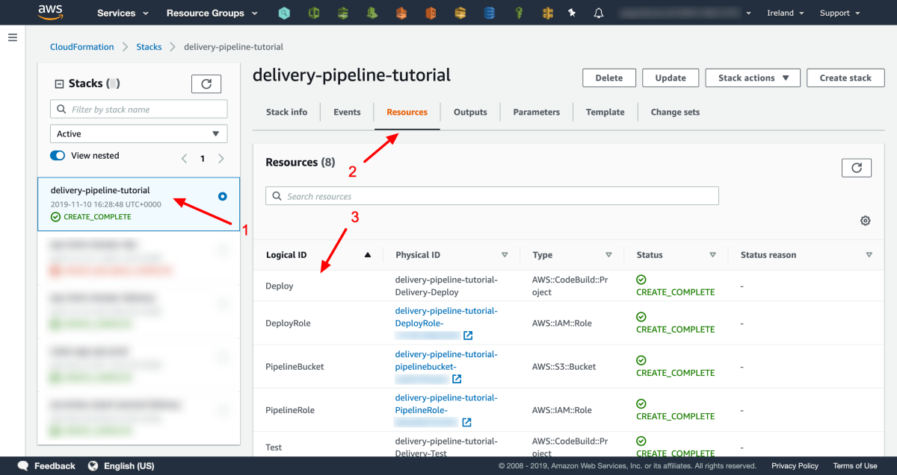

# 第5步-让这个坏男孩上班吧！ 💪

交付管道已启动并正在运行，做得很好！ 不过，我们并不是出于此目的而构建的； 我们希望它能够部署我们的代码。 现在，我们将其投入使用并开始进行一些持续集成/持续交付。

当我们部署管道时，我们的应用程序也被自动部署。 您可以看到管道阶段是绿色的，带有绿色的勾号。 表明它们已成功运行-如果管道仍在运行，请耐心等待，可能需要4到5分钟。

您可以在CloudFormation控制台中看到我们的应用程序，称为delivery-pipeline-tutorial-application-Dev。
## 应用基础架构

我们正在使用无服务器来帮助管理和部署我们的应用程序。 无服务器默认情况下会处理很多我们需要的东西。 在仓库的根目录打开serverless.yaml文件。 它仅包含以下代码行：
```
service: delivery-pipeline-tutorial-applicationprovider:  name: aws  runtime: python3.7package:  exclude:    - tests/**    - delivery/**    - LICENSE    - README.mdfunctions:  helloWorld:    handler: hello_world/hello_world.entry_point    name: HelloWorld    description: A lambda function to help us demonstrate continuous delivery
```
+ 服务：我们希望我们的应用程序堆栈具有的可读名称（这是我们在CloudFormation中看到的名称，并带有环境名称后缀）。
+ 提供程序：告诉Serverless我们正在部署到AWS，默认情况下，我们希望运行时为Python 3.7
+ 软件包：此部分向Serverless解释了应用程序一旦部署就不需要哪些文件和目录。
+ 功能：在这里，我们描述我们要部署的功能（Lambda）。 这包括入口点（即代码执行应从何处开始）。 它还包含一些更易理解的信息，以帮助我们了解在部署此功能后的功能。

serverless.yaml文件是IaC的另一个示例。 此基础结构已部署在我们交付管道的“部署”步骤中。
## 申请代码

应用程序代码位于services / hello_world / hello_world.py中。 顾名思义，它很简单：
```
def entry_point(event, context):    #   Lambda Entry Point    return "Hello World"
```

一旦运行，它将返回字符串：Hello World。

您可以在AWS Lambda中看到此代码； 它的名字叫HelloWorld。 您可以使用AWS Lambda Test功能运行代码。 打开HelloWorld Lambda函数，在页面顶部，您将看到一个下拉菜单，选择测试事件。 然后选择“配置测试事件”。 您可以将有效负载保留为默认值，并为测试命名。 任何都会做。 单击创建。

配置测试后，您可以单击“测试”按钮。 Lambda将被执行，并显示结果。

> Successfully executed Lambda code!

## 应用测试

该应用程序在tests / test_hello_world.py中具有自己的单元测试。 该测试只是检查返回的字符串是否正确，即“ Hello World”：
```
import unittestfrom services.hello_world import hello_worldclass HelloWorldTest(unittest.TestCase):    def test_greeting(self):        """        Test that I get the correct greeting        """        greeting = hello_world.entry_point("", "")        self.assertEqual(greeting, "Hello World")if __name__ == '__main__':    unittest.main()
```

该测试在交付管道的“测试”步骤中运行。
## 做出改变

我们将进行两项更改以演示实际的管道。

首先，我们将更改我们的应用程序代码，该代码在Lambda中运行。 这样做会导致我们的单元测试失败。 因此，管道将在“测试”步骤中失败。 试试吧

更改services / hello_world / hello_world.py文件，使其不再返回“ Hello World”：
```
def entry_point(event, context):    #   Lambda Entry Point    return "Hola Mundo"
```

现在，您需要提交并推送更改：
```
git add .git commit -m "Changed the returned string"git push origin
```

转到AWS CodePipeline中的管道。 管道已自动开始处理最新修订。 它将验证，并且此步骤将通过。 然后它将尝试“测试”步骤，但这将失败。

> The unit tests have failed


请注意，管道此时已停止。 在确定单元测试之前，管道将被阻塞。 很好 它阻止我们部署损坏的代码。 我们可以通过单击“详细信息”链接来确认失败的原因。 遵循执行细节； 您将看到以下输出：
```
============================================FAIL: test_greeting (__main__.HelloWorldTest)--------------------------------------------Traceback (most recent call last):File "/codebuild/output/src993431970/src/tests/test_hello_world.py", line 12, in test_greetingself.assertEqual(greeting, "Hello World")AssertionError: 'Hola Mundo' != 'Hello World'--------------------------------------------Ran 1 test in 0.000sFAILED (failures=1)
```

为了使管道重新运行，我们需要修复该测试。 更改tests / test_hello_world.py文件，使其看起来像这样：
```
import unittestfrom services.hello_world import hello_worldclass HelloWorldTest(unittest.TestCase):    def test_greeting(self):        """        Test that I get the correct greeting        """        greeting = hello_world.entry_point("", "")        self.assertEqual(greeting, "Hola Mundo")if __name__ == '__main__':    unittest.main()
```

我们将需要进行更改并推动它：
```
git add .git commit -m "Updated failing unit test"git push origin
```

拾取这些更改后，管道将自动重新启动。

我们的测试步骤现在将通过！ 欢呼！ 不仅如此，该代码还将很快贯穿整个部署过程。 完成后，您可以返回AWS Lambda并重试配置的测试：

> It works!

# 最后的想法

恭喜，您现在是一名持续交付专家！ 从头开始，您已在大约20分钟内配置并构建了新的CI / CD管道。 比那更好 现在，您可以为将来的任何项目提供基准。

您可以根据每个项目的需要来调整和修改此基准。 完成几次后，您将可以在不到5分钟的时间内从空的存储库转到正在运行的管道！ 无论您的项目有多小，您都可以从CI / CD中受益。 在执行2或3次代码提交之前，您将节省5分钟。

如果您对本教程有任何问题，疑问或建议，请在下面的回复部分中告诉我。 我很乐意提供帮助！
## 快速入门指南| AWS CLI
### 使用此快速入门指南可以在几分钟内安装AWS CLI并创建用户配置文件。
# 步骤4 —创建CI / CD管道

整理好配置后，我们就可以创建CI / CD管道了。 令人惊讶的是，它只需要那几行代码。

现在，创建管道非常简单，请在delivery /目录中查找bash脚本create_delivery_pipeline.sh。 如果您尚未安装此文件，则使用AWS CLI工具，然后按照以下4分钟指南进行操作：
## 快速入门指南| AWS CLI
### 使用此快速入门指南可以在几分钟内安装AWS CLI并创建用户配置文件。

该脚本将使我们能够使用一个命令来创建管道。 在执行此操作之前，请根据需要打开文件。 它执行aws cloudformation创建堆栈：

创建模板中指定的堆栈。 调用成功完成后，将开始创建堆栈。

该命令需要一些参数：
+ --stack-name可以是您想要的任何内容； 它是将堆栈部署到AWS后将被称为的名称。
+ --template-body这指示包含配置的文件所在的位置，将其保留为默认值。
+ --profile告诉AWS CLI与AWS通信时希望使用哪个配置文件。 使用设置个人资料时创建的名称。 如果使用默认配置文件，则可以删除此参数。
+ --region这是您要在其中放置管道的AWS区域的区域代码。
+ --capabilities当使用此命令创建包含IAM资源的堆栈时，AWS要求您显式使用此参数声明所需的状态。 值CAPBILITY_IAM告诉AWS我们正在故意创建IAM资源。
## 运行命令

从终端cd到delivery /目录。 现在，您可以使用以下命令执行脚本并创建管道：
```
./create_delivery_pipeline.sh
```

短暂的停顿后，您将得到如下响应，告诉您AWS中正在进行堆栈创建：
```
{    "StackId": "arn:aws:cloudformation:eu-west-1:xxxxxxxxxxxx:stack/delivery-pipeline-tutorial/1234567890-abcde-1234-mnbvc-9876g5543d221"}
```

登录到AWS控制台并导航到AWS CloudFormation。 您应该看到全新的堆栈，看起来像这样：

> 1) Stack Name, 2) Resource, 3) Resource Names


到目前为止，一切都很好。 此时，您的应用程序将自动部署，并称为Delivery-pipeline-tutorial-application-Dev。 我们稍后再讲。

现在已经创建了管道堆栈，我们应该拥有一个CodePipeline，其中包含我们上面描述的所有步骤。 若要查看管道，请从“服务”菜单中选择“代码管道”。

> The pipeline has been created


单击管道的名称将其打开。

> AWS Console showing the four parts of the pipeline


现在我们可以清楚地看到交付管道的组成部分：
+ 源：侦听代码存储库中所有更改的步骤。
+ 验证：AWS CodeBuild步骤，检查我们的代码库是否有效。
+ 测试：运行自动单元测试的AWS CodeBuild步骤。
+ 部署：发布应用程序的AWS CodeBuild步骤，准备使用。

这就是全部。 真！ 现在，该管道可以侦听我们对代码库所做的任何更改，并自动验证，测试和部署它们。 魔法！ 🤓
# 步骤3 — CI / CD管道配置

我们的仓库中有三种文件类型：
+ 交付：有助于我们将代码放入环境中的文件
+ 测试：可帮助我们确认代码是否正常运行的文件。
+ 代码/应用程序：构成我们正在构建的应用程序的文件。

在这一步中，我们将重点放在交付文件上。 这些文件将指导AWS有关如何配置CI / CD管道的信息。 描述管道以及管道应执行的操作的文件是delivery / Delivery-Cloudformation.yaml。 此文件是基础结构即代码（IaC）类型。

IaC是使用配置文件通知基础架构即服务（IaaS）提供程序（例如AWS）如何代表您配置基础结构的概念。 使用IaC意味着您不必自己提供基础架构。
## 管道配置YAML

在部署管道之前，让我们看一下文件，看看它将要创建什么。 该文件是Cloudformation文件，格式为YAML。
```
AWSTemplateFormatVersion: 2010-09-09Description: Infrastructure as Code deployment pipelineParameters:  StackName:    Type: String    Default: delivery-pipeline-tutorial    Description: Name of the Stack  RepositoryName:    Type: String    Default: delivery-pipeline-tutorial    Description: The name of the CodeCommit repository to collect the code from  RepositoryBranch:    Type: String    Default: master    Description: The name of the git branch which should be used for deployments
```

前两行是元数据。 第一个帮助AWS Cloudformation知道如何解析文件。 第二个帮助您了解此堆栈在部署之后的含义。

接下来，我们有参数。 这些参数是输入字段，我们可以根据需要输入不同的值。 它们还充当变量，可以在文件的其余部分中重复使用。
+ StackName：这是创建管道后将给定的名称。 您可以将其更改为您喜欢的任何内容。
+ RepositoryName：这是您的AWS CodeCommit存储库的名称，您必须将其更改为在步骤1中选择的确切名称。
+ RepositoryBranch：如果要使用master以外的其他分支，则可以在此处指定。 但是，我们将使用master，因此请保持原样。

该文件的第三个顶级部分是资源。 本节包含我们要部署的资产的描述。 这些资产成对出现：一种资源，以及它的IAM角色（一个例外）。 我们的每个资源都可以执行一项任务，该资源需要权限。 我们在IAM角色中定义权限。

这些是资源：
+ PipelineBucket：这是我们的交付管道将能够存储完成其工作所需的点点滴滴的地方。 这是不需要IAM角色的资源。
+ 管道：这是CodePipeline资源。 它是交付管道本身，并定义了管道应采取的阶段和动作。 它的角色是PipelineRole，它为管道提供了将对象放入/读取对象到PipelineBucket中的权限，并启动了CodeBuild操作。
+ 验证：这是一个CodeBuild资源。 它描述了需要配置的EC2服务器以及服务器应执行的操作—在这种情况下，是要验证我们存储库中的serverless.yaml文件。
+ 测试：这是我们需要的第二个CodeBuild资源。 这是配置为运行python单元测试。
+ 部署：第三个CodeBuild资源将部署我们的应用程序。
# 第2步-复制快速入门代码

在本指南的后面，我将向您介绍所有代码的工作方式。 现在，您需要做的就是将基本代码库复制到新的存储库中。

从这个Github仓库中，复制以下文件和目录：
+ 交付/ —包含我们创建和维护交付渠道所需的资源。
+ services / —这包含应用程序代码。
+ 测试/ —它包含我们的自动化测试，这是CI / CD中的关键要素。
+ serverless.yaml-我们将使用无服务器框架来帮助我们部署应用程序代码。 该文件告诉我们的交付管道如何部署和配置我们的应用程序。 这是一个IaC文件。 （不用担心，您不需要在本地安装Serverless）。

最简单的方法是克隆Github存储库。 使用：
+ git clone git@github.com：g-farrow / delivery-pipeline-tutorial.git或
+ git clone https://github.com/g-farrow/delivery-pipeline-tutorial.git

现在，您可以使用以下命令将文件从Github存储库复制到新存储库：
```
cp -r <Github_repo_location>/delivery <your_repo_location>/cp -r <Github_repo_location>/services <your_repo_location>/cp -r <Github_repo_location>/tests <your_repo_location>/cp <Github_repo_location>/serverless.yaml <your_repo_location>/
```

您的仓库现在应该看起来像这样：
```
<your repo name>  --> delivery/  --> services/  --> tests/  --> serverless.yaml
```

现在，您可以将更改推送到您的AWS CodeCommit存储库。 您可以使用以下命令从终端轻松完成此操作：
```
git add .git commit -m "Initial commit containing quickstart files"git push origin
```
## 创建一个新的仓库 AWS CodeCommit
### AWS CodeCommit是基于Git的，完全托管的服务，非常适合爱好项目或企业项目。
# 第1步-创建代码存储库

任何CI / CD管道的基础都是回购协议。 代码存储库是应用程序代码的存储和版本控制的地方。 版本控制系统有很多选项。 最受欢迎的之一是Git。 在本指南中，我们将使用AWS CodeCommit存储我们的代码。 如果您在创建CodeCommit存储库方面需要帮助，请按照以下3分钟的指南进行操作：
## 创建一个新的仓库 AWS CodeCommit
### AWS CodeCommit是基于Git的，完全托管的服务，非常适合爱好项目或企业项目。

现在您有了一个仓库，您将需要将其检出到本地工作站。 上面的指南将说明如何执行此操作。
# 在20分钟内连续交付🏎
## 几乎无需任何努力或先验知识即可从头开始建立CI / CD管道的指南。

如果您以前从未使用过持续交付，那么前景不佳！

所有这些工具，所有技术，我什至从哪里开始！？

这就是我第一次遇到持续交付时的感觉。 像软件工程（以及生活）中的大多数事情一样，最困难的步骤可能是第一步。 这就是为什么我写本指南的目的是让您在几分钟之内从菜鸟到连续交付！ 我已经提供了您需要的所有代码和配置。

> Photo by Greg Farrow

## 什么是持续集成（CI）和持续交付（CD）？

持续集成—拥有用于存储和版本化源代码的存储库的做法。 更改代码库后，将构建并验证代码。

连续交付-CI的逻辑扩展，一旦验证和测试了代码，便会自动部署它。 手动网关可用于允许人为控制部署。

采用持续交付要求改变思维方式，以适应代码变更。 对存储库的每次提交都必须符合交付条件。
## 本指南涵盖哪些内容？

+ 创建一个Git存储库来存储和版本化我们的代码。
+ 部署持续交付管道以验证我们的代码，运行单元测试和部署我们的应用程序。
+ 通过更新我们的代码来测试其工作方式！
# 工具与技术

我会逐步指导您，因此即使您是菜鸟，也应该能够按照本指南进行操作。 😀

我们将使用AWS部署一个简单的“ hello world”无服务器应用程序。 我们所做的一切都是免费的，因此不必担心成本。 如果您还没有，请在这里创建您的帐户。

让我们从我们的工具包开始（同样，您不需要了解这些工具的任何知识，我们将在接下来的工作中解释一切）：
+ AWS CodeCommit-这是我们存储代码和管理版本的地方。
+ AWS CodeBuild-此服务可帮助我们验证，测试和部署我们的应用程序。
+ AWS CodePipeline-这是将所有其他元素整合到我们的CI / CD管道中的东西。
+ 无服务器框架—一种围绕AWS服务的抽象，可帮助我们以几乎没有代码的方式部署真正的应用程序。
+ AWS CLI —这有助于我们在命令行上与AWS进行交互。 我们仅需要两个命令。
