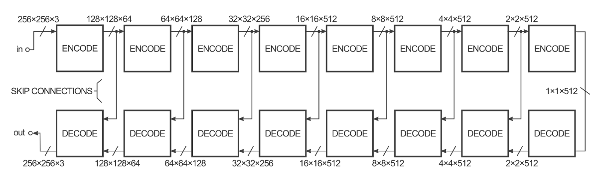

## 使用CycleGANs学习图像到图像的翻译
### 最近，我们与我们的合作伙伴Getty Images（一家全球性的图片服务公司）合作，在…上探索图像到图像的翻译。
## Tensorflow中的图像到图像翻译-仿射层
### 确保首先安装了Tensorflow 0.12.1，然后执行python -c“ import tensorflow; print（tensorflow .__ version__）”…
# CycleGANS和Pix2Pix

鸣谢：介绍这些博客的简要版本，以解释pix2pix和cycleGAN背后的思想和概念。

Christopher Hesse博客：
## Tensorflow中的图像到图像翻译-仿射层
### 确保首先安装了Tensorflow 0.12.1，然后执行python -c“ import tensorflow; print（tensorflow .__ version__）”…

Olga Liakhovich博客：
## 使用CycleGANs学习图像到图像的翻译
### 最近，我们与我们的合作伙伴Getty Images（一家全球性的图片服务公司）合作，在…上探索图像到图像的翻译。
# Pix2Pix：

论文：https://phillipi.github.io/pix2pix/

pix2pix使用条件生成对抗网络（cGAN）来学习从输入图像到输出图像的映射。

undefined

生成器的结构称为“编码器-解码器”，在pix2pix中，编码器/解码器看起来或多或少像这样：


那里的体积使您可以感觉到它们旁边的张量尺寸的形状。 在此示例中，输入是具有3个颜色通道（红色，绿色和蓝色，对于黑白图像均相等）的256x256图像，并且输出是相同的。

生成器接受一些输入，并尝试通过一系列编码器（卷积+激活函数）将其减少为更小的表示形式。 我们的想法是，通过这种方式进行压缩，我们希望在最终编码层之后可以对数据进行更高级别的表示。 解码层执行相反的操作（解卷积+激活功能），并反转编码层的作用。

为了提高图像到图像变换的性能，作者使用“ U-Net”代替编码器-解码器。 这是同一回事，但是通过“跳过连接”将编码器层直接连接到解码器层：


跳过连接使网络可以选择不使用编码/解码部分。

这些图只是一个简单的简化。 例如，网络的第一层和最后一层没有批处理规范层，而中间的一些层则具有退出单元。

鉴别者

鉴别器的工作是拍摄两个图像，一个输入图像和一个未知图像（这将是生成器的目标图像或输出图像），并确定第二个图像是否由生成器生成。


该结构看起来很像生成器的编码器部分，但工作方式略有不同。 输出为30x30图像，其中每个像素值（0到1）表示未知图像的相应部分的可信度。 在pix2pix实现中，来自此30x30图像的每个像素对应于输入图像的70x70色块的可信度（由于输入图像为256x256，所以色块重叠很多）。 该架构称为“ PatchGAN”。

训练

要训练该网络，有两个步骤：训练鉴别器和训练生成器。

为了训练鉴别器，首先发生器产生输出图像。 鉴别器查看输入/目标对和输入/输出对，并就其看起来有多逼真做出猜测。 然后基于输入/输出对和输入/目标对的分类误差来调整鉴别器的权重。

然后根据鉴别器的输出以及输出图像与目标图像之间的差异来调整生成器的权重。


> Discriminator and Generator training

# 循环GAN

原始CycleGAN纸

虽然PIX2PIX可以产生真正神奇的结果，但挑战在于训练数据。 您想要学习在其间转换的两个图像空间需要预先格式化为单个X / Y图像，以容纳两个紧密相关的图像。 根据您要转换的两种图像类型（例如，如果两个图像配置文件之间没有一对一的匹配），这可能是耗时的，不可行的，甚至是不可能的。 这就是CycleGAN的用武之地。

CycleGANs背后的关键思想是它们可以基于PIX2PIX体系结构的强大功能，但允许您将模型指向两个不成对的离散图像集合。 例如，一组图像X将充满阳光明媚的海滩照片，而组Y将是阴暗海滩照片的集合。 CycleGAN模型可以学习在这两种美学之间转换图像，而无需将紧密相关的匹配项合并到单个X / Y训练图像中。

CycleGAN无需显式的X / Y训练图像就可以学习如此出色的翻译的方法包括引入完整翻译周期的想法，以确定整个翻译系统的质量，从而同时改善两个生成器。


这种方法是CycleGAN带来的图像到图像转换的聪明力量，以及它如何在非配对图像样式之间实现更好的转换。

Zhujun-Yan Zhu等人发表了最初的CycleGANs论文“使用周期一致的对抗网络进行不成对的图像到图像的翻译”。
# 损失函数

CycleGAN的功能在于如何设置损耗函数，并将全周期损耗用作附加的优化目标。

复习一下：我们正在处理2个生成器和2个区分器。
## 发电机损耗

让我们从生成器的损失函数开始，该函数由两部分组成。

第1部分：如果伪造（生成的）图像非常好，以至于辨别器无法将其与真实图像区分开，则生成器成功。 换句话说，伪造图像的鉴别器输出应尽可能接近1。 用TensorFlow术语来说，生成器希望最小化：
```
g_loss_G_disc = tf.reduce_mean((discY_fake — tf.ones_like(discY_fake)) ** 2)g_loss_F_dicr = tf.reduce_mean((discX_fake — tf.ones_like(discX_fake)) ** 2)
```

注意：上面的“ **”符号是Python中的幂运算符。

第2部分：我们需要捕获循环损耗：当我们使用一个生成器从一个生成器返回图像的原始空间时，原始图像（开始循环的位置）与循环图像之间的差异应最小化。
```
g_loss_G_cycle = tf.reduce_mean(tf.abs(real_X — genF_back)) + tf.reduce_mean(tf.abs(real_Y — genG_back))g_loss_F_cycle = tf.reduce_mean(tf.abs(real_X — genF_back)) + tf.reduce_mean(tf.abs(real_Y — genG_back))
```

最后，发电机损耗是这两项的总和：

g_loss_G = g_loss_G_disc + g_loss_G_cycle

由于周期性损失非常重要，因此我们想倍增其影响。 我们为此乘数使用了一个L1_lambda常数（在本文中使用了值10）。

现在，发电机损耗的总决赛看起来像：

g_loss_G = g_loss_G_disc + L1_lambda * g_loss_G_cycle

g_loss_F = g_loss_F_disc + L1_lambda * g_loss_F_cycle

鉴别损失

鉴别器有2个决定要做出：
+ 真实图片应标记为真实图片（建议尽可能接近1）
+ 鉴别器应该能够识别生成的图像，从而为假图像预测0。
```
DY_loss_real = tf.reduce_mean((DY — tf.ones_like(DY))** 2)DY_loss_fake = tf.reduce_mean((DY_fake_sample — tf.zeros_like(DY_fake_sample)) ** 2)DY_loss = (DY_loss_real + DY_loss_fake) / 2DX_loss_real = tf.reduce_mean((DX — tf.ones_like(DX)) ** 2)DX_loss_fake = tf.reduce_mean((DX_fake_sample — tf.zeros_like(DX_fake_sample)) ** 2)DX_loss = (DX_loss_real + DX_loss_fake) / 2
```
```
(本文翻译自Manish Chablani的文章《CycleGANS and Pix2Pix》，参考：https://towardsdatascience.com/cyclegans-and-pix2pix-5e6a5f0159c4)
```
