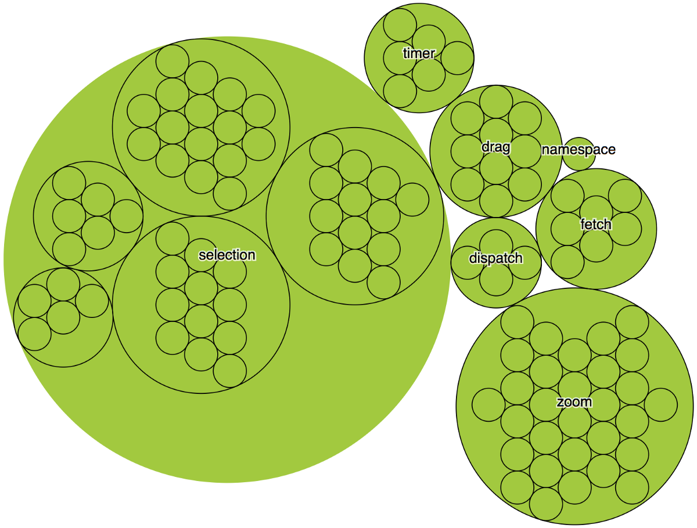

# D3不是数据可视化库
## 了解这一点可以帮助您学习（和取消学习）

D3.js是一个非常成功的库，但是人们认为D3所做的和实际的工作之间存在脱节。 结果，学习D3令人感到恐惧和困惑。 通过更好地了解其结构并将其分成更易于管理的部分，可以更容易地选择要学习的库部分以及应避免的部分—不仅对于D3新手，而且对于像我这样想要重新检查的专家用户来说，都是重要的课程 他们如何使用D3。

我写了一本关于D3的书（两次），所以我确定您在想这是一种点击诱饵的标题，并且我将对文字进行微妙的播放，或者说类似D3的内容不是数据可视化 库是数据可视化库。 但是，不行，D3除了具有使您能够进行数据可视化的关键功能外，还包括其他仅与数据可视化相关的功能。 鉴于D3主页的外观，您可能会对此感到惊讶。

但是D3的大部分内容与图形无关，而许多部分对于学习创建有效的数据可视化并不必要。 我们可以通过将函数图形化地嵌套到文档中描述的小节和小节中，来获取D3 API页面并将其可视化为层次结构。 使用此方法的d3选择的外观如下：

除了为整个文档执行此操作外，我还将功能分为几个广泛的语义类别。 显然，这种可视化API的方法并不能说明真正的复杂性，因为某些部分具有许多小的几乎重复的功能，而另一些部分仅具有一些复杂的功能，但是它提供了合理的图形概述。

> A hierarchical diagram of the functions listed in the D3 API page, grouped into their category (such as d3-scale or d3-array) and subcategory (if applicable, such as continuous scales) and then further grouped and colored and labeled by the part of the API they represent. In this formulation, the geospatial data visualization functionality is a subsection of dataviz.

库的大小和复杂性总是使授课变得困难，几乎每节课和书（包括我的书）都首先关注建立库的JQuery部分，这全部是关于DOM操作的内容，以在网页上创建和操作元素 。

但是，请看一下上面的图。 如果您想学习如何使用D3进行数据可视化，则无需在右侧学习任何内容，并且几乎可以肯定，无需在左侧学习任何内容。 实际上，如果您这样做了，从长远来看，您可能会为成功做好准备。 我将在介绍D3 API的各个区域时进行解释。
# JQUERY零件

您在D3教程中阅读的大部分内容都集中在其DOM操作功能上。 这包括您可能已经看过上千次的选择/输入/退出/更新模式，还包括用于拖动，缩放，调度事件甚至使用Fetch（D3风格的d3-fetch也不奇怪）的便捷功能。

如果您更喜欢D3编写代码的方式，则可以使用现有ES2015功能的特定D3风格以及有用且有趣的功能（例如d3-zoom）。 但是，如果您使用的是Vue之类的工具来创建DOM元素，并且与其他形式的DOM管理（需要黑客或混合系统）进行积极冲突，则不需要整个部分。 如果您在团队环境中工作，那么与D3相比，您团队中的其他人更有可能更熟悉DOM管理的其他方法，因此有充分的理由完全避免D3的这一方面。

这与数据可视化如此紧密地联系在一起是有原因的：您无法可视化事物，除非它们实际存在（在DOM中），但是由于它在API中如此突出，因此会像D3一样成为新的受众。 如果您使用D3操纵DOM，则使用此命令。 考虑到最初开发D3的时间（2013年发布了v3）也很有意义。 选择的另一个原因与动画有关，我将在下面介绍。
# 乐活散件

该库的另一重要部分公开了许多功能，这些功能是数据转换，清理和格式化过程的一部分。 其中一些功能（例如d3数组中的min和max函数）是可以使用普通JavaScript处理的操作的语法糖。 其他设置（例如set和map）是D3风格，与ES2015 Set和Map不太一样。

如果您喜欢python风格的数字格式，那我会发现格式实用程序，我发现它不如数字直观，还有时间格式，根据我在D3方面的所有经验，我从未使用过偏好矩或（在Moment之前和现在） 原始JavaScript时间格式选项。 此外，还有一些插值函数可在内部使用，以为刻度和颜色功能供电，以及许多随机数生成器。

您需要知道如何测量和格式化数据以进行数据可视化，但是通常有很多方法可以创建数据集。 还有一些其他库可能更常用于工业或本机ES2015功能中，与D3特定功能相比，较大的团队将有更好的理解机会。
# 动画部分

d3转换是对网络上的图形元素进行动画处理的最便捷方法之一，并且与d3选择紧密相关。 但是我发现，数据可视化中的动画虽然令人印象深刻且引人注目，但其优先级远低于了解不同图表类型如何呈现数据，如何正确设计图表，理解数据可视化中的形式以及数据可视化的其他方面 实践。 鉴于您需要使用D3选择来通过d3转换来访问动画，因此这是一笔沉重的投资，最好将其花费在以其他方式进行升级上。

动画的另一个方面使它在学习使用D3时成为可选项，这是因为还有其他的库可以制作出色的动画，例如GSAP，以及您（或您的团队）使用的方法固有的动画解决方案 用于DOM管理。
# 数据分析部分

我们在这里越来越接近数据可视化。 解析CSV等数据及其各种样式（制表符分隔，逗号分隔）是数据可视化的重要组成部分，而且我还没有看到像d3-dsv这样容易实现的库。 但是，我的大部分生产数据都是经过处理的，可以作为JavaScript数据结构使用，不需要处理CSV。 d3-quadtree是一个非常有趣且有用的空间搜索库，但在现实世界中，它的直接应用非常罕见（在引擎盖下，四叉树用于使用d3-force构建的网络图之类的东西）。 d3集合和d3数组中的装箱和嵌套功能也属于此类。
# 数据可视化部分

D3进行数据可视化的真正功能在于其功能，即使用绘图指令修饰数据，从源数据创建新的可绘制数据，生成SVG路径以及根据数据和方法在DOM中创建数据可视化元素（如轴）。 将D3的图形功能分为生成器，组件和布局很有用。 由于布局和生成器不生成DOM元素，而仅生成用于创建DOM元素的原材料，因此您仍然需要将它们创建的数据传递给DOM，这是我在之前的文章中使用React进行描述的过程。

> A diagram from D3.js in Action describing the difference between generators, components and layouts.

不仅了解如何使用布局和生成器，而且了解它们如何工作是理解数据可视化的关键。 由于大多数复杂的数据可视化是组合的，因此了解这些不同功能如何相互作用以生成不同种类的图表是了解如何很好地设计数据可视化的关键。 不幸的是，学习D3的人花了很多时间来学习其DOM管理功能，并且对实际的数据可视化功能只有一个肤浅的了解。
## D3的数据可视化功能

d3shape具有许多真正有价值的功能，它们可以从本身有用的数据数组中绘制SVG路径，并作为构建自己的生成器的模型。 其内置的画布渲染功能非常出色，但是在普通的JavaScript：Path2D中已有一个解决方案。

除了图形功能外，比例尺和插值器不会创建图形，而是将图形投影到可视空间的关键（无论是在图表边界内还是在颜色，笔划宽度或其他用于可视化通信的通道上）。 比例尺不仅将数字内插到数字，还可以从一种模式转换为另一种模式（例如使用比例尺进行量化），并提供便利功能，例如计算适合于轴的刻度。

d3-hierarchy具有分层布局（如树状图，树形图和旭日形），还具有分层数据结构，该结构提供了方便的方法来分割和分析分层数据。

d3-force具有简单的基于约束的力导向布局，该布局有效且通用，足以在大多数网络可视化中使用。

d3color和d3color方案不是处理颜色的唯一方法，如果您刚刚起步，我建议您使用chroma.js而不是D3的颜色实用程序。

D3中的轴和笔刷功能遭受与d3选择相同的问题，因为它们会进入DOM并自己创建元素。 这意味着它们更难集成到使用Vue或React管理DOM的应用程序中。

某些功能（例如d3路径的画布到SVG）在某些极端情况下可能会有用，但是学习D3的真正价值来自学习不同的可视化方法，例如船体，轮廓，voronoi多边形和和弦图。 了解它们如何采用不同形式的数据并得出绘图指令可以帮助您了解如何为应用程序转换数据以及这些转换如何相互作用。
## 土方零件

虽然d3-geo绝对是D3数据可视化领域的一部分，但它可能过于具体，无法像更广泛的数据可视化作品那样容易地在不同的设计案例中集成。 D3已经成为新地理学家尝试制图，栅格重投影和其他地理怪胎的游乐场，因此它的受欢迎程度是有道理的。

它包含一百万个投影，一个完整的投影流系统，用于将GeoJSON转换为路径，查找质心和边界框的功能（如果要对通用几何使用此功能，请使用d3-polygon）。 很多球面数学，球面形状和球度。

如果您不是GIS专业人士或地图专家，则D3可让您轻松制作简单的十字形地图，但学习曲线却很高。 鉴于WebGL映射空间中正在发生的创新，如果您要制作地图，则可能需要首先浏览kepler.gl或Mapbox。
# 为什么这很重要

人们很难学习D3。 如果希望您首先学习DOM操作部分，则可能会遇到障碍，尤其是当您正在处理已经处理过的项目时。 学习D3的目的是学习如何创建数据可视化产品，而这实际上只是库中您可以关注的一部分，而不是补充功能。

如果人们将D3视为一个独立的生态系统，它将限制D3的组合质量。 数据可视化和图表是关于将数据属性映射到视觉特征的。 这应该是任何试图学习进行数据可视化而不是DOM管理的库的人的重点。 有很多用于管理DOM的工具，所有这些工具都可以在D3中集成数据可视化功能，这只会增加完成的复杂数据可视化的数量。

您可能会发现，将D3用于所有内容都特别适合您的练习。 那很棒！ 您应该购买我的书，因为它解释了如何使用所有这些内容。 但是我发现，人们开始学习D3常常不是这种情况，因此，数据可视化社区会因为真正只想进行数据可视化的开发人员的贡献而失败。 对于他们来说，我希望我做得不错，可以确定他们在学习D3时应该看的地方以及应该关注的重点。

对于那些已经掌握了D3的人，我希望这可以帮助描述该库在外部人员看来多么复杂，折衷和自以为是（而且我什至没有涉足所有功能链……）。 我们不要以为学习或使用D3的方法是实现它的唯一方法，即使那意味着我们需要不断发展。
