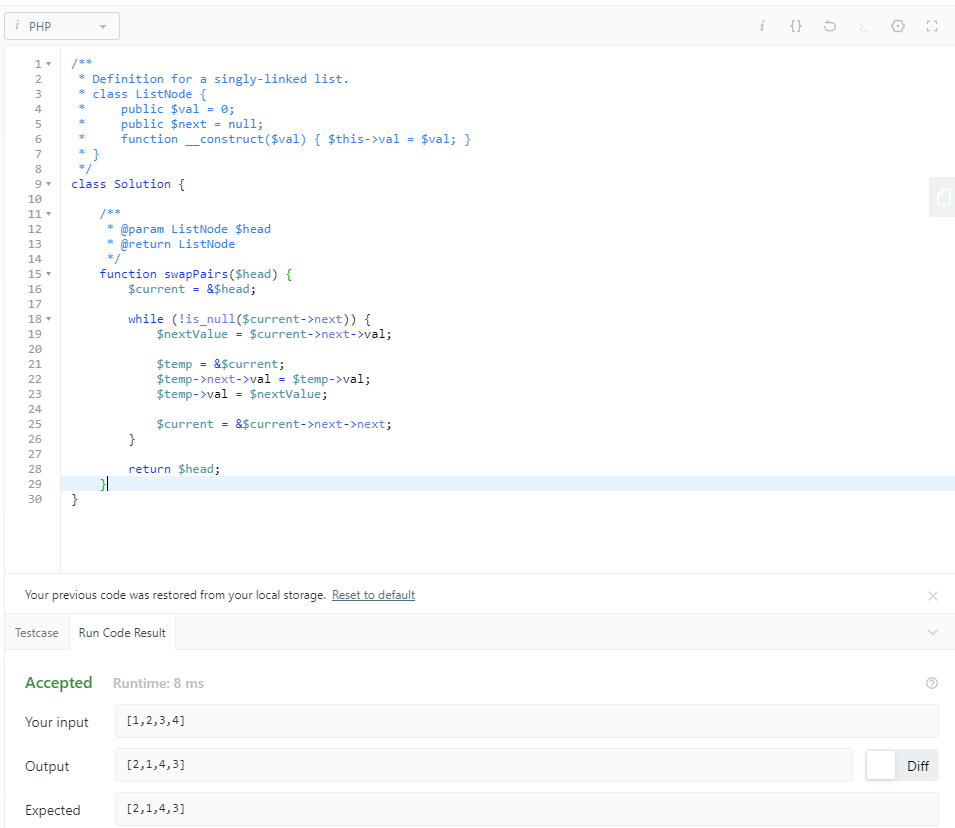
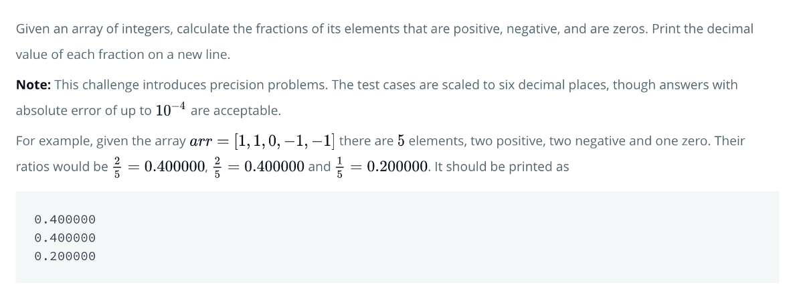

# 是否想自己解决更多的编程问题？

如果您喜欢解决这些问题，请转至我在本文中提到的网站之一。 大多数网站都提供许多免费的挑战，您可以尝试解决这些挑战。
+ LeetCode
+ 欧拉计划
+ 黑客排名
+ 编码字节
# 解决方案
## 1.加号减号

让您开始真正简单的解决方案是一个非常大的问题。
```
<?phpfunction getFractionals($numbers) { $length = count($numbers); $results = [  'positive' => 0,  'negative' => 0,  'zero' => 0, ];  for ($i = 0; $i < $length; $i++) {  if ($numbers[$i] < 0) {   $results['negative'] += 1;   } else if ($numbers[$i] > 0) {   $results['positive'] += 1;   } else {   $results['zero'] += 1;   } }  return [  $results['positive'] / $length,  $results['negative'] / $length,  $results['zero'] / $length   ];}print_r(getFractionals([1, 1, 0, -1, -1])); // [0.4, 0.4, 0.2]print_r(getFractionals([-4, 3, -9, 0, 4, 1])); // [0.5, 0.3333, 0.16667]
```
## 2.两个和

尽管这个问题比第一个问题要难一些，但解决这个问题应该不会有太多麻烦。 我使用了一种简单的蛮力方法。
```
<?phpfunction twoSum($numbers, $target) {  for ($i = 0; $i < count($numbers); $i++) {    for ($j = $i + 1; $j < count($numbers); $j++) {      if ($numbers[$j] + $numbers[$i] === $target) {        return [$i, $j];      }    }  }}print_r(twoSum([2, 7, 11, 15], 9)); // [0, 1]print_r(twoSum([2, 7, 11, 15], 17)); // [0, 3]
```
## 3.最大的回文产品

我想出的解决方案具有一个优势，它可以用于查找最大的回文数，该回文数是任意两个x位数的乘积。

我还添加了停止条件，以避免不必要的额外循环。
```
<?phpfunction isPalindrome($number) {  return (string) $number === strrev((string) $number);}function getBiggestPalindrome($digits) {  $start = pow(10, $digits) - 1;  $max = 0;for ($i = $start; $i > 0; $i--) {    if ($i * $start <= $max) {      break;      }for ($j = $start; $j > 0; $j--) {      $product = $i * $j;if ($product < $max) {        break;        }if ($product > $max && isPalindrome($product)) {        $max = $product;      }    }  }return $max;}echo getBiggestPalindrome(2); // 9009echo getBiggestPalindrome(3); // 906609, which is 993 * 913
```
## 4.独特的权力

我通过蛮力路线解决了独特的权力问题。

将每个结果添加到数组，然后从数组中删除重复项。 最后一步是对数组进行排序。
```
<?phpfunction distinctPowers($min, $max) { $numbers = [];  for ($i = $min; $i <= $max; $i++) {  for ($j = $min; $j <= $max; $j++) {     $numbers[] = pow($i, $j);  } }  $unique_numbers = array_unique($numbers); sort($unique_numbers);  return $unique_numbers;}echo print_r(distinctPowers(2, 5), 1); // [4, 8, 9, 16, 25, 27, 32, 64, 81, 125, 243, 256, 625, 1024, 3125]echo print_r(count(distinctPowers(2, 100)), 1); // 9183 distinct terms
```
## 5. Kaprekars Constant

Kaprekars Constant问题很难解决。 这是此列表中的第一个问题，需要递归才能解决。
```
function KaprekarsConstant($number, $numberOfIterations = 1) {  $number = (string) $number;    if (strlen($number) < 4) {    for ($i = strlen($number); $i < 4; $i++) {      $number .= '0';    }  }    $asc = str_split($number);  $desc = $asc;    rsort($desc);  sort($asc);    $asc_number = (int) implode($asc, '');  $desc_number = (int) implode($desc, '');  $difference = abs($asc_number - $desc_number);    if ($difference !== 6174) {    return KaprekarsConstant($difference, $numberOfIterations + 1);  }    return $numberOfIterations; }echo KaprekarsConstant(2111); // 5echo KaprekarsConstant(9831); // 7
```

> A screenshot of passing all test cases

## 6.成对交换节点

这花了我一段时间才弄清楚。 我的解决方案中的技巧是通过引用而不是通过值传递变量。 不过，这可能需要一些时间才能引起注意。
```
function swapPairs($head) {    $current = &$head;        while (!is_null($current->next)) {        $nextValue = $current->next->val;                $temp = &$current;        $temp->next->val = $temp->val;        $temp->val = $nextValue;                $current = &$current->next->next;    }        return $head;}
```

# 挑战性
## 1.加号减号

让我们从HackerRank提供的一个相对简单的问题开始。 这项挑战被归为热身。

## 2.两个和

LeetCode提供的挑战被认为很容易。

## 3.最大的回文产品

此问题由Euler项目提供，被认为是较容易解决的问题之一。 目前有超过455,000人解决了该问题。

这就是问题：

## 4.独特的权力

欧拉计划的另一个挑战。 这个问题比以前的问题要难一些。 大约有100,000人解决了此问题。

## 5. Kaprekars Constant

如果您已经做到这一点：恭喜！ 现在是开始第一个艰巨挑战的时候了。 该挑战由Coderbyte提供。

## 6.成对交换节点

到目前为止，绝对是最艰巨的挑战，此挑战由LeetCode提供。 尽管它被认为是中等难度的，但我发现这个问题比Kaprekars Constant更难解决。 这需要您知道链接列表的工作方式。

但是，我们不要过分详细-这是挑战：


> Photo by Fletcher Pride on Unsplash

# 您知道如何解决这些编程问题吗？
## 你能把头包住吗？

编程是关于解决问题的。 在本文中，我列出了来自几个包含编程问题的站点的六个编程问题。 此清单中的问题是根据解决的难易程度进行排序的，其中最容易解决的是第一名，而最难解决的是第六名。 你能把头包住吗？

我在本文底部提供了用PHP编码的这些编程问题的解决方案。 您可以选择一种编程语言来解决这些问题。

祝您好运解决这些问题，并祝您编程愉快！
```
(本文翻译自Daan的文章《Do You Know How to Solve These Programming Problems?》，参考：https://medium.com/better-programming/do-you-know-how-to-solve-these-programming-problems-18d04defc05e)
```
