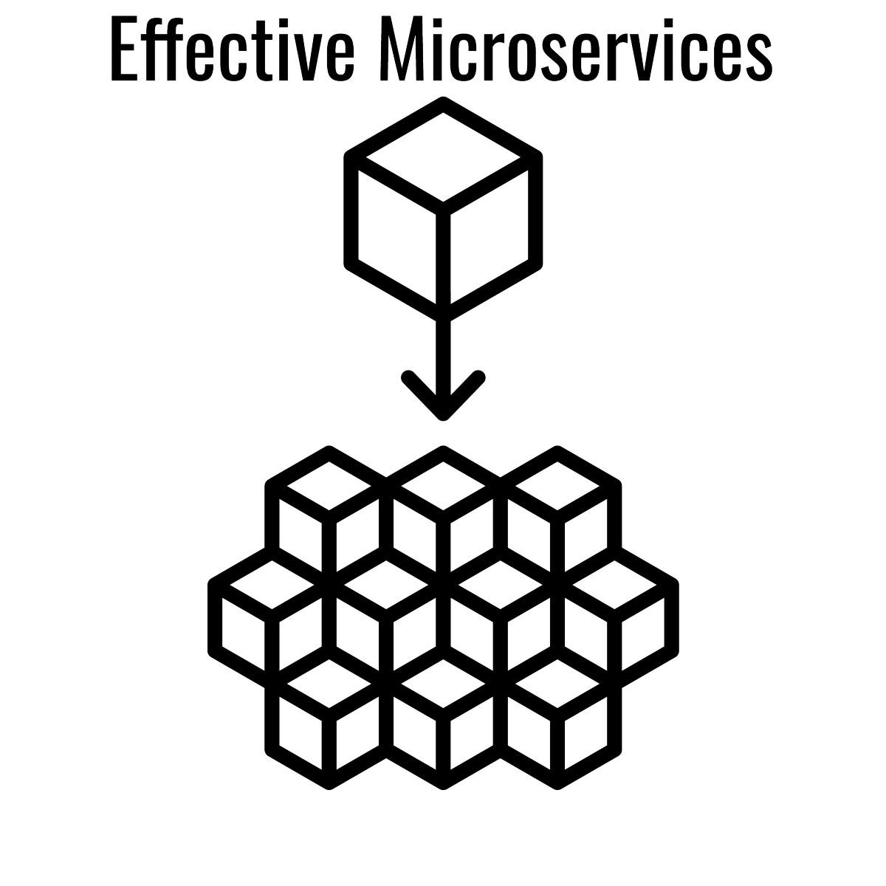

# 有效的微服务：10个最佳实践
## 正确实施微服务架构的10条技巧

> Effective Microservices: 10 Best Practices

在上一篇文章：微服务体系结构：简要概述以及为什么要在下一个项目中使用它，我已经详细讨论了微服务体系结构以及在现代软件开发中使用微服务体系结构的优点/缺点。 那么，微服务架构到底是什么？ 这是我的定义：

微服务体系结构是将软件系统分解为自主模块，这些自主模块可独立部署，并通过轻量级，与语言无关的方式进行通信，并共同实现业务目标。

软件系统很复杂。由于人脑只能处理一定程度的复杂性，因此大型软件系统的高度复杂性会导致许多问题。大规模，复杂的软件系统难以开发，增强，维护，现代化，扩展。多年来，有许多尝试解决软件系统的复杂性。在70年代，David Parnas和Edsger W. Dijkstra引入了模块化软件开发，以解决软件系统的复杂性。在1990年代，引入了分层软件体系结构来解决业务应用程序的复杂性。自本世纪初以来，面向服务的体系结构（SOA）脱颖而出，以开发复杂的业务应用程序。微服务架构是处理现代软件应用程序复杂性的最新方法。可能会出现一个问题：为什么我们突然需要一种新的软件开发方法？简短的答案是，与软件开发相关的整个生态系统在过去十年中发生了巨大变化。如今，软件是使用敏捷方法开发的，使用CI / CD部署在Container + Cloud上，保留在NoSQL数据库上，呈现在现代浏览器或智能手机上，并且这些机器通过高速网络连接。由于这些因素，微服务架构于2012年诞生。
# 微服务或Monolith：

对于微服务与Monolith，主要有两类人持相反的观点。 对于一个团队来说，微服务架构完全是关于货真人秀或炒作驱动开发的，这只是技术成瘾的开发人员的游乐场。 对于另一组人来说，微服务架构是“一个统御一切的架构”，它可以消除任何软件系统的复杂性。 在我看来，微服务和Monolith体系结构是互补的。 对于长期精简的应用程序，Monolith Architecture是正确的方法。 另一方面，对于大型，复杂或有可能变得大型，复杂的应用程序，微服务架构是正确的解决方案。 现代软件开发是如此之大，以至于微服务体系结构和Monolith体系结构将以与SQL和NoSQL共存的相同方式共存。
# 最佳做法：

正确的方法设计微服务架构非常具有挑战性和难度。 与为所有人提供一种解决方案的Monolith体系结构相反，微服务体系结构针对不同的问题提供了不同的解决方案。 如果选择了错误的解决方案，那么微服务体系结构将是定时炸弹，注定会爆炸。 设计不良的微服务架构要比Monolith差。 定义一套微服务体系结构的最佳实践也很困难。 我见过一些会议演讲，一些著名和受人尊敬的软件工程师提出了适得其反的微服务架构最佳实践。

我在这里提出一些最佳实践，这些最佳实践将有助于开发有效的微服务应用程序，其中目标项目应该存在6个月以上，并且团队规模为中型到大型（6个以上的开发人员）。 全面披露了有关Microservice Architecture最佳做法的其他一些帖子，例如 Martin Fowler的微服务架构的特征或Chris Richardson的微服务模式的特征，或者Netflix的采用微服务：Tony Mauro的建筑设计课程。 也有一些很棒的演讲，例如 Stefan Tilkov撰写的《微服务模式和反模式》，David Schmitz撰写的《微服务严重失败的10条技巧》，Sam Newman撰写的《微服务原理》。

1.域驱动设计：开发微服务的最大挑战是将大型，复杂的应用程序拆分为小型的，自主的，可独立部署的模块。 如果微服务的拆分方式不正确，那么将存在紧密耦合的微服务，这些微服务将具有Monolith的所有缺点以及Microservices或分布式Monolith的所有复杂性。 幸运的是，已经有了一个可以在这方面大有帮助的解决方案。 当时的软件工程顾问Eric Evans经常遇到不同公司有关业务应用程序中软件复杂性的问题，并在2004年的“域驱动设计：解决软件核心中的复杂性”一书中总结了他的宝贵见解。 概述了三个核心概念：
+ 软件开发团队应与业务部门或领域专家紧密合作。
+ 建筑师/开发人员和领域专家应首先进行战略设计：查找有界上下文以及相关的核心域和泛在语言，子域，上下文映射。
+ 然后，建筑师/开发人员应进行战术设计，以将核心域分解为细粒度的构建基块：实体，价值对象，集合，集合根

关于域驱动设计的详细讨论不在本文的讨论范围之内，但是您应该阅读原始的DDD书《域驱动设计：解决埃里克·埃文斯（Eric Evans）的软件核心中的复杂性（蓝皮书），或者阅读一些现代DDD书《实现》。 Vaughn Vernon的域驱动设计（红皮书）。 如果将一个大型系统分为核心域和子域，然后将核心域和子域映射到一个或多个微服务，那么我们将获得理想的松耦合微服务。

2.每个微服务的数据库：将复杂应用程序拆分为微服务模块后，下一个挑战出现了，如何处理数据库？我们是否应该在微服务之间共享数据库。这个问题的答案是双刃剑。一方面，在微服务之间共享数据库将导致微服务之间的强大耦合，这与微服务架构的目标恰恰相反。即使数据库中有很小的变化，也需要团队之间的同步。同样，在一项服务中管理事务和数据库锁定也具有挑战性。但是在多个分布式微服务之间管理事务/锁定是一项艰巨的任务。另一方面，如果每个微服务都有自己的数据库/专用表，那么在微服务之间交换数据将打开潘多拉盒式挑战。结果，许多杰出的软件工程师都提倡在微服务之间共享一个实用的解决方案。但是，我认为，微服务完全是关于可持续和长期的软件开发。因此，每个微服务都应具有其数据库（或专用表）。

3.Micro Frontends：不幸的是，大多数后端开发人员对Frontend Development都有过时的看法，并认为Frontend Development很简单。由于大多数软件架构师都是后端开发人员，因此他们很少关注Frontend，而Frontend通常在体系结构设计中被忽略。在微服务项目中，后端经常与数据库进行非常精细的模块化，但是只有一个Monolith前端。在最佳情况下，他们会考虑使用最热门的SPA（反应，角度，Vue）之一来开发Monolith Frontend。这种方法的主要问题在于，前端单体与我之前描述的后端单体一样糟糕。此外，当由于浏览器的更改而需要对前端进行现代化时，则需要进行大爆炸式现代化（这就是为什么许多公司仍在使用过时的Angular 1框架的原因）。网络简单但功能强大，并固有地提供了包含性。开发基于SPA的Microfrontend的方法有很多：使用iFrame，Web组件或通过（Angular / React）元素。

4.持续交付：微服务架构的关键USP之一是每个微服务都可以独立部署。 如果您有例如 要更改100个微服务，只需更改一个微服务，则只能更新一个微服务，而无需更改其他99个微服务。但是，在没有自动化的情况下独立部署100个微服务（DevOps，CI / CD）是一项艰巨的任务。 要充分利用此微服务功能，需要CI / CD和DevOps。 使用不带CI / CD，DevOps的微服务架构，自动化就像购买最新的保时捷，然后手动刹车驾驶。 难怪CI / CD被微服务专家Martin Fowler列为使用微服务体系结构的三个先决条件之一。

5，可观察性：微服务体系结构的主要缺点之一是软件开发变得简单，却以运营为代价。 使用一个Monolith，监视应用程序要简单得多。 但是，由于许多微服务在容器上运行，因此整个系统的可观察性变得非常关键和复杂。 甚至日志记录也变得很复杂，无法将来自许多容器/机器的日志聚合到一个中央位置。 幸运的是，市场上已经有许多企业级解决方案。 例如，ELK / Splunk提供微服务日志记录。 Prometheus / App Dynamics提供行业级的监视。 在微服务领域，另一个非常重要的可观察性工具是跟踪。 通常，对微服务的一个API请求会导致对其他微服务的多次级联调用。 要分析微服务系统的延迟，有必要测量每个单独的微服务的延迟。 Zipkin / Jaeger为微服务提供了出色的跟踪支持。

6.Unified Tech Stack：微服务架构告诉我们，对于微服务，采用最适合该微服务的编程语言和框架。 该声明不应从字面上理解。 有时，微服务可能需要新的Tech Stack，例如 对于CPU繁重/高性能的任务，可以选择C ++ / Rust之类的编程语言。 如果微服务可以与机器学习一起使用，也许Python是更好的选择。 但是，在没有任何充分理由的情况下使用不同的编程语言/框架可能会导致太多的编程语言和框架而没有任何真正的好处。 考虑一下使用Spring Boot + Kotlin + React + MySQL开发一种微服务的场景，另一种使用JakartaEE + Java + Angular + PostgreSQL开发，另一种使用Scala + Play Framework + VueJS + Oracle开发，那么它将需要很多 努力保持不同的编程语言，数据库，框架不会有太多收获。

7，异步通信：微服务架构中最具挑战性的设计决策之一是服务如何在彼此之间进行通信和共享数据。当每个微服务都有其自己的数据存储时，这一点尤为重要。通常，一个微服务可以并存，但不能单独满足所有业务目标。所有微服务一起工作以实现业务目标，并且一起工作，它们需要交换数据或触发其他微服务来完成任务。微服务之间最简单，最常见的通信方式是通过同步REST API，这是实用的但是短期解决方案。如果服务A调用服务B，服务B调用服务C，服务C同步调用服务D，则等待时间加在一起。另外，由于微服务主要是分布式系统，因此它们可能会失败。同步微服务通常会导致级联失败，即，一个服务的失败可能导致其他服务的失败。微服务之间的同步通信还导致微服务之间的紧密耦合。对于长期解决方案，微服务应该异步通信。微服务之间有多种异步通信方式：通过Message Queue，例如Kafka，通过异步REST（ATOM）或CQRS。

8.微服务优先：许多专家认为，对于未开发的（新）项目，最好从松散耦合的单片架构开始，因为微服务架构需要大量的初始工作来设置操作。 他们认为，一旦该项目变得足够成熟，就可以轻松地将“精巧”设计的Monolith转换为微服务。 但是，我认为这种方法在大多数情况下将失败。 实际上，Monolith内部的模块将紧密耦合，这将使其难以转换为微服务。 同样，一旦应用程序正式投入生产，要在不中断应用程序的情况下将其转换为微服务将变得更加困难。 因此，如果最终有计划使用微服务架构，我的建议是从微服务开始。

9，图书馆基础设施：在微服务软件开发的初期，Netflix主要使用Java编程来开发微服务。 他们还开发了许多库（包括Hystrix，Zuul的Netflix OSS Stack）。 许多公司遵循Netflix，并开始使用Netflix OSS库。 后来，许多公司（包括Netflix）发现Java并不是开发Microservices的事实上的语言，因为Java的体积庞大且存在冷启动问题。 Netflix后来转向Polyglot微服务范式，并决定不再进一步开发Netflix OSS，这将导致追随者公司陷入困境。 因此，与其大量投资特定语言的库（例如基于Java的Netflix OSS），不如使用框架（例如服务网格，API网关）更明智。

10，组织方面的考虑：大约50年前（1967年），梅尔文·康威（Melvin Conway）观察到，公司的软件架构受到组织结构（康威法则）的限制。 尽管观察已有50年历史，但MIT和哈佛商学院最近发现该法律在现代仍然有效。 如果组织计划开发微服务架构，则应相应地扩大团队规模（两个“美国” Pizza团队：7±2人）。 此外，团队应具有跨职能，并且理想情况下将拥有前端/后端开发人员，Ops工程和测试人员。 微服务架构仅在高级管理层还相应改变其观点和愿景的情况下才起作用。

如果您觉得这有帮助，请在您喜欢的论坛（Twitter，Facebook，LinkedIn）上分享。 评论和建设性批评受到高度赞赏。 谢谢阅读！
