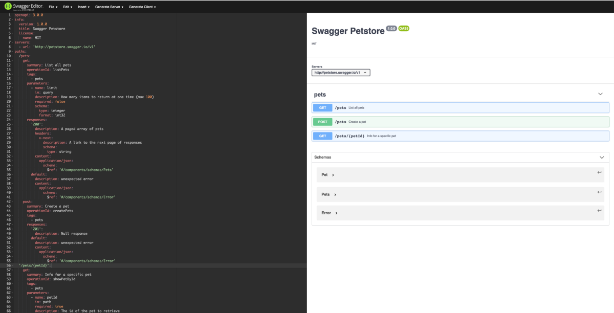
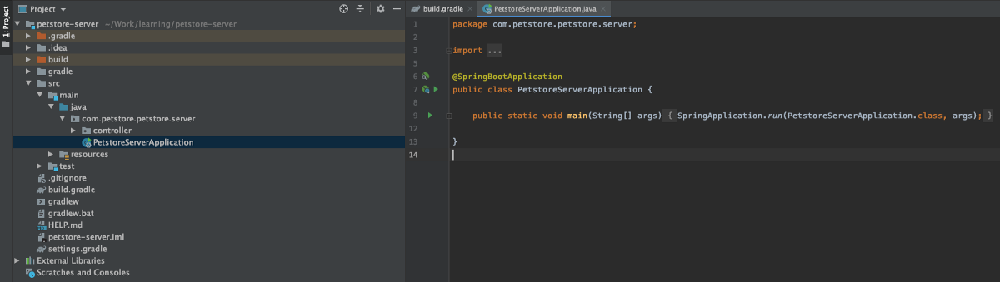
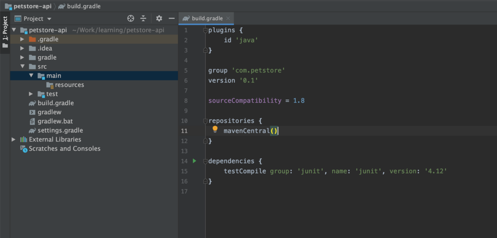
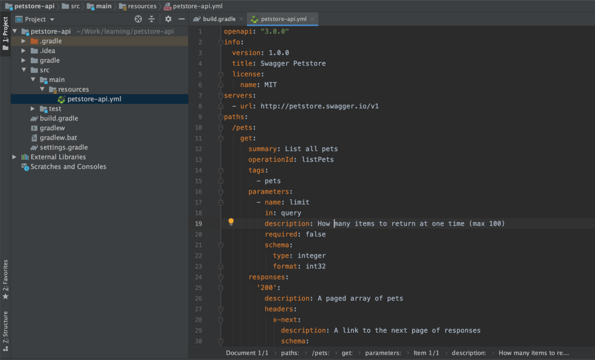
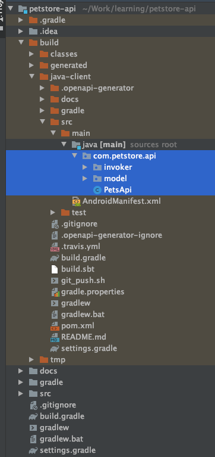
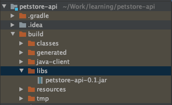
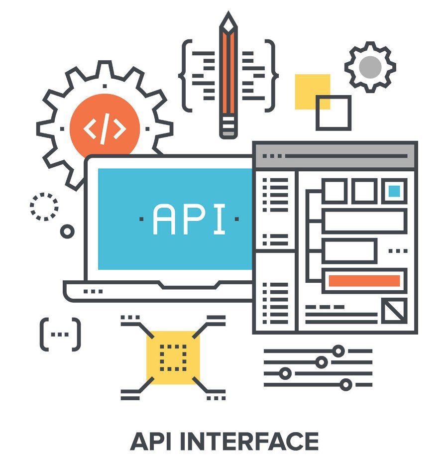

## Swagger编辑器
### SwaggerHub中团队的API设计Swagger Editor是开发人员用来定义……的最强大的设计工具之一。
# 操场：

是的，我们也得到了那个。 Swagger UI是用于与OpenAPI定义文件进行交互的开源UI，我们可以自己托管它，也可以使用SwaggerHub托管它。
## Swagger编辑器
### SwaggerHub中团队的API设计Swagger Editor是开发人员用来定义……的最强大的设计工具之一。

我们也可以在线查看它，请访问http://editor.swagger.io，复制粘贴API定义或从URL Petstore API Spec导入。 您将获得漂亮的界面。

# 结论

借助OpenAPI规范，我们可以
+ 使用API设计优先方法构建API，
+ 强制服务器和客户端实现符合相同的定义
+ 为客户端和服务器实现生成多种语言的代码
+ 使用API定义生成并保持文档最新
+ 使用我们的API具有更好的开发人员经验

OpenAPI还有其他一些您可能会感兴趣的工具，请查看OpenAPI工具

快乐的构建API…
## 参考：
+ https://swagger.io/specification
+ https://github.com/OpenAPITools/openapi-generator
+ https://swagger.io
+ https://github.com/ramesh-dev/petstore-demo-api
+ https://github.com/ramesh-dev/petstore-demo-server
## ramesh-dev / petstore-demo-server
### petstore open api定义的示例演示服务器，请查看文章，此代码由OpenAPI生成...
# 生成服务器代码：

更有趣的是，openapi-generator还可以使用相同的API定义（petstore-api.yml）生成服务器端代码，这不仅可以加快开发过程，而且可以帮助服务器坚持相同的标准API定义，并且 符合它。 因此，服务器API，其文档和客户端实现之间不再缺少同步：)

让我们快速建立一个新项目petstore-server，并使用相同的构建配置，而对生成器所做的更改很少，

我将其创建为春季启动应用，但您可以使用您选择的任何框架并相应地生成API代码。

> petstore-server setup


我的build.gradle文件看起来像这样，
```
plugins {
    id 'org.springframework.boot' version '2.2.0.RELEASE'
    id 'io.spring.dependency-management' version '1.0.8.RELEASE'
    id "org.openapi.generator" version "4.1.1"
    id 'java'
}

group = 'com.petstore'
version = '0.1'
sourceCompatibility = '11'

configurations {
    developmentOnly
    runtimeClasspath {
        extendsFrom developmentOnly
    }
    compileOnly {
        extendsFrom annotationProcessor
    }
}

repositories {
    mavenCentral()
}


ext {
    swagger_annotations_version = "1.5.22"
}

dependencies {
    implementation 'org.springframework.boot:spring-boot-starter-actuator'
    implementation 'org.springframework.boot:spring-boot-starter-web'
    implementation 'org.openapitools:jackson-databind-nullable:0.2.0'

    compileOnly 'org.projectlombok:lombok'
    developmentOnly 'org.springframework.boot:spring-boot-devtools'

    annotationProcessor 'org.springframework.boot:spring-boot-configuration-processor'
    annotationProcessor 'org.projectlombok:lombok'
    annotationProcessor "io.swagger:swagger-annotations:$swagger_annotations_version"

    testImplementation('org.springframework.boot:spring-boot-starter-test') {
        exclude group: 'org.junit.vintage', module: 'junit-vintage-engine'
    }
}

test {
    useJUnitPlatform()
}


/* Generate Server Code from OpenAPI definition */
def petstoreApiYml = "$rootDir/src/main/resources/petstore-api.yml".toString()

/* server code configuration */
task buildPetStoreServerCode(type: org.openapitools.generator.gradle.plugin.tasks.GenerateTask) {
    generatorName = "spring"
    inputSpec = petstoreApiYml
    outputDir = "$buildDir/generated".toString()

    groupId = "$project.group"
    id = "$project.name-java-client"
    version = "$project.version"
    apiPackage = "com.petstore.api"
    modelPackage = "com.petstore.api.model"
    enablePostProcessFile = true
    skipOverwrite = false
    configOptions = [
            configPackage       : "com.petstore.api.config",
            java8               : "true",
            dateLibrary         : "java8",
            serializationLibrary: "jackson",
            library             : "spring-boot",
            useBeanValidation   : "true",
            interfaceOnly       : "true",
            serializableModel   : "true",
            useTags             : "true"
    ]
}

// code will be generated during compilation
compileJava.dependsOn(buildPetStoreServerCode)


// attach the generated folder as source for this project
sourceSets {
    main {
        java {
            srcDir "$buildDir/generated/src/main/java"
        }
    }
}
```

如果您检查buildPetStoreServerCode任务，则这次我们使用spring作为生成器，并且与此生成器相关的更改很少，大部分更改保持不变。 检查我们的Spring生成器配置

现在我们可以简单地创建一个控制器PetsApiController，该控制器实现由开放API生成的PetsApi接口
```
@RestController
public class PetsApiController implements PetsApi {

    @Override
    public ResponseEntity<Void> createPets() {
        // create new pet :)
        return ResponseEntity.status(HttpStatus.CREATED).build();
    }

    @Override
    public ResponseEntity<List<Pet>> listPets(@Valid Integer limit) {

        Pet pet1 = new Pet();
        pet1.setId(1L);
        pet1.setName("kitty");
        pet1.setTag("cat");

        Pet pet2 = new Pet();
        pet2.setId(1L);
        pet2.setName("doe");
        pet2.setTag("dog");

        return ResponseEntity.ok(List.of(pet1, pet2));
    }

    @Override
    public ResponseEntity<Pet> showPetById(String petId) {

        Pet pet = new Pet();
        pet.setId(1L);
        pet.setName("kitty");
        pet.setTag("cat");

        return ResponseEntity.ok(pet);
    }
}
```

注意，PetsApi，Pet模型，方法定义全部来自生成的代码，现在我们的生活变得更加轻松！

完整的服务器代码可在Github上找到，
## ramesh-dev / petstore-demo-server
### petstore open api定义的示例演示服务器，请查看文章，此代码由OpenAPI生成...
# 更改API：

由于api定义托管在单独的存储库中，因此开发人员可以轻松地在不同的分支中进行更改并创建Pull Requests。 因此，可以安全地检查每个更改，检查设计质量和其他内容。 现在，我们可以建立构建管道来生成库，上传工件，更新文档全部在一个命令中。
## ramesh-dev / petstore-demo-api
### 您目前无法执行该操作。 您使用其他选项卡或窗口登录。 您已在另一个标签中退出，或…
# 配置：

对于此示例，我们将使用java＆gradle，但对于其他语言或环境，想法是相同的。 首先，使用您选择的IDE创建一个Gradle Java项目petstore-api，我使用IntelliJ Gradle 5。


一个普通的简单Java项目，您也可以从项目中删除Java源文件夹，因为我们不会编写任何代码:)。 这个项目是持有API合约（仅定义，没有代码）和库的常见方法，这些库可以直接在我们编写实际API以及生成客户端库的服务中使用。
# 蜜蜂：

对于API，我们将使用OpenAPI网站中提供的petstore示例，该示例定义了API以创建和获取宠物的信息。
```
openapi: "3.0.0"
info:
  version: 1.0.0
  title: Swagger Petstore
  license:
    name: MIT
servers:
  - url: http://petstore.swagger.io/v1
paths:
  /pets:
    get:
      summary: List all pets
      operationId: listPets
      tags:
        - pets
      parameters:
        - name: limit
          in: query
          description: How many items to return at one time (max 100)
          required: false
          schema:
            type: integer
            format: int32
      responses:
        '200':
          description: A paged array of pets
          headers:
            x-next:
              description: A link to the next page of responses
              schema:
                type: string
          content:
            application/json:    
              schema:
                $ref: "#/components/schemas/Pets"
        default:
          description: unexpected error
          content:
            application/json:
              schema:
                $ref: "#/components/schemas/Error"
    post:
      summary: Create a pet
      operationId: createPets
      tags:
        - pets
      responses:
        '201':
          description: Null response
        default:
          description: unexpected error
          content:
            application/json:
              schema:
                $ref: "#/components/schemas/Error"
  /pets/{petId}:
    get:
      summary: Info for a specific pet
      operationId: showPetById
      tags:
        - pets
      parameters:
        - name: petId
          in: path
          required: true
          description: The id of the pet to retrieve
          schema:
            type: string
      responses:
        '200':
          description: Expected response to a valid request
          content:
            application/json:
              schema:
                $ref: "#/components/schemas/Pet"
        default:
          description: unexpected error
          content:
            application/json:
              schema:
                $ref: "#/components/schemas/Error"
components:
  schemas:
    Pet:
      type: object
      required:
        - id
        - name
      properties:
        id:
          type: integer
          format: int64
        name:
          type: string
        tag:
          type: string
    Pets:
      type: array
      items:
        $ref: "#/components/schemas/Pet"
    Error:
      type: object
      required:
        - code
        - message
      properties:
        code:
          type: integer
          format: int32
        message:
          type: string
```

在资源文件夹下创建一个新文件petstore-api.yml，然后通过gist或Github从上方复制粘贴内容。

# 添加OpenAPI Generator插件：

这很容易，正式的开放API生成器存储库包含有关使用方法的信息，有关Gradle插件的Gradle设置阅读，将以下内容复制粘贴到build.gradle文件中，
```
def petstoreApiYml = "$rootDir/src/main/resources/petstore-api.yml".toString()

/* java client configuration */
task buildPetStoreJavaClient(type: org.openapitools.generator.gradle.plugin.tasks.GenerateTask) {
    generatorName = "java"
    inputSpec = petstoreApiYml
    outputDir = "$buildDir/java-client".toString()

    groupId = "$project.group"
    id = "$project.name-java-client"
    version = "$project.version"
    apiPackage = "com.petstore.api"
    invokerPackage = "com.petstore.api.invoker"
    modelPackage = "com.petstore.api.model"
    enablePostProcessFile = true
    skipOverwrite = false
    configOptions = [
            java8               : "true",
            dateLibrary         : "java8",
            serializationLibrary: "jackson",
            library             : "resttemplate",
            useBeanValidation   : "true",
            enableBuilderSupport: "true"
    ]
    systemProperties = [
            modelDocs: "true"
    ]
}

task generateCode(type: Copy, dependsOn: ['buildPetStoreJavaClient']) {

    def srcPath = "$buildDir/java-client"
    def targetPath = "$rootDir/docs"

    // copy docs
    from(srcPath + "/docs")
    into(targetPath)
    include('*.md')
}

// code will be generated during compilation
compileJava.dependsOn(generateCode)


// attach the generated folder as source for this project
sourceSets {
    main {
        java {
            srcDir "$buildDir/java-client/src/main/java"
        }
    }
}

```

这是上面代码的分解，

buildPetStoreJavaClient：这是一个自定义的Gradle任务，我们从openapi-generator插件提供的openApiGenerate任务扩展而来，该任务用于通过Open API Tools Generator为Open API 2.0或3.x规范文档生成代码。
+ generatorName：表示使用哪个生成器来生成代码，我们使用java，还有其他几种可用的生成器，例如Go，Koltin，Spring等，请查看生成器列表。 因此，您可以为不同的语言，客户端或服务器等生成代码。
+ 还有其他一些配置，例如包名称，工件定义等，可以进行配置，以进行更多检查
+ configOptions：定义需要传递给生成器的配置，对于每个生成器，配置可能有所不同，因为在我们的示例中，我们将其配置为使用java8日期库，Jackson进行序列化，启用BeanValidation等。有关更多信息，请检查Java 构型

generateCode：我编写了一个帮助程序任务，它将生成的文档从生成的文件夹复制到根docs文件夹，以便我们可以将其添加到git中。 注意：此任务将buildPetStoreJavaClient添加为依赖项

并且我们将generateCode添加为compileJava任务的依赖项，因此，每次编译代码时，都会生成该代码，
```
compileJava.dependsOn(generateCode)
```

让我们尝试运行compileJava任务，
```
./gradlew clean compileJava
```


该代码将在build / java-client目录中生成，

您还可以注意到它使用自己的项目结构，构建脚本，文档，自述文件等生成了整个项目。您可以在generate任务中配置这些选项。

最后，由于代码是在build目录中生成的，因此我们需要将代码添加到当前项目源中才能生成jar，将以下代码添加到build.gradle文件中，
```
// attach the generated folder as source for this projectsourceSets {    main {        java {            srcDir "$buildDir/java-client/src/main/java"        }    }}
```

同样，现在生成的代码是当前项目的源代码，如果现在进行编译，由于在当前项目中未定义这些代码所使用的依赖项，您将获得错误，请添加以下内容。注意：仅出于构建库的目的，这是必需的 。
```
// these dependencies are required for the generated code in order to buildext {    swagger_annotations_version = "1.5.22"    jackson_version = "2.9.9"    jackson_databind_version = "2.9.9"    spring_web_version = "4.3.9.RELEASE"    jodatime_version = "2.9.9"    junit_version = "4.12"    validation_version = "2.0.1.Final"}dependencies {    compile "io.swagger:swagger-annotations:$swagger_annotations_version"    compile "com.google.code.findbugs:jsr305:3.0.2"    compile "org.springframework:spring-web:$spring_web_version"    compile "com.fasterxml.jackson.core:jackson-core:$jackson_version"    compile "com.fasterxml.jackson.core:jackson-annotations:$jackson_version"    compile "com.fasterxml.jackson.core:jackson-databind:$jackson_databind_version"    compile "com.fasterxml.jackson.jaxrs:jackson-jaxrs-json-provider:$jackson_version"    compile "com.fasterxml.jackson.datatype:jackson-datatype-jsr310:$jackson_version"    testCompile "junit:junit:$junit_version"    compile group: 'javax.annotation', name: 'javax.annotation-api', version: '1.3.2'    compile "javax.validation:validation-api:$validation_version"}
```

因此完整的build.gradle文件应如下所示：
```
plugins {
    id 'java'
    id "org.openapi.generator" version "4.1.1"
}

group 'com.petstore'
version '0.1'

sourceCompatibility = 1.8

repositories {
    mavenCentral()
}

def petstoreApiYml = "$rootDir/src/main/resources/petstore-api.yml".toString()

/* java client configuration */
task buildPetStoreJavaClient(type: org.openapitools.generator.gradle.plugin.tasks.GenerateTask) {
    generatorName = "java"
    inputSpec = petstoreApiYml
    outputDir = "$buildDir/java-client".toString()

    groupId = "$project.group"
    id = "$project.name-java-client"
    version = "$project.version"
    apiPackage = "com.petstore.api"
    invokerPackage = "com.petstore.api.invoker"
    modelPackage = "com.petstore.api.model"
    enablePostProcessFile = true
    skipOverwrite = false
    configOptions = [
            java8               : "true",
            dateLibrary         : "java8",
            serializationLibrary: "jackson",
            library             : "resttemplate",
            useBeanValidation   : "true",
            enableBuilderSupport: "true"
    ]
    systemProperties = [
            modelDocs: "true"
    ]
}

task generateCode(type: Copy, dependsOn: ['buildPetStoreJavaClient']) {

    def srcPath = "$buildDir/java-client"
    def targetPath = "$rootDir/docs"

    // copy docs
    from(srcPath + "/docs")
    into(targetPath)
    include('*.md')
}

// code will be generated during compilation
compileJava.dependsOn(generateCode)


// attach the generated folder as source for this project
sourceSets {
    main {
        java {
            srcDir "$buildDir/java-client/src/main/java"
        }
    }
}


// these dependencies are required for the generated code in order to build
ext {
    swagger_annotations_version = "1.5.22"
    jackson_version = "2.9.9"
    jackson_databind_version = "2.9.9"
    spring_web_version = "4.3.9.RELEASE"
    jodatime_version = "2.9.9"
    junit_version = "4.12"
    validation_version = "2.0.1.Final"
}

dependencies {
    compile "io.swagger:swagger-annotations:$swagger_annotations_version"
    compile "com.google.code.findbugs:jsr305:3.0.2"
    compile "org.springframework:spring-web:$spring_web_version"
    compile "com.fasterxml.jackson.core:jackson-core:$jackson_version"
    compile "com.fasterxml.jackson.core:jackson-annotations:$jackson_version"
    compile "com.fasterxml.jackson.core:jackson-databind:$jackson_databind_version"
    compile "com.fasterxml.jackson.jaxrs:jackson-jaxrs-json-provider:$jackson_version"
    compile "com.fasterxml.jackson.datatype:jackson-datatype-jsr310:$jackson_version"
    testCompile "junit:junit:$junit_version"
    compile group: 'javax.annotation', name: 'javax.annotation-api', version: '1.3.2'
    compile "javax.validation:validation-api:$validation_version"
}

```

现在，事实上，当您运行build命令时，您会在bulid / libs下获得漂亮的Java客户端库，
```
./gradlew clean build
```

> generated client library


您可以将库上载到工件，maven Central，GitHub等，供其他开发人员使用，甚至用于您自己的服务（稍后将对此进行更多介绍）。

同样，您可以生成其他语言的库，因此其他开发人员只需使用YAML API定义即可轻松构建代码。

Github上提供了带有安装程序的api合同的完整源代码，
## ramesh-dev / petstore-demo-api
### 您目前无法执行该操作。 您使用其他选项卡或窗口登录。 您已在另一个标签中退出，或…
## OpenAPI规范
### 版本3.0.2关键字“必须”，“必须”，“必须”，“应有”，“应有”，“应有”，“应有”…
# 使用OpenAPI规范进行端到端的Restful API开发

> Image downloaded from the internet


随着越来越多的人采用面向服务的体系结构并更好地与外部系统集成，有必要为我们的服务编写Restful API。 在进行构建时，我们可能经常会遇到一些挑战，例如，
+ 标准和一致的API设计
+ 更好的文档
+ 客户图书馆
+ 游乐场（更好的开发人员经验）

因此，在编写API时，我们必须确保它遵循标准的设计原则，更新文档（在其他地方托管），最后编写客户端库（如果必须支持多种语言则更加困难）。 手动执行所有这些操作是一件痛苦的事情。

可能我们有OpenAPI规范（以前称为swagger），该规范为我们提供了一个标准的，与语言无关的接口来编写RESTful API，使人类和计算机都可以理解服务功能。

您可以阅读有关它的更多信息，这里有很多内容，这是官方网站，
## OpenAPI规范
### 版本3.0.2关键字“必须”，“必须”，“必须”，“应有”，“应有”，“应有”，“应有”…

简而言之，您可以在JSON或YAML文件中定义API，可以轻松将其转换为代码或文档。

在本文中，我们将研究如何使用OpenAPI规范，如何生成代码并在服务器和客户端使用它。
```
(本文翻译自Ramesh Lingappa的文章《End to End Restful API development using OpenAPI Specification》，参考：https://medium.com/swlh/end-to-end-restful-api-development-using-openapi-specification-c73d45e98c8d)
```
