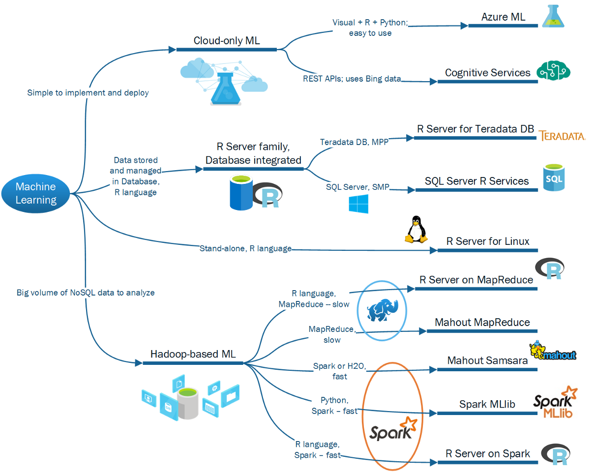
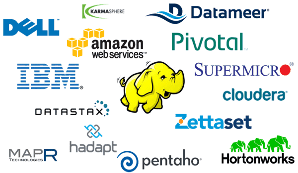
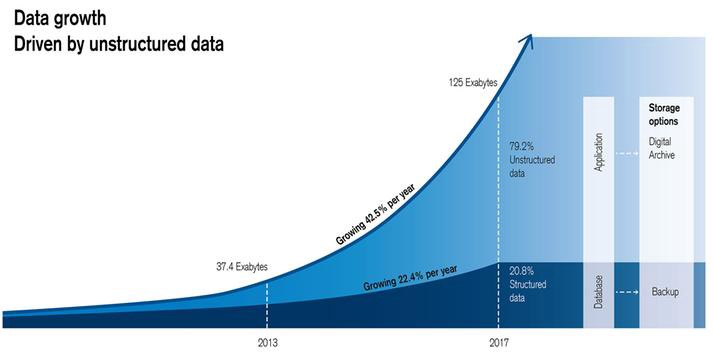
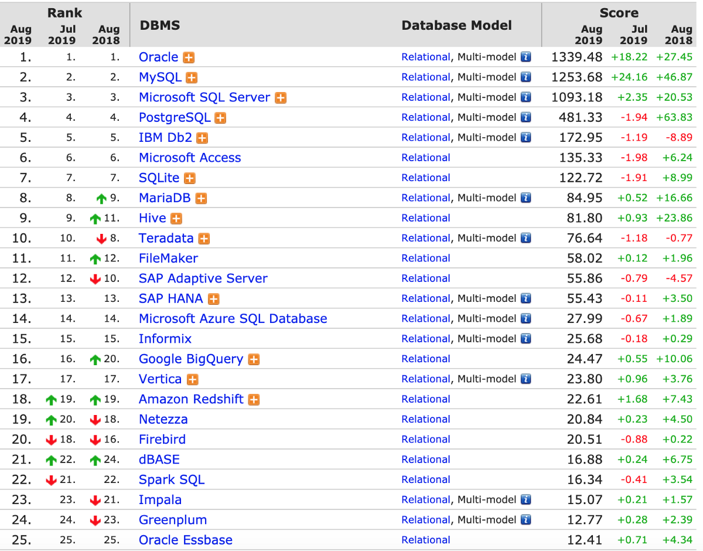
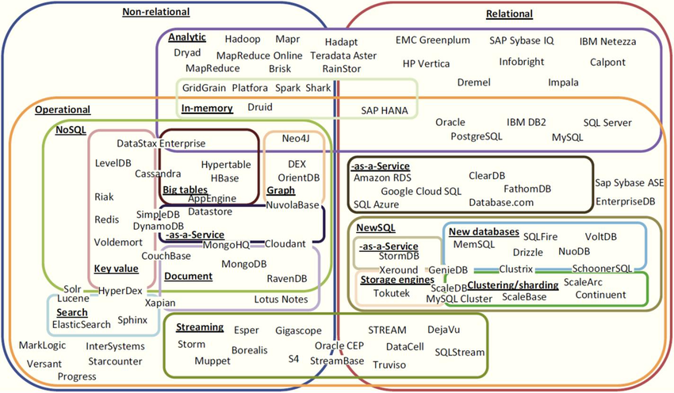
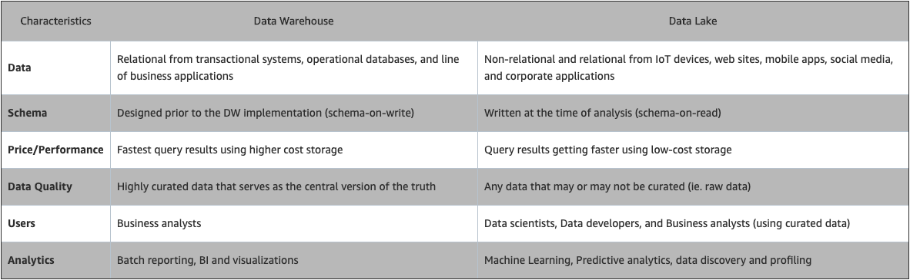
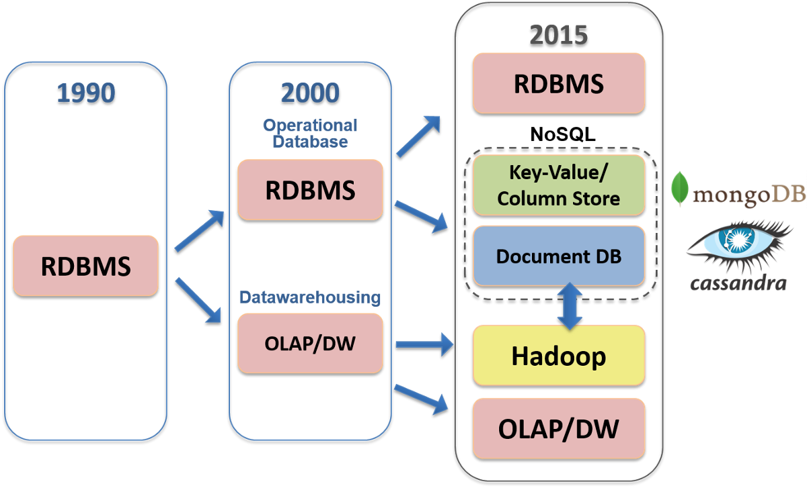
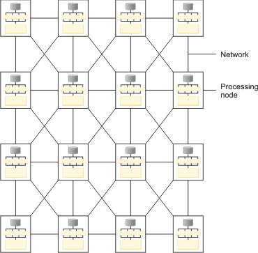
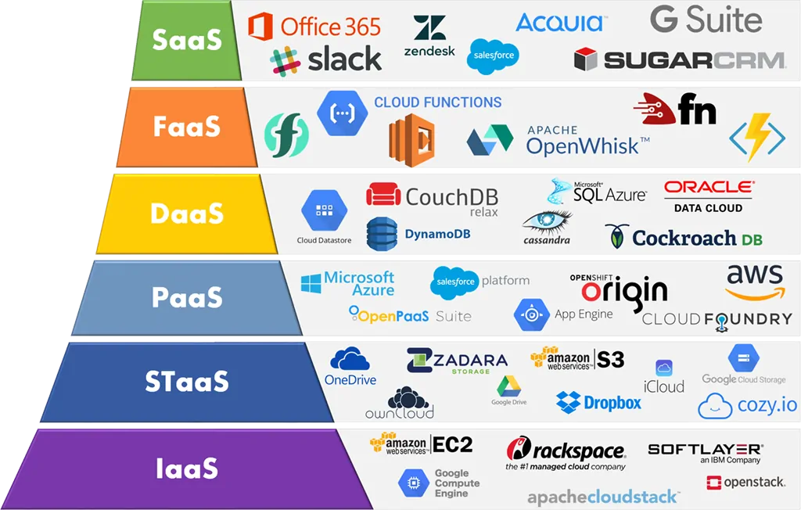
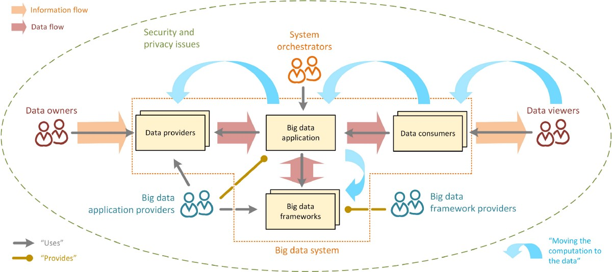

免责声明：本文中表达的观点是我们自己的观点，并不代表我们过去或现在的雇主的观点。
## 案例研究：为推荐应用程序启动构建端到端数据科学基础架构

> Machine learning packages for different types of data environment (Source: Kosyakov (2016))

构建可行的数据科学产品所涉及的不只是使用scikit-learn构建机器学习模型，对其进行腌制并将其加载到服务器上。 它需要了解企业生态系统的所有部分如何协同工作，从数据在何处/如何流入数据团队，处理/转换数据的环境，企业用于可视化/呈现数据的约定开始，以及 模型输出将转换为其他一些企业应用程序的输入。 主要目标涉及建立易于维护的流程； 在哪里可以迭代模型并且性能可重现； 并且其他利益相关者可以轻松理解和可视化模型的输出，以便他们可以做出更明智的业务决策。 要实现这些目标，就需要选择正确的工具，并了解行业中其他人在做什么以及最佳实践。

让我们用一个场景进行说明：假设您刚刚被聘为度假推荐应用程序启动的首席数据科学家，该应用程序有望收集数百GB的结构化（客户资料，温度，价格和交易记录）和非结构化（客户 每日来自用户的帖子/评论和图片文件）数据。 您的预测模型将需要每周重新训练以提供新数据，并根据需要立即提出建议。 由于您希望应用程序会大受欢迎，因此您的数据收集，存储和分析功能必须具有极高的可扩展性。 您将如何设计数据科学流程并生产模型？ 完成工作需要哪些工具？ 由于这是一家初创企业，而您是数据科学家的领导者（也许是唯一的），因此由您来做出这些决定。

首先，您必须弄清楚如何建立数据管道，该管道将从数据源中获取原始数据，处理数据，并将处理后的数据馈送到数据库中。理想的数据管道具有较低的事件等待时间（能够在收集到数据后立即查询数据）；可扩展性（能够随着您的产品规模处理大量数据）；交互式查询（同时支持批处理查询和较小的交互式查询，这些查询允许数据科学家探索表和模式）；版本控制（在不中断管道且不会丢失数据的情况下更改管道的能力）；监视（当数据停止进入时，管道应生成警报）；和测试（能够不间断地测试管道的能力）。也许最重要的是，最好不要干扰日常业务运营-例如如果您正在测试的新模型导致您的运营数据库陷入瘫痪，那么头将滚动。建立和维护数据管道通常是数据工程师的责任（有关更多详细信息，本文对为初创企业构建数据管道进行了很好的概述），但是数据科学家至少应该熟悉该过程，其局限性，以及访问处理后的数据进行分析所需的工具。

接下来，您必须决定是要设置本地基础结构还是使用云服务。 对于一家初创公司而言，最重要的是在不扩展运营资源的情况下扩展数据收集。 如前所述，内部部署基础架构需要大量的前期和维护成本，因此云服务对于初创公司而言往往是更好的选择。 云服务允许扩展以适应需求并需要最少的维护工作，因此您的一小团队人员可以专注于产品和分析，而不是基础架构管理。

> Examples of vendors that provide Hadoop-based solutions (Source: WikiCommons)

为了选择云服务提供商，您必须首先建立分析所需的数据，以及最适合这些数据类型的数据库和分析基础架构。 由于您的分析渠道中既有结构化数据又有非结构化数据，因此您可能要同时设置数据仓库和数据湖。 数据科学家需要考虑的重要事情是存储层是否支持构建模型所需的大数据工具，以及数据库是否提供有效的数据库内分析。 例如，某些ML库（例如Spark的MLlib）不能有效地与数据库一起用作数据的主要接口-必须先从数据库中卸载数据，然后才能对其进行操作，这可能是非常耗时的数据量 当您必须定期重新训练模型时，它会增长并可能成为瓶颈（从而导致另一种“前滚”情况）。

对于云中的数据科学，大多数云提供商都在努力开发其本机机器学习功能，以使数据科学家能够使用存储在其自己平台中的数据轻松构建和部署机器学习模型（亚马逊拥有SageMaker，谷歌拥有BigQuery ML，微软 具有Azure机器学习）。 但是工具集仍在开发中，并且常常不完整：例如，BigQuery ML当前仅支持线性回归，二进制和多类逻辑回归，K-means聚类和TensorFlow模型导入。 如果您决定使用这些工具，则必须彻底测试它们的功能，以确保它们能够按照您的要求进行操作。

选择云提供商时要考虑的另一项主要事情是锁定供应商。如果选择专有的云数据库解决方案，则很可能将无法访问本地环境中的软件或数据，因此更换供应商将需要迁移到其他数据库可能会很昂贵。解决此问题的一种方法是选择支持开源技术的供应商（这里是Netflix解释为什么他们使用开源软件的原因）。使用开源技术的另一个优势是，它们倾向于吸引更大的用户群体，这意味着您可以更轻松地雇用具有经验和技能的人员来在基础架构中工作。解决该问题的另一种方法是选择使用其他主要云提供商作为存储后端来提供云数据库解决方案的第三方供应商（例如Pivotal Greenplum和Snowflake），如果适合，您还可以将数据存储在多个云中创业的需求。

最后，由于您希望公司发展，因此必须采取稳健的云管理实践来保护您的云并防止数据丢失和泄漏，例如管理数据访问并保护接口和API。 您还希望实施数据治理最佳实践，以保持数据质量并确保您的Data Lake不会变成数据沼泽。

如您所见，在企业数据科学项目中，除了调整机器学习模型中的超参数之外，还有更多其他功能！ 我们希望这个高层次的概述能使您兴奋地学习更多有关数据管理的知识，并且也许可以从中获得一些启发，从而给饮水机的数据工程师留下深刻的印象。
## 非结构化数据和大数据工具的兴起

> IBM 305 RAMAC (Source: WikiCommons)

数据科学的故事实际上就是数据存储的故事。 在数字化时代之前，数据被存储在我们的头脑中，粘土板上或纸上，这使得汇总和分析数据非常耗时。 1956年，IBM推出了第一台带有磁性硬盘驱动器的商用计算机305 RAMAC。 整个设备需要30英尺x 50英尺的物理空间，重达一吨，每月花费3200美元，公司可以租用该设备以存储多达5 MB的数据。 从那以后的60年中，DRAM的每千兆字节价格已从1965年的26.4亿美元下降到2017年的4.9美元。除了价格便宜之外，数据存储也变得越来越密集/越来越小。 305 RAMAC中的磁盘存储每平方英寸存储一百位，而如今的典型磁盘存储每平方英寸存储超过万亿位。

数据存储成本和大小的显着降低结合在一起，才使当今的大数据分析成为可能。 以超低的存储成本，建立数据科学基础架构以从大量数据中收集和提取见解已成为企业的获利方法。 随着大量IoT设备不断生成和传输用户数据，企业正在收集与数量越来越多的活动有关的数据，从而创建了大量的高容量，高速度和高多样性的信息资产（或 “大数据的三个Vs”）。 其中大多数活动（例如电子邮件，视频，音频，聊天消息，社交媒体帖子）都会生成非结构化数据，这些数据占当今企业总数据的近80％，并且其增长速度是过去十年中结构化数据的两倍。

> 125 Exabytes of enterprise data was stored in 2017; 80% was unstructured data. (Source: Credit Suisse)

大量的数据增长极大地改变了数据的存储和分析方式，因为传统的工具和方法无法应对“三个大数据”。开发出了能够处理不断增长的数量和种类的新技术的新技术。 数据，并且速度更快，成本更低。 这些新工具还对数据科学家的工作方式产生深远影响-允许他们通过执行分析和构建以前无法实现的新应用程序，通过海量数据获利。 以下是我们认为每位数据科学家都应了解的主要大数据管理创新。

关系数据库和NoSQL

关系数据库管理系统（RDBMS）于1970年代问世，它使用结构化查询语言（SQL）语句查询和维护数据库，将数据存储为具有行和列的表。 关系数据库基本上是表的集合，每个表都具有一个模式，该模式严格定义了它们存储的数据的属性和类型，以及用于标识特定列或行以方便访问的键。 RDBMS格局曾经由Oracle和IBM统治，但是如今许多开源选项（例如MySQL，SQLite和PostgreSQL）同样受欢迎。

> RDBMS ranked by popularity (Source: DB-Engines)

关系数据库由于具有一些非常吸引人的特性而在商业世界中找到了家。在关系数据库中，数据完整性绝对至关重要。 RDBMS通过施加许多约束条件来确保存储的数据可靠且准确，从而满足跟踪，存储，帐号，订单，和付款。但是这些限制伴随着代价高昂的折衷。由于架构和类型的限制，RDBMS在存储非结构化或半结构化数据时非常糟糕。严格的架构也使RDBMS的设置，维护和增长变得更加昂贵。设置RDBMS要求用户事先具有特定的用例。对模式的任何更改通常都是困难且耗时的。此外，传统的RDBMS被设计为在单个计算机节点上运行，这意味着在处理大量数据时，它们的速度大大降低。分片RDBMS以便在保持ACID合规性的同时进行水平扩展也非常具有挑战性。所有这些属性使传统的RDBMS不能很好地处理现代大数据。

到2000年代中期，现有的RDBMS不再能够处理一些非常成功的在线业务的变化需求和指数增长，结果开发了许多非关系（或NoSQL）数据库（这是有关Facebook如何处理的故事 数据量开始增长时受到MySQL的限制）。 当时还没有任何已知的解决方案，这些在线业务发明了新的方法和工具来处理他们收集的大量非结构化数据：Google创建了GFS，MapReduce和BigTable； 亚马逊创建了DynamoDB； 雅虎创建了Hadoop； Facebook创建了Cassandra和Hive； LinkedIn创建了Kafka。 这些业务中有一些是开源的。 一些发表的研究论文详细介绍了它们的设计，导致使用新技术的数据库激增，NoSQL数据库成为该行业的主要参与者。

> An explosion of database options since the 2000’s. Source: Korflatis et. al (2016)

NoSQL数据库与模式无关，并提供存储和处理大量非结构化和半结构化数据所需的灵活性。用户无需知道在设置过程中将存储什么类型的数据，并且系统可以适应数据类型和架构的更改。设计用于在不同节点之间分布数据，NoSQL数据库通常具有更高的水平可扩展性和容错性。但是，这些性能优势也要付出代价-NoSQL数据库不符合ACID，并且不能保证数据的一致性。相反，它们提供了“最终的一致性”：当旧数据被覆盖时，它们会暂时返回错误的结果。例如，当人们同时搜索给定术语时，Google的搜索引擎索引无法覆盖其数据，因此当我们进行搜索时，它不会为我们提供最新的结果，但可以为我们提供最新，最佳的答案它可以。尽管此设置在绝对需要数据一致性（例如财务交易）的情况下不起作用；对于需要速度而不是精确度的任务来说，这是很好的选择。

现在有几种不同的NoSQL类别，每种类别都有特定的用途。键值存储（例如Redis，DynamoDB和Cosmos DB）仅存储键值对，并提供用于检索与已知键关联的值的基本功能。当速度很重要时，它们最适合使用简单的数据库架构。宽列存储（例如Cassandra，Scylla和HBase）将数据存储在列族或表中，并被构建为在大规模分布式系统中管理PB级数据。文档存储（例如MongoDB和Couchbase）以XML或JSON格式存储数据，文档名称为键，文档内容为值。这些文档可以包含许多不同的值类型，并且可以嵌套，使它们特别适合于管理分布式系统中的半结构化数据。诸如Neo4J和Amazon Neptune之类的图形数据库将数据表示为相关节点或对象的网络，以便于数据可视化和图形分析。图形数据库对于分析异构数据点之间的关系特别有用，例如在欺诈预防或Facebook的朋友图形中。

MongoDB是目前最流行的NoSQL数据库，并且为一些使用传统RDBMS方法处理非结构化数据的企业提供了可观的价值。 这是两个行业示例：大都会人寿（MetLife）花费了数年时间试图在可以处理其所有保险产品的RDBMS上建立集中式客户数据库之后，内部黑客马拉松中的某人在数小时内就用MongoDB构建了一个数据库，并在90天内投入生产。 市场研究公司YouGov每小时收集5 GB的数据，通过从RDBMS迁移到MongoDB，节省了以前使用的70％的存储容量。

数据仓库，数据湖和数据沼泽

随着数据源的不断增长，使用多个数据库执行数据分析变得效率低下且成本高昂。 1980年代出现了一种称为数据仓库的解决方案，该解决方案集中了企业所有数据库中的数据。 数据仓库通过创建来自各种来源（内部和外部）的单个数据存储库，支持从操作系统到分析/决策系统的数据流。 在大多数情况下，数据仓库是一个关系数据库，用于存储经过处理的数据，这些数据针对收集业务见解进行了优化。 它收集来自交易系统和业务应用程序的具有预定结构和架构的数据，并且该数据通常用于运营报告和分析。

但是，由于存储在数据仓库中的数据需要在存储之前进行处理-使用当今大量的非结构化数据，这可能会花费大量时间和资源。 作为响应，企业开始在2010年代维护Data Lakes，该数据湖以任意规模存储企业的所有结构化和非结构化数据。 数据湖存储原始数据，无需先定义数据结构和架构即可进行设置。 数据湖使用户无需将数据移至单独的分析系统即可运行分析，从而使企业能够从以前无法进行分析的新数据源中获取见解，例如，通过使用日志文件中的数据构建机器学习模型， 点击流，社交媒体和物联网设备。 通过使所有企业数据易于分析，数据科学家可以回答一组新的业务问题，或者用新数据解决旧问题。

> Data Warehouse and Data Lake Comparisons (Source: AWS)

Data Lake体系结构的一个共同挑战是，如果没有适当的数据质量和治理框架，当数以千亿计的结构化和非结构化数据流入Data Lakes时，对它们的内容进行分类通常变得非常困难。 由于存储的数据太乱而无法使用，因此数据湖可能会变成数据沼泽。 现在，许多组织都在呼吁采取更多的数据治理和元数据管理实践，以防止形成数据沼泽。

分布式和并行处理：Hadoop，Spark和MPP

undefined

> Evolution of database technologies (Source: Business Analytic 3.0)

当您考虑Hadoop时，请考虑“分布式”。Hadoop由三个主要组件组成：Hadoop分布式文件系统（HDFS），一种跨多个（分布式）物理硬盘驱动器存储和跟踪数据的方式； MapReduce，一个用于在分布式处理器上处理数据的框架；还有另一个资源协商程序（YARN），它是一个群集管理框架，可在分布式计算机之间协调诸如CPU使用率，内存和网络带宽分配之类的事物的分布。 Hadoop的处理层是一项特别引人注目的创新：MapReduce是一种两步计算方法，用于以可靠，容错的方式处理分布在大型商品硬件集群中的大型（多TB或更大）数据集。第一步是将数据分布在多台计算机（地图）上，每台计算机并行对其数据切片执行计算。下一步是以成对的方式合并这些结果（减少）。 Google于2004年在MapReduce上发表了一篇论文，该论文得到了Yahoo程序员的青睐，他们于2006年在开源Apache环境中实现了该功能，从而为每家企业提供了使用商品硬件存储前所未有的数据量的功能。即使该想法有许多开源实现，Google品牌名称MapReduce仍然存在，就像极可意浴缸或Kleenex。

Hadoop专为迭代计算而构建，可通过一次操作从磁盘扫描大量数据，将处理分布在多个节点上，并将结果存储回磁盘。 在Hadoop和HBase中，在传统的数据仓库环境中运行需要4个小时才能运行的索引数据的ZB的查询可以在10到12秒内完成。 Hadoop通常用于生成复杂的分析模型或大容量数据存储应用程序，例如追溯和预测分析。 机器学习和模式匹配； 客户细分和客户流失分析； 和活动档案。

但是MapReduce批量处理数据，因此不适合处理实时数据。 Apache Spark成立于2012年，以填补这一空白。 Spark是一个并行数据处理工具，通过在内存中处理数据来优化速度和效率。它以相同的MapReduce原理运行，但是通过完成内存中的大多数计算并且仅在内存已满或计算完成时才写入磁盘，才能运行得更快。这种内存内计算使Spark“在内存中运行程序的速度比Hadoop MapReduce快100倍，在磁盘上的速度快10倍。”但是，当数据集太大而导致RAM不足成为问题时（通常为数百GB或更多） ），Hadoop MapReduce可能会胜过Spark。 Spark还具有广泛的数据分析库集，涵盖了广泛的功能：用于SQL和结构化数据的Spark SQL；用于SQL和结构化数据的Spark SQL；用于SQL的Spark SQL。 MLib用于机器学习，Spark Streaming用于流处理，而GraphX用于图形分析。由于Spark的重点是计算，因此它没有自己的存储系统，而是在各种存储系统（例如Amazon S3，Azure存储和Hadoop的HDFS）上运行。

> In an MPP system, all the nodes are interconnected and data could be exchanged across the network (Source: IBM)

并非只有Hadoop和Spark能够利用群集来处理大量数据。分布式查询处理的另一种流行的计算方法称为大规模并行处理（MPP）。与MapReduce相似，MPP在多个节点之间分布数据处理，并且节点并行处理数据以提高速度。但是与Hadoop不同，MPP用于RDBMS，并使用“无共享”架构-每个节点都使用多核处理器处理自己的数据片段，使其速度比传统RDBMS快许多倍。一些MPP数据库，例如Pivotal Greenplum，具有成熟的机器学习库，可用于数据库内分析。但是，与传统的RDBMS一样，大多数MPP数据库不支持非结构化数据，甚至结构化数据也需要进行一些处理才能适合MPP基础结构；因此，要花费更多的时间和资源来建立MPP数据库的数据管道。由于MPP数据库符合ACID标准，并且提供的速度比传统RDBMS快得多，因此它们通常用于高端企业数据仓库解决方案中，例如Amazon Redshift，Pivotal Greenplum和Snowflake。作为一个行业示例，纽约证券交易所每天接收4到5 TB的数据，并进行复杂的分析，市场监视，容量计划和监视。该公司一直在使用无法处理工作负载的传统数据库，该数据库要花几个小时才能加载，查询速度也很慢。转移到MPP数据库后，其每日分析运行时间减少了八个小时。

云服务

彻底改变企业大数据分析功能的另一项创新是云服务的兴起。 在云服务可用之前的糟糕年代，企业不得不从软件和硬件供应商那里购买本地数据存储和分析解决方案，通常要支付前期永久性软件许可费以及年度硬件维护和服务费。 最重要的是用于构建和维护本地基础结构的电源，冷却，安全，灾难保护，IT人员等的成本。 即使从技术上讲，可以存储和处理大数据，但大多数企业发现大规模进行此操作成本过高。 使用本地基础架构进行扩展还需要大量的设计和采购过程，这需要很长时间才能实施，并且需要大量的前期资金。 结果，许多潜在有价值的数据收集和分析可能性被忽略了。

> “As a Service” providers: e.g. Infrastructure as a Service (IaaS) and Storage as a Service (STaaS) (Source: IMELGRAT.ME)

在2000年代末推出云服务后，本地模型开始迅速失去市场份额-在过去十年中，全球云服务市场每年以15％的速度增长。云服务平台提供按需付费的方式通过互联网交付的各种服务（从虚拟计算到存储基础结构再到数据库）的订阅，为客户提供快速访问灵活且低成本的存储和虚拟计算的机会资源。云服务提供商负责所有其硬件和软件的购买与维护，并且通常拥有庞大的服务器网络和支持人员以提供可靠的服务。许多企业发现他们可以使用云服务显着降低成本并提高运营效率，并且能够利用现成的云资源及其内置的可扩展性更快地开发和生产其产品。通过消除建立本地基础架构的前期成本和时间承诺，云服务还降低了采用大数据工具的障碍，并有效地使中小型企业的大数据分析民主化。

有几种云服务模型，最常见的是公共云。在公共云中，所有硬件，软件和其他支持基础结构均由云服务提供商拥有和管理。客户与其他“云租户”共享云基础架构，并通过Web浏览器访问其服务。私有云通常由具有特殊安全需求的组织（例如政府机构和金融机构）使用。在私有云中，服务和基础架构专用于一个组织，并在私有网络上维护。私有云可以是本地的，也可以由其他地方的第三方服务提供商托管。混合云将私有云与公共云结合在一起，使组织可以利用两者的优势。在混合云中，数据和应用程序可以在私有云和公共云之间移动，以实现更大的灵活性：公共云可用于大批量，低安全性数据，私有云可用于敏感的关键业务数据，例如财务报告。多云模型涉及多个云平台，每个平台都提供特定的应用程序服务。多云可以是公共云，私有云和混合云的组合，以实现组织的目标。组织经常选择多云以适合其特定的业务，位置和时间需求，并避免供应商锁定。
# 数据科学家应了解的有关数据管理的一切*
## （*但是不敢问）

> NIST Big Data Taxonomy (Source: WikiCommons)

Phoebe Wong和Robert Bennett

要成为真正的“全栈”数据科学家，或者被许多博主和雇主称为“独角兽”，您必须掌握数据科学过程的每个步骤-从存储数据到完成产品的整个过程（通常是预测模型）。但是，大多数数据科学培训都集中在机器/深度学习技术上。数据管理知识通常被认为是事后的想法。数据科学专业的学生通常会使用笔记本电脑上存储的文本文件中经过处理和清理的数据来学习建模技能，而忽略了如何制作数据香肠。学生通常不会意识到在行业环境中，从各种来源获取原始数据以进行建模通常是工作的80％。而且，由于企业项目通常涉及其本地计算机无法处理的大量数据，因此整个建模过程通常在云中进行，大多数应用程序和数据库托管在其他数据中心的服务器上。即使在学生找到了数据科学家的工作之后，数据管理通常也变成了由单独的数据工程团队负责的事情。结果，太多的数据科学家对数据存储和基础设施知之甚少，这常常损害了他们在工作中做出正确决定的能力。本文的目的是为2019年数据科学家应了解的数据管理提供一个路线图-从数据库类型，数据在何处以及如何存储和处理到当前的商业选择-以便有抱负的“独角兽”可以自己更深入地学习，或者至少在面试和鸡尾酒会上学到足够多的声音。
