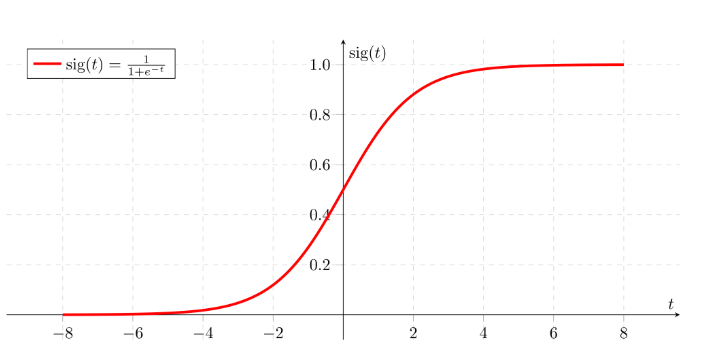

## 处理类不平衡数据时使用专门为此造成的损失
### 通过添加约10行代码，可以在严重的类不平衡数据上将精度提高4％以上。
## 使用辅助旋转损耗的自我监督GAN
### 缩小有监督和无监督图像生成之间的差距
## 您需要了解的有关MobileNetV3及其与以前版本的比较的所有信息
### 论文评论：搜索MobilenetV3，ICCV’19
## 您需要了解的有关Auto-Deeplab的所有信息：Google关于细分的最新信息
### 搜索模型以进行图像分割
# 您需要了解的有关深度学习模型中“激活功能”的所有信息

本文是您与深度学习模型中使用的与激活功能相关的每个可能问题的一站式解决方案。 这些基本上是我关于激活功能的注释，以及我对这个主题拥有的所有知识的总括在一个地方。 因此，在不进行任何不必要的介绍的情况下，让我们直接开始工作。
# 内容
+ 什么是激活功能？它在网络中起什么作用？
+ 为什么需要它，为什么不使用线性函数呢？
+ 激活功能中需要具备哪些功能？
+ 使用中的各种非线性激活
+ 最新研究显示出显着的非线性激活
+ 如何（以及在深度神经网络中使用它们）
# 什么是激活功能？

简而言之，激活函数是一种功能，已添加到人工神经网络中，以帮助网络学习数据中的复杂模式。 与大脑中基于神经元的模型进行比较时，激活功能最终决定了要发射到下一个神经元的东西。 这也正是激活函数在ANN中所做的。 它吸收前一个单元的输出信号，并将其转换为某种形式，可以作为下一个单元的输入。 比较可以总结在下图中。

> Source: cs231n by Stanford

# 为什么需要它？

在网络中具有非线性激活功能有多种原因。
+ 除了前面讨论的生物学相似性之外，它们还有助于将神经元输出的值限制为根据我们的要求限制在一定范围内。 这很重要，因为激活函数的输入是W * x + b，其中W是单元的权重，x是输入，然后在其上加上偏差b。 如果不限制在某个值上，则该值的幅度可能会非常高，尤其是在具有数百万个参数的非常深的神经网络的情况下。 这将导致计算问题。 例如，有一些激活函数（如softmax）针对不同的输入值（0或1）输出特定的值。
+ 激活函数中最重要的功能是其将非线性添加到神经网络的能力。 为了理解这一点，让我们考虑多维数据，如下图所示：


使用三个特征（此图中的体重，收缩压和年龄）的线性分类器可以为我们提供一条穿过3-D空间的线，但是它将永远无法准确地了解使人成为吸烟者或非吸烟者的模式 -smoker（手头的分类问题），因为定义此分类的模式根本不是线性的。 出现了人工神经网络。 如果我们使用具有单个单元格但没有激活功能的ANN，该怎么办。 所以我们的输出基本上是W * x + b。 但这不好，因为W * x也具有1的次数，因此是线性的，这基本上与线性分类器相同。

如果我们堆叠多层，该怎么办。 让我们将nᵗʰ层表示为函数fₙ（x）。 因此，我们有：

o（x）=fₙ（fₙ₋₁（....f₁（x））

但是，这还不够复杂，尤其是对于诸如计算机视觉或自然语言处理所面临的模式非常高的问题。

为了使模型具有学习非线性模式的能力（又称较高程度的复杂性），在它们之间添加了特定的非线性层（激活函数）。
# 激活功能的理想功能
+ 消失梯度问题：使用过程梯度下降训练神经网络。梯度下降包括反向传播步骤，该步骤基本上是链式规则，可获取权重变化，以减少每个时期后的损失。考虑两层网络，第一层表示为f 1（x），第二层表示为f 2（x）。整个网络为o（x）= f 2（f₁（x））。如果我们在向后传递过程中计算权重，则得到o`（x）= f 2（x）*f₁`（x）。这里f₁（x）本身就是一个由Act（W₁*x₁+b₁）组成的复合函数，其中Act是第1层之后的激活函数。再次应用链式规则，我们清楚地看到f₁`（x）= Act（W₁*x₁） +b₁）*x₁，这也直接取决于激活值。现在想象一下，这样的链规则在反向传播时会经历多层。如果Act（）的值在0到1之间，则将多个这样的值相乘以计算初始层的梯度。这会降低初始层的渐变值，并且这些层将无法正确学习。换句话说，由于网络深度和激活将值移至零，它们的梯度趋于消失。这称为消失梯度问题。因此，我们希望激活函数不要将梯度移向零。
+ 零中心：激活函数的输出应对称于零，以使梯度不会偏移到特定方向。
+ 计算费用：激活函数应用在每一层之后，在深度网络中需要进行数百万次计算。 因此，它们在计算上应该便宜。
+ 可微：如前所述，神经网络是使用梯度下降过程训练的，因此模型中的各层需要部分可微或至少可微。 这是功能用作激活功能层的必要条件。
# 使用中的各种非线性激活
+ 乙状结肠：乙状结肠定义为：


此激活功能仅出于历史原因，从未在实际模型中使用。 它在计算上很昂贵，导致消失的梯度问题，而不是零中心。 此方法通常用于二进制分类问题。
+ Softmax：softmax是乙状结肠的更广义形式。 它用于多类分类问题。 与S形相似，它产生的值在0-1范围内，因此在分类模型中用作最后一层。
+ tanh：tanh定义为：


如果将它与S型相比较，它只能解决零中心问题。
+ ReLU：ReLU（整流线性单位）定义为f（x）= max（0，x）：


这是一种广泛使用的激活函数，尤其是在卷积神经网络中。 它易于计算，不会饱和，也不会引起消失梯度问题。 它只有一个不以零为中心的问题。 它遭受“垂死的ReLU”问题的困扰。 由于所有负输入的输出均为零。 它导致某些节点完全死掉，并且不学习任何东西。

ReLU的另一个问题是爆炸的激活，因为它的上限是inf。 有时这会导致无法使用的节点。
+ 泄漏ReLU和参数ReLU：定义为f（x）= max（αx，x）

> the figure is for α = 0.1


在这里，α是通常设置为0.01的超参数。 显然，Leaky ReLU在某种程度上解决了“垂死的ReLU”问题。 请注意，如果将α设置为1，则Leaky ReLU将成为线性函数f（x）= x，将无用。 因此，α的值永远不会设置为接近1。如果我们将α分别设置为每个神经元的超参数，则会得到参数ReLU或PReLU。
+ ReLU6：基本上是ReLU限制在正极，它定义为f（x）= min（max（0，x），6）


这有助于停止激活激增，从而停止梯度爆炸（变为inf），以及正常ReLU发生的另一个小问题。

想到的一个主意是，为什么不将ReLU6和LeakyReLU结合起来解决以前的激活功能所存在的所有已知问题。 流行的DL框架没有提供这种激活功能的实现，但是我认为这是个好主意。
# 最新研究显示出显着的非线性激活
+ Swish：这是Ramachandran等人于2017年提出的建议。 定义为f（x）= x * Sigmoid（x）。


与ReLU相比，它的性能稍好一些，因为它的图形与ReLU非常相似。 但是，由于它在某个点不会像ReLU在x = 0时那样突然改变，因此在训练时更易于收敛。

但是，Swish的缺点是计算量大。 为了解决这个问题，我们来讨论下一个Swish版本。
+ 硬摆或高摆：定义为：


最好的部分是，它几乎与swish相似，但计算成本较低，因为它用ReLU（线性类型）代替了S型（指数函数）。
# 如何在深度神经网络中使用它们？
+ Tanh和Sigmoid会导致巨大的消失梯度问题。 因此，不应使用它们。
+ 从网络中的ReLU开始。 如上文所述，在权重层（类似于CNN，RNN，LSTM或线性密集层）之后添加激活层。 如果您认为该模型已停止学习，则可以将其替换为LeakyReLU，以避免Dying ReLU问题。 但是，泄漏的ReLU将稍微增加计算时间。
+ 如果您的网络中也有Batch-Norm层，则在激活功能发出CNN-Batch Norm-Act命令之前添加该层。 尽管“批处理规范”和“激活”功能的顺序是一个有争议的话题，并且有些人说该顺序无关紧要，但是我使用上述顺序只是为了遵循原始的“批处理规范”论文。
+ 激活函数在其流行的框架（如Tensorflow和Pytorch）中使用的默认超参数中效果最好。 但是，您可以摆弄LeakyReLU中的负斜率并将其设置为0.02以加快学习速度。

这就是所有的😃

我已尝试解决与激活功能相关的所有可能问题，但是，如果我错过了任何事情，请在下面进行评论。

您可以在我的Github上查看与深度学习有关的更多信息，并在Linkedin上关注我。

我以前的一些文章：
## 您需要了解的有关Auto-Deeplab的所有信息：Google关于细分的最新信息
### 搜索模型以进行图像分割
## 您需要了解的有关MobileNetV3及其与以前版本的比较的所有信息
### 论文评论：搜索MobilenetV3，ICCV’19
## 使用辅助旋转损耗的自我监督GAN
### 缩小有监督和无监督图像生成之间的差距
## 处理类不平衡数据时使用专门为此造成的损失
### 通过添加约10行代码，可以在严重的类不平衡数据上将精度提高4％以上。
```
(本文翻译自Vandit Jain的文章《Everything you need to know about “Activation Functions” in Deep learning models》，参考：https://towardsdatascience.com/everything-you-need-to-know-about-activation-functions-in-deep-learning-models-84ba9f82c253)
```
