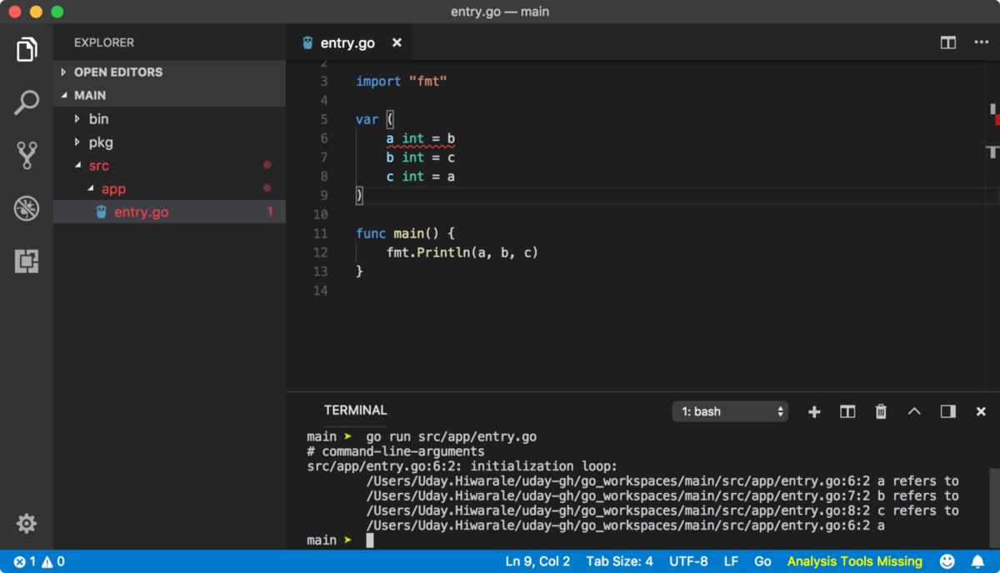
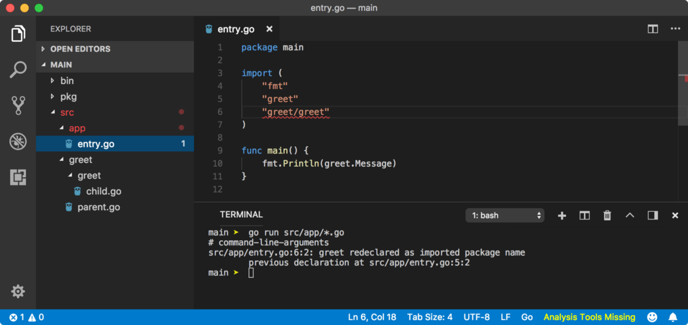

> (GitHub / Twitter)

## Go中的模块剖析
### 模块是管理项目依赖关系的新方法。 模块使我们能够合并不同版本的……
# 迁移到模块

Go提供了一个称为模块的新功能，该功能提供了轻松管理项目和依赖项的灵活性。 如果您正在使用Go软件包，则应考虑将项目重新定位到Go Modules。
## Go中的模块剖析
### 模块是管理项目依赖关系的新方法。 模块使我们能够合并不同版本的……
# 安装第三方包

安装第三方软件包只不过是将远程代码克隆到本地src / <package>目录中。 不幸的是，Go不支持程序包版本或不提供程序包管理器，但正在这里等待提案。

由于Go没有统一的正式软件包注册中心，因此它会要求您提供软件包的主机名和路径。
```
$ go get -u github.com/jinzhu/gorm
```

上面的命令从http://github.com/jinzhu/gorm URL导入文件，并将其保存在src / github.com / jinzhu / gorm目录中。 如嵌套软件包中所述，您可以像下面那样导入gorm软件包。
```
package mainimport "github.com/jinzhu/gorm"// use ==> gorm.SomeExportedMember
```

因此，如果您制作了一个程序包并希望人们使用它，只需将其发布在GitHub上就可以了。 如果您的程序包是可执行的，则人们可以将其用作命令行工具，也可以将其导入程序中并将其用作实用程序模块。 他们唯一需要做的就是使用以下命令。
```
$ go get github.com/your-username/repo-name
```
# 程序执行顺序

到目前为止，我们已经了解了有关软件包的所有内容。 现在，让我们结合对程序如何在Go中初始化的理解。
```
go run *.go├── Main package is executed├── All imported packages are initialized|  ├── All imported packages are initialized (recursive definition)|  ├── All global variables are initialized |  └── init functions are called in lexical file name order└── Main package is initialized   ├── All global variables are initialized   └── init functions are called in lexical file name order
```

这是一个证明这一点的小例子。
```
// version/get-version.gopackage versionimport "fmt"func init() { fmt.Println("version/get-version.go ==> init()")}func getVersion() string { fmt.Println("version/get-version.go ==> getVersion()") return "1.0.0"}/***************************/// version/entry.gopackage versionimport "fmt"func init() { fmt.Println("version/entry.go ==> init()")}var Version = getLocalVersion()func getLocalVersion() string { fmt.Println("version/entry.go ==> getLocalVersion()") return getVersion()}/***************************/// app/fetch-version.gopackage mainimport ( "fmt" "version")func init() { fmt.Println("app/fetch-version.go ==> init()")}func fetchVersion() string { fmt.Println("app/fetch-version.go ==> fetchVersion()") return version.Version}/***************************/// app/entry.gopackage mainimport "fmt"func init() { fmt.Println("app/entry.go ==> init()")}var myVersion = fetchVersion()func main() { fmt.Println("app/fetch-version.go ==> fetchVersion()") fmt.Println("version ===> ", myVersion)}
```

# 包初始化

当我们运行Go程序时，Go编译器会按照一定的执行顺序执行程序包，程序包中的文件以及程序包中的变量声明。
## 包装范围

范围是代码块中可访问定义变量的区域。 包作用域是包中的一个区域，在该区域中可从包内（包中的所有文件）访问声明的变量。 此区域是软件包中任何文件的最上面的块。


看一下go run命令。 这次，我们不再使用一个文件，而是使用一种全局模式将所有文件都包含在应用程序包中以便执行。 Go具有足够的智能，可以找出应用程序的entry.go入口点，因为它具有主要功能。 我们还可以使用如下所示的命令（文件名顺序无关紧要）。
```
go run src/app/version.go src/app/entry.go
```

go install或go build命令需要一个软件包名称，其中包括软件包中的所有文件，因此我们不必像上面那样指定它们。

回到我们的主要问题，我们可以在包的任何地方使用在version.go文件中声明的变量version，即使它没有导出（如Version），因为它是在包范围内声明的。 如果在函数中声明了版本变量，则说明该版本变量不在包范围内，并且上述程序无法编译。

不允许在同一包中重新声明具有相同名称的全局变量。 因此，一旦声明了版本变量，就不能在程序包范围内对其进行重新声明。 但是您可以随意在其他地方重新声明。

## 变量初始化

当变量a依赖于另一个变量b时，应事先定义b，否则程序将无法编译。 Go在函数内部遵循此规则。


但是，当这些变量在包范围内定义时，它们将在初始化周期中声明。 让我们看看下面的简单示例。


在上面的示例中，第一个c被声明，因为它的值已经被声明。 在以后的初始化周期中，声明了b，因为它取决于c并且已经声明了c的值。 在最后的初始化周期中，声明a并将其分配给b的值。 Go可以处理如下所示的复杂初始化周期。


在上面的示例中，将首先声明c，然后声明b，因为其值取决于c，最后是a，因为其值取决于b。 您应该避免像下面这样的初始化循环进入初始化循环。


包范围的另一个示例是，在单独文件中具有函数f，该函数从主文件引用变量c。


## 初始化功能

像main函数一样，初始化包时，Go会调用init函数。 它不带任何参数，也不返回任何值。 Go隐式声明了init函数，因此您无法从任何地方引用它（或像init（）一样调用它）。 您可以在文件或包中具有多个init函数。 文件中init函数的执行顺序将根据它们出现的顺序。


您可以在包中的任何位置都具有init函数。 这些初始化函数以词汇文件名顺序（字母顺序）调用。


毕竟，要执行init函数，然后才能调用main函数。 因此，init函数的主要工作是初始化无法在全局上下文中初始化的全局变量。 例如，数组的初始化。


由于for语法在包范围内无效，因此我们可以在init函数内部使用for循环来初始化大小为10的数组整数。
## 包别名

导入包时，请使用包的包声明创建一个变量。 如果要导入多个具有相同名称的软件包，则将导致冲突。
```
// parent.gopackage greetvar Message = "Hey there. I am parent."// child.gopackage greetvar Message = "Hey there. I am child."
```


因此，我们使用包别名。 我们在import关键字和程序包名称之间声明一个变量名，该变量名成为引用该程序包的新变量。


在上面的示例中，greet / greet包现在由子变量引用。 如果您注意到的话，我们在greet包中使用下划线作为别名。 下划线是Go中的一个特殊字符，用作空容器。 由于我们导入的是greet包，但未使用它，因此Go编译器会抱怨它。 为了避免这种情况，我们将对该包的引用存储到_中，而Go编译器只会忽略它。

有时，如果要初始化一个包但不使用它，则用下划线来给一个包起别名似乎什么也没做是很有用的。
```
// parent.gopackage greetimport "fmt"var Message = "Hey there. I am parent."func init() {  fmt.Println("greet/parent.go ==> init()")}// child.gopackage greetimport "fmt"var Message = "Hey there. I am child."func init() {  fmt.Println("greet/greet/child.go ==> init()")}
```


要记住的主要事情是，每个包只对导入的包初始化一次。 因此，如果包中有任何import语句，则导入的包将在主包执行的生命周期中仅初始化一次。

如果我们使用。 （点）作为类似import的别名。 “ greet / greet”，那么greet包的所有导出成员将在本地文件块作用域中可用，我们可以在不使用限定符子代的情况下引用Message。 因此，fmt.Println（Message）可以正常工作。 这种类型的导入被称为“点导入并转到”社区，因为它可能会引起一些问题，因此他们对此不太满意。
# 创建一个包

正如我们所讨论的，有两种类型的软件包。 可执行程序包和实用程序包。 可执行包是您的主要应用程序，因为您将在运行它。 实用程序包不是自可执行的，相反，它通过提供实用程序功能和其他重要资产来增强可执行程序包的功能。

众所周知，一个包只不过是一个目录，让我们在src中创建greet目录，并在其中创建几个文件。 这次，我们将在每个文件的顶部编写一个包greeting声明，以声明这是一个实用程序包。

## 出口会员

实用程序包应该为导入它的包提供一些变量。 与JavaScript中的导出语法一样，如果变量名称以大写字母开头，则Go会导出变量。 所有其他不以大写字母开头的变量对程序包都是私有的。

从现在开始，我将使用可变词来描述导出成员，但是导出成员可以是常量，映射，函数，结构，数组，切片等任何类型。

让我们从day.go文件中导出一个问候变量。


在上面的程序中，Morning变量将从包中导出，但是Morning变量不会以小写字母开头，因此不会。
## 导入包裹

现在，我们需要一个可执行包，它将使用我们的greet包。 让我们在src内创建一个应用程序目录，并创建带有主包声明和主函数的entry.go文件。 请注意，Go包在Node中没有像index.js这样的入口文件命名系统。 对于可执行程序包，具有主要功能的文件是要执行的入口文件。

要导入软件包，我们使用导入语法，后跟软件包名称。

与其他编程语言不同，包名称也可以是诸如some-dir / greet的子路径，而Go会自动为我们解析到greet包的路径，如前面的嵌套包主题所示。

首先转到GOROOT / src目录中的包目录，如果找不到包，则查找GOPATH / src。 由于fmt软件包是Go的标准库（位于GOROOT / src中）的一部分，因此从那里导入。 由于Go无法在GOROOT中找到问候包，因此它将在GOPATH / src中进行查找，并且我们已经在其中了。


上面的程序抛出编译错误，因为从包中看不到morning变量。 如您所见，我们使用。 （点）表示法，用于从包中访问导出的成员。 导入程序包时，Go使用程序包的程序包声明创建一个全局变量。 在上述情况下，greet是Go创建的全局变量，因为我们在greet软件包中包含的程序中使用了package greet声明。


我们可以使用分组语法（括号）将fmt和greet包导入分组在一起。 这次，我们的程序将编译得很好，因为可以从包外部获得Morning变量。
## 嵌套包装

我们可以将包嵌套在包中。 由于对于Go，包只是目录，就像在现有包中创建子目录一样。 我们要做的就是提供嵌套包的相对路径。


## 包编译

如上一课所述，go run命令编译并执行程序。 我们知道，go install命令可以编译软件包并创建二进制可执行文件或软件包归档文件。 这是为了避免每次编译（导入这些程序包的程序）每次都编译程序包。 go install会预编译一个软件包，而Go则引用.a文件。

通常，当您安装第三方软件包时，Go会编译该软件包并创建软件包存档文件。 如果您在本地编写软件包，则IDE可能会在将文件保存在软件包中或在软件包被修改后立即创建软件包归档文件。 如果已安装Go插件，则VSCode在保存时会编译该软件包。

# 您需要了解有关Go中软件包的所有信息
## Go编程语言的软件包管理和部署的完整概述


如果您熟悉Java或NodeJS之类的语言，那么您可能非常熟悉软件包。 包不过是带有一些代码文件的目录，该目录从单个引用点公开了不同的变量（功能）。 让我解释一下，这意味着什么。

想象一下，在任何项目中进行工作时，您都需要不断地使用上千种功能。 其中一些功能具有共同的行为。 例如，toUpperCase和toLowerCase函数可转换字符串的大小写，因此您可以将它们写入单个文件（可能为case.go）。 还有其他函数对字符串数据类型执行其他一些操作，因此您也将它们写在单独的文件中。

由于您有许多文件可以处理字符串数据类型，因此您创建了一个名为string的目录，并将所有与字符串相关的文件放入其中。 最后，将所有这些目录放在一个父目录中，该目录将成为您的软件包。 整个程序包结构如下所示。
```
package-name├── string|  ├── case.go|  ├── trim.go|  └── misc.go└── number   ├── arithmetics.go   └── primes.go
```

我将详细解释如何从包中导入函数和变量，以及如何将所有内容融合在一起形成一个包，但是现在，将您的包想象成一个包含.go文件的目录。

每个Go程序都必须是某些程序包的一部分。 如Go入门课程中所述，独立的可执行Go程序必须具有包main声明。 如果程序是主软件包的一部分，则go install将创建一个二进制文件； 在执行时调用程序的主要功能。 如果程序不是main包的一部分，则使用go install命令创建包归档文件。 不用担心，我将在以后的主题中解释所有这些内容。

让我们创建一个可执行程序包。 众所周知，要创建一个二进制可执行文件，我们需要程序成为主程序包的一部分，并且它必须具有主函数，该函数是执行的入口点。


软件包名称是src目录中包含的目录的名称。 在上述情况下，因为app是src目录的子目录，所以app是软件包。 因此，执行go install app命令在GOPATH的src目录中查找app子目录。 然后，它编译了程序包，并在bin目录中创建了应用二进制可执行文件，该文件应可从终端执行，因为PATH中的bin目录。

像上面示例中的package main这样的应该是代码的第一行的包声明可以与包名称不同。 因此，您可能会发现某些软件包，其中软件包名称（目录名称）与软件包声明不同。 导入程序包时，程序包声明用于创建程序包引用变量，如本文稍后所述。

go install <package>命令在给定的软件包目录中查找具有主软件包声明的任何文件。 如果找到文件，则Go知道这是一个可执行程序，因此需要创建一个二进制文件。 一个包可以有许多文件，但只有一个具有主要功能的文件，因为该文件将是执行的入口。

如果软件包不包含带有主软件包声明的文件，则Go会在pkg目录中创建一个软件包归档（.a）文件。


由于app不是可执行程序包，因此它在pkg目录中创建了app.a文件。 该文件不是二进制文件，因此无法执行。
## 包命名约定

Go社区建议对软件包使用简单的名称。 例如，用于字符串实用程序功能的strutils或用于HTTP请求相关功能的http。 应该避免使用under_scores，连字符或mixedCaps的软件包名称。
```
(本文翻译自Uday Hiwarale的文章《Everything you need to know about Packages in Go》，参考：https://medium.com/rungo/everything-you-need-to-know-about-packages-in-go-b8bac62b74cc)
```
