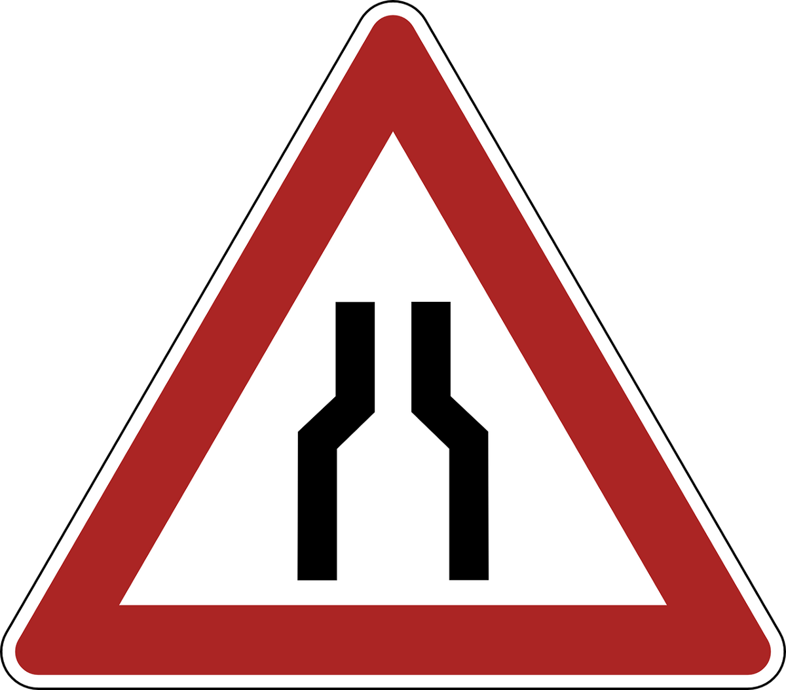

# 查找Python中的性能瓶颈
## 是什么让您的代码如此缓慢？


在这篇文章中，我将解释如何分析代码片段并可能发现性能瓶颈。
# 首先创建瓶颈

假设我们需要创建一个循环遍历的脚本，并且每次循环执行都会产生一个值，该值取决于当前迭代和一个独立的值。 独立值是初始设置的一部分，它可以是一个相对繁重的功能：
```
import timedef initial_setup():  a = 7  time.sleep(1)  return a
```

我们的“ initial_setup”函数只是返回一个固定值，但是我添加了1秒的time.sleep（）调用来模拟一个较重的函数。 让我们继续并构建脚本的主要功能，我们将其随意地称为“ slow_function”。
```
def slow_function():  x = range(5)  for i in x:    a = initial_setup()    b = a + i    print(b)
```

我们的新功能只是简单地遍历[0，4]并将当前数字添加到初始设置中返回的固定数字上。 您可能已经注意到，我在循环块内部错误地将其称为“ initial_setup（）”。 即使结果正确，但由于“ initial_setup（）”不依赖于循环迭代，而且还是一个繁重的功能，因此仍然会导致性能错误。

无论如何，我们假装没有注意到，然后测试我们的解决方案。 您应该得到以下结果：
```
7891011
```

工作正常，对吗？ 尽管它花费的时间比我预期的要长...但是我不知道是什么使它如此缓慢，所以也许是时候使用Python的分析器了...
# cProfile入门

我们需要分析我们的功能，并找出阻碍其性能的因素！ 幸运的是，Python提供了一个可以帮助我们完成此任务的模块：cProfile。 我们将从创建Profile类的实例开始：
```
import cProfileprofile = cProfile.Profile()
```

现在我们准备分析我们的功能！ 我们将开始使用一种简单的方法，即使用runcall（）方法，该方法接收要分析的函数（及其参数，如果有的话）。 在我们的情况下，我们要分析“ slow_function（）”，因此我们将添加以下说明：
```
import cProfileprofile = cProfile.Profile()profile.runcall(slow_function)
```

现在，如果您运行上述代码段，您将会发现显然没有任何反应。 至少，没有在标准输出中打印性能分析信息。 那是因为我们错过了难题的最后一部分：pstats。 让我们继续并将其添加到我们的代码段中：
```
import cProfileimport pstatsprofile = cProfile.Profile()profile.runcall(slow_function)ps = pstats.Stats(profile)ps.print_stats()
```

如您所见，我们将“ profile”实例传递给Stats的构造函数，以创建该类的新实例“ ps”。 该实例最终使我们可以打印分析结果。

好了，足够多的谈话（或写作），让我们运行摘要，看看能得到什么！
```
7891011         17 function calls in 5.011 seconds   Random listing order was used   ncalls  tottime  percall  cumtime  percall filename:lineno(function)        5    0.001    0.000    0.001    0.000 {built-in method builtins.print}        5    5.010    1.002    5.010    1.002 {built-in method time.sleep}        5    0.000    0.000    5.010    1.002 python-performance-bottlenecks.py:5(initial_setup)        1    0.000    0.000    5.011    5.011 python-performance-bottlenecks.py:10(slow_function)        1    0.000    0.000    0.000    0.000 {method 'disable' of '_lsprof.Profiler' objects}
```
# 我们如何解释print_stats（）的结果？

好！ 现在，我们可以看到大量信息，这些信息应指出性能瓶颈。 为了找到它，我们首先应该了解每列的含义。
+ ncalls：被分析函数被调用的次数
+ tottime：在分析函数中花费的总执行时间（不包括子函数的执行时间）
+ percall：tottime除以ncalls
+ cumtime：所分析的函数花费的总执行时间（包括子函数的执行时间）
+ percall：cumtime除以ncalls
+ filename：lineno（function）：文件，行号和分析函数

既然我们了解了每一列的含义，我们就可以寻找阻碍我们性能的原因。 嗯...哦！ “ initial_setup（）”被调用了5次。 实际上，累计执行时间超过5秒！ 好吧，这是有道理的，正如我错误地在for循环内称为“ initial_setup（）”一样！ 好吧，我将在循环之外调用它，因为它并不依赖于它。

因此，我们已经解决了第一个性能问题！ 现在，我们将如何解决未来的瓶颈？ 我们应该一直在看ncall吗？ 好吧，有时候。 但是有时候，我们将面临另一种问题，其中ncalls不会告诉我们任何事情。 例如，我们可能不得不处理一个仅被调用一次但非常慢的函数。 作为一般策略，我倾向于先查看具有较高累积时间（cumtime）的函数，然后再检查是否有任何函数在ncalls中脱颖而出。 但是，我想说，选择策略是我们根据经验构建的个人旅程。
# 一种更灵活的配置方法

有时您可能不希望描述整个功能，而只是描述一部分。 通过以下方式，这也是可能且容易的：
```
def slow_function():  profile = cProfile.Profile()  profile.enable()  x = range(5)  for i in x:    a = initial_setup()    b = a + i    print(b)  profile.disable()  ps = pstats.Stats(profile)  ps.print_stats()
```

我们必须将要分析的代码片段放在“ profile.enable（）”和“ profile.disable（）”之间。 请记住，在这种情况下，我们正在分析一个玩具示例，但是在实际情况下，您可能必须分析一个更大的函数，因此，如果怀疑某个代码段在什么地方，限制分析代码片段的范围总是有用的。 可以解决瓶颈。

此外，从Python 3.8开始，您还可以选择将其用作上下文管理器，将“配置文件”实例的范围限制为封闭的块：
```
with cProfile.Profile() as profile:  x = range(5)  for i in x:    a = initial_setup()    b = a + i    print(b)  ps = pstats.Stats(profile)  ps.print_stats()
```
# 充分利用pstat

一旦开始对真实世界的代码库进行性能分析，您会发现打印的统计数据将大得多，因为您可能正在分析较大的代码片段。 好吧，在某个时候，有太多的信息使它变得有些混乱。 幸运的是，pstats可以帮助您使此信息更易于管理。

对于初学者，您可以使用sort_stats（）确定打印功能的顺序（您也可以在链接中找到可用的订购键）。 例如，它可能有助于按通话次数或累积时间对其进行排序。 您可以定义多个排序键，并按键的顺序定义其优先级。 另一个方便的选择是可以限制打印功能的数量。 您可以通过将整数传递给print_stats（）来实现。 让我们修改示例，以按ncalls和cumtime的顺序对此输出进行排序，并将其限制为3个函数：
```
def slow_function():  profile = cProfile.Profile()  profile.enable()  x = range(5)  for i in x:    a = initial_setup()    b = a + i    print(b)  profile.disable()  ps = pstats.Stats(profile)  ps.sort_stats('calls', 'cumtime')   ps.print_stats(3)
```

您的输出应如下所示：
```
7891011         17 function calls in 5.017 seconds   Ordered by: call count, cumulative time   List reduced from 5 to 3 due to restriction <3>   ncalls  tottime  percall  cumtime  percall filename:lineno(function)        5    0.000    0.000    5.016    1.003 python-performance-bottlenecks.py:5(initial_setup)        5    5.016    1.003    5.016    1.003 {built-in method time.sleep}        5    0.001    0.000    0.001    0.000 {built-in method builtins.print}
```

如您所见，已应用定义的顺序和限制。 还请注意，这些限制在输出中声明。

好了，就是这样，您现在就可以更快地编写代码了！
```
(本文翻译自Dhanesh Budhrani的文章《Finding performance bottlenecks in Python》，参考：https://towardsdatascience.com/finding-performance-bottlenecks-in-python-4372598b7b2c)
```
