在本文中，我讨论了我在技术数据科学采访中个人遇到的五个问题，我认为这可能会更好。 我强烈建议您阅读以下资源，以每天磨练您的基本概念。 相信我，我一定会一遍又一遍地阅读这些概念，但是我在采访中却偶然发现了这些概念。

如果您喜欢阅读本文，请不要忘记对其进行评论！

学习愉快！
+ 使用Scikit-Learn和TensorFlow进行动手机器学习
+ 统计学习导论

问题V：模型正则化是什么意思，线性模型将如何实现正则化？

答：正则化是用于约束机器学习模型的术语。 限制或减少机器学习模型中过度拟合的一种好方法是减少自由度。 自由度越小，模型越难拟合数据。 例如，规范化多项式模型的一种简单方法是减少多项式自由度的数量。 但是，对于线性模型，通常通过限制模型的权重来实现正则化。 因此，代替线性回归，Ridge回归，Lasso回归和弹性网模型具有三种不同的方式来限制权重。 为了完整起见，让我们首先从线性回归的定义开始：
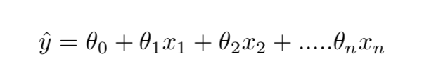
> Equation V: Linear regression and model prediction

+ y-hat是预测值。
+ n是特征数量。
+ x_i是第n个特征值。
+ Theta是模型参数或也称为特征权重。

线性回归模型的均方误差成本函数定义为：
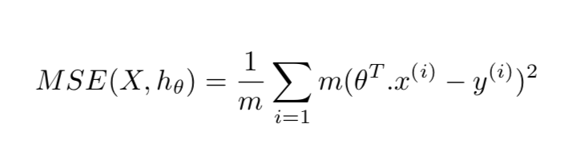
> Equation VI: Linear regression cost function.

其中theT是theta的转置（行向量而不是列向量）。

岭回归：是线性回归的正则化版本，即在成本函数中增加了一个正则化项。 这迫使学习算法不仅适合数据，而且还使模型权重尽可能小。 请注意，仅在训练期间将正则化项添加到成本函数中。 训练完模型后，您想使用非常规性能指标评估模型的性能。
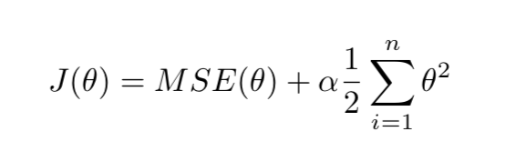
> Equation VII: Ridge regression cost function.

超参数Alpha控制要对模型进行正则化的量。 如果alpha为零，则岭回归仅是线性回归。

拉索回归：最小绝对收缩和选择算子回归（简单称为拉索回归）是线性回归的另一种正规化版本：就像岭回归一样，它向成本函数添加了正规化项，但它使用权重向量的L1范数 而不是L2范数的平方的一半。
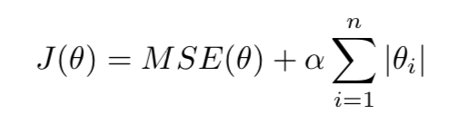
> Equation VIII: Lasso Regression cost function.

拉索回归的一个重要特征是它趋于完全消除最不重要特征的权重（即将它们设置为零）。 换句话说，套索回归会自动执行特征选择并输出稀疏模型（即具有少量非零特征权重）。

弹性净回归：这是Ridge和Lasso回归之间的中间立场。 正则项是Ridge和Lasso的正则项的简单组合，可以用“ r”控制。 当r = 0时，Elastic Net等效于Ridge回归，而当r = 1时，Elastic Net等效于套索回归。
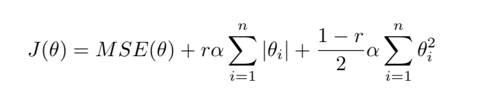
> Equation IX: Elastic Net cost function.

总是最好至少要有一点正则化，并且通常应该避免纯线性回归。 Ridge是一个很好的默认值，但是如果在特定数据集中只有少数功能有用，则应使用套索。 通常，Elastic Net优于Lasso，因为当要素数量大于实例数量或多个要素紧密相关时，Lasso的行为可能会不稳定。

问题IV：您的数据科学实绩项目需要3分钟的时间？

答：典型的数据科学面试过程始于实地数据分析项目。 我已经考虑了其中两个，时间跨度可能会根据带回家项目的复杂性而有所不同。 第一次，我有两天的时间使用机器学习和执行摘要来解决问题。 第二次给我两个星期来解决问题。 无需指出，第二次在我处理类不平衡数据集时，这是一个更加困难的问题。 因此，三分钟的销售推销类型面试问题可让您展示对当前问题的理解。 请确保首先从您对问题的解释开始； 您解决问题的简要方法； 您在方法中使用了哪种类型的机器学习模型，为什么？ 并通过吹嘘模型的准确性来结束这一点。

我相信这是您面试中的一个非常重要的问题，它使您能够证明自己是数据科学领域的领导者，并可以使用最新，最好的工具来解决复杂的问题。

问题三：您将如何向外行解释深度神经网络？

答：神经网络（NN）的思想最初源于旨在识别模式的人脑。 NN是一组算法，可通过机器感知，标记和聚类原始输入数据来解释感官数据。 任何类型的现实世界数据，例如图像，文本，声音甚至时间序列数据，都必须转换为包含数字的向量空间。

深层神经网络中的“深层”一词是指神经网络由多层组成。 这些层由进行计算的节点组成。 类比节点是人脑中的神经元，当其受到足够的刺激时会触发。 节点将来自原始输入的数据与它们的系数或权重进行组合，这些系数或权重将基于权重来抑制或放大该输入。 输入和权重的乘积然后在图3中所示的求和节点处求和，然后将其传递到激活函数，该激活函数确定该信号是否以及在何种程度上应继续通过网络传播以影响最终结果。 节点层是一行这样的神经元状开关，当输入通过网络馈送时，它们会打开或关闭。
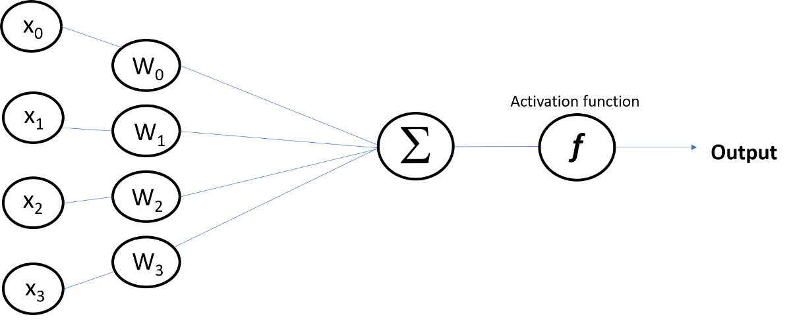
> Figure 3: An example of node visualization in neural network.

深度神经网络与早期版本的神经网络（例如感知器）不同，因为它们很浅，仅由输入和输出层以及一个隐藏层组成。
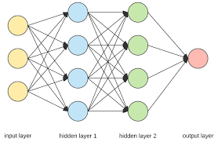
> Figure 4: Deep neural network consists of more than one hidden layer.

问题II：共线性如何影响您的模型？

答：共线性是指两个或多个预测变量彼此密切相关的情况。 下面的图2显示了共线变量的示例。 变量2严格跟随变量1，其Pearson相关系数为1。因此，显然，这些变量之一在馈入机器学习模型时的行为会像噪声一样。
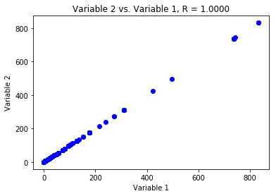
> Figure 2: Example of collinear variables.

共线性的存在在回归类型问题中可能会成为问题，因为很难区分出共线性变量对响应的影响。 换句话说，共线性降低了回归系数估计的准确性，并导致误差增加。 这最终将导致t统计量的下降，结果，在存在共线性的情况下，我们可能无法拒绝原假设。

检测共线性的一种简单方法是查看预测变量的相关矩阵。 此矩阵的绝对值大的元素表示一对高度相关的变量，因此与数据存在共线性问题。 不幸的是，并非所有的共线性问题都可以通过检查相关矩阵来检测到：即使没有一对变量具有特别高的相关性，共线性也可能存在于三个或更多变量之间。 这种情况称为多重共线性。 对于这种情况，代替检查相关矩阵，评估多重共线性的更好方法是计算方差膨胀因子（VIF）。 可以使用以下公式计算每个变量的VIF：
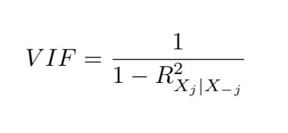
> Equation IV: The Variance Inflation Factor (VIF)

其中R平方项是变量X在所有其他预测变量上的回归。 如果VIF接近或大于1，则存在共线性。 面对共线性问题，有两种可能的解决方案。 一种是删除冗余变量。 这可以在不影响回归拟合的情况下完成。 第二种解决方案是将共线变量组合在一起成为单个预测变量。

问题1：您能否解释决策树的成本函数？

答：在我们回答这个问题之前，必须注意决策树是通用的机器学习算法，可以执行分类和回归任务。 因此，它们的成本函数也不同。

分类类型问题的成本函数：

在我们了解成本函数之前，基尼杂质是一个重要的概念，所以让我先解释一下。
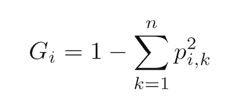
> Equation I: Gini Impurity

其中“ p”是第i个节点的k个实例在训练实例中的比率。 这意味着什么？ 让我们从下面的示例中了解一下。 图一显示了深度2的虹膜决策树的简单可视化。顶层是根节点。 在算法中，将训练集划分为一组决策的概念非常简单。 例如，此处，虹膜数据集基于根节点上称为“花瓣宽度”的单个特征分为两个子集。 如果花瓣宽度小于或等于0.8，则算法转到深度1（左侧）。 如果不是，则转到深度1，对。 它根据“花瓣宽度”的附加特征进一步划分实例。 深度1，右节点有100个实例的样本，并将0个实例应用于Iris-Setosa，将50个实例应用于Iris-Versicolor，其余50个实例应用于Iris-Virginica。
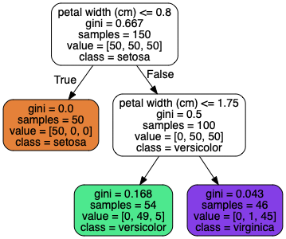
> Figure I: Iris Decision Tree, Source

因此，该节点的基尼杂质为0.5：
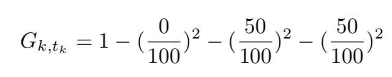
> Figure II: Gini impurity calculation

同样，在深度1处，左节点的Gini杂质为零，因为所有训练实例都适用于同一类。 该节点实质上是“纯”的。

既然了解了什么是基尼杂质，让我们深入探讨答案。 决策树基于简单的概念将分类和回归树（CART）算法用于训练目的，该简单的概念是使用单个特征（k）和阈值（t）将数据集分为两个子集。 在虹膜数据集中，特征为“花瓣宽度”，阈值为0.8。 如何选择k和t？ 它搜索产生最纯子集的对（k，t）。 因此，算法尝试使成本函数最小化的公式如下：
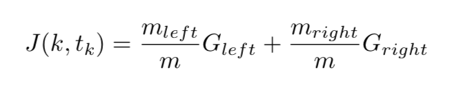
> Equation II: Cost function of a classification type decision tree.

其中G左或右代表子集的基尼杂质，而m代表子集的实例。

回归类型问题的成本函数：

对于回归树，成本函数非常直观。 我们使用残差平方和（RSS）。 公式III显示了回归类型树的成本函数，其中“ y”是基本事实，“ y-hat”是预测值。
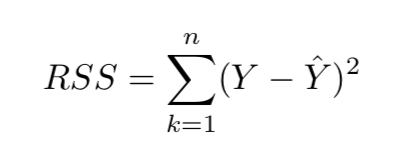
> Equation III: Residual Sum of Squares (RSS)

# 您必须能够回答的五个数据科学面试问题
## “有关Amazon / Netflix / Google数据科学家采访问题的内幕人士指南”

为了避免在同一地点失败两次并让自己对他人有用，我的这个职位专门为那些希望跟随自己成为/提高数据科学家热情的人们提供。 我坚信，即使您不打算换职业，也必须继续进行面试，因为您在进行面试时会学到很多东西。 没有更快的学习方法。 数据科学是一个需要不断提高技能的领域，同时每天都要开发机器学习算法中的基本概念。 因此，事不宜迟，让我们直接探讨一些可能对您下一次面试有用的问题和答案。
