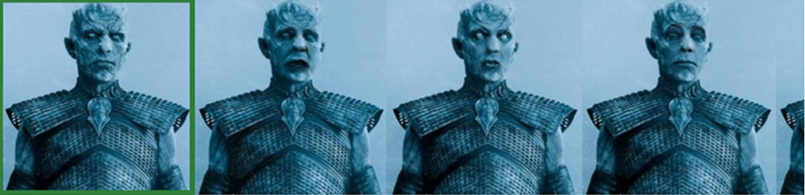

# GAN从零到英雄：面向新手的最佳资源
## 一切即将发生GAN！


生成对抗网络是机器学习中最近十年来最有趣的想法。

— Facebook AI研究总监Yann LeCun

毫无疑问，GAN现在非常令人兴奋，它们是第一个产生令人信服的好结果的生成算法，并且可能随着时间的推移这些结果只会变得更好。 因此，在这个充满机遇和不断进步的领域尝试自己是很有趣的，但是……没有什么事情如此简单。

由于该领域非常年轻，因此从2014年的第一篇论文开始，并且由于论文和应用程序的数量众多，因此开始使用GAN可能会非常具有挑战性。 那么，学习它的最佳途径是什么？ 今天，我要阐明一下！

在这篇文章中，我将介绍以下几点：
+ 什么是神经网络？
+ 什么是GAN？
+ GAN如何工作？
+ GAN的应用
+ 学习GAN的最好的东西

事不宜迟，让我们直接进入吧！
# 什么是神经网络？

在谈到GAN时，第一个关联是假冒产品-将人们的面孔（通常是名人）放在别人的身上的照片和视频。 就像“光辉”深渊假装在吉姆·凯里（Jim Carrey）饰演的杰克·托伦斯（Jack Torrance）的眼中一样。 它是如何工作的？ 答案很简单-神经网络的力量，这就是为什么我们以此主题开始学习之旅。

那么什么是神经网络？ 简而言之，这是一个执行某种任务的程序。 为什么这样一个name谐的名字？ 那是因为它类似于人脑中神经元的工作。 但是，尽管常规程序具有一个人设置的所有设置，但神经网络仍能够自主行动。 您只需要训练它们以指定数千万个参数即可。

顺便说一句，如果您有机会选择所有带有路标的图像，那么恭喜您：您已经参与了神经网络和人工智能的培训。 Google的“ CAPTCHA”不仅用于计算机器人（而且使我们怀疑自己的人性）。 每次用户在照片中标记对象时，Google的神经网络都会变得更加智能，图像搜索将变得更加精确，Google Photos在识别照片库中的面部，位置和对象方面会变得更好，Waymo无人机开始杀死人和猫。 比平常少。

因此，将一个图像转换为另一个图像是任何神经网络的标准操作。 当网络执行识别人脸，物体或声音的任务时，它们会在输出端给出矢量或数值，这些矢量或数值可以属于一个或另一类物体。 但是没有什么能阻止神经网络的建立，因此我们得到的不是数字，而是一组像素。 另一个问题：如何使该场景看起来像真实的照片或图片，而不是毫无意义的抽象？

为此，现在是对抗性生成网络（GAN）进入游戏的正确时机。
# 什么是生成对抗网络？

生成对抗网络是一类用于无监督机器学习的神经网络。 它是由Ian Goodfellow及其同事于2014年发明的。

其核心是两个神经网络的组合。 简而言之，其中一个受过训练以创建带有某个对象的图像，另一个受过训练-区分什么图像是真实的图像和人为创建的图像。 第一个网络试图欺骗第二个网络，并且每次失败尝试都会收到它的反馈，从而开始更好地应对这一任务。 其中一个产生，另一个批评。 通过完美的协作，它们在合理的图像合成和图像增强方面均能提供出色的效果。


https://thispersondoesnotexist.com/展示由计算机生成的虚构人物的随机照片。 每次刷新页面以换一张新面孔。

第一个算法或网络的名称是“生成器”，第二个是“鉴别器”。 因此，它们同时工作。 生成器的任务是生成给定类别的图像。 鉴别器的任务是尝试识别创建的图像。

例如，我们有与面孔相似的图片。 在这种情况下，区分器试图确定它是否是一张脸。 随着时间的流逝，该网络将学会生成逼真的面孔。
# GAN如何工作？

要了解GAN的工作原理，请深入了解鉴别器和发生器的作用。

“歧视者”或“歧视性网络”。 为了识别，我们使用卷积神经网络（CNN）。 这是什么？ 让我澄清一下：CNN可以识别图片中的图像，例如，从整个图像中提取人脸，数字等。 为了使神经网络识别某些东西，您需要对其进行训练以处理包含所需图像的大量图像。

您给神经网络提供了大量猫的图片，并在图像中标记出猫所在的部分。 在此之后，神经网络能够识别两种类型的图片：有猫和无猫。

“发电机”或“发电网络”模型。 图像形成始于产生任意噪声，在该噪声上开始出现所需图像的片段。 想象一下，您正在晃动一盘沙，直到您设法“晃动”一些隐约让人联想到数字的东西。 然后继续摇晃，直到数字的轮廓变得更明显为止。 神经网络会精确地记住您如何摇动盘子以达到这样的效果，并且下次它会重现您的动作。


自然，这是一个说明性示例，在实际模型中使用了更合理的方法。 由于可以使用（并且经常使用）生成神经网络FFNN网络-前馈神经网络。

那么，如何使神经网络生成吉姆·卡里的脸呢？


为此，我们不需要普通的生成对抗网络，而是所谓的条件GAN。 为了获得Jim Carrey（或任何其他人）的真实照片，首先要由某个人的照片提供神经网络，然后由演员脸部的图像提供神经网络，这几乎不可能与真实的人区分开。 。

为了使面部说话，扭曲和眨眼，就像在著名的病毒视频中一样，神经网络配备了具有不同面部表情的人的照片-感谢上帝，我们所有人都以类似的方式做鬼脸。
# 生成对抗网络有哪些实际应用？

好吧，有很多。 在GAN开发的最初几年中，我们取得了令人瞩目的进展。 不再有像恐怖电影中那样邮票大小的面部图片。 在2017年，GAN制作了1024×1024张图像，这些图像可能会欺骗人才侦探。 GAN已用于图像生成，修复，文本的光合作用，图像编辑和许多其他应用程序，通常会导致获得最先进的结果。

这里是生成对抗网络的一些实际应用的简要概述。

内容和数据创建：为在线商店创建图片，为游戏创建头像，基于音乐片段自动生成的视频，甚至是电视节目的虚拟主机。 由于GAN的工作，可以进行数据综合，并且可以在其上训练其他系统。

自动编辑：这种方法已在现代智能手机和某些应用程序中使用。 它使您可以更改面部表情，皱纹数量并更改头发的颜色，将日光更改为夜灯等等。

GAN神经网络应用程序-真实的启发性例子

使用Nvidia的PG GAN生成“名人”（实际上是不存在的人）的逼真的图像。 使用该网络，您还可以生成任何其他类别的图像。


所有这些图像都是由基于生成的对抗神经网络的系统生成的，其中一些看上去不太逼真，但其他的非常可信。


由伯克利大学的一组科学家创建的“每个人立即跳舞”模型提出了一种基于生成的运动传递神经网络的简单方法，“做我就做。”给出：一个跳舞的人的原始视频。 结果：我们使另一个人的形象跳舞。 这称为“运动传递”。

将样式从一幅图像转换为另一幅图像可以使用神经网络完成令人印象深刻的事情，例如“将马变成斑马”


或从照片中生成“动漫肖像”。 在这张照片中，您可以看到不同类型的GAN如何完成此任务。


改变一个人的情绪，年龄，面部表情-所有这些都可以通过适当地训练和编程GAN神经网络来实现。 实际上，它看起来像这样：在模型的输入处，提交原始照片，并指出需要在输出处显示的情感。


GAN神经网络还用于生成城市环境的逼真的视频。 例如，在制作电影，游戏，虚拟现实时。

使用GAN将草图和轮廓图转换为逼真的图像的方法如下：用手绘制一个脸，一个包或（例如）一只猫，并在输出处获得逼真的图像。 您可以在这里尝试。

# 生成网络的最佳资源


深入研究是值得的，但是要获得有效的知识，您需要为此选择正确的资源。 这是我精选的绝对适合此目的的最佳视频，书籍，文章。

视频讲座和演示

＃1 Ian Goodfellow：生成对抗网络（NIPS 2016教程）

接触到没有GAN经验的读者，它将为您准备使用GAN或改进核心GAN算法做出原始研究贡献。 主题包括对将GAN应用于大图像生成的工作的回顾； 改进的模型架构，可以在GAN中更好地学习； 使用GAN和其他工具进行半监督学习。

这是该教程的随附幻灯片和纸质版本：

滑梯

纸

＃2 AAAI-19邀请演讲-Ian Goodfellow（Google AI）-对抗机器学习

关于对抗性机器学习的更广泛主题的最新演讲，也涵盖了GAN

＃3斯坦福大学卷积神经网络课程的生成模型讲座

本讲座为GAN提供了有用的背景知识，并涵盖了变分自动编码器和PixelRNN的相关技术。

图书

＃1 Chapter 20.深度生成模型，深度学习，2016年

可能最强大的起点是Goodfellow编写的深度学习教科书。 第20章的标题为“深度生成模型”，并总结了包括GAN在内的一系列技术。

乔什·卡林（Josh Kalin）的＃2生成对抗网络食谱，2019年

本书将向您介绍八个现代GAN实施示例，包括CycleGAN，simGAN，DCGAN和GAN的模仿学习。 每章都以Python和Keras的通用体系结构为基础，以易于阅读的格式探索日益困难的GAN体系结构。

大卫·福斯特（David Foster）的＃3 Generative Deep Learning，2019

您将学习如何重新生成生成深度学习模型的一些最著名示例，例如变体自动编码器和生成对抗网络（GAN）。 您还将学习如何将这些技术应用于自己的数据集。

＃4 GAN在行动中，Jakub Langr，弗拉基米尔·博克，2019年

首先，您将了解生成建模以及GAN的工作原理，并概述其潜在用途。 然后，当您探索GAN架构的基础：生成器和鉴别器网络时，您将开始构建自己的简单对抗系统。

Kailash Ahirwar的＃5生成对抗网络项目，2019年

本书用Keras中的代码示例总结了一系列GAN。

文件
+ 生成对抗网络
+ GAN是否平等？ 大规模研究
+ GAN景观：损失，架构，正则化和规范化
+ 生成对抗网络：概述

幻灯片和教程
+ 伊恩·古德费洛（Ian Goodfellow）的GAN幻灯片（NIPS Goodfellow Slides）—为初学者提供了很好的简短说明
+ 关于GANS的ICCV 2017教程— 2017年在意大利举行的ICCV教程的初学者的其他很棒的幻灯片。它从入门主题开始，并继续探索最新的GAN模型，使用对抗损失的模型等等。

更多相关链接
+ 生成学习算法-吴安德的斯坦福笔记
+ 关于判别式与生成式分类器：逻辑回归与朴素贝叶斯的比较，Andrew Ng和Michael I. Jordan
+ 生成对抗网络背后的数学
+ 使用带有Deeplearning4j和Spark的生成对抗网络进行自动特征工程
+ 使用VQ-VAE-2生成各种高保真图像

精通深度学习的书籍和指南
+ 安德鲁·W·特拉斯克（Andrew W.
+ 机器学习的渴望
+ 6个月的深度学习实用指南
+ Yann LeCun等人的高效BackProp

学习愉快！

与往常一样，如果您对这些信息感兴趣，请在下面的评论中留下回复，或者随时在我的Instagram和Medium博客上与我们联系。

谢谢阅读！
```
(本文翻译自Oleksii Kharkovyna的文章《GANs from Zero to Hero: Best Resources for Newcomers》，参考：https://towardsdatascience.com/gans-from-zero-to-hero-best-resources-for-newcomers-a7c7cf1024b5)
```
