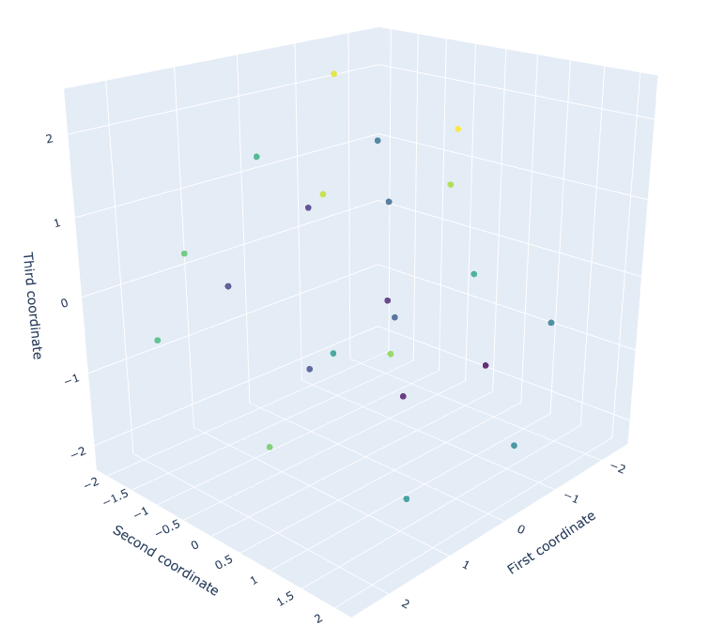

# giotto-learn入门
## 用于拓扑机器学习的Python库

由Lewis Tunstall，ColinKälin，Francesco Palma和Thomas Boys撰写

# 介绍

在L2F，我们围绕giotto学习和拓扑机器学习遇到的最常见问题之一是“我从哪里开始？”。

在本指南中，我们概述了基本概念和工作流程，以便您可以在机器学习管道中开始使用giotto-learn。 可以在GitHub上获得用于重现分析的代码。
# 什么是拓扑机器学习？

拓扑机器学习是指将代数拓扑中的元素与统计学习结合在一起的一组技术。 通过关注数据的整体属性（例如形状和连接性），这些拓扑方法可以捕获传统机器学习方法可能会遗漏的模式。

例如，拓扑机器学习已在药物设计和图形分类中产生了最先进的结果，并导致了对蛋白质结合的新颖见解。

这些技术的主要成分被称为持久同源性。 持久同源性度量了各种长度范围内拓扑不变性（如连接的组件，孔和空隙）的存在。 这些不变量的“出生”和“死亡”通过持久性图表进行了总结，这是生成新型特征以馈送到下游机器学习任务的最常见，最直观的方式。 有关这些概念的出色概述，请参见Gary Koplik的文章或Matthew Wright的视频。

> Birth and death of a hole by connecting neighbouring points with circles of increasing radius (left). The corresponding persistence diagram is also shown (right). Credit: https://bit.ly/2raKb11


概括地说，拓扑机器学习的关键步骤是：
+ 使用持久性同源性从输入数据中提取拓扑特征。
+ 使用监督或非监督方法将这些功能与机器学习方法结合起来。

giotto学习库旨在简化这些步骤，并使更广泛的数据科学界可以访问拓扑机器学习。 它基于scikit-learn的fit-transform范例，并与流行的框架紧密集成。 giotto-learn入门就像运行一样简单：
```
pip install giotto-learn
```
# 预测分子性质

为了展示giotto-learn的作用，我们将使用Kaggle上Predicting Molecular Properties竞赛中的CHAMPS数据集。 此处的任务是预测分子中两个原子之间的磁性相互作用或“标量耦合常数”。 由于这些耦合取连续值，因此学习任务是一种回归。

> For a given molecule, the learning task is to predict the strength of the couplings between each atom pair.

## 探索数据

训练数据由分子中的原子对组成，每对原子均以标量耦合的类型和每个原子的（x，y，z）坐标为特征。 为了简化分析，我们将重点介绍100个最大的分子，即原子数最大的分子。 如下图所示，这些分子具有五种不同的偶联，其强度取决于偶联的类型。

> Coupling strength per coupling type for the 100 largest molecules in the data.

## 从数据到持久图

我们的拓扑机器学习管道的第一步是从训练数据构建持久性图。

在giotto-learn中，有两种主要方法可以实现此目的：
+ 将数据表示为点云：将每个观测值视为空间中的一个点，并使用度量标准来计算成对的观测值之间的距离。 在我们的上下文中，单个分子的点云可以简单地是每个原子相对于所有原子的平均值（x̅，y̅，z̅）的（x，y，z）坐标。 在下面的代码片段中，homology_dimensions指定要跟踪的拓扑不变量的类型（“ 0”表示连接的组件，“ 1”表示孔，“ 2”表示空隙），而欧几里得定义了我们希望在持久性同源性中应用的度量 计算。
```python
import giotto.homology as hl

# represent data as a point cloud
point_cloud = ...

# define topological features to track
homology_dimensions = [0, 1, 2]

# define simplicial complex to construct
persistence = hl.VietorisRipsPersistence(
    metric="euclidean", homology_dimensions=homology_dimensions
)

# calculate persistence diagram
persistence_diagram = persistence.fit_transform(point_cloud)
```
+ 将数据表示为距离矩阵：计算每个观测值之间的成对距离，其中“距离”不必一定是度量。 如果我们将单个分子视为图，则两个原子之间的距离可能是沿着连接它们的最短路径的边数。 在下面的代码片段中，我们只需要指定度量是预先计算的，并确保输入是距离矩阵即可。
```python
import giotto.homology as hl

# represent data as a matrix of pairwise distances
distance_matrix = ...

# define topological features to track
homology_dimensions = [0, 1, 2]

# define simplicial complex to construct
persistence = hl.VietorisRipsPersistence(
    metric="precomputed", homology_dimensions=homology_dimensions
)

# calculate persistence diagram
persistence_diagram = persistence.fit_transform(distance_matrix)
```

对于每个输入点云或距离矩阵，我们得到一个持久性图。 在训练数据中，每个观察都是一个原子对，因此将这些对分组以形成100个分子时，我们获得100个点云，从而获得100个余辉图。

持久性图中距离对角线死亡=出生线最远的点对应于最持久的拓扑特征。


> A point cloud for a single molecule (left) and its corresponding persistence diagram (right). Connected components (H0) are shown in red, holes (H1) in cyan, and voids (H2) in purple.

## 从持久性图到机器学习功能

尽管持久性图是数据的有用描述符，但是它们不能直接用于机器学习应用程序。 这是因为不同的持久性图可能具有不同的点数，并且没有很好地定义基本操作（例如，图的加法和乘法）。

为了克服这些限制，已经提出了各种建议，以通过嵌入或内核将持久化图“向量化”，这些嵌入或内核非常适合机器学习。 在giotto-learn中，我们通过giotto.diagrams模块提供对最常见矢量化的访问。

例如，可以通过选择度量来实现计算持久性图的“振幅”，如下面的代码片段所示。
```python
import giotto.diagrams as diagrams

# calculate persistence diagram
persistence_diagram = ...

# define type of amplitude to calculate
amplitude = diagrams.Amplitude(metric="wasserstein")

# calculate amplitude of diagram
persistence_diagram_amplitude = amplitude.fit_transform(persistence_diagram)
```

另外，您可以创建自己的自定义拓扑功能！ 由于giotto-learn中的持久性图是出生-死亡-维三元组的数组，因此使用NumPy或Pandas操作它们很简单。 例如，下面的代码片段显示了如何计算每个homology_dimension点的平均寿命。
```python
import pandas as pd

# define topological features to track
homology_dimensions = [0, 1, 2]

# calculate persistence diagram
persistence_diagram = ...

# convert NumPy array of triples to DataFrame
persistence_table = pd.DataFrame(
    persistence_diagram, columns=["birth", "death", "homology_dim"]
)

# calculate the lifetime per point
persistence_table["lifetime"] = persistence_table["death"] - persistence_table["birth"]

# calculate average lifetimes per homology dimension
average_lifetimes = [
    persistence_table.query(f"homology == {homology_dim}")["lifetime"].mean()
    for homology_dim in homology_dimensions
]
```

在对CHAMPS数据集的全面分析中，我们提取了各种各样的拓扑特征-有关详细信息，请参见随附的代码。
## 训练模型

有了拓扑特征，下一步就是训练回归器。 在scikit-learn约定中，这等于将所有相关功能和目标变量组合到数组X和y中。 对于本指南，我们采用本Kaggle提交中采用的方法，并使用XGBoostRegressor进行预测。 为了评估功能部件对性能的影响，我们比较了具有和不具有拓扑功能部件的经过5倍交叉验证训练的模型的结果。 此步骤的代码段是标准的，并在下面复制。
```python
def cv_model(X, y, features, n_fold=5, random_state=45245, params=None):
    """Evaluate a score by cross validation.
    
    Parameters
    ----------
    
    X : pandas.DataFrame
        The data to fit.
        
    y : pandas.DataFrame or pandas.Series
        The scalar coupling constants as target variables.
        
    features : list
        The list of features to use during training.
        
    n_fold : int, default `5`
        The number of fold to use in cross validation.
    
    random_state : int, default `45245`
        The seed for the KFold split
        
    params : dict, default `None`
        The parameter dictionary for XGBRegressor
        
    Returns
    -------
    
    results_mean : list
        List of the scores for each coupling type, averaged over all folds.
        
    results_details : list
        List of all the scores as a list of lists.
    """

    X = X[features]

    folds = KFold(n_splits=n_fold, shuffle=True, random_state=random_state)
    model = XGBRegressor(**params)
    results_mean = []
    results_details = []

    for fold_n, (train_index, valid_index) in enumerate(folds.split(X)):
        X_train, X_valid = X.iloc[train_index], X.iloc[valid_index]
        y_train, y_valid = y.iloc[train_index], y.iloc[valid_index]
        model.fit(X_train, y_train)
        y_pred = model.predict(X_valid)
        scores = group_mean_log_mae(y_pred, y_valid, X_valid["type"])
        results_mean.append(scores[0])
        results_details.append(list(scores[1]))

    print(
        "After {}-fold CV: Mean: ".format(n_fold),
        np.mean(results_mean),
        "Std.:",
        np.std(results_mean),
    )
    return results_mean, results_details
```
## 得分预测

最后一步是对我们模型的预测进行评分。 竞赛的指标是平均绝对误差的对数的平均值（是的，这有点复杂-可以将其视为多个分数，每种债券类型均得分。对于每种类型，计算平均绝对误差，取对数 这些结果，最后计算所有债券类型的均值）：


这里：
+ T是标量耦合类型的数量（在我们的示例中为5）
+ nₜ是类型t的观测数
+ yᵢ是观测的标量耦合常数
+ ŷᵢ是预测的标量耦合常数

由于对数，我们可以获得负值，因此说-0.5的得分比-0.3的得分更好。

下图显示了每种耦合类型的分数，并将包含拓扑特征的模型与没有拓扑特征的模型进行了比较。


我们可以清楚地看到，拓扑功能有助于将分数提高多达5.5％，平均提高3.6％。 在Kaggle竞赛中，这些小的改进可以在最终排行榜中产生很大的不同，并很好地演示了拓扑如何为常规特征提取方法提供补充信息。
# 展望及下一步

本指南仅刮擦了giotto学习可能的内容。 除了我们的回归示例之类的核心机器学习任务外，该库当前还支持将持久同源性应用于图形和时间序列数据。

例如，giotto-learn已用于检测股市崩溃，研究甲虫种群的种群动态或预测分子是否抑制HIV的传播。

如果您对如何使用giotto学习有疑问，请随时通过Slack与我们联系。

如果您想了解有关拓扑机器学习的更多信息，请查阅以下链接。
# 链接
+ 拓扑数据分析简介：数据科学家的基本和实践方面
+ 基于持久同源性的机器学习及其应用—一项调查
```
(本文翻译自Lewis Tunstall的文章《Getting started with giotto-learn》，参考：https://towardsdatascience.com/getting-started-with-giotto-learn-a-python-library-for-topological-machine-learning-451d88d2c4bc)
```
