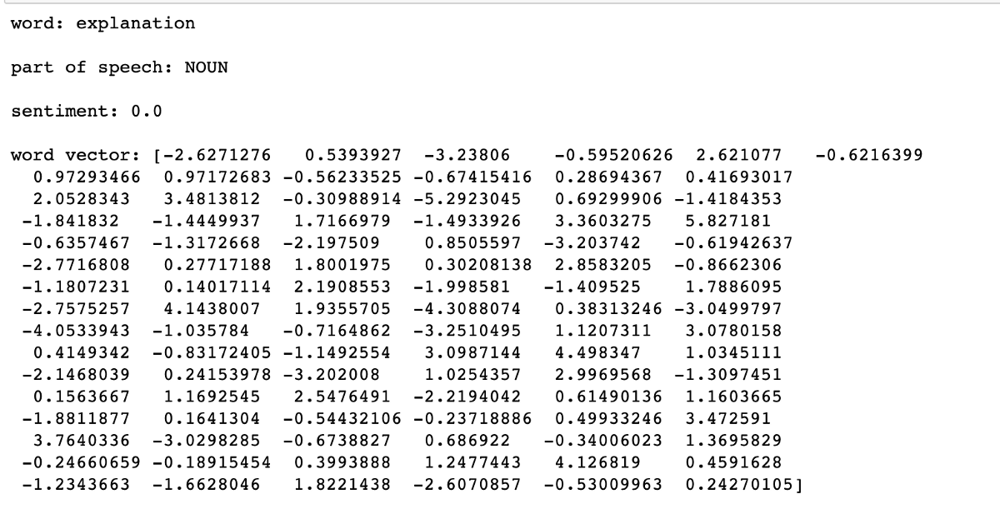

我们已经介绍了大多数基础知识，但是NLP当然还有很多。 但是，本文是一个不错的起点，希望对初学者有所帮助，因为这是我刚开始学习的第一件事！
## 有毒评论分类器
## 有毒评论分类挑战
### 识别和分类有毒的在线评论
# 自然语言处理（NLP）入门-预处理，单词嵌入，文本分类等！
## 使用简单的Python库

> source


如今，自然语言处理领域发生了很多事情（GRU，LSTM，XLNet，BERT等！）。 弄清楚从哪里开始可能会造成混淆。 本文讨论了自然语言处理的基础，包括使用基本但功能强大的Python库进行的数据清理，规范化，编码，情感分析和简单的文本分类器。 这通常是进入复杂的深度学习模型之前的第一步。
# 数据清理和规范化

根据问题的性质，可能需要也可能不需要此步骤。 如果我们的模型正在尝试最大程度地学习语言，则最好以原始格式使用数据，实际上，现代深度学习技术建议不要删除停用词，表情符号或小写字母，因为它们会提供附加信息 上下文。 但是，如果您尝试根据某些单词的出现情况进行趋势分析或分类（例如在词袋模型中），则有助于执行此步骤。 我想在此处重点介绍一些常见的预处理步骤：
+ 删除标点符号：尝试训练机器学习模型时，它可以通过删除标点符号（如！，*等）来减少过度拟合。 但是，请注意不要删除重要的内容，例如，问号（？）有助于识别问题。
+ 删除表情符号：有时人们将表情符号附加到没有空格的单词（例如：you❤）上，从而难以解释此类单词。 删除表情符号可以在这种情况下提供帮助。 同样，删除这些表情符号时要小心，因为表情符号实际上可能对情感分析和主题分类等任务非常有用。
+ 删除停用词：对于诸如数据探索和趋势分析之类的任务，查看诸如“ the”，“ and”，“ of”等常用词可能不是很有用。sklearn软件包实际上包含了一组常用的英语停用词 我们可以用来删除这些。
+ 使所有文本变为小写：这是标准化文本的最简单方法。 （毕竟，BeTTer和更好的语言确实具有相同的语义含义）
+ 词干：规范化的另一种方法是将派生词替换为其词根形式（例如，“发布”，“已发布”，“帖子”全部替换为“帖子”）。 为了阻止单词，我们使用nltk提供的PorterStemmer util。
+ 提取/删除主题标签和注释：主题标签和注释在识别数据趋势方面非常有用。 它有助于将它们从文本中提取出来并分别进行分析。

这是执行上述任务的简单功能：
```python
import re
from sklearn.feature_extraction.text import ENGLISH_STOP_WORDS
from nltk.stem.porter import PorterStemmer
import emoji
import string

def preprocess_text(text, remove_stop = True, stem_words = False, remove_mentions_hashtags = True):
  """
  eg:
  input: preprocess_text("@water #dream hi hello where are you going be there tomorrow happening happen happens",  
  stem_words = True) 
  output: ['tomorrow', 'happen', 'go', 'hello']
  """
    
    # Remove emojis
    emoji_pattern = re.compile("[" "\U0001F1E0-\U0001F6FF" "]+", flags=re.UNICODE)
    text = emoji_pattern.sub(r"", text)
    text = "".join([x for x in text if x not in emoji.UNICODE_EMOJI])

    if remove_mentions_hashtags:
        text = re.sub(r"@(\w+)", " ", text)
        text = re.sub(r"#(\w+)", " ", text)
        
    text = re.sub(r"[^\x00-\x7F]+", " ", text)
    regex = re.compile('[' + re.escape(string.punctuation) + '0-9\\r\\t\\n]') # remove punctuation and numbers
    nopunct = regex.sub(" ", text.lower())
    words = (''.join(nopunct)).split()
    
    if(remove_stop):
        words = [w for w in words if w not in ENGLISH_STOP_WORDS]
        words = [w for w in words if len(w) > 2]  # remove a,an,of etc.
        
    if(stem_words):
        stemmer = PorterStemmer()
        words = [stemmer.stem(w) for w in words]
        
    return list(words) 
```
# 字向量-它们是什么？

机器学习算法只能处理固定长度的数字输入，即它们不能采用字符串输入来处理文本数据！ 这是单词向量进入的地方，我们使用固定长度的向量表示每个单词。 然后将各个单词向量用于编码句子。
## 一键编码：

这是编码单词的最简单方法。 它假定使用词袋表示法，其中每个单词都被视为一个独立的实体，并且单词关系被忽略（例如，尽管工作和职业实际上具有相同的含义，但它们被视为完全独立的单词）。 该方法涉及从整个语料库创建不同单词的词汇表，该词汇表的长度是每个单词向量的长度。 每个向量在单词向量中都有自己的指定索引，该索引标记为1，而其他索引标记为0以表示特定单词。

例：


这里的词汇表由9个不同的词组成，这些词可以被一个热编码为长度为9的向量。这些词向量的表示形式如下：[1,0,0,0,0,0,0,0,0,0]好：[ 0,1,0,0,0,0,0,0,0]，依此类推。

使用此表示形式，明天将是美好的一天的文本可以编码为：[0,1,1,0,1,1,0,1,0]。 注意单词将被忽略，因为它根本不存在于词汇表中。 要使此模型正常工作，必须具有良好而广泛的词汇表。 还要注意在此表示形式中如何完全忽略单词关系（出现的顺序，语义关系）。
## Word2Vec词嵌入：

单词编码的这种方法（通常称为单词嵌入）考虑了上下文。 例如，我们可以预期国王和王室一词的空间距离要比鹦鹉和蜂蜜小。 Word2vec使用浅层两层神经网络执行特定任务（基于所使用的方法），并为每个单词学习隐藏层的权重。 这些学习的隐藏层权重用作我们的最终单词向量。 您可以阅读原始论文，以深入了解如何获得这些单词向量。 但总的来说，这是使用Word2Vec获取基于上下文的单词向量的两种常用方法：

CBOW（连续词袋）：

> source : https://arxiv.org/pdf/1301.3781.pdf


CBOW模型体系结构尝试根据源上下文单词（环绕单词）预测当前的目标单词（中心单词）。

跳过—语法模型：

> source: https://arxiv.org/pdf/1301.3781.pdf


Skip-gram模型体系结构试图实现与CBOW模型相反的功能。 它尝试在给定目标单词（中心单词）的情况下预测源上下文单词（环绕单词）。

在两种情况下，窗口大小（每侧考虑的周围单词数）都是超参数。
## 手套：

Glove与Word2vec非常相似，但与Word2vec不同，Glove利用了单词的全局共现，而不仅仅是局部上下文，这使它在某些方面更加强大。 同样，通过阅读原始论文，您可以更好地理解。
# 词嵌入-如何使用它们？

现在我们对什么是词嵌入及其为何有用有了一个大概的想法，让我们来谈谈如何利用它们来发挥我们的优势。
## 使用预训练的单词向量：

有许多公开的，经过预先训练的，具有不同向量长度的预训练词向量，例如Glove，fasttext等。这些已经在大规模语料库（Wikipedia，twitter和常见的抓取数据集）上进行了训练，可以下载并用于在我们的语料库中对词进行编码。

示例：使用词向量相似度查找与给定文档最相似的文档

问题陈述：

给定一组属于不同主题的文档（培训集），当给定一个新文档时，我们能否从原始文档集中找到与其最相似的文档？

方法：
+ 将经过预训练的单词向量文件加载到字典中，以单词为键，其向量表示为值。
+ 通过对特定文档中存在的单词的单词矢量求平均值，找到训练集中每个文档的质心矢量（忽略不属于词汇表的单词）
+ 找到新文档的质心，从训练集中选择其质心最接近新文档质心的文档（使用合适的相似度度量，例如欧氏距离，余弦相似度等）

码：

这是一些辅助函数，用于加载手套字典，查找质心以及查找质心之间的距离：
```python
import numpy as np

#loading the glove file into a dictionary of words
def load_glove(filename):
    glove_dict = {}
    with open(filename) as f:
        file_content = f.readlines()
    for line in file_content:
        line_content = line.split()
        glove_dict[line_content[0]] = np.array(line_content[1:], dtype=float)
    return glove_dict

#get centroid of a particular document
def get_centroid(text, gloves):
    words_list = preprocess_text(text)
    word_vec_sum = 0
    words_count = 0
    for w in words_list:
        if w in gloves:
            word_vec_sum += gloves[w]
            words_count += 1
    if words_count:
        return word_vec_sum/words_count
    else:
        return 0

#get distance between two centroids
def get_distance (a,b):
    return (np.linalg.norm(a - b))
```
## 训练从头开始生成单词向量：

如果要查找特定语料库的单词向量，可以使用gensim包进行训练。

例：

码：
```python
import gensim
with open('./potato.txt') as f:
    text = f.read()
words_list = [preprocess_text(text)]
model = gensim.models.Word2Vec(
        words_list,
        size=150,
        window=2,
        min_count=1,
        workers=10,
        iter=10)
print('vocabulary: ', model.wv.vocab.keys(),'\n')
print(model.wv.most_similar('starchy'),'\n')
print(model.wv.word_vec('potato'),'\n')
```

输出：


在上面的示例中，我仅使用了Wikipedia页面上的两行内容。 训练是非常快速和简单的，您只需要输入单词列表，所需单词矢量的大小，窗口大小（要考虑的周围单词的数量）以及出现该单词的最小次数 它被视为词汇的一部分。 检查词汇表，获取向量以及查看语料库中最常用的词都很容易。 当然，从头开始的训练可能并不总是能获得与预训练的结果一样好的结果，但是对于涉及数据看起来与预训练中使用的数据集截然不同的问题的好处。
# 数据探索

带有文本数据的EDA不如表格或数字数据那么简单。 但是，有些库可以使这些任务更容易。 对于本文的其余部分，我使用了Kaggle的以下数据集：
## 有毒评论分类挑战
### 识别和分类有毒的在线评论
## 使用spacy探索：

Spacy是一个非常强大的NLP库，具有多种用途。 它可用于命名实体识别，识别单词所属的语音部分，甚至给出单词的矢量和情感。

码：
```python
import spacy
nlp = spacy.load("en_core_web_sm")
text = ' '.join(toxic_data[:1000]['comment_text'])
doc = nlp(' '.join(preprocess_text(text)))

x = doc[0]
print('word:', x, '\n')
print('part of speech:', x.pos_, '\n')
print('sentiment:', x.sentiment,'\n')
print('sentiment:', x.sentiment,'\n')
print('word vector:', x.vector)
```

输出：


来自spacy的nlp函数将每个单词转换为具有各种属性的令牌，例如上面示例中提到的那些属性。
## Wordcloud：

Wordclouds是一种简单而有趣的方法，用于可视化各种单词在我们的语料库中出现的频率。 让我们以评论数据中最常出现的名词为例：

码：
```python
from wordcloud import WordCloud
import matplotlib.pyplot as plt

def make_wc(word_list):
    wordcloud = WordCloud()
    wordcloud.fit_words(dict(Counter(word_list).most_common(40)))

    fig=plt.figure(figsize=(10, 10))
    plt.imshow(wordcloud)
    plt.axis("off")
    plt.show()
    
make_wc([token.text for token in doc if token.pos_ in ['NOUN']])
```

输出：

> article, talk, and page are the most frequently occurring nouns

# 情绪分析

在NLP中，一项非常常见的任务是确定特定评论或文本的正面或负面。 vaderSentiment软件包提供了一种快速简便的方法：

码：
```
from vaderSentiment.vaderSentiment import SentimentIntensityAnalyzersentiment_analyzer = SentimentIntensityAnalyzer()def get_sentiment_score(text):    return sentiment_analyzer.polarity_scores(text)['compound']
```

输出：

> The sentiment score for a toxic comment seems to be close to -1 whereas a non-toxic one has a score greater than 0 as expected

# 文字分类

对于分类，我使用过的最简单的库之一是fasttext。 它于2016年由Facebook发布，并使用线性技术将单词向量组合到代表文本的向量中，并用于计算分类标准。 它花费很少的时间进行培训，并为大多数常见的文本分类问题提供了不错的结果。 它可以用来提出基线模型。 您可以阅读原始文章，以更好地了解fasttext分类器背后的机制。

这就是我使用fasttext对有毒评论与无毒评论进行分类的方式：
## 有毒评论分类器
```
(本文翻译自Aakanksha NS的文章《Getting Started with Natural Language Processing (NLP) — preprocessing, word embeddings, text classification, and more!》，参考：https://towardsdatascience.com/getting-started-with-natural-language-processing-nlp-2c482420cc05)
```
