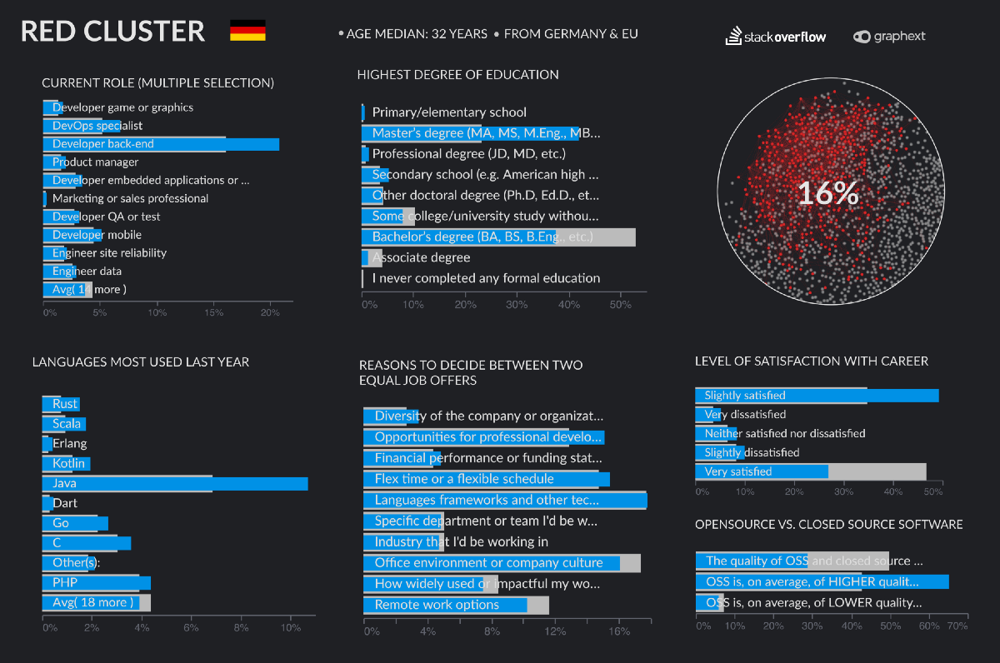

当然，还有更多的集群和见解可以发现，这就是我们使您可以访问该项目的原因。 通过单击此链接，您可以访问项目并开始您的探索之旅。

如果您想了解更多信息，请随时在此处要求我们进行演示，或于6月19日加入我们的网络研讨会。
## 结论与建议

即使配置文件相差很大，我们也可以提取一些准则供您输入前5％的数据。
+ 在美国，您不需要硕士学位，就读学士学位后即可开始工作。 在德国和英国，通过硕士学位和博士学位的传统途径更为普遍。
+ 学习诸如Rust或WebAssembly之类的利基语言将为您提供竞争优势，并使您对市场的需求更高。
+ 在决定工作机会时，公司的公司文化和多样性经常被称为前5％的标准。 选择一个适合自己的工作场所似乎对成功至关重要。
+ 对您的职业选择持开放态度。 作为DevOps或Full-Stack开发人员以及设计人员或开发人员QA，您可以赚取丰厚的薪水

为了使我们的分析更加有趣，在开始分析之前，我们先问了以下问题：
# 谁是收入最高的5％最高的开发人员？

通过回答大多数问题的人筛选88883调查对象，我们最终得到了52545人口。从这些对象中，我们选择了美元年度薪金栏的95％分位数，最终为我们的项目吸引了2600名受访者。 这些人的最低年收入为573,108 USD，我们想了解这些人是谁。

重要说明：堆栈溢出使用总薪酬，货币，汇率和信息（如果薪酬是每周，每月或每年）来计算年度美元薪水。 因此，每个项目收费很高的顾问，其虚拟年薪很容易超过2Mio。
# 1.通用网络

将我们的数据集输入到Graphext后，我们最终得到了这个漂亮的Graph，您可以在上面看到。 已经识别出了几组颜色独特的开发人员，单击一下我们就可以发现这些人的主要特征是什么。

在下面的内容中，我们将向您展示解释概要文件的主要变量。 每个变量的值均按Uplift排序，这意味着：

想象一下，在VBA中整个人口计划中只有极少数的人（6％）。 当我们创建总体过滤器时，VBA不太可能成为该选择中最重要的编程语言。 但是，如果它的比例增加到12％，那么它对于“选择”的意义就会加倍，因此，我们说这是该人的重要特征。

另一方面：如果使用Java的所有People程序中有50％，但是在我们的集群中只有30％，那么即使它是最常用的一种编程语言，“特性”也不如其他重要。
# 资料1：拥有学士学位的美国人

## 关键事实
+ 除了工作以外的一些学习
+ 数据和业务分析师，数据库管理员，设计人员，质量检查，桌面应用程序，..
+ 学士和副学士学位
+ 在大公司工作
+ 重要语言：VBA，C＃，F＃，PHP，SQL等
+ 他们在决定工作机会时会寻求灵活的时间表，公司文化和远程工作选择
# 配置文件2：德国DevOps和后端开发

## 关键事实
+ DevOps，后端开发，开发 用于游戏和图形
+ 硕士学位，专业学位
+ 对自己的职业不太满意
+ 相信开源软件的质量
+ 重要语言：Rust，Scala，Erlang，Java，..
+ 在决定工作机会时，他们会寻找公司的多元化，专业发展和财务绩效
# 简介3：具有博士学位和硕士学位的英国人

## 关键事实
+ 高管，移动开发人员，DevOps，后端，前端，全栈，系统管理员，..
+ 硕士和博士学位
+ 几乎所有人都可以使用MacOS
+ 他们平均不到40小时
+ 重要语言：Dart，WebAssembly，Clojure，Ruby，JavaScript
+ 他们在决定工作机会时会寻求多样性，公司文化和行业
# 好极了—如何成为世界上排名前5％的开发商！

每年，Stack Overflow都会为我们提供年度开发人员调查的许多有趣见解。 您将对市场上最需要的编程语言，薪酬最高的职位以及更多内容有深刻的了解。

在Graphext，我们也总是对调查结果非常感兴趣，但是今年我们想尝试自己寻找见解。 多亏了Stack Overflow发布了他们的调查数据，我们可以简单地使用不同的方法来运行我们自己的分析。 通过根据受访者提供的所有答案创建集群，我们将找到典型且更详细的开发人员资料。

因此，今天我们将向您展示如何摆脱这一困境：

为此：

