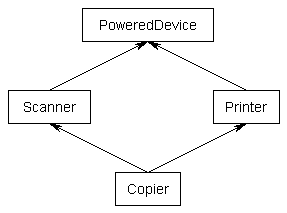

# 再见，面向对象编程


我从事面向对象语言的编程已有数十年了。 我使用的第一种面向对象语言是C ++，然后是Smalltalk，最后是.NET和Java。

我很想利用继承，封装和多态性的好处。 范式的三个支柱。

我渴望获得重用的承诺，并利用在这个新的令人兴奋的环境中出现在我之前的人们所获得的智慧。

想到将现实世界的对象映射到它们的类中，并希望整个世界都能整齐地摆放，我激动不已。

我再也不会错了。
# 继承，第一个跌落的支柱


乍一看，继承似乎是面向对象范例的最大好处。 形形色色的结构的所有简单示例都被认为是新学说的示例，这似乎是合乎逻辑的。


重用是当今的话题。 不……让这一年，甚至永远。

我吞下了这一切，并以我新发现的见识冲进了世界。
## 香蕉猴丛林问题

出于宗教信仰和解决问题的需要，我开始构建类层次结构并编写代码。 世界上一切都正确。

我永远不会忘记这一天，当我准备通过继承现有类来兑现“重用”的承诺时。 这是我一直在等待的时刻。

一个新项目出现了，我回想起我上一个项目中非常喜欢的那个班级。

没问题。 重新使用进行救援。 我要做的只是从另一个项目中获取该Class并使用它。

好吧……实际上……不只是那个班级。 我们需要家长班。 但是……仅此而已。

嗯...等等...看来我们也将需要父母的父母...然后...我们将需要所有父母。 好吧好吧我会处理的 没问题。

太好了 现在它将无法编译。 为什么？？ 哦，我明白了…这个对象包含另一个对象。 所以我也需要 没问题。

等等...我不仅需要那个物体。 我需要对象的父对象及其父对象的父对象，依此类推，依次包含每个包含的对象以及包含对象的所有父对象以及其父对象，父对象，父对象……

啊。

Erlang的创建者Joe Armstrong引用了一句话：

面向对象语言的问题在于，它们具有随身携带的所有隐式环境。 您想要香蕉，但是得到的是一只大猩猩，拿着香蕉和整个丛林。
## 香蕉猴丛林解决方案

我可以通过不创建太深的层次结构来解决这个问题。 但是，如果继承是重用的关键，那么我对该机制的任何限制肯定会限制重用的好处。 对？

对。

那么，在Kool-aid的健康帮助下，可怜的面向对象程序员该怎么办呢？

包含并委托。 稍后再详细介绍。
## 钻石问题

迟早，以下问题将变得很丑陋，并且根据语言的不同，还会出现无法解决的问题。


尽管这似乎合乎逻辑，但大多数OO语言都不支持此功能。 用OO语言支持此功能有何困难？

好吧，想象一下下面的伪代码：
```
Class PoweredDevice {}Class Scanner inherits from PoweredDevice {  function start() {  }}Class Printer inherits from PoweredDevice {  function start() {  }}Class Copier inherits from Scanner, Printer {}
```

请注意，Scanner类和Printer类都实现了一个名为start的函数。

那么Copier类继承了哪个启动函数？ 扫描仪开启了吗？ 打印机一台？ 不能两者兼有。
## 钻石解决方案

解决方案很简单。 不要那样做

是的，这是正确的。 大多数OO语言不允许您这样做。

但是，但是……如果我必须对此建模呢？ 我要重用！

然后，您必须包含并委托。
```
Class PoweredDevice {}Class Scanner inherits from PoweredDevice {  function start() {  }}Class Printer inherits from PoweredDevice {  function start() {  }}Class Copier {  Scanner scanner  Printer printer  function start() {    printer.start()  }}
```

请注意，此处的Copier类现在包含Printer和Scanner的实例。 它将启动函数委托给Printer类的实现。 它可以轻松地委派给扫描仪。

这个问题是继承支柱中的另一个难题。
## 脆弱的基类问题

因此，我正在简化层次结构，以防止其具有周期性。 我没有钻石。

世界上一切都正确。 直到...

有一天，我的代码可以工作，而第二天它将停止工作。 这是踢脚线。 我没有更改代码。

好吧，也许是个错误……但是等等……有些事情确实发生了变化……

但这不在我的代码中。 原来更改是在我继承的类中进行的。

基类的更改如何破坏我的代码？

这就是...

想象一下以下基类（它是用Java编写的，但是如果您不懂Java，应该很容易理解）：
```
import java.util.ArrayList; public class Array{  private ArrayList<Object> a = new ArrayList<Object>();   public void add(Object element)  {    a.add(element);  }   public void addAll(Object elements[])  {    for (int i = 0; i < elements.length; ++i)      a.add(elements[i]); // this line is going to be changed  }}
```

重要说明：请注意注释的代码行。 稍后将更改此行，这将使事情中断。

此类在其接口上具有2个函数add（）和addAll（）。 add（）函数将添加单个元素，而addAll（）将通过调用add函数添加多个元素。

这是派生类：
```
public class ArrayCount extends Array{  private int count = 0;   @Override  public void add(Object element)  {    super.add(element);    ++count;  }   @Override  public void addAll(Object elements[])  {    super.addAll(elements);    count += elements.length;  }}
```

ArrayCount类是常规Array类的专用化。 唯一的行为差异是ArrayCount保留元素数量的计数。

让我们详细看看这两个类。

Array add（）将元素添加到本地ArrayList.Array addAll（）为每个元素调用本地ArrayList add。

ArrayCount add（）调用其父级的add（），然后增加计数。ArrayCount addAll（）调用其父级的addAll（），然后将计数增加元素数。

而且一切正常。

现在是突破性的变化。 基类中的代码注释行更改为以下内容：
```
  public void addAll(Object elements[])  {    for (int i = 0; i < elements.length; ++i)      add(elements[i]); // this line was changed  }
```

就基类的所有者而言，它仍按公告功能运行。 并且所有自动化测试仍然通过。

但是所有者没有理会派生类。 派生类的所有者正在粗鲁地觉醒。

现在，ArrayCount addAll（）调用其父级的addAll（），该父类在内部调用已由Derived类覆盖的add（）。

这会导致计数在每次调用派生类的add（）时增加，然后再次增加在派生类的addAll（）中添加的元素数。

算了两次。

如果可以做到这一点，那么派生类的作者必须知道如何实现基类。 并且必须通知他们有关基类的每项更改，因为它可能以不可预测的方式破坏其派生类。

啊! 这个巨大的裂缝永远威胁着宝贵的继承支柱的稳定性。
## 脆弱的基类解决方案

再次包含并委托救援人员。

通过使用包含和委托，我们从白盒编程到黑盒编程。 对于White Box编程，我们必须查看基类的实现。

使用黑匣子编程，由于无法通过覆盖基函数的功能之一将代码注入到基类中，因此我们可以完全不了解其实现。 我们只需要关心接口。

这个趋势令人不安...

继承被认为是重用的巨大胜利。

面向对象的语言很难使“包含”和“委托”变得容易。 它们旨在简化继承。

如果您像我一样，就开始对这种继承感到好奇。 但更重要的是，这应该动摇您对通过层次结构进行分类的能力的信心。
## 层次问题

每当我创建新公司时，在创建放置公司文件的地方时都会遇到麻烦，例如 员工手册。

我是否要创建一个名为Documents的文件夹，然后在其中创建一个名为Company的文件夹？

还是创建一个名为Company的文件夹，然后在其中创建一个名为Documents的文件夹？

两者都可以。 但是哪个是对的？ 哪个最好？

类别层次结构的思想是，有些基类（父母）更为笼统，而派生类（子代）则是这些类的更专业版本。 随着我们沿着继承链的发展，甚至更加专业。 （请参阅上面的形状层次结构）

但是，如果父母和孩子可以任意切换位置，则显然此模型有问题。
## 层次解决方案

怎么了

分类层次结构无效。

那么，层次结构有什么好处呢？

遏制。

如果您查看现实世界，那么到处都会看到遏制（或专有所有权）层次结构。

您将找不到分类层次结构。 让它陷入片刻。 面向对象范例基于真实世界，其中充满了对象。 但随后它使用了损坏的模型，即。 没有现实世界类比的分类层次结构。

但是现实世界充满了遏制层次结构。 围护结构的一个很好的例子是您的袜子。 它们位于袜子抽屉中，该抽屉包含在您的梳妆台的一个抽屉中，该抽屉包含在您的卧室中，也包含在您的房屋中，等等。

硬盘驱动器上的目录是“包含层次结构”的另一个示例。 它们包含文件。

那么我们该如何分类呢？

好吧，如果您想到公司文件，我放在哪里几乎都没有关系。 我可以将它们放在“文档”文件夹或名为“ Stuff”的文件夹中。

我对其进行分类的方式是使用标签。 我用以下标签标记文件：
```
DocumentCompanyHandbook
```

标签没有顺序或层次。 （这也解决了钻石问题。）

标签类似于接口，因为您可以将多种类型与文档关联。

但是，裂缝如此之多，看来继承支柱已经倒下了。

再见，继承。
# 封装，第二倒下的支柱


乍一看，封装似乎是面向对象编程的第二大优点。

保护对象状态变量不受外部访问，即它们被封装在对象中。

我们不再需要担心who-knows-who正在访问的全局变量。

封装对于您的变量是安全的。

这个封装的东西是不可思议的！

封装寿命长…

直到...
## 参考问题

为了提高效率，对象不是通过其值而是通过引用传递给函数。

这意味着函数不会传递对象，而是传递对对象的引用或指针。

如果将对象通过引用传递给对象构造函数，则构造函数可以将该对象引用放入受封装保护的私有变量中。

但是传递的对象并不安全！

为什么不？ 因为其他一些代码具有指向对象的指针，即。 调用构造函数的代码。 它必须具有对对象的引用，否则无法将其传递给构造函数？
## 参考解决方案

构造函数将必须克隆传入的对象。 不是浅层克隆，而是深层克隆，即传入对象中包含的每个对象以及这些对象中的每个对象，依此类推。

效率非常重要。

这是踢脚线。 并非所有对象都可以被克隆。 有些具有与操作系统资源相关联的资源，从而使克隆在最好或最坏的情况下变得无用。

而且每种主流OO语言都存在此问题。

再见，封装。
# 多态性，下降的第三大支柱


多态是面向对象三位一体的红发继子。

这是该小组的Larry Fine。

他们到处走，他都在那里，但他只是一个配角。

并不是说多态性不是很好，而是您不需要使用面向对象的语言来实现。

接口会给你这个。 而且没有OO的所有包g。

有了Interfaces，您可以混合多少种不同的行为就没有限制。

因此，事不宜迟，我们告别了OO多态，而向基于接口的多态问好。
# 破碎的承诺


好吧，OO在早期肯定会许诺很多。 这些天赋仍然是给坐在教室，阅读博客和在线课程的程序员的。

我花了很多年才意识到OO对我撒谎。 我也宽容，经验不足和信任。

我被烧死了。

再见，面向对象的编程。
# 那又如何呢？

您好，函数式编程。 过去几年与您合作真是太好了。

请注意，我不会兑现您的任何承诺。 我将不得不看到它才能相信它。

一旦被烧毁，两次都害羞。

你明白。

如果您喜欢这个，请单击下面的so，以便其他人可以在Medium上看到此内容。

如果您想加入Web开发人员社区，以学习和互相帮助使用Elm中的Functional Programming开发Web应用程序，请查看我的Facebook组，Learn Elm Programming https://www.facebook.com/groups/learnelm/

我的Twitter：@cscalfani
```
(本文翻译自Charles Scalfani的文章《Goodbye, Object Oriented Programming》，参考：https://medium.com/@cscalfani/goodbye-object-oriented-programming-a59cda4c0e53)
```
