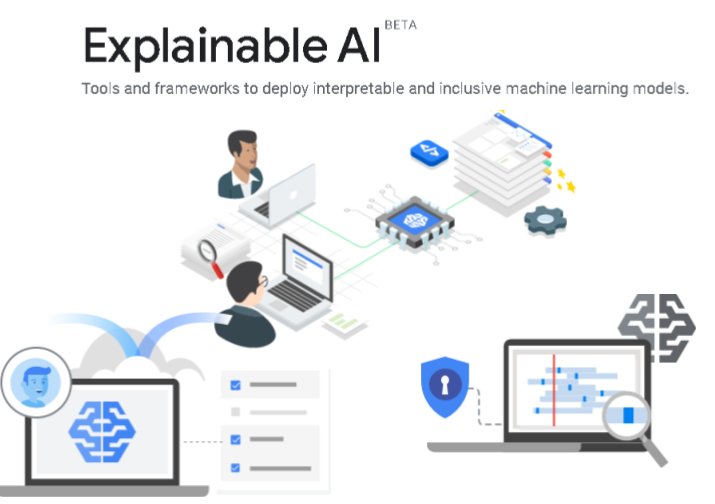
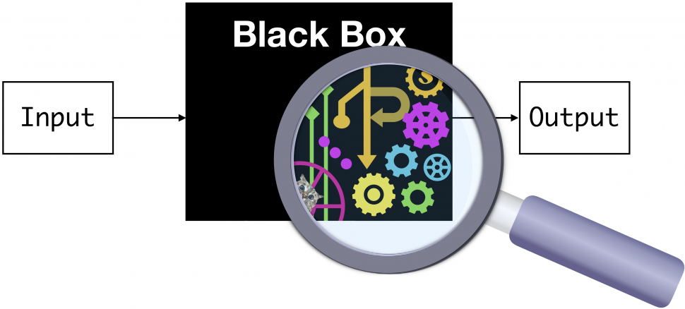
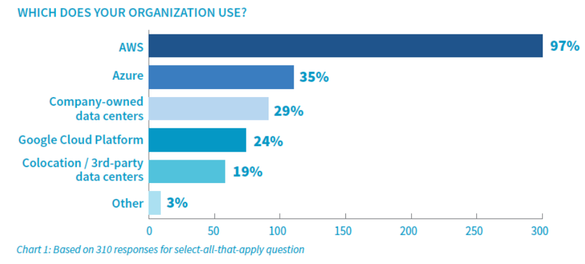
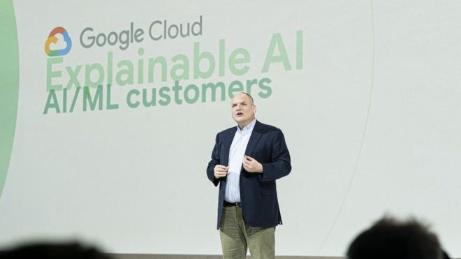
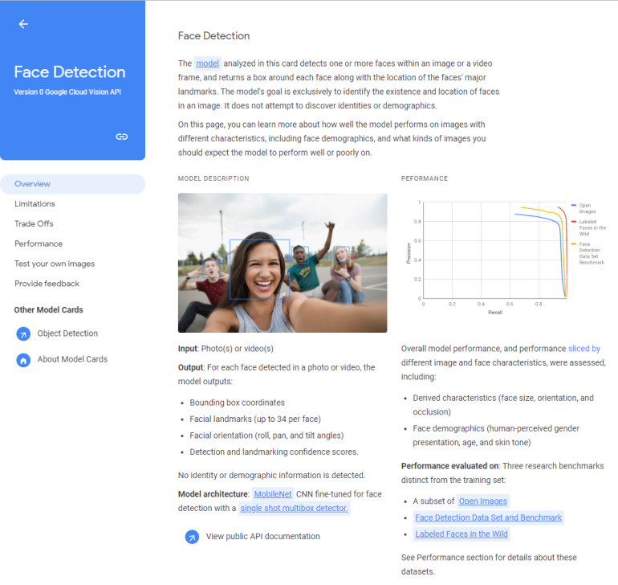
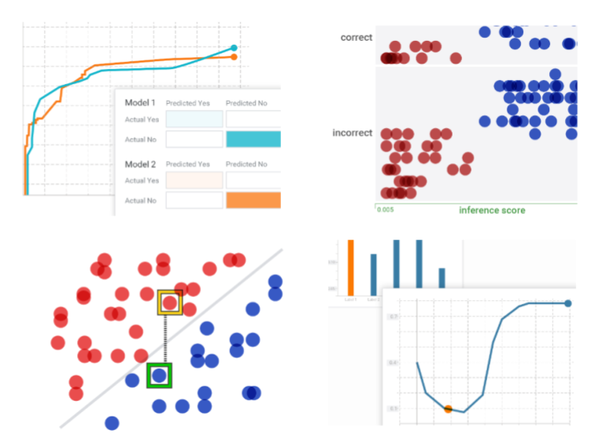

## Tirthajyoti Sarkar-高级首席工程师-人工智能，人工智能，机器学习-ON…
### 通过写作使数据科学/ ML概念易于理解：https://medium.com/@tirthajyoti开源且有趣……

如果您有任何问题或想法要分享，请通过tirthajyoti [AT] gmail.com与作者联系。 另外，您可以检查作者的GitHub存储库，以获取有关机器学习和数据科学的代码，思想和资源。 如果您像我一样对AI /机器学习/数据科学充满热情，请随时在LinkedIn上添加我或在Twitter上关注我。
## Tirthajyoti Sarkar-高级首席工程师-人工智能，人工智能，机器学习-ON…
### 通过写作使数据科学/ ML概念易于理解：https://medium.com/@tirthajyoti开源且有趣……
## AI应该自我解释吗？ 还是我们应该设计可解释的AI，以便它不必
### 在本文中，我将介绍：
# Google的新“可解释AI”（xAI）服务
## 谷歌已经开始为“可解释的AI”或XAI提供新服务，俗称它。 目前提供的工具尚不多，但目的是朝正确的方向发展。

# 人工智能存在可解释性问题

人工智能将改变全球的生产力，工作模式和生活方式，并创造巨大的财富。

研究公司Gartner预计，到2022年，全球人工智能经济将从去年的约1.2万亿美元增长至约3.9万亿美元，而麦肯锡预计，到2030年，其全球经济活动将达到约13万亿美元。

人工智能技术（尤其是深度学习（DL）模型）正在一个应用领域中令人jaw目结舌的性能彻底改变了商业和技术领域，图像应用，图像分类，对象检测，对象跟踪，姿势识别，视频分析，合成图片生成在另一个应用领域中 仅举几例。

它们正用于-医疗保健，IT 服务，金融，制造，自动驾驶，视频游戏，科学发现，甚至刑事司法系统。

但是，它们就像经典机器学习（ML）算法/技术一样。 DL模型使用数百万个参数，并创建极其复杂且高度非线性的图像或数据集的内部表示形式。

因此，它们通常被称为完美的黑盒ML技术。 在使用大型数据集训练它们之后，我们可以从中获得高度准确的预测，但是我们几乎不希望了解模型用于将特定图像分类为类别的数据的内部特征和表示形式。

> Source: CMU ML blog

# Google已启动一项新服务来解决该问题

毫无疑问，正如商业分析师和经济学家所预测的那样，谷歌（或其母公司Alphabet）在庞大的人工智能经济的适当发展中占有很大的份额（请参阅上一节）。

Google早在2017年就将官方战略政策设定为“人工智能至上”。

因此，通过提供可解释的AI服务，使AI变得不那么神秘，更适合普通用户群，这可能会成为行业中的火炬手的压力。
## 什么是可解释的AI（或xAI）？

顾名思义，这个概念很简单。 您希望您的模型不仅要进行预测，还需要进行一些解释，说明预测结果为何是如此。


但是为什么需要它呢？

本文涵盖了一些要点。 人工智能系统提供可解释性的主要原因是-
+ 提高人类可读性
+ 确定机器决策的合理性
+ 为了帮助确定问责制，导致良好决策的责任
+ 避免歧视
+ 减少社会偏见

围绕它的争论仍然很多，但是正在出现一种共识，即预测后的证明不是正确的方法。 可解释性目标应该在核心设计阶段内置到AI模型/系统中，并且应该是系统的组成部分而不是附件。

已经提出了一些流行的方法。
+ 更好地理解数据-直观的可视化显示区别特征
+ 更好地理解模型-可视化神经网络层的激活。
+ 更好地了解用户心理和行为-将行为模型与统计学习一起纳入系统，并在此过程中生成/合并适当的数据/说明

甚至DARPA也已经启动了一个完整的程序来为未来的AI / ML驱动的防御系统构建和设计这些XAI原理和算法。

在核心设计阶段，应将可解释性目标构建到AI模型/系统中

阅读本文以对概念进行彻底的讨论。
## AI应该自我解释吗？ 还是我们应该设计可解释的AI，以便它不必
### 在本文中，我将介绍：
## Google Cloud希望引领xAI

Google是吸引AI和ML人才的领导者，并且是当今世界基于信息经济的无可争议的巨头。 但是，与来自亚马逊和微软的云服务相比，其云服务仅占三分之一。

> Source: Top cloud providers 2019


但是，正如本文所指出的那样，尽管传统的基础设施即服务之战已在很大程度上决定了，但AI和ML等新技术为尝试新主题，战略和方法的参与者打开了广阔的视野 。

基于这些思路，本周在伦敦举行的一次活动上，谷歌的云计算部门推出了一项新的设施，希望借此使其在微软和亚马逊领域处于优势地位。

著名的AI研究人员Andrew Moore教授在伦敦介绍并解释了这项服务。

> Prof. Andrew Moore in London for Google Cloud explainable AI service launch, source


在他们的官方博客中，

“可解释的AI是一套工具和框架，可帮助您开发可解释且包容的机器学习模型并充满信心地部署它们。 借助它，您可以了解AutoML表和AI平台中的功能归因，并使用假设分析工具直观地调查模型行为。”
## 最初-适度的目标

最初，目标和影响范围不大。 该服务将提供有关人脸和物体检测模型的性能以及潜在缺陷的信息。

但是，随着时间的流逝，GCP希望提供更多的见解和可视化效果，以帮助使其AI系统的内部工作变得不那么神秘，并使每个人都更值得信赖。

AI和ML等新技术为尝试新主题，战略和方法的云服务参与者打开了广阔的视野。

摩尔教授坦率地接受了AI系统，即使在可解释性方面，即使是Google最好的头脑也很难解决，

“令我们为之疯狂的一件事是，我们经常会建立非常准确的机器学习模型，但我们必须了解他们为什么做自己在做的事情。 在许多大型系统中，我们都是为智能手机，搜索排名系统或问题解答系统而构建的，我们内部一直在努力地了解正在发生的事情。”

谷歌希望给用户更好的解释的一种方式是通过所谓的模型卡。

> Google model card for face detection, Source: ZDNet article


Google曾经提供过一种情景分析假设工具。 他们鼓励用户将新的可解释性工具与此方案分析框架配对。

“您可以将AI解释与我们的假设分析工具配对，以全面了解模型的行为，” Google Cloud战略总监Tracy Frey说。

> Google AI’s What-If tool


而且，目前是免费的附加组件。 向AutoML表或AI平台的用户免费提供了可解释的AI工具。

有关更多详细信息和历史观点，请考虑阅读这份精彩的白皮书。

总体而言，这听起来是一个好的开始。 尽管不是每个人，即使是在Google内部，都对xAI的整个想法充满热情。
## 有人说偏见是一个更大的问题

过去，Google研究总监Peter Norvig曾谈到可解释的AI，

“您可以问一个人，但是，您知道，认知心理学家发现的是，当您问一个人时，您并没有真正进入决策过程。 他们首先做出决定，然后您问，然后产生解释，而这可能不是真正的解释。”

因此，从本质上讲，我们的决策过程受心理学的限制，对于机器而言，这没有什么不同。 我们真的需要改变这些机制来提高机器智能吗？如果得出的答案和见解对用户而言并不令人满意，该怎么办？

相反，他认为应该在机器决策过程中跟踪和识别偏见和公平性，并给予更多的思考和重视。

为此，模型的内部工作不一定是最好的观察场所。 可以查看系统随着时间推移做出的输出决策的整体，并确定隐藏偏差机制的特定模式。

是否应该给予偏见和公平而不是仅仅对未来的AI系统进行解释？


如果您申请贷款而被拒绝，可以解释的AI服务可能会发出诸如“由于缺乏足够的收入证明而拒绝了您的贷款申请”之类的声明。 但是，任何构建过ML模型的人都知道，过程并不是一维的，而导致这种决策（通常是整体）的数学模型的特定结构和权重取决于所收集的数据集，这可能会产生偏差 反对社会中与收入和经济流动性有关的某些人。

因此，争论的焦点将集中在仅仅具有显示基本的，被淡化的解释的系统，以及建立具有较少偏见和较高程度的公平性的系统的相对重要性。
```
(本文翻译自Tirthajyoti Sarkar的文章《Google’s new ‘Explainable AI” (xAI) service》，参考：https://towardsdatascience.com/googles-new-explainable-ai-xai-service-83a7bc823773)
```
