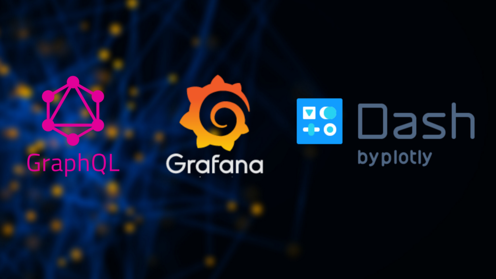
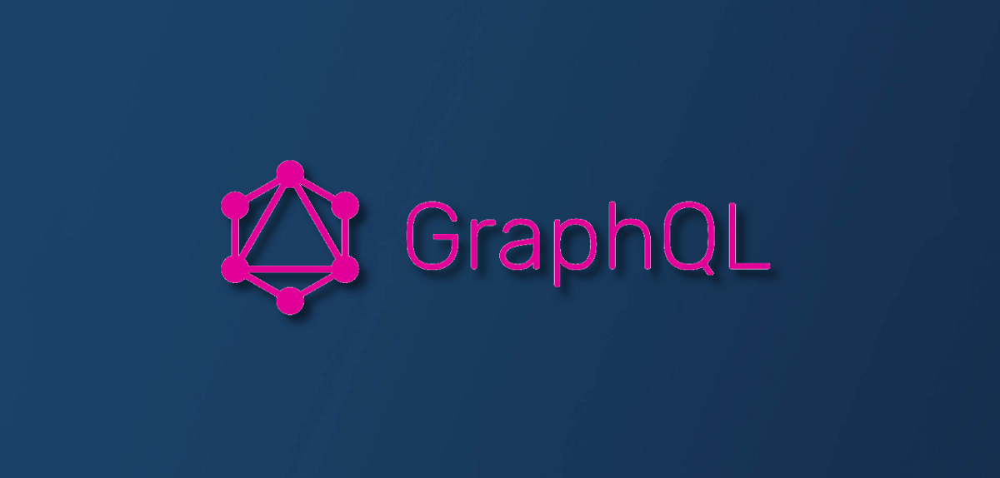
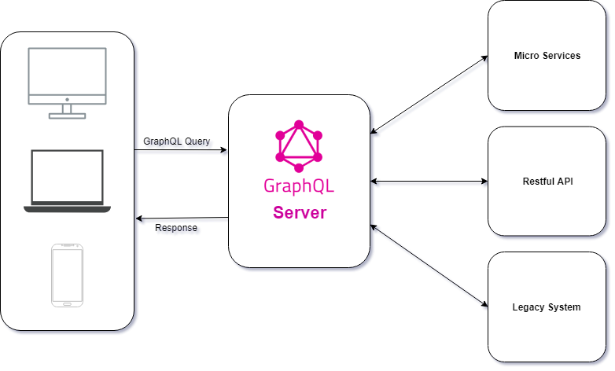
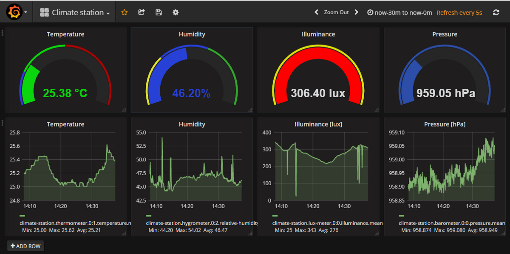
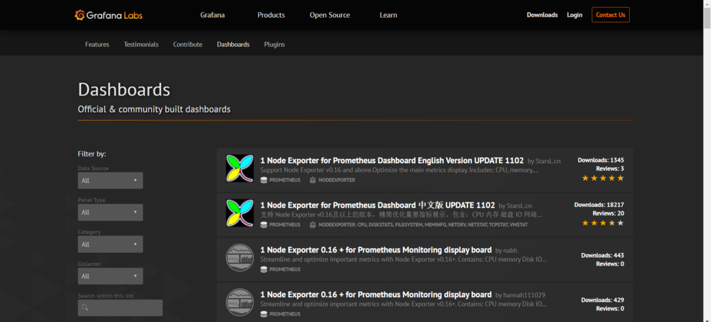
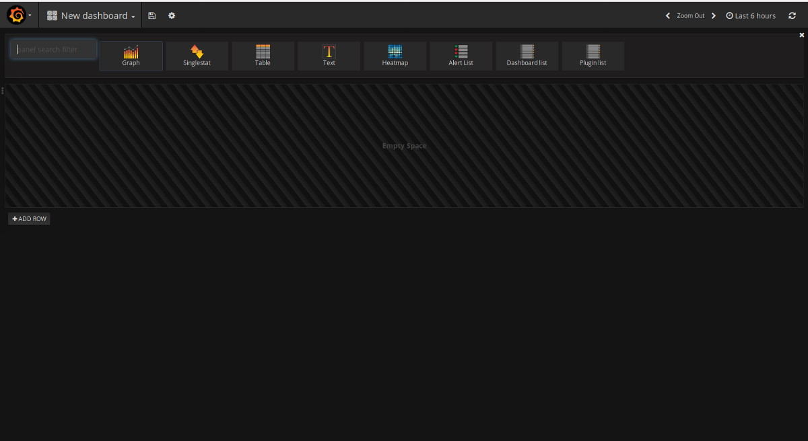
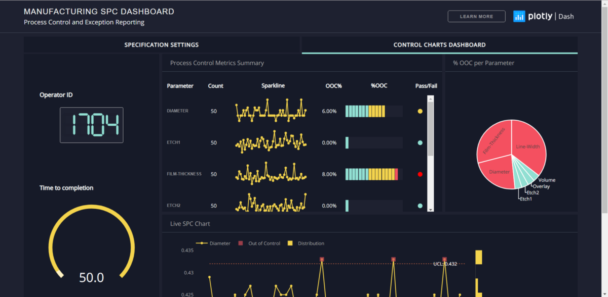

# GraphQL，Grafana和Dash

如果您是对数据科学，数据处理或数据可视化感兴趣的人，那么本文就是您的合适之选。 我确定您已经听说过我在上述主题中使用的名称。 在本文中，我将首先详细介绍所有这些内容，然后再进行比较。

> GraphQL, Grafana and Dash


上面的三个中，除了GraphQL之外，其他两个都用于数据可视化。 当今的数据可视化工具已经超越了Microsoft Excel电子表格中使用的标准图表和图形，以更复杂的方式显示数据，例如信息图表，刻度盘和仪表，地理地图，迷你图，热图以及详细的条形图，饼图和散点图。 图像可以包括交互式功能，使用户能够操纵它们或钻取数据以进行查询和分析。 还可以包括旨在在数据已更新或发生预定义条件时向用户发出警报的指示器。 数据可视化已成为现代商业智能的事实上的标准。

为了以任何方式可视化数据，您首先必须从某种来源中提取数据。 它可以是传感器，API，数据库等的系统。它还涉及对数据不同特征的理解，并为它们提供有意义，重要和有趣的属性。 数据提取还用于执行探索性分析并从数据中提取相关信息。 有许多用于数据处理的方法和技术，例如Pandas，R，SQL，GraphQL等。因此，GraphQL（这是我选择的主题之一）也是一种数据提取方法，但与其他方法截然不同。

因此，让我们从第一个GraphQL开始。
# 什么是GraphQL？

如今，大多数应用程序都需要从服务器上获取数据，而该服务器将数据存储在数据库中。 API的职责是为存储的数据提供适合应用程序需求的接口。 否则应该对通过API获取的数据进行某种过滤，以匹配应用程序的需求。


大多数人对GraphQL作为数据库技术感到困惑。 这不是很准确，因为GraphQL是API而不是数据库的查询语言。 从这个意义上讲，它与数据库无关，可以在使用API的任何情况下有效使用。 它支持声明式数据获取，因此可以与作为构建用户界面的声明性框架的React / React Native完美结合。 GraphQL可以补充或完全取代REST API的使用。

REST和GraphQL之间的主要区别在于RESTful API具有多个返回固定数据结构的终结点，而GraphQL服务器仅公开一个终结点并返回灵活的数据结构。


使用RESTful API，您最终将获得不需要的数据。 例如，当调用环境/构建/ <id>端点时，您将获得与该特定构建有关的所有数据。 您可以获取诸如date_created，date_updated，状态等数据。但是，我们所需要的只是作者的姓名。 这是RESTful API中过度获取的明显示例。

在环境/ build / <id>的情况下，不足以检索我们要查找的内容。 要获取构建所属的代码库，我们必须调用另一个端点环境/ build / <id> / codebases。 这种情况称为读取不足。

GraphQL使用其自己的类型系统来定义API的架构，其语法称为架构定义语言（SDL）。 该模式充当服务器和客户端之间的桥梁，以定义客户端如何访问数据。

一旦定义了模式，前端和后端开发人员就可以自己工作，因为可以轻松地使用模拟数据测试前端。 前端还可以从架构中获取有用的信息，例如其类型，查询和变异。 该模式还提供类型安全性，这对于前端和后端开发是一个加号，因为它可以尽早发现类型错误。

查询示例：
```
query {  books {    id    title    author    isbn    price  } }
```

在这里，我们得到一个端点，在其中可以获取所有必需的数据，而不会通过GraphQL服务器获取过多或不足的数据。

许多流行的编程语言支持GraphQL。
+ C＃/。NET
+ 走
+ Groovy
+ 爪哇
+ 的JavaScript
+ 科特林
+ 的PHP
+ 蟒蛇
+ 红宝石
+ 斯卡拉

除了在数据获取方面取得进步之外，性能优化，版本控制和易于启动也是您尝试使用GraphQL的一些原因。
# 什么是Grafana？

> Climate Station Dashboard using Grafana ( https://developers.bigclown.com/integrations/grafana-for-visualization )


Grafana是一个开放源代码，仪表板，分析和监视平台，可与Elasticsearch，Influxdb，Graphite，Prometheus，AWS Cloud Watch等各种源进行修补。最重要的是，Grafana具有将多个数据源整合在一起的能力 在一个仪表板中添加行将托管单个面板（在UI中）的行。

Grafana允许您查询，可视化，警报和了解指标，无论它们存储在哪里。 您可以与Grafana创建，浏览和共享仪表板，并促进数据驱动的文化。

如果我们谈论身份验证，则可以将Grafana与LDAP，Google Auth，Grafana.com和Github集成。 但是，如果您的公司使用SSO（单点登录）之类的技术来处理身份验证，Grafana使其可以轻松地与您现有的工作流程一起使用。

Grafana还已经创建了由社区构建的仪表板。 我们可以通过数据源，面板类型，类别和收集器来选择它们。 您可以在这里查看这些仪表板。


如果您具有与Grafana兼容的数据源，那么您要做的就是设置这些数据源，然后创建所需的面板以可视化要显示的内容。 在这里，您将从一排空的仪表板开始。 在该行中，您可以放置任何类型和任意数量的面板，每个面板负责一个视觉效果。


您可以选择所需的面板，然后将其添加到仪表板中。 就这么简单。 您可以选择面板的类型，并探索与之交互的方式。 您可以轻松创建动态和可重用的仪表板，并使用变量显示在仪表板顶部的下拉列表中，您可以在其中进行更改和交互。 此外，您可以通过查询来深入查看视图。 除此之外，您还可以使用分割视图来相互比较。

您可以轻松创建实时仪表盘，甚至可以分别浏览日志。 另一个有用的功能是为用户提供了为其重要指标定义警报规则的空间。 Grafana会不断寻找最新数据，并将通知发送到Slack，PagerDuty，VictorOps等系统。

Grafana是一种非常用户友好的工具，并且具有许多吸引人的设计可供选择。
# 什么是短跑？

Dash是一个开放源代码Python库，用于创建基于Web的反应式应用程序。 Dash于2年前在GitHub上开始公开概念验证。 我们将此原型保持在线状态，但随后在Dash上进行的工作却秘密进行。 我们使用了来自银行，实验室和数据科学团队的私人试用的反馈来指导产品前进。 今天，我们很高兴宣布Dash首次公开发布，该版本既可用于企业，又是Plotly开源工具的一流成员。 Dash可以通过pip install dash从Python的软件包管理器中下载，它是完全开源的，并获得MIT许可。 您可以在此处找到入门指南，在GitHub上可以找到Dash代码。

> Sample dashboard from the Dash App Gallery


Dash使数据科学团队能够专注于数据和模型，同时仍在生产和部署企业就绪型应用程序。 通常需要一组后端开发人员的团队，前端开发人员都可以使用Dash完成。

Dash是基于Python的框架，主要用于创建包含密集数据可视化的Web应用程序。顾名思义，Dash专用于创建基于Web的仪表板应用程序。 但这是通过在某些Python库的帮助下使用纯Python或R来实现的。

这特别适合使用Python或R进行数据处理的任何人。Dash提取了构建交互式的基于Web的应用程序所需的所有技术和协议，因此使开发人员更加方便。 他们目前具有开源版本和企业版本。

我们可以使用引人入胜的主题和任何类型的图表制作出色的数据可视化应用程序。 这样做的好处是，所有这些操作都是在纯Python或R中完成的。此外，当我们使用Dash时，您将具有更大的灵活性，因为我们可以开始使用Python从头开始创建仪表板。 这样您就可以创建自己的自定义仪表板。

Dash写在Flask，Plotly.js和React.js之上，是构建具有高度吸引力的Dashboards的数据可视化应用程序的理想选择。 它特别适合使用Python处理数据的任何人。

Dash应用程序在Web浏览器中呈现，因此它们可以跨平台和移动平台使用。 Dash是一个高级框架，它抽象了图形，表格等UI组件的较低层实现。

以下是使用Dash进行数据可视化的其他一些优点：
+ 能够以可打印的PDF或交互式，分析性Web应用程序的形式创建报告
+ 自动报告和监视流数据流
+ 历史存档，版本控制和状态跟踪，有助于审核和合规并创建机构记忆

与之前讨论的两个框架相比，Dash是一个相对较新的框架，因此您可以在此处获得有关Dash以及如何使用Dash创建仪表板的总体描述性知识。
# 比较方式

GraphQL显然与Dash和Grafana的发展路径不同，因为它是关于从存储它们的位置查询必要数据的。 GraphQL帮助我们准确地获得所需的东西，仅此而已。 当我们考虑像仪表板这样的应用程序时，这在提高效率方面确实很有用。 另一件事是，尽管许多专家和初创公司希望能够说服所有人，但GraphQL不会取代REST。 但这确实是一种查询，处理数据的简便，有效和有效的方法。

Grafana和Dash可被视为可视化从不同来源收集的数据的方法。 在Grafana中，您可以通过单击“仪表板”链接来创建一个新的空白Grafana仪表板。 Grafana附带了各种面板，可以将它们添加到仪表板中。 面板不是很有用，除非将某种图形与之关联。 图形取决于数据，因此添加到仪表板的每个面板都将与一个数据源关联。 因此，grafana将允许您添加连接了数据源的预定义面板和图形。

但是在Dash中，我们可以从头开始构建自己的非常定制的仪表板。 但是，在绘制图形和可视化数据时，它确实非常容易。 我们可以使用数据框，然后将其提供给Dash中的图形元素。 因此Dash更可定制，并且基于Python。 它基于React和Flask，而Grafana是用Go编程语言（由Google创建）和Node.js编写的。 即使您可能认为使用Dash可能会花费更多的时间和精力，但是如果您熟悉Python或R，也没那么困难。

总之，如果您需要创建仪表板，我建议您同时尝试使用Grafana和Dash。 最佳选择取决于您的要求。 但是它们都为您提供了惊人的时尚可视化效果，这些可视化效果既丰富又有吸引力。
