# 结论

感谢您的阅读，希望您学到了一些新知识。 如果您知道方便的命令行技巧，请一起成长，并将其发布在回复中。

保持好奇和饥饿！
# 11.MV
```
$ mv somefile /to/some/other/path
```

mv命令将文件或目录从一个位置移动到另一个位置。 mv命令支持移动单个文件，多个文件和目录。
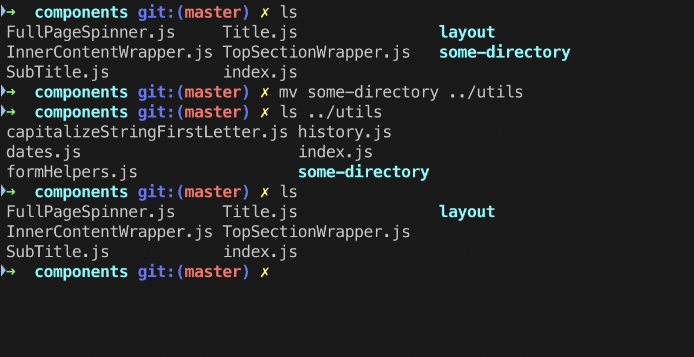
> Moving the some-directory from components to utils directory

# 10.找到
```
$ find path -name filename
```

使用find命令可以快速查找文件或目录。 当您正在处理包含数百个文件和多个目录的大型项目时，此功能非常有用。
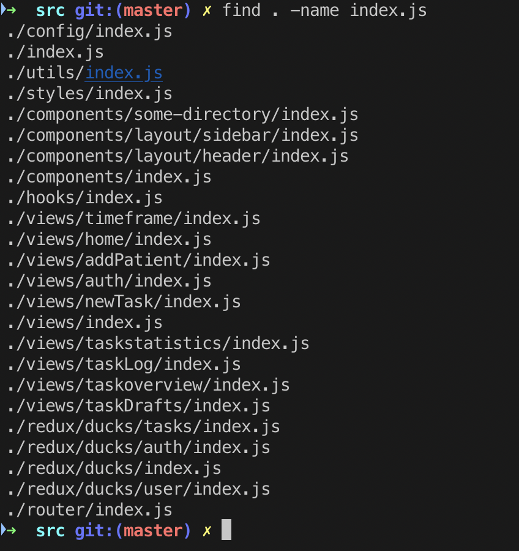
> Finding all files with the name of index.js

## 搜索特定类型的文件

使用find命令还可以在目录（及其子目录）中搜索相同类型的文件。 例如，以下命令将搜索当前工作目录中的所有.js文件。
```
$ find . -name "*.js"
```
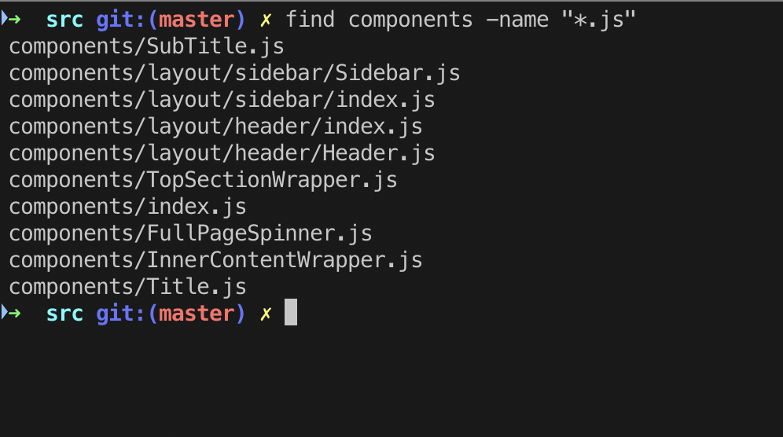
> Finding all .js files in the components directory

# 9. wget
```
$ wget someurl
```

GNU Wget是一个免费软件包，可使用HTTP，HTTPS，FTP和FTPS（使用最广泛的Internet协议）检索文件。 这是一种非交互式的命令行工具，因此可以轻松地从脚本，CRON作业，不支持X-Windows的终端等中调用。
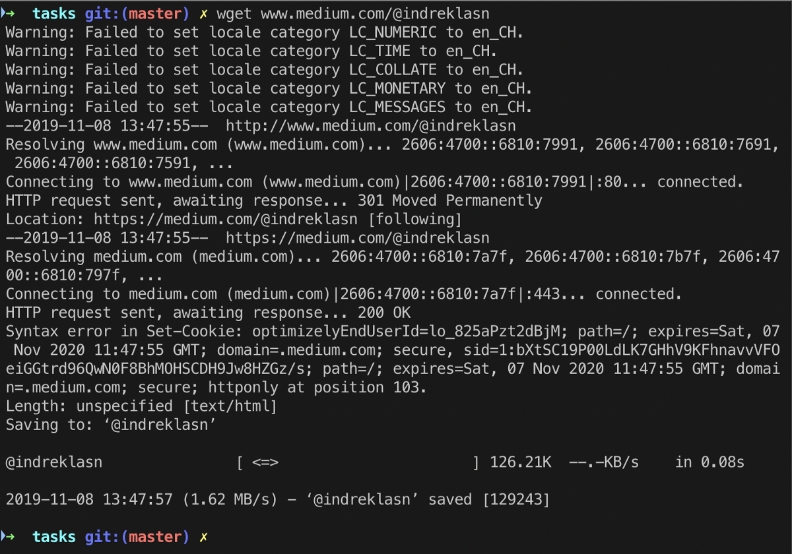
> wget to fetch information about a webpage


GNU Wget具有许多使检索大型文件或镜像整个Web或FTP站点变得容易的功能，包括：
+ 可以使用REST和RANGE恢复中止的下载
+ 可以使用文件名通配符并递归镜像目录
+ 基于NLS的消息文件，适用于多种语言
+ （可选）将下载的文档中的绝对链接转换为相对链接，以便下载的文档可以在本地彼此链接
+ 在大多数类似UNIX的操作系统以及Microsoft Windows上运行
+ 支持HTTP代理
+ 支持HTTP cookie
+ 支持持久的HTTP连接
+ 无人值守/后台操作
+ 使用本地文件时间戳确定镜像时是否需要重新下载文档
+ GNU Wget是根据GNU通用公共许可证发行的。

阅读官方GNU文档以获取更多信息。
# 8.尾巴
```
$ tail somefile
```

tail命令读取文件并输出文件的最后部分（“ tail”）。
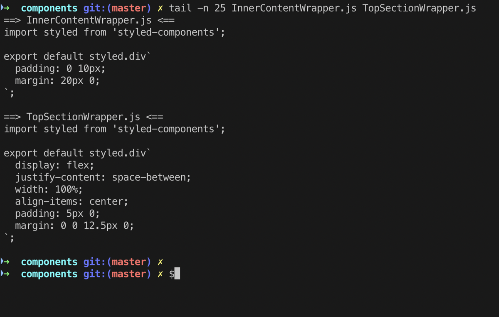
> Output the last num lines, instead of the default (10)


在查看崩溃报告或以前的历史记录日志时，tail命令很有用。 这是处理文件日志时有用的示例。
```
# tail /var/log/messagesMar 20 12:42:22 hameda1d1c dhclient[4334]: DHCPREQUEST on eth0 to 255.255.255.255 port 67 (xid=0x280436dd)Mar 20 12:42:24 hameda1d1c avahi-daemon[2027]: Registering new address record for fe80::4639:c4ff:fe53:4908 on eth0.*.Mar 20 12:42:28 hameda1d1c dhclient[4334]: DHCPREQUEST on eth0 to 255.255.255.255 port 67 (xid=0x280436dd)Mar 20 12:42:28 hameda1d1c dhclient[4334]: DHCPACK from 10.76.198.1 (xid=0x280436dd)Mar 20 12:42:30 hameda1d1c avahi-daemon[2027]: Joining mDNS multicast group on interface eth0.IPv4 with address 10.76.199.87.Mar 20 12:42:30 hameda1d1c avahi-daemon[2027]: New relevant interface eth0.IPv4 for mDNS.Mar 20 12:42:30 hameda1d1c avahi-daemon[2027]: Registering new address record for 10.76.199.87 on eth0.IPv4.Mar 20 12:42:30 hameda1d1c NET[4385]: /sbin/dhclient-script : updated /etc/resolv.confMar 20 12:42:30 hameda1d1c dhclient[4334]: bound to 10.76.199.87 -- renewal in 74685 seconds.Mar 20 12:45:39 hameda1d1c kernel: usb 3-7: USB disconnect, device number 2
```
# 7. mkdir
```
$ mkdir some-directory
```

如您所料，mkdir在当前活动路径中创建一个新的空目录。 而不是在文本编辑器或GUI中单击，而使用此命令来创建新文件夹。
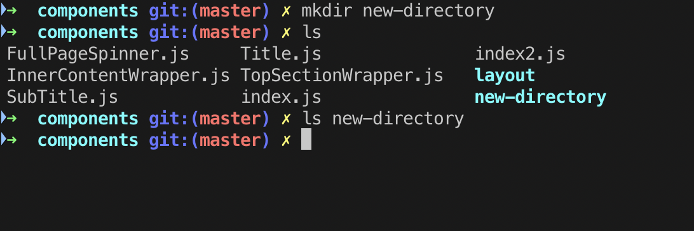
> Creating a new directory with mkdir


注意：请注意我们如何使用前面的ls命令窥视目录。
## 7.1 rm
```
$ rm someFile
```

Rm代表remove，它完全按照它说的去做。 删除，或换句话说，删除文件。
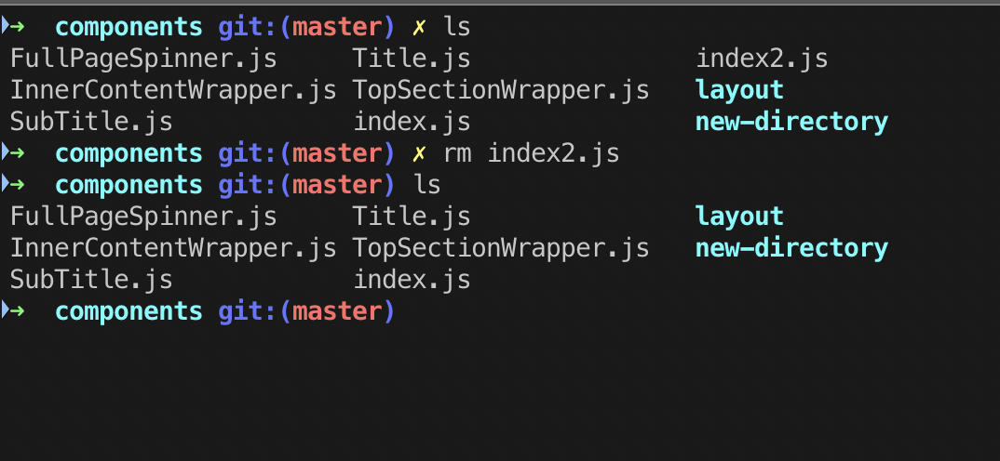
> Removing a file with the rm command


默认情况下，rm命令不会删除目录。 您需要传递-rf标志以删除目录。
```
$ rm -rf some-directory
```
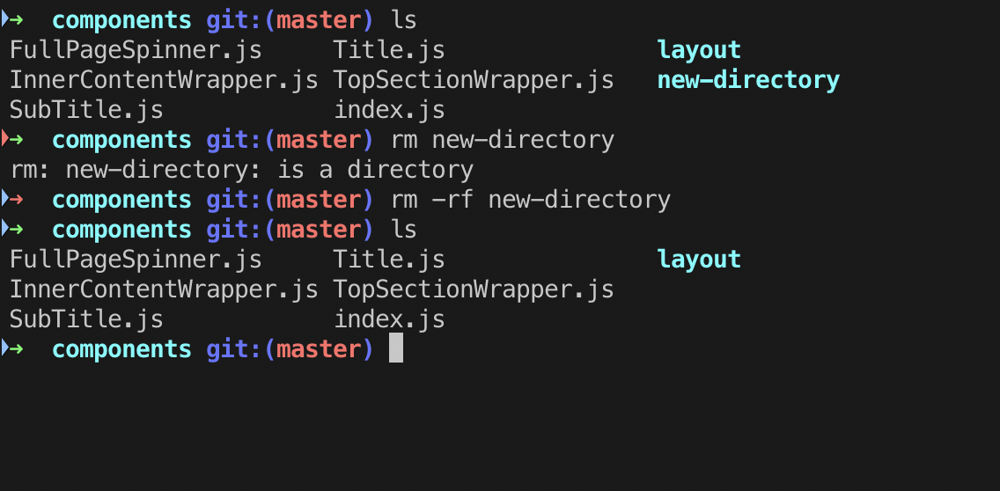
> Removing a directory with the rm command (notice we’re passing the flag to remove a directory)


注意：无论目录内部是否包含内容，这都会无条件删除目录。
## 7.2均方根
```
$ rmdir some-directory
```

如果目录中没有内容，则rmdir命令将删除目录。
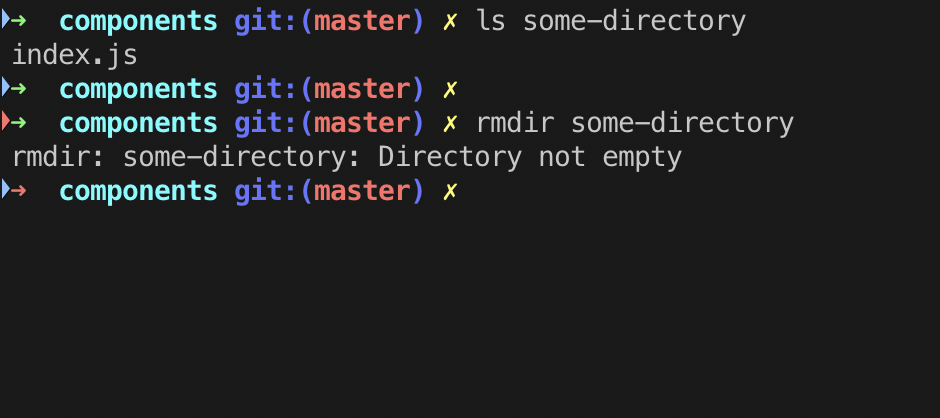
> Removing an empty directory with rmdir

# 6.触摸
```
$ touch somefile
```

touch命令用于创建不包含任何内容的文件。 当用户在创建文件时没有要存储的数据时，可以使用touch命令。
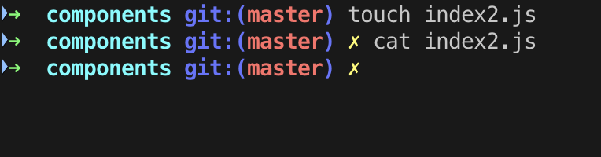
> Creating a new file with touch


请注意，我们是如何通过触摸来创建文件的，如何使用cat来查看文件的内部。 由于新创建的index2.js文件为空，因此cat不返回任何内容。

以下是cat和touch之间的主要区别：
+ cat-用于创建包含内容的文件。
+ 触摸—创建一个没有任何内容或空文件的文件。 请记住，使用touch命令创建的文件为空。 当用户在创建文件时没有要存储的数据时，此命令很有用。
# 5.回声
```
$ echo "some text"
```

Linux中的echo命令用于显示作为参数传递的一行文本/字符串。 echo是一个内置命令，主要用于shell脚本和批处理文件中，以将状态文本输出到屏幕或文件中。
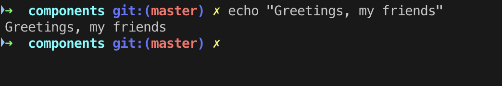
# 4.猫
```
$ cat somefile.js
```
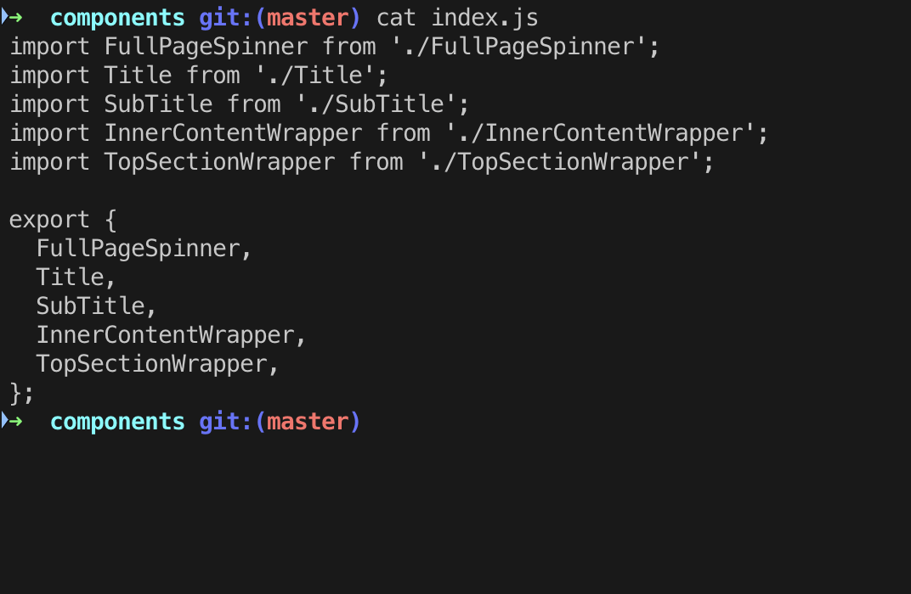
> Displaying content of a file with cat


cat命令具有与文本文件有关的三个相关功能：
+ 显示它们
+ 合并副本
+ 创造新的

cat的最常见用法是读取文件的内容，而cat通常是用于此目的的最方便的程序。

在以下示例中，使用输出重定向运算符（由向右指向的尖括号表示）将cat的标准输出重定向到file2：
```
$ cat somefile > somefile2
```
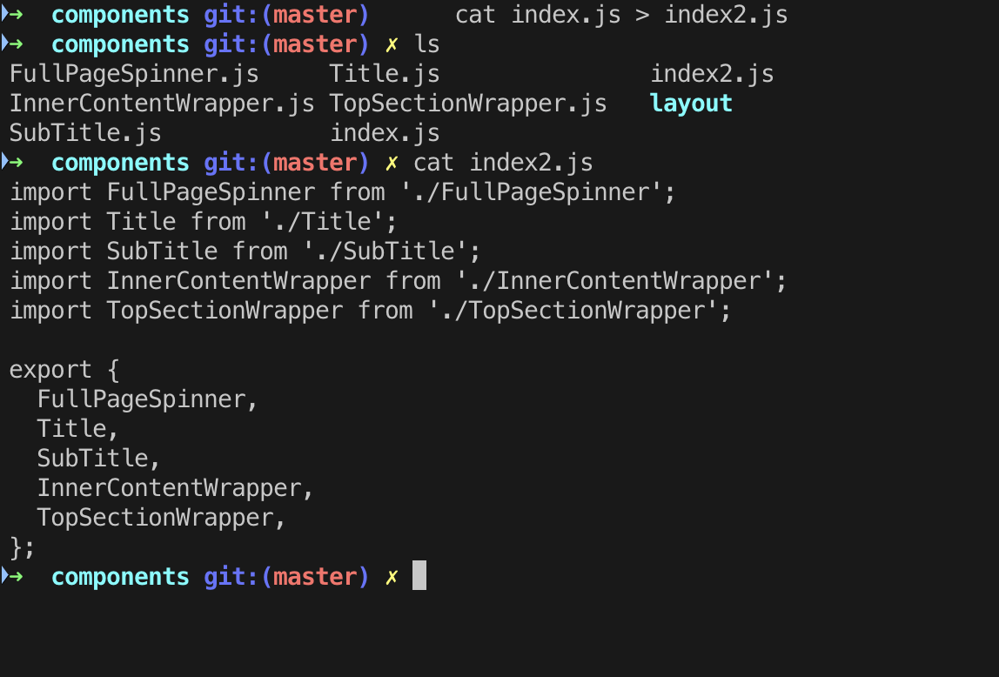
> Creating files with cat

# 3. pwd
```
$ pwd
```
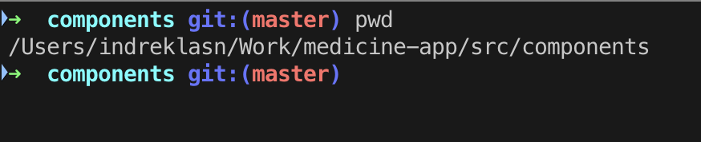
> Printing out the current working directory (pwd)


pwd命令是用于打印当前工作目录的命令行实用程序。 输出会将当前工作目录的完整系统路径打印到标准输出。 默认情况下，pwd命令会忽略符号链接，尽管可以使用选项显示当前目录的完整物理路径。
# 2. ls
```
$ ls
```

ls列出当前活动路径中的文件和目录。 如果路径名是文件，则ls根据请求的选项显示有关文件的信息。 如果路径名是目录，则ls显示有关文件和其中的子目录的信息。
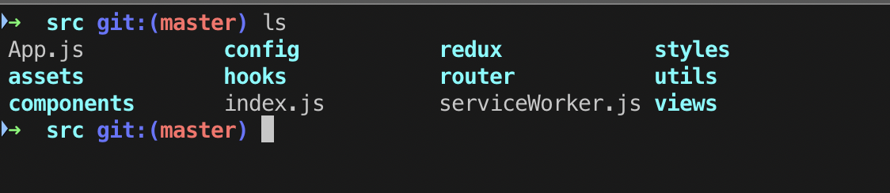
> Using the ls command to show all files in the current directory


您可能已经注意到文件显示为灰色，而文件夹为蓝色。 这是为了帮助我们区分文件夹和文件。
# 1. grep
```
$ grep "some string" file
```

grep命令在每个文件中搜索模式。 它还会寻找由换行符分隔的模式，并且grep打印与模式匹配的每一行。
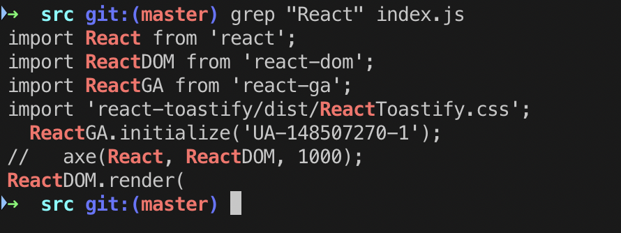
> Using the grep command to find all React keywords in a file


-i选项使我们能够在给定文件中区分大小写地搜索字符串。 它匹配“ REACT”，“ REact”和“ react”之类的词。
```
$ grep -i "REact" file
```

我们可以使用-c（count）标志找到与给定字符串/模式匹配的行数。
```
$ grep -c "react" index.js
```
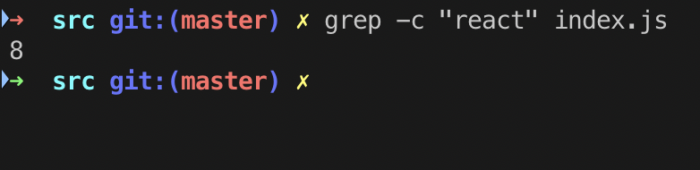
> Counting the times the word “react” pops up in a life


这是我在互联网上找到的有关grep命令的有趣且具有教育意义的漫画。
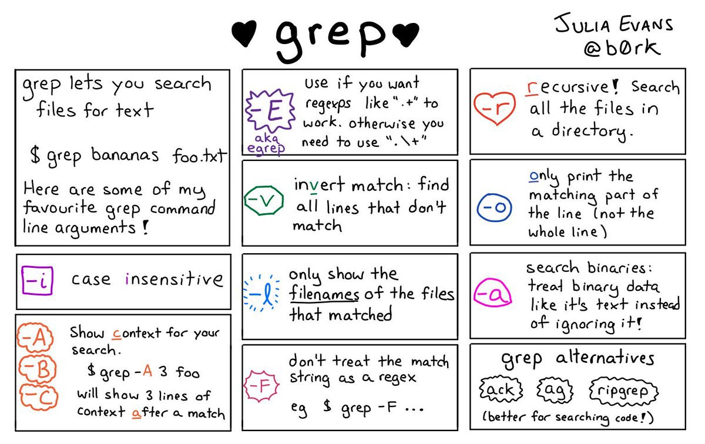
> Source: Wizard Zines


此外，变体程序egrep和fgrep分别与grep -E和grep -F相同。 不建议使用这些变体，但提供这些变体是为了向后兼容。

您可以使用grep做很多事情-在此处阅读文档以进行深入研究。
# 这是每个开发人员都应该知道的11个控制台命令
## 这些控制台命令可提高日常工作效率
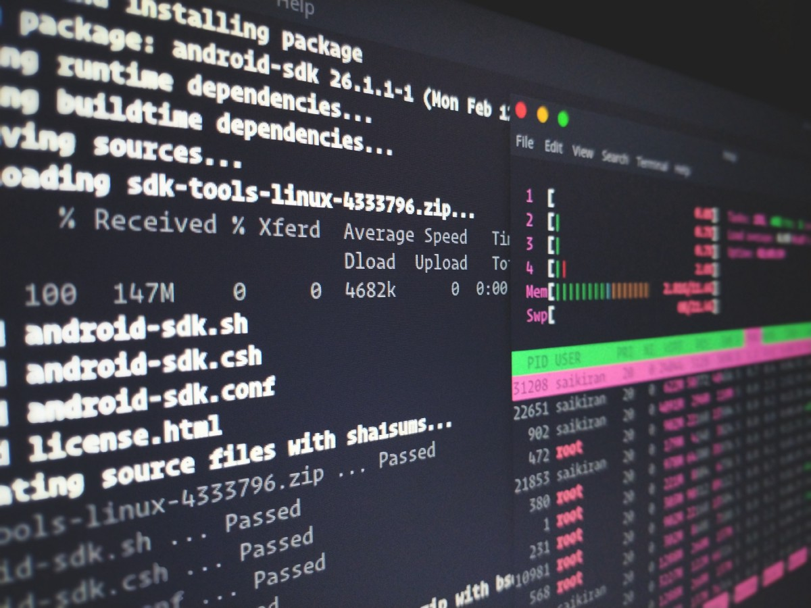
> Photo by Sai Kiran Anagani on Unsplash


命令行使我们的生活变得更加轻松，因为我们可以自动化一些平凡的任务并使事情运行更顺畅。 无需单击图形用户界面（GUI），我们可以触发一些命令并将其称为完成工作。

Unix shell是命令行解释器或shell，可为类似Unix的操作系统提供命令行用户界面。 外壳程序既是交互式命令语言又是脚本语言，并且操作系统使用它来使用外壳程序脚本控制系统的执行。

默认情况下，每个基于Linux或Mac的操作系统都安装了一个命令行，通常以“ Terminal”为名称。命令行（CLI）使我们可以轻松地移动和重命名文件，对数据进行排序以及在计算机中浏览。

事不宜迟，这里有11个命令行技巧，可以使您的生活更轻松。
