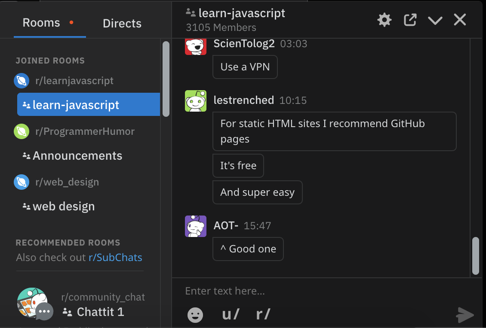
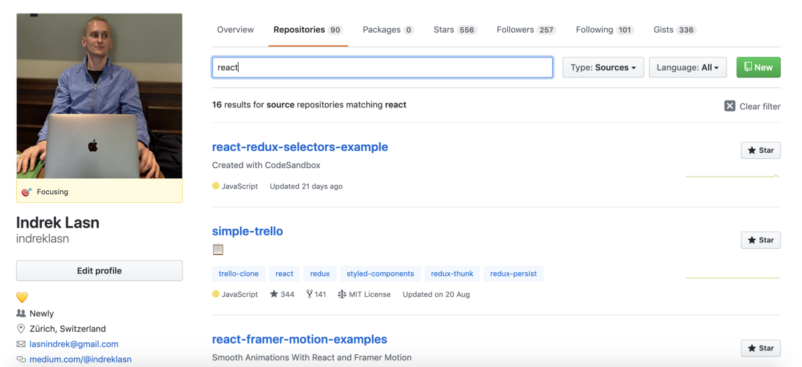
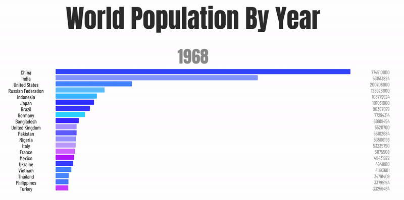

## 最好的前端黑客秘籍-集中一处
### 完全了解所有API几乎是不可能的。 这是备忘单进来的地方！ 这是最好的前端…
## 成为顶级开发人员的秘诀在于构建事物！ 这是要构建的有趣应用的列表！
# 结论

感谢您的阅读，希望您发现一些有趣的代码。

请记住，要精通编码，没有捷径可走。 开始投入工作，并通过尽可能多的构建来提高您的编码技能。 如果您没有发现任何有趣的东西，请查看下面的文章以获取更多想法。
## 成为顶级开发人员的秘诀在于构建事物！ 这是要构建的有趣应用的列表！
## 最好的前端黑客秘籍-集中一处
### 完全了解所有API几乎是不可能的。 这是备忘单进来的地方！ 这是最好的前端…
# 6.条纹样式导航

此导航的独特之处在于弹出容器的变形以适合内容。 与完全打开和关闭新的弹出框的传统行为相比，此过渡具有优雅之处。

> Stripe navigation

## 解决挑战将学到什么
+ 如何结合CSS动画和过渡效果
+ 交叉淡入淡出的内容并将活动类应用于要悬停的元素

尝试先自己做，但是如果需要帮助，请查看此帖子以获取分步指南。
# 5. Reddit风格的聊天室

聊天室易于使用和有趣，是一种流行的交流方式。 但是，实际上是什么为现代聊天室提供了动力？ WebSockets！

## 解决挑战将学到什么
+ 如何使用WebSockets和实时通讯以及数据更新
+ 用户权限级别的工作方式（例如，聊天频道的所有者具有管理员的角色，而会议室中的其他人则具有用户的角色）
+ 表单验证和处理-请记住，用于发送消息的聊天框是输入元素
+ 如何创建和加入不同的聊天室
+ 直接消息及其工作方式。 用户可以私下与其他用户通信。 本质上，您将在两个用户之间建立WebSocket连接。
## 如何使用GraphQL，Koa和MongoDB设置功能强大的API
### 构建API很有趣！
# 4.具有搜索功能的GitHub存储库

这里没有什么比GitHub仓库更重要的是。

任务是显示存储库，并允许用户筛选存储库。 使用官方GitHub API提取每个用户的存储库。

> GitHub profile page — https://github.com/indreklasn

## 解决挑战将学到什么
+ 如何从API获取数据
+ 如何显示API中的数据
+ 如何过滤和显示每次搜索的相关数据
+ 可选：如果您准备好迎接挑战，请使用通过GraphQL构建的v4 API。 如果您想学习GraphQL，请阅读我以前的文章之一。
## 如何使用GraphQL，Koa和MongoDB设置功能强大的API
### 构建API很有趣！
# 3. Twitter心脏动画

早在2016年，Twitter就针对喜欢的推特推出了这个很棒的动画。 截至2019年，它看起来仍然很rad，那么为什么不自己创建一个人呢？

> Twitter tweet like animation

## 解决挑战将学到什么
+ 关键帧CSS属性如何工作
+ 如何操作和动画HTML元素
+ 如何结合JavaScript，HTML和CSS
## 每年世界人口
### 从公元前5000年到当年（2019年）的历史人口增长
# 2.从头开始的条形图

条形图或条形图是用高度或长度与其所代表的值成比例的矩形条形显示分类数据的图表。

条形图可以垂直或水平绘制。 垂直条形图有时称为折线图。

## 解决挑战将学到什么
+ 以结构化且易于理解的方式显示数据
+ 可选：了解如何使用<canvas>元素以及如何使用它绘制元素

您可以在此处找到按年份列出的世界人口数据。
## 每年世界人口
### 从公元前5000年到当年（2019年）的历史人口增长
# 1.信用卡表格

梦幻般的信用卡形式，具有流畅而甜美的微交互作用。 包括数字格式化，验证和自动卡类型检测。 它使用Vue.js构建，并且响应速度也很快。

在这里看到它。

> credit-card-form — https://github.com/muhammederdem/credit-card-form

## 解决挑战将学到什么
+ 表格处理和验证
+ 处理事件监听器（例如，当字段更改时，它将在信用卡上打印值）
+ 了解如何在页面上显示和定位元素，尤其是与表格重叠的信用卡
# 这是代码的6个前端挑战
## 您是否可以编写这些前端挑战的代码？

> Photo by Olav Ahrens Røtne on Unsplash

前端开发非常艰巨且艰辛，但是通过实践，人们可以熟练掌握技术。 如果您愿意付出努力和努力，那么您将能够成为前端开发领域中熟练的问题解决者。 成为优秀的前端开发人员的一种有效方法是简单地构建和解决尽可能多的挑战。

您必须立即解决以下六个挑战，才能成为前端开发大师。 事不宜迟，这里可能是您应该编写的六个挑战。
