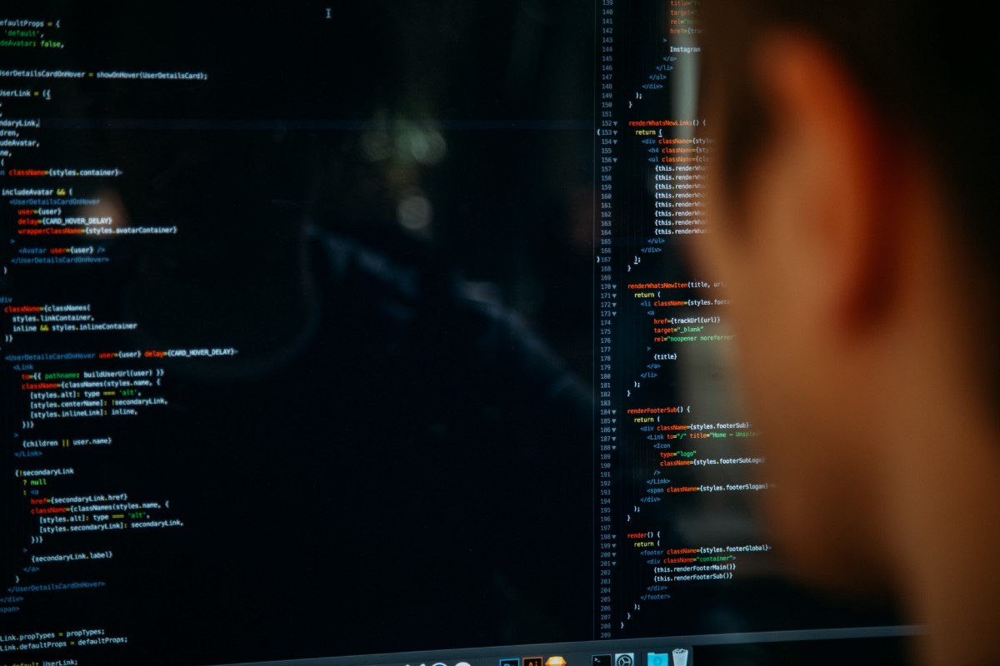

# 结论

希望您现在对Larry Wall的美德含义有了更好的了解。

这些美德实际上是有效工作愿望的不同方面。 有效地工作通常意味着知道正确的工作是什么，而不是仅仅接受效率低下或有缺陷的工作方式。

我不建议您将懒惰，急躁或自负纳入日常生活的各个方面，例如打扫房屋或洗碗，但它可以很好地激励您编写更好的程序！
# 美德＃3：傲慢

您是否曾经因为试图弄清楚如何用编程语言做某件事而沮丧，然后对自己说：“我可以写出比这更好的语言”？ 正是这种思维过程催生了每种编程语言。

抛弃一种完整的编程语言并从头开始编写一种新的语言的想法是激发程序员创建新解决方案的创造性狂妄。

还有一个想法是，我们不仅可以修复广泛使用的开源软件，而且可以编写出效果更好的替代软件。 没有这种冲动，我们将永远无法使用旧的专有语言和框架。 开源社区受到良善狂妄的刺激。
# 美德2：急躁

当您遇到交通拥堵时，不耐烦没有帮助，但在编程时会很有用。

这就是我们构建更快的编译器，浏览器和操作系统的原因。 我们希望所有内容都能快速加载，高效并且接口能够响应。 一个好的程序员不能容忍慢的系统-我们的耐心是不允许的！

对于程序员而言，没有什么比大幅改进性能更令人满意了。 我曾经将数据管道的吞吐量提高了10倍，但我仍然在面试中提到它，这是我担任该职务的最佳时机。

节省时间只会让程序员心动不已！
# 美德＃1：懒惰

这说明计算机科学是“懒惰”是技术术语的唯一领域。

程序员有很多工作要做。 从逻辑上讲，解决大量工作任务的最佳方法是摆脱您根本不需要做的任何工作。

接下来，尝试摆脱任何重复性的任务。 如果我们讨厌一件事，那是例行公事。 如果可以编写脚本来帮助我们，我们不想重复相同的按键操作。

为什么？ 因为我们很懒惰-那是一件好事。 懒惰是我们渴望效率的结果。

在某些情况下，这可能是一种文化误解。 有时，程序员会判断我们产生多少代码。 对于非技术背景的经理来说，一个非常努力工作以产生大量代码的程序员可能被视为办公室中最努力的工人。

但是聪明的程序员知道，产生大量代码可能只意味着您效率低下。 提出一个明智的，省力的解决方案要好得多，而不是重新设计轮子或过度设计某些东西。 为什么要花几个小时编写不需要的代码？
# 优秀程序员的三大美德
## 只是不要把它们从字面上看

> Photo by Charles on Unsplash


很久以前，Perl的创建者拉里·沃尔（Larry Wall）指出了程序员的三种嘲讽美德：懒惰，急躁和自大。

在尝试学习最新的编程语言和流行的框架以提高自己的技能之前，请看一下这三个“技巧”，并尝试将其纳入您的日常工作中。

只是不要从字面上接受它们！
```
(本文翻译自Robert Quinlivan的文章《The 3 Virtues of Good Programmers》，参考：https://medium.com/better-programming/here-are-the-three-virtues-of-good-programmers-e561e061ea19)
```
