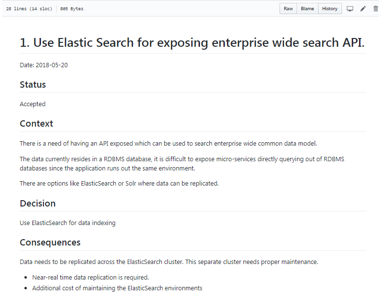
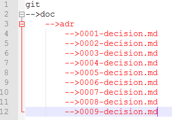

# 结论

随着我们越来越多地朝着基于敏捷的开发方向发展，我们需要采用这种技术，以便我们在架构文档中也变得更加高效和敏捷。

谢谢阅读！ 如果您有关于记录体系结构决策的建议，请发表评论。
## joelparkerhenderson / architecture_decision_record
### 用于软件规划，IT领导和模板文档的体系结构决策记录（ADR）示例…
## ADR模板

这不是您可以使用的唯一ADR模板。 许多团队正在使用自己的模板。 您可以在GitHub上找到其他ADR模板集合。
## joelparkerhenderson / architecture_decision_record
### 用于软件规划，IT领导和模板文档的体系结构决策记录（ADR）示例…
# 样本ADR

这是一个示例ADR，您可以将其用作参考。


GitHub上有更多ADR的示例供您参考。
# ADR的内容

ADR的内容可以包括以下部分：
+ 标题-决策记录的标题。
+ 决策-做出的决策。 例如，对企业范围内的搜索API使用Elasticsearch。
+ 状态-可以提出，接受或取代状态。 如果您做出任何决定并且以后需要更改它们，则只需添加状态已更改的新记录。
+ 上下文-此决定的上下文是什么？ 重要的是要抓住决策的全部内容，以使读者了解决策背后的原因。
+ 后果-在本节中，您可以添加如果做出此决定将发生的情况。 重要的是列出所有正面和负面的后果。

整个文档需要一页或两页，并且不能超过两页。 这里的想法是保持轻便，以便人们可以阅读。

开发人员需要始终看到ADR，因为他们应该知道构建某些东西的原因。
# Git友好

可以在源代码存储库本身中记录ADR。 您可以简单地将ADR创建为Git存储库的一部分。

例如，您可以创建以下文件夹：
```
/doc/adr/
```

并如下图所示添加决策。

> ADR in GIT Repo

# LADR的历史

在研究LADR时，我遇到了Michael Nygard撰写的非常有趣的文章。 本文讨论了一种将体系结构文档嵌入代码本身的技术。

从文章引用：

敏捷项目的架构必须以不同的方式描述和定义。 并非所有决定都会一次做出，也不会在项目开始时全部做出。 —迈克尔·尼加德（Michael Nygard）

这是真的。 敏捷已被广泛使用，并且需要一个定义好的过程来捕获所有架构决策。 通常，我们最终会创建大量的文档，没人喜欢阅读。

当我阅读更多内容时，我发现了一种更好的方法来记录您的决定。
# ThoughtWorks技术雷达

在试图解决这个难题的同时，我遇到了最新版的ThoughtWorks Technology Radar。

“我们是一家软件公司，是一个以目标为导向的热情社区。 在寻求革新IT行业并创造积极的社会变革的同时，我们具有颠覆性的思维来提供技术以解决客户最严峻的挑战。” — ThoughtWorks

ThoughtWorks在Technology Radar中发布了有关您应该使用什么，应该继续做什么以及可以尝试的内容的新闻。

ThoughtWorks讨论了各种：
+ 技术技巧
+ 平台类
+ 工具类
+ 语言和框架

在阅读技术部分时，我注意到ThoughtWorks建议采用轻型体系结构决策记录（LADR）。

我不了解LADR，所以我开始研究。
# 一个简单而强大的工具来记录您的架构决策

> Photo by Brooke Cagle on Unsplash


从我担任技术架构师的那一刻起，我一直想知道为什么要做出某些决定而不是其他选择。

Visio图表很棒，但它们不过是图片而已。 他们没有告诉您为什么某些箭头以某种方式而不是相反地旋转的故事。
```
(本文翻译自Tanmay Deshpande的文章《A Simple but Powerful Tool to Record Your Architectural Decisions》，参考：https://medium.com/better-programming/here-is-a-simple-yet-powerful-tool-to-record-your-architectural-decisions-5fb31367a7da)
```
